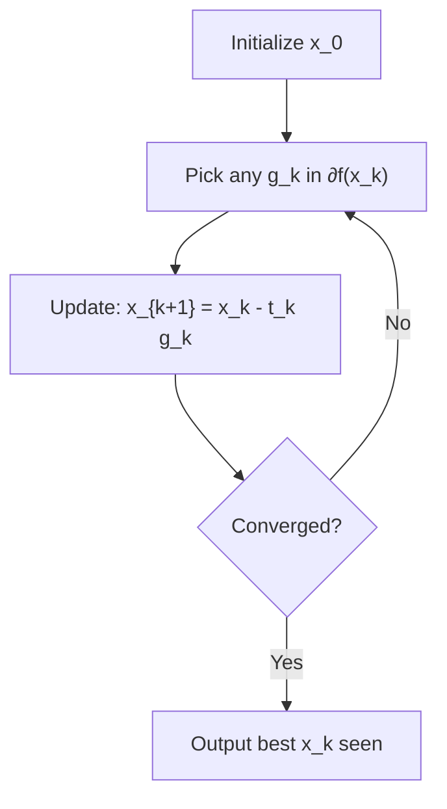

## Subgradients and Subdifferentials

### Overview

Subgradients generalize the gradient to convex functions that are not differentiable everywhere, such as $|x|$, $\max$ functions, and norms. They preserve the single most useful property of gradients for optimization — the first-order global underestimator inequality — while allowing for non-uniqueness at kink points. This machinery underlies nonsmooth convex optimization methods like subgradient descent and is foundational to duality theory.

### Definition

**Statement**

Let $f: \mathbb{R}^n \to \mathbb{R} \cup \{+\infty\}$ be convex. A vector $g \in \mathbb{R}^n$ is a **subgradient** of $f$ at $x$ if:

$$f(z) \geq f(x) + g^T(z - x) \quad \forall z \in \text{dom}(f)$$

The set of all subgradients at $x$ is the **subdifferential**, denoted $\partial f(x)$:

$$\partial f(x) = \{g \in \mathbb{R}^n : f(z) \geq f(x) + g^T(z-x) \, \forall z\}$$

**Interpretation**

This is exactly the first-order convexity condition, but instead of requiring the unique gradient $\nabla f(x)$, it asks for *any* vector $g$ that defines a global affine underestimator touching $f$ at $x$. At points where $f$ is differentiable, $\partial f(x) = \{\nabla f(x)\}$ — a singleton. At non-differentiable points (kinks), $\partial f(x)$ is typically a whole convex set of valid "supporting slopes."

### Geometric Picture

<svg xmlns="http://www.w3.org/2000/svg" viewBox="0 0 520 300">
<text x="260" y="20" text-anchor="middle" font-size="14" font-weight="bold" fill="#222">Subgradients at a Kink Point (svg_diagram)</text>
<line x1="40" y1="260" x2="480" y2="260" stroke="#444" stroke-width="1.5" />
<line x1="60" y1="280" x2="60" y2="40" stroke="#444" stroke-width="1.5" />
<path d="M 80 100 L 260 220 L 440 60" stroke="#1f6feb" stroke-width="2.5" fill="none" />
<line x1="140" y1="280" x2="380" y2="140" stroke="#e05252" stroke-width="1.5" stroke-dasharray="4,3" />
<line x1="140" y1="260" x2="380" y2="180" stroke="#2ea44f" stroke-width="1.5" stroke-dasharray="4,3" />
<circle cx="260" cy="220" r="4" fill="#111" />
<text x="200" y="240" font-size="11" fill="#111">x (kink)</text>
<text x="390" y="135" font-size="10" fill="#e05252">g₁ (steep support line)</text>
<text x="390" y="185" font-size="10" fill="#2ea44f">g₂ (shallow support line)</text>
</svg>

At the kink, every line with slope between the left-derivative and right-derivative lies below the graph — so $\partial f(x)$ is the full interval between those two slopes, not a single value.

### Canonical Example: Absolute Value

**Example**

$f(x) = |x|$ on $\mathbb{R}$.

For $x > 0$: $f$ is differentiable, $\partial f(x) = \{1\}$.

For $x < 0$: $f$ is differentiable, $\partial f(x) = \{-1\}$.

For $x = 0$: any $g \in [-1, 1]$ satisfies $|z| \geq g \cdot z$ for all $z$ (check: for $z > 0$, need $z \geq gz \iff g \leq 1$; for $z < 0$, need $-z \geq gz \iff g \geq -1$).

**Output**

$$\partial f(0) = [-1, 1]$$

This is the standard textbook example and appears repeatedly in $\ell_1$-regularized optimization (LASSO), where the subdifferential of $|x|$ at zero directly explains why $\ell_1$ regularization induces exact sparsity.

### Existence

**Statement**

For convex $f$ and $x \in \text{int}(\text{dom}(f))$ (interior of the domain), $\partial f(x)$ is always **nonempty**, closed, and convex. At boundary points of the domain, $\partial f(x)$ can be empty.

**Key Points**

- Nonemptiness on the interior follows from the supporting hyperplane theorem applied to the epigraph of $f$.
- $\partial f(x)$ is bounded whenever $f$ is Lipschitz continuous near $x$; more precisely, if $f$ is $L$-Lipschitz near $x$, then every $g \in \partial f(x)$ satisfies $\|g\|_* \leq L$ (dual norm).

### First-Order Optimality via Subgradients

**Statement**

For convex $f$, $x^*$ is a global minimizer if and only if:

$$0 \in \partial f(x^*)$$

**Interpretation**

This is the direct nonsmooth generalization of $\nabla f(x^*) = 0$. It says that the zero vector must be a valid supporting-hyperplane slope at $x^*$ — equivalently, no direction of strict decrease exists.

This condition is the theoretical foundation for subgradient-based optimality checks and for stopping criteria in nonsmooth solvers.

**Example**

For $f(x) = |x|$, we need $0 \in \partial f(x^*). At $x^* \neq 0
, $\partial f(x^*) = \{\pm 1\}$, which never contains $0. At $x^* = 0
, $\partial f(0) = [-1,1] \ni 0$. So $x^* = 0$ is confirmed as the unique global minimizer, consistent with direct inspection.

### Subdifferential Calculus

**Statement (sum rule)**

For convex $f_1, f_2$ with a point in the interior of both domains (a constraint qualification, e.g. relative interiors intersect):

$$\partial(f_1 + f_2)(x) = \partial f_1(x) + \partial f_2(x)$$

(Minkowski sum of the two subdifferential sets.)

**Statement (scaling rule)**

For $\alpha > 0$:

$$\partial(\alpha f)(x) = \alpha \, \partial f(x)$$

**Statement (affine composition)**

For $g(x) = f(Ax + b)$:

$$\partial g(x) = A^T \partial f(Ax+b)$$

**Statement (pointwise max rule)**

For $f(x) = \max_{i=1,\dots,k} f_i(x)$, at a point $x$ where the maximum is attained by the subset of indices $I(x) = \{i : f_i(x) = f(x)\}$:

$$\partial f(x) = \text{conv}\left(\bigcup_{i \in I(x)} \partial f_i(x)\right)$$

the convex hull of the union of subdifferentials of the *active* functions at $x$.

**Key Points**

- The sum rule requires a constraint qualification in general infinite-dimensional or boundary-touching settings; in finite dimensions with both functions finite and convex near $x$, it typically holds without extra conditions, but care is needed at domain boundaries. [Unverified: the precise minimal constraint qualification (e.g., relative interiors intersecting vs. simple domain-interior conditions) varies slightly in how different textbooks state it; the practically important case — both $f_1, f_2$ finite-valued and convex on a common open neighborhood of $x$ — is unambiguous and needs no extra qualification.]
- The max-rule convex hull requirement is essential — at a kink formed by two active pieces, the subdifferential is not just the union but the full convex hull connecting them, matching the interval example for $|x| = \max\{x, -x\}$.

### Worked Example: Subdifferential of a Max Function

**Example**

$f(x) = \max\{x_1, x_2\}$ on $\mathbb{R}^2$, evaluated at $x = (0,0)$ where both pieces are active ($I(x) = \{1,2\}$).

$f_1(x) = x_1$ has $\partial f_1(x) = \{(1,0)\}$ everywhere (it's linear). $f_2(x) = x_2$ has $\partial f_2(x) = \{(0,1)\}$ everywhere.

$$\partial f(0,0) = \text{conv}\{(1,0), (0,1)\} = \{(\theta, 1-\theta) : \theta \in [0,1]\}$$

**Output**

The subdifferential is the line segment connecting $(1,0)$ and $(0,1)$ in $\mathbb{R}^2$ — a one-dimensional convex set, illustrating that subdifferentials of piecewise-linear functions at kink points are generally convex polytopes spanned by the active pieces' gradients.

### Relationship to Directional Derivatives

**Statement**

For convex $f$, the directional derivative at $x$ in direction $d$ always exists (possibly $\pm\infty$ at boundary points) and satisfies:

$$f'(x; d) = \sup_{g \in \partial f(x)} g^T d$$

**Interpretation**

The directional derivative is the support function of the subdifferential set. This connects subgradients directly back to the conjugate-function machinery: the subdifferential's support function *is* the directional derivative, tying together first-order local behavior and the global geometric structure of $\partial f(x)$.

### Relationship to Conjugate Functions

**Statement**

$$g \in \partial f(x) \iff x \in \partial f^*(g) \iff f(x) + f^*(g) = x^Tg$$

This is the same equality condition from Fenchel's inequality — subdifferentials of $f$ and $f^*$ are mutually inverse set-valued maps.

### Monotonicity of the Subdifferential

**Statement**

For convex $f$, the subdifferential operator is **monotone**:

$$(g_1 - g_2)^T(x_1 - x_2) \geq 0 \quad \forall x_1, x_2, \, g_1 \in \partial f(x_1), \, g_2 \in \partial f(x_2)$$

**Interpretation**

This generalizes the scalar fact that a convex function's derivative is nondecreasing. Monotonicity of $\partial f$ is the property directly exploited in convergence proofs for subgradient methods, proximal algorithms, and monotone operator splitting methods.

### Subgradient Method Sketch

**Key Points**

- Unlike gradient descent, the subgradient method is **not** guaranteed to be a descent method — $f(x_{k+1})$ can be larger than $f(x_k)$ even for a well-chosen step size, since $-g_k$ is not necessarily a descent direction when $g_k$ is merely *a* subgradient rather than the unique gradient.
- Convergence analysis therefore typically tracks the best (or averaged) iterate rather than the current iterate, and requires diminishing or carefully chosen step sizes $t_k$ (e.g., $t_k \to 0$, $\sum t_k = \infty$, $\sum t_k^2 < \infty$).
- Convergence rates for subgradient methods are markedly slower than gradient descent on smooth functions — typically $O(1/\sqrt{k})$ versus $O(1/k)$ or better for smooth convex problems, reflecting the loss of curvature information at kinks.

### Common Pitfalls

**Key Points**

- Assuming $\partial f(x)$ is always a singleton — it is only a singleton where $f$ is differentiable; treating a nonsmooth point as if the gradient were unique leads to incorrect optimality claims.
- Using $-g$ as a descent direction for a chosen subgradient $g \in \partial f(x)$ — not valid in general, unlike $-\nabla f(x)$ for differentiable convex $f$.
- Forgetting the convex-hull step in the max-function rule and simply taking the union of active subdifferentials instead of their convex hull.
- Applying subdifferential calculus rules (especially the sum rule) without checking the relevant constraint qualification, particularly near domain boundaries.

### Related Topics

- Proximal operators and the proximal point algorithm
- Subgradient descent convergence rates and step-size schedules
- KKT conditions generalized to nonsmooth convex problems via subdifferentials
- Monotone operators and operator splitting (e.g., ADMM)
- $\ell_1$ regularization and sparsity via subdifferential analysis
- Clarke subdifferentials for nonconvex, locally Lipschitz functions