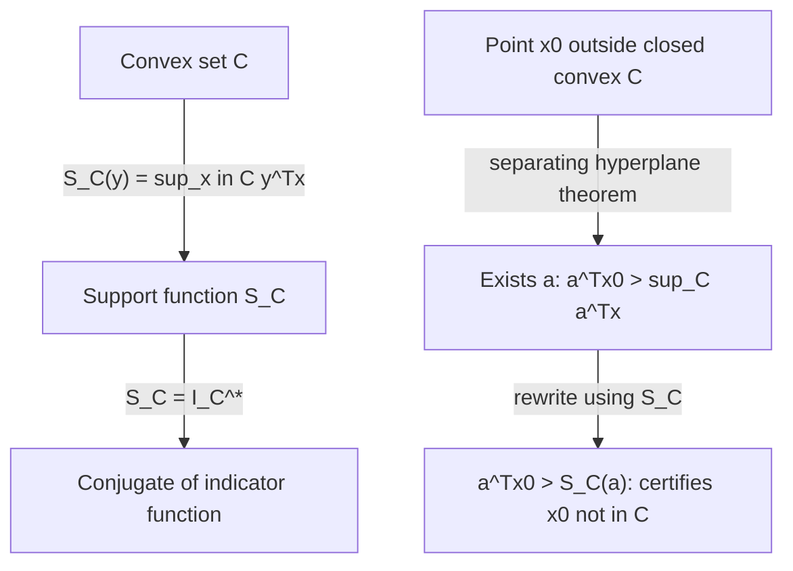

## Support Functions and Separating Hyperplanes

### Overview

Support functions encode the shape of a convex set as a function of direction, while separating hyperplane theorems provide the fundamental geometric fact that disjoint convex sets can be divided by a hyperplane. Together these form the geometric backbone of convex duality — separating hyperplanes are what make Lagrangian duality and Fenchel duality possible in the first place.

### Support Functions

**Definition**

For a nonempty set $\mathcal{C} \subseteq \mathbb{R}^n$ (not necessarily convex), the **support function** is:

$$S_{\mathcal{C}}(y) = \sup_{x \in \mathcal{C}} y^T x$$

**Interpretation**

$S_{\mathcal{C}}(y)$ gives the signed distance (scaled by $\|y\|$) from the origin to the supporting hyperplane of $\mathcal{C}$ with outward normal direction $y$. Sweeping $y$ over all directions and recording $S_{\mathcal{C}}(y)$ fully characterizes the convex hull of $\mathcal{C}$ — this is the content of the theorem below.

**Key Points**

- $S_{\mathcal{C}}(y)$ is exactly the conjugate of the indicator function $I_{\mathcal{C}}$, i.e., $S_{\mathcal{C}} = I_{\mathcal{C}}^*$, directly connecting this topic to conjugate functions.
- $S_{\mathcal{C}}$ is always convex (as a supremum of linear functions of $y$), regardless of whether $\mathcal{C}$ itself is convex.
- $S_{\mathcal{C}}$ is positively homogeneous of degree 1: $S_{\mathcal{C}}(\alpha y) = \alpha \, S_{\mathcal{C}}(y)$ for $\alpha \geq 0$.
- $S_{\mathcal{C}} = S_{\text{conv}(\mathcal{C})} = S_{\overline{\text{conv}}(\mathcal{C})}$ — the support function cannot distinguish a set from its closed convex hull.

### Fundamental Theorem: Sets Are Determined by Their Support Functions

**Statement**

For nonempty closed convex sets $\mathcal{C}_1, \mathcal{C}_2$:

$$\mathcal{C}_1 = \mathcal{C}_2 \iff S_{\mathcal{C}_1} = S_{\mathcal{C}_2}$$

**Interpretation**

This is the geometric analog of the Fenchel–Moreau biconjugation theorem: just as a convex function is fully recovered from its conjugate (when closed and convex), a closed convex set is fully recovered from its support function. In fact these are the same theorem in disguise, since $S_{\mathcal{C}} = I_{\mathcal{C}}^*$ and $I_{\mathcal{C}}^{**} = I_{\mathcal{C}}$ for closed convex $\mathcal{C}$.

### Worked Examples of Support Functions

**Example**

*Unit ball:* $\mathcal{C} = \{x : \|x\|_2 \leq 1\}$.

$$S_{\mathcal{C}}(y) = \sup_{\|x\|_2 \leq 1} y^Tx = \|y\|_2$$

by Cauchy–Schwarz, with equality when $x = y/\|y\|_2$.

**Example**

*Box:* $\mathcal{C} = \{x \in \mathbb{R}^n : -1 \leq x_i \leq 1 \, \forall i\}$.

$$S_{\mathcal{C}}(y) = \sup_x y^Tx = \sum_i |y_i| = \|y\|_1$$

achieved by setting $x_i = \text{sign}(y_i)$.

**Output**

These two examples illustrate a general pattern: the support function of the unit ball of a norm $\|\cdot\|$ is the **dual norm** $\|\cdot\|_*$. The $\ell_2$ ball is self-dual ($\|\cdot\|_2^* = \|\cdot\|_2$); the $\ell_\infty$ ball's dual is $\|\cdot\|_1$ (matching the box example, since the box is the $\ell_\infty$ unit ball).

**Example**

*Single point:* $\mathcal{C} = \{a\}$. $S_{\mathcal{C}}(y) = y^Ta$, a linear function — the simplest possible support function.

*Polytope:* $\mathcal{C} = \text{conv}\{v_1, \dots, v_k\}$. $S_{\mathcal{C}}(y) = \max_i y^Tv_i$, a piecewise-linear function of $y$, directly by linearity of the objective over a polytope having its maximum at a vertex.

### Separating Hyperplane Theorem

**Statement**

Let $\mathcal{C}, \mathcal{D} \subseteq \mathbb{R}^n$ be nonempty, disjoint convex sets. Then there exists $a \neq 0$ and $b \in \mathbb{R}$ such that:

$$a^Tx \leq b \quad \forall x \in \mathcal{C}, \qquad a^Tx \geq b \quad \forall x \in \mathcal{D}$$

i.e., the hyperplane $\{x : a^Tx = b\}$ separates $\mathcal{C}$ from $\mathcal{D}$.

**Key Points**

- Basic disjointness is sufficient for the existence of a separating hyperplane in this weak (non-strict) form. Strict separation, $a^Tx < b$ on $\mathcal{C}$ and $a^Tx > b$ on $\mathcal{D}$, requires additional conditions — typically that at least one of the sets is closed and the other compact, or that the sets have positive distance between them.
- If $\mathcal{C}$ and $\mathcal{D}$ merely have disjoint interiors (but may touch on their boundaries), a hyperplane separating them still exists, but it is necessarily supporting rather than strictly interior-separating.
- The theorem does not require convexity of both sets for *existence* results in every variant, but the standard and most commonly used form assumes both $\mathcal{C}$ and $\mathcal{D}$ are convex.

### Geometric Illustration

<svg xmlns="http://www.w3.org/2000/svg" viewBox="0 0 520 300">
<text x="260" y="20" text-anchor="middle" font-size="14" font-weight="bold" fill="#222">Separating Hyperplane Between Convex Sets (svg_diagram)</text>
<ellipse cx="150" cy="160" rx="70" ry="55" fill="#eef4ff" stroke="#1f6feb" stroke-width="2" />
<text x="150" y="165" text-anchor="middle" font-size="12" fill="#1f6feb">C</text>
<ellipse cx="380" cy="160" rx="70" ry="55" fill="#ffece8" stroke="#e05252" stroke-width="2" />
<text x="380" y="165" text-anchor="middle" font-size="12" fill="#e05252">D</text>
<line x1="265" y1="30" x2="265" y2="290" stroke="#444" stroke-width="2" stroke-dasharray="6,3" />
<text x="270" y="45" font-size="11" fill="#444">{x : aᵀx = b}</text>
<line x1="265" y1="160" x2="310" y2="160" stroke="#2ea44f" stroke-width="2" marker-end="url(#arrow2)" />
<text x="275" y="150" font-size="10" fill="#2ea44f">a</text>
</svg>

### Supporting Hyperplane Theorem

**Statement**

Let $\mathcal{C}$ be convex and $x_0 \in \partial \mathcal{C}$ (boundary of $\mathcal{C}$). Then there exists $a \neq 0$ such that:

$$a^T x \leq a^T x_0 \quad \forall x \in \mathcal{C}$$

i.e., a hyperplane through $x_0$ with $\mathcal{C}$ entirely on one side.

**Interpretation**

This is the special case of the separating hyperplane theorem applied to $\mathcal{C}$ and $\{x_0\}$: every boundary point of a convex set admits at least one supporting hyperplane. This is the direct geometric source of subgradients — a subgradient of $f$ at $x$ corresponds precisely to a supporting hyperplane of $\text{epi}(f)$ at $(x, f(x))$.

**Converse (partial)**

If a set $\mathcal{C}$ is closed and has a supporting hyperplane at every boundary point, and satisfies a mild regularity condition, $\mathcal{C}$ is convex. [Inference: the precise minimal converse statement (exact regularity conditions needed, e.g., closedness alone versus closedness plus connectedness) is a more delicate result than the forward direction and is stated with varying levels of generality across convex analysis references; the forward direction — convex implies supporting hyperplanes exist — is the standard, unambiguous result and the one used in practice.]

### Strict Separation for Closed Sets

**Statement**

If $\mathcal{C}$ is closed convex and $x_0 \notin \mathcal{C}$, there exists a hyperplane **strictly** separating $x_0$ from $\mathcal{C}$:

$$a^Tx_0 > b \geq a^Tx \quad \forall x \in \mathcal{C}$$

**Proof sketch**

Let $x^* = \text{proj}_{\mathcal{C}}(x_0)$ be the (unique, since $\mathcal{C}$ is closed convex) Euclidean projection of $x_0$ onto $\mathcal{C}$. Take $a = x_0 - x^*$. The projection's variational characterization gives $a^T(x - x^*) \leq 0$ for all $x \in \mathcal{C}$, which rearranges into the strict separation inequality using $\|a\|^2 > 0$ (since $x_0 \notin \mathcal{C}$ means $x_0 \neq x^*$).

**Interpretation**

This construction is one of the most important building blocks in convex analysis — it directly proves the existence of a nonzero subgradient/normal vector at any point outside a closed convex set and underlies duality-gap arguments in Lagrangian duality (a primal-dual gap can be certified by separating a point from a convex set of achievable values).

### Application: Farkas' Lemma via Separation

**Statement**

Farkas' Lemma — exactly one of the following holds:

1. $\exists x$ with $Ax = b$, $x \geq 0$
2. $\exists y$ with $A^Ty \leq 0$, $b^Ty > 0$

**Interpretation**

This classical result in linear programming duality is a direct consequence of the separating hyperplane theorem applied to $b$ and the convex cone $\{Ax : x \geq 0\}$: if $b$ is not in this cone (case 1 fails), the cone is closed convex, so $b$ can be strictly separated from it, and the separating hyperplane's normal vector is exactly the $y$ in case 2.

### Support Functions and Separation: The Duality Link

**Key Points**

- Membership testing via support functions: $x_0 \in \mathcal{C}$ (closed convex) if and only if $a^Tx_0 \leq S_{\mathcal{C}}(a)$ for **every** direction $a$ — this is precisely the statement that $\mathcal{C}$ equals the intersection of all its supporting half-spaces.
- This membership characterization is the basis for robust optimization reformulations, where uncertainty sets are represented via their support functions to derive tractable worst-case reformulations.

### Common Pitfalls

**Key Points**

- Assuming disjointness alone guarantees *strict* separation — it does not; two disjoint open convex sets can still fail to be strictly separated if their closures touch (weak separation always holds for disjoint convex sets, but strict separation needs closedness/compactness assumptions).
- Confusing supporting hyperplane (touches the set at a single boundary point, set on one side) with separating hyperplane (divides two distinct sets) — related but logically distinct statements.
- Forgetting that support functions are defined for **any** set (even nonconvex, even non-closed) but only fully characterize the set (via the biconjugation-style theorem) when restricted to closed convex sets.
- Misapplying the projection-based proof of strict separation to non-closed $\mathcal{C}$ — the projection may not exist or be unique if $\mathcal{C}$ is not closed.

### Related Topics

- Convex cones and conic duality (Farkas' Lemma as a cone-separation result)
- Dual norms and their construction as support functions of unit balls
- Lagrangian duality and strong duality via separation arguments (Slater's condition)
- Polar sets and polar cones
- Robust optimization and uncertainty-set reformulations via support functions
- KKT conditions derived geometrically via normal cones and supporting hyperplanes