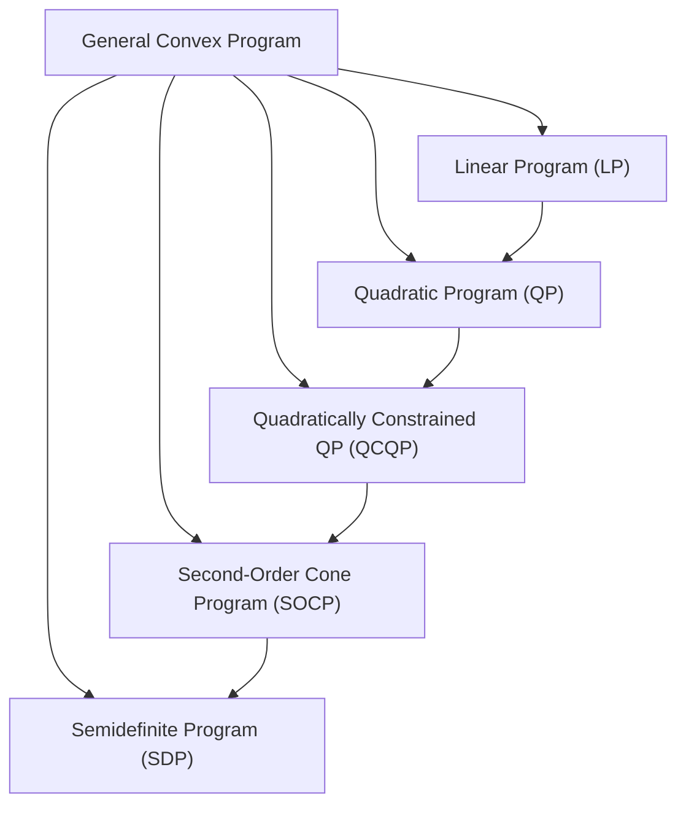

## Convex Optimization Problem Structure

### Overview

A convex optimization problem is one where the objective is convex, the inequality constraints are convex, and the equality constraints are affine. This structural definition is what unlocks the field's central theoretical result — every local minimum is global — and what enables reliable, efficient numerical solution via interior-point and other methods, in sharp contrast to general nonconvex optimization.

### Standard Form

**Statement**

$$\begin{aligned}

\min_{x} \quad & f_0(x) \

\text{s.t.} \quad & f_i(x) \leq 0, \quad i = 1, \dots, m \

& h_j(x) = 0, \quad j = 1, \dots, p

\end{aligned}$$

This is a **convex optimization problem** if:

- $f_0$ (the objective) is convex
- Each $f_i$ (inequality constraint function) is convex
- Each $h_j$ (equality constraint function) is **affine**: $h_j(x) = a_j^Tx - b_j$

**Key Points**

- Equality constraints must be affine, not merely convex — a nonlinear convex equality constraint like $\|x\|_2 = 1$ generally does not define a convex feasible set (it defines a sphere, which is nonconvex), so it would break convexity of the problem even though the individual function is convex.
- The feasible set $\mathcal{X} = \{x : f_i(x) \leq 0 \,\forall i, \, h_j(x) = 0 \, \forall j\}$ is convex, since it is an intersection of convex sublevel sets ($f_i(x) \leq 0$) and affine sets ($h_j(x)=0$), and intersections of convex sets are convex.
- Maximizing a concave function subject to the same constraint structure is equivalent (by negation) and is also referred to as a convex optimization problem in the broader sense.

### Why Convexity Matters: Local–Global Equivalence

**Statement**

For a convex optimization problem, **every local minimum is a global minimum**.

**Proof sketch**

Suppose $x^*$ is a local but not global minimum: there exists feasible $y$ with $f_0(y) < f_0(x^*)$. Consider the point $z = \theta y + (1-\theta) x^*$ for small $\theta > 0$. By convexity of the feasible set, $z$ is feasible. By convexity of $f_0$:

$$f_0(z) \leq \theta f_0(y) + (1-\theta) f_0(x^*) < f_0(x^*)$$

for any $\theta \in (0,1]$. As $\theta \to 0^+$, $z \to x^*$, so points arbitrarily close to $x^*$ have strictly smaller objective value — contradicting local optimality of $x^*$.

**Interpretation**

This single property is the reason convex optimization is tractable: local search algorithms (gradient descent, Newton's method, interior-point methods) that only guarantee convergence to a local optimum in general automatically find the global optimum on convex problems.

### First-Order Optimality Condition

**Statement**

For a convex problem with feasible set $\mathcal{X}$, differentiable $f_0$, $x^*$ is optimal if and only if:

$$\nabla f_0(x^*)^T(y - x^*) \geq 0 \quad \forall y \in \mathcal{X}$$

**Interpretation**

At the optimum, the negative gradient $-\nabla f_0(x^*)$ points either out of the feasible set or is zero — there is no feasible descent direction remaining. For unconstrained problems ($\mathcal{X} = \mathbb{R}^n$), this reduces to the familiar $\nabla f_0(x^*) = 0$, since the inequality must hold for both $y - x^*$ and its negation.

### Convex Optimization Problem Taxonomy

**Key Points**

- Each class in the hierarchy is a special case of the next: every LP is a QP with zero quadratic term, every convex QP is a QCQP, every QCQP is representable as an SOCP, and every SOCP is representable as an SDP.
- This nesting matters practically: problems higher in generality (SDP) are typically more expensive to solve than more structured lower classes (LP), so recognizing the tightest applicable class in the hierarchy often yields large computational savings.

### Linear Programs (LP)

**Statement**

$$\min_x c^Tx \quad \text{s.t.} \quad Ax \leq b, \; Gx = h$$

Objective and constraints are all affine. LPs are convex (affine functions are both convex and concave).

**Example**

Diet problem: minimize cost of a food selection subject to linear nutritional minimums — a textbook LP formulation.

### Quadratic Programs (QP)

**Statement**

$$\min_x \tfrac{1}{2}x^TPx + q^Tx \quad \text{s.t.} \quad Ax \leq b, \; Gx = h$$

Convex when $P \succeq 0$.

**Example**

Markowitz portfolio optimization — minimizing portfolio variance ($x^T \Sigma x$ with $\Sigma \succeq 0$, the covariance matrix) subject to linear budget and return constraints — is a canonical convex QP.

### Second-Order Cone Programs (SOCP)

**Statement**

$$\min_x c^Tx \quad \text{s.t.} \quad \|A_ix + b_i\|_2 \leq c_i^Tx + d_i, \; i=1,\dots,m$$

Each constraint requires a vector to lie within a second-order (Lorentz/ice-cream) cone.

**Example**

Robust linear programming with ellipsoidal uncertainty in the constraint coefficients naturally produces SOCP constraints, since worst-case-over-ellipsoid reformulations introduce $\ell_2$-norm terms.

### Semidefinite Programs (SDP)

**Statement**

$$\min_X \; \text{tr}(CX) \quad \text{s.t.} \quad \text{tr}(A_iX) = b_i, \; X \succeq 0$$

optimizing over the cone of positive semidefinite matrices, a convex cone.

**Example**

Relaxations of combinatorial problems (e.g., the Goemans–Williamson SDP relaxation of MAX-CUT) and control-theoretic Lyapunov stability conditions are classic SDP applications.

### Feasibility and the Slater Condition

**Statement**

**Slater's condition**: there exists a strictly feasible point $x$ with $f_i(x) < 0$ for all $i$ (and $h_j(x)=0$), assuming the inequality constraints are not affine. (For affine inequality constraints, "$\leq$" strictness is not required.)

**Interpretation**

Slater's condition is a **constraint qualification** — when it holds, strong duality is guaranteed for the convex problem (the primal and dual optimal values coincide, with zero duality gap), and KKT conditions become both necessary and sufficient for optimality. This is arguably the single most consequential regularity condition in convex optimization theory, since strong duality is what allows dual-based algorithms and dual bounds to be trusted as exact.

### Convex vs. Nonconvex: Why the Distinction Is Structural, Not Cosmetic

**Key Points**

- A problem's convexity is a property of how the *set of achievable objective/constraint values* is shaped — reformulating a nonconvex problem's variables or constraints can sometimes reveal hidden convex structure (e.g., geometric programming, which is convex after a log-transform of variables, despite looking nonconvex in the original variables).
- Conversely, a superficially simple-looking problem can be nonconvex: minimizing a convex function over a **nonconvex** feasible set (e.g., integer constraints, or $\|x\|_2 = 1$ equality constraints) is not a convex optimization problem, even though the objective itself is convex.
- Both the objective **and every constraint set** must satisfy the convexity requirements — convexity is not a property that can be checked on the objective in isolation.

### Worked Example: Formulating a Convex Problem

**Example**

Regularized least squares: given data $A \in \mathbb{R}^{m \times n}$, $b \in \mathbb{R}^m$, solve:

$$\min_x \|Ax - b\|_2^2 + \lambda \|x\|_1, \quad \lambda \geq 0$$

**Output**

This is convex: $\|Ax-b\|_2^2$ is a convex quadratic (composition of the convex function $\|\cdot\|_2^2$ with the affine map $x \mapsto Ax - b$), $\|x\|_1$ is convex (a norm), and the nonnegative weighted sum of convex functions is convex. There are no constraints beyond $x \in \mathbb{R}^n$, so the feasible set $\mathbb{R}^n$ is trivially convex. This is the LASSO formulation, and its convexity (despite the nondifferentiability of $\|x\|_1$) is exactly why subgradient- and proximal-based methods reliably solve it to global optimality.

### Common Pitfalls

**Key Points**

- Writing an equality constraint as $g(x) = c$ for nonlinear convex $g$ and assuming the problem remains convex — only *affine* equality constraints preserve convexity of the feasible set in general.
- Checking only the objective for convexity and forgetting to verify that constraint functions are convex (inequalities) or affine (equalities) — a convex objective over a nonconvex feasible region is not a convex optimization problem.
- Assuming any locally-convergent solver will find the global optimum on a nonconvex problem just because the *objective function alone* looks convex — the constraint set's shape matters equally.
- Neglecting to check a constraint qualification (like Slater's condition) before invoking strong duality or KKT sufficiency — without it, a zero duality gap is not guaranteed.

### Related Topics

- Lagrangian duality and the KKT conditions for convex problems
- Geometric programming and convexity via log-transformation
- Disciplined convex programming and automatic convexity verification (CVXPY, CVX)
- Interior-point methods for solving convex programs
- Conic optimization as the unifying framework for LP/SOCP/SDP
- Convex relaxations of nonconvex/combinatorial problems