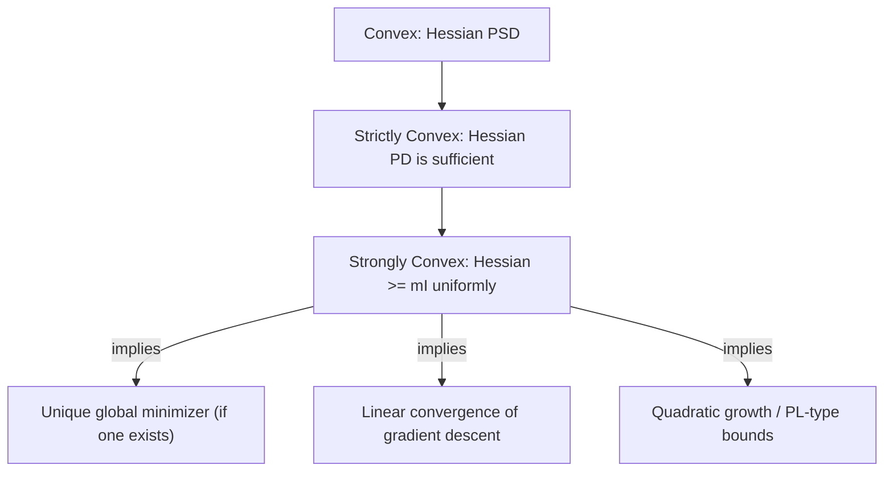

## Strong Convexity and Its Implications

### Overview

Strong convexity is a quantitative strengthening of convexity that guarantees a minimum curvature everywhere, not just nonnegative curvature. This single additional assumption is responsible for most of the strongest guarantees in optimization theory: unique minimizers, linear (geometric) convergence rates for gradient methods, and explicit suboptimality bounds from gradient norms alone.

### Definition

**Statement**

A differentiable function $f: \mathbb{R}^n \to \mathbb{R}$ is **$m$-strongly convex** on convex $\mathcal{D}$ (for $m > 0$) if:

$$f(y) \geq f(x) + \nabla f(x)^T(y-x) + \frac{m}{2}\|y-x\|_2^2 \quad \forall x, y \in \mathcal{D}$$

**Equivalent definition (via a shifted convexity condition)**

$f$ is $m$-strongly convex if and only if:

$$g(x) = f(x) - \frac{m}{2}\|x\|_2^2$$

is convex. This is often the most convenient operational definition — strong convexity is precisely "convexity with a quadratic margin subtracted off still being convex."

**Interpretation**

Ordinary convexity's first-order condition says the tangent plane underestimates $f$. Strong convexity strengthens this to say the tangent plane *plus an explicit quadratic bowl* underestimates $f$ — the function must curve upward at least as fast as $\frac{m}{2}\|y-x\|^2$ in every direction, everywhere.

### Second-Order Characterization

**Statement**

For twice-differentiable $f$:

$$f \text{ is } m\text{-strongly convex} \iff \nabla^2 f(x) \succeq mI \quad \forall x \in \mathcal{D}$$

i.e., every eigenvalue of the Hessian is at least $m > 0$ everywhere, not merely nonnegative.

**Key Points**

- This is strictly stronger than $\nabla^2 f(x) \succ 0$ (positive definite) — positive definiteness alone permits eigenvalues to approach zero as $x$ varies (e.g., $f(x) = x^4$ has $f''(x) = 12x^2 \to 0$ as $x \to 0$, so it is convex but not strongly convex on any interval containing the origin), whereas strong convexity requires a uniform lower bound $m$ across the whole domain.
- Strong convexity $\implies$ strict convexity $\implies$ convexity, but none of the reverse implications hold in general.

### Comparison of the Convexity Hierarchy

### Consequence 1: Uniqueness of the Minimizer

**Statement**

If $f$ is $m$-strongly convex on $\mathcal{D}$ and a minimizer exists, it is **unique**.

**Proof sketch**

Suppose $x_1^*, x_2^*$ are both minimizers with $x_1^* \neq x_2^*$. Apply the strong convexity definition at $x_1^*$ with $y = x_2^*$: since $\nabla f(x_1^*) = 0$ (first-order optimality),

$$f(x_2^*) \geq f(x_1^*) + \frac{m}{2}\|x_2^* - x_1^*\|_2^2 > f(x_1^*)$$

since $\|x_2^*-x_1^*\|_2^2 > 0$. This contradicts $f(x_2^*) = f(x_1^*)$ (both being minimizers of the same function).

### Consequence 2: Quadratic Growth Bound

**Statement**

If $f$ is $m$-strongly convex with minimizer $x^*$:

$$f(x) \geq f(x^*) + \frac{m}{2}\|x - x^*\|_2^2 \quad \forall x \in \mathcal{D}$$

**Interpretation**

Suboptimality in function value directly bounds distance to the optimum: $\|x - x^*\|_2 \leq \sqrt{\frac{2(f(x) - f(x^*))}{m}}$. This is a genuinely useful practical guarantee — it converts an objective-value convergence guarantee into an iterate-distance convergence guarantee, which plain convexity alone cannot provide (plain convexity allows arbitrarily flat regions near the optimum where small objective gaps correspond to large distances).

### Consequence 3: Gradient Lower Bound (PL-type Inequality)

**Statement**

For $m$-strongly convex $f$ with minimizer $x^*$:

$$f(x) - f(x^*) \leq \frac{1}{2m}\|\nabla f(x)\|_2^2$$

**Interpretation**

This is a special case of the **Polyak–Łojasiewicz (PL) inequality**. It says suboptimality can be certified directly from the gradient norm at the *current* point — without knowing $x^*$ or $f(x^*)$ — which is exactly the quantity available during an optimization run and gives a practical, checkable stopping criterion.

### Consequence 4: Linear Convergence of Gradient Descent

**Statement**

If $f$ is $m$-strongly convex and $L$-smooth (i.e., $\nabla f$ is $L$-Lipschitz, equivalently $\nabla^2 f(x) \preceq LI$), gradient descent with step size $t = 1/L$ satisfies:

$$f(x_{k}) - f(x^*) \leq \left(1 - \frac{m}{L}\right)^k \left[f(x_0) - f(x^*)\right]$$

**Interpretation**

This is **linear convergence** (also called geometric or exponential convergence in the optimization literature) — the optimality gap shrinks by a constant multiplicative factor $(1 - m/L)$ every iteration. This is dramatically faster than the $O(1/k)$ sublinear rate guaranteed for merely convex, $L$-smooth functions without the strong convexity assumption.

**Condition number**

The ratio $\kappa = L/m \geq 1$ is the **condition number** of the problem. The convergence factor $(1 - m/L) = (1 - 1/\kappa)$ shows directly why ill-conditioned problems ($\kappa \gg 1$) converge slowly — this single ratio governs the entire convergence behavior of gradient descent on strongly convex, smooth objectives.

### Convergence Rate Visualization

<svg xmlns="http://www.w3.org/2000/svg" viewBox="0 0 520 300">
<text x="260" y="20" text-anchor="middle" font-size="14" font-weight="bold" fill="#222">Linear vs. Sublinear Convergence (svg_diagram)</text>
<line x1="50" y1="260" x2="480" y2="260" stroke="#444" stroke-width="1.5" />
<line x1="50" y1="260" x2="50" y2="40" stroke="#444" stroke-width="1.5" />
<text x="260" y="285" text-anchor="middle" font-size="11" fill="#333">iteration k</text>
<text x="20" y="150" text-anchor="middle" font-size="11" fill="#333" transform="rotate(-90 20 150)">f(x_k) - f*</text>
<path d="M 60 60 Q 150 200 250 240 Q 350 255 470 259" stroke="#e05252" stroke-width="2.5" fill="none" />
<text x="330" y="230" font-size="10" fill="#e05252">sublinear (convex only)</text>
<path d="M 60 60 Q 100 150 140 200 Q 200 240 470 258" stroke="#1f6feb" stroke-width="2.5" fill="none" />
<text x="150" y="130" font-size="10" fill="#1f6feb">linear (strongly convex)</text>
</svg>

### Worked Example: Ridge-Regularized Least Squares

**Example**

$f(x) = \|Ax - b\|_2^2 + \lambda \|x\|_2^2$, $\lambda > 0$ (ridge regression / Tikhonov-regularized least squares).

$$\nabla^2 f(x) = 2A^TA + 2\lambda I$$

Since $A^TA \succeq 0$ always (it is a Gram matrix), we get:

$$\nabla^2 f(x) \succeq 2\lambda I$$

**Output**

$f$ is $2\lambda$-strongly convex, **regardless of whether $A^TA$ itself is invertible or rank-deficient**. This is precisely why ridge regularization is added in ill-posed or underdetermined least-squares problems ($m < n$, or collinear columns of $A$): it guarantees a unique minimizer and well-behaved (linearly convergent) optimization, whereas plain least squares ($\lambda = 0$) may have infinitely many minimizers or a singular Hessian.

### Strong Convexity vs. Strong Smoothness (Dual Notions)

**Key Points**

- $L$-smoothness ($\nabla^2 f \preceq LI$) is in a precise sense dual to $m$-strong convexity ($\nabla^2 f \succeq mI$) — smoothness upper-bounds curvature, strong convexity lower-bounds it.
- Via conjugate duality, if $f$ is $m$-strongly convex, its conjugate $f^*$ is $\frac{1}{m}$-smooth (Lipschitz gradient), and this relationship is symmetric. [Inference: this duality result is standard in convex analysis references, though the exact minimal regularity conditions under which it is stated (e.g., differentiability requirements on $f$ or $f^*$) vary slightly by source.]
- Problems that are both $m$-strongly convex and $L$-smooth are the best-behaved class for first-order methods, since both a curvature floor and a curvature ceiling are guaranteed.

### Common Pitfalls

**Key Points**

- Confusing strict convexity with strong convexity — strict convexity is a qualitative statement (strictly less than the chord) with no explicit rate parameter, while strong convexity is quantitative ($m > 0$ explicitly bounds the curvature); strict convexity does not imply strong convexity.
- Assuming strong convexity holds globally just because it holds locally near a minimizer — the defining inequality must hold for **all** $x, y$ in the domain, not just near the optimum.
- Applying the linear convergence rate formula without also verifying $L$-smoothness — strong convexity alone bounds curvature from below but says nothing about an upper bound, and the stated rate requires both.
- Forgetting that strong convexity requires a strictly positive $m$ — "$m = 0$" strong convexity is just ordinary convexity, not a meaningfully stronger condition.

### Related Topics

- $L$-smoothness and its role alongside strong convexity in convergence analysis
- Condition number and its effect on gradient descent, Newton's method, and preconditioning
- Polyak–Łojasiewicz condition as a generalization beyond strong convexity to some nonconvex settings
- Accelerated gradient methods (Nesterov acceleration) and their improved rate dependence on condition number
- Ridge regression, elastic net, and regularization for well-posedness
- Duality between strong convexity and Lipschitz-smooth conjugates