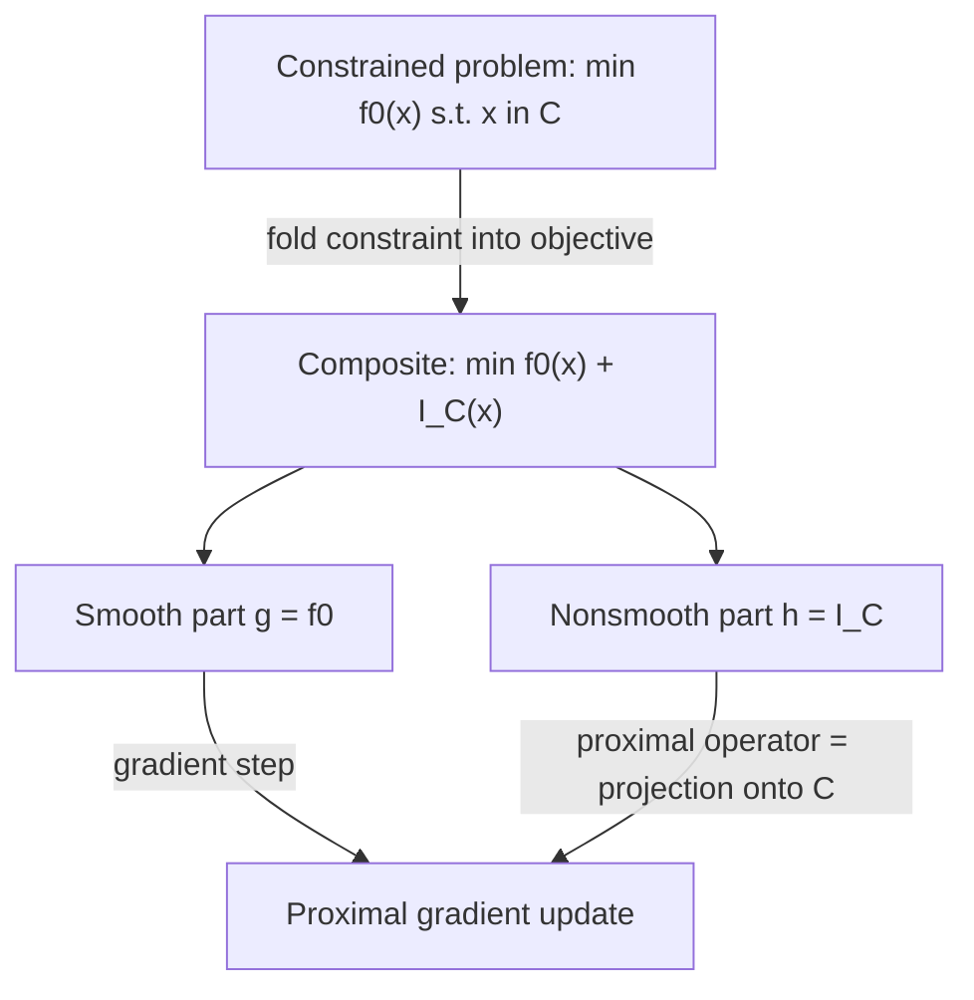

## Convexity in Composite and Constrained Problems

### Overview

Real optimization problems rarely consist of a single smooth convex function — they are built from sums of smooth and nonsmooth pieces, and are posed over feasible regions carved out by constraints. This topic assembles the earlier convexity-preserving operations, subgradient calculus, and problem-structure material into the specific setting of composite objectives and constrained convex problems, which is the form almost all practical convex solvers actually target.

### Composite Objective Structure

**Statement**

A **composite optimization problem** has the form:

$$\min_x \; F(x) = g(x) + h(x)$$

where $g$ is typically smooth (differentiable, often $L$-smooth) and convex, and $h$ is convex but possibly nonsmooth.

**Key Points**

- This decomposition is the standard template for proximal-gradient-type methods: the smooth part $g$ is handled via its gradient, and the nonsmooth part $h$ is handled via a proximal operator, avoiding the need for full subgradient information on the sum.
- $F = g + h$ is convex by the nonnegative-weighted-sum rule (with both weights equal to 1), so composite structure does not, by itself, complicate convexity verification — the difficulty it introduces is algorithmic (nonsmoothness), not structural (convexity still holds).
- Common concrete instances: $g$ a data-fidelity/loss term (squared error, logistic loss), $h$ a regularizer ($\|x\|_1$, $\|x\|_2$, indicator of a convex set for constraints).

### Canonical Composite Examples

**Example**

*LASSO:* $g(x) = \|Ax-b\|_2^2$ (smooth, convex), $h(x) = \lambda\|x\|_1$ (nonsmooth, convex).

*Elastic net:* $g(x) = \|Ax-b\|_2^2 + \frac{\lambda_2}{2}\|x\|_2^2$, $h(x) = \lambda_1\|x\|_1$ — combines the strong-convexity-inducing ridge term with the sparsity-inducing $\ell_1$ term.

*Constrained smooth minimization:* $g(x) = f_0(x)$ (the original smooth objective), $h(x) = I_{\mathcal{C}}(x)$ (indicator function of the convex feasible set $\mathcal{C}$) — this reformulation folds constraints directly into the composite objective, turning a constrained problem into an unconstrained (but nonsmooth) one.

**Output**

The indicator-function trick above is important structurally: it shows that constrained convex optimization and unconstrained composite convex optimization are, in a precise sense, the same problem class, since any convex constraint set can be absorbed into the objective via its indicator function, which is convex whenever the set is convex.

### Constraints as Convexity Requirements — Recap and Extension

**Statement**

Recall a convex optimization problem requires $f_i(x) \leq 0$ (convex $f_i$) and $h_j(x) = 0$ (affine $h_j$). Composite formulations reveal *why* this specific structure is required: the feasible set

$$\mathcal{X} = \{x : f_i(x) \leq 0 \,\forall i\} \cap \{x : h_j(x) = 0 \, \forall j\}$$

is an intersection of sublevel sets of convex functions (each convex, since sublevel sets of convex functions are convex) and affine sets (each convex, trivially). By the intersection rule for convex sets, $\mathcal{X}$ is convex.

**Interpretation**

This connects three previously separate ideas into one coherent picture: convexity-preserving operations (intersection of convex sets), sublevel-set convexity, and the standard-form definition of a convex program — they are not independent facts but different views of the same underlying mechanism.

### Composite Structure Diagram

### Proximal Operators for Composite Problems

**Statement**

The **proximal operator** of a convex function $h$ with parameter $t > 0$ is:

$$\text{prox}_{th}(v) = \arg\min_x \left( h(x) + \frac{1}{2t}\|x - v\|_2^2 \right)$$

**Interpretation**

This minimization is itself a convex problem (sum of convex $h$ and a strongly convex quadratic, hence strongly convex, hence a unique minimizer exists by the earlier strong-convexity uniqueness result) — proximal operators are always well-defined single-valued maps for convex $h$. Proximal-gradient methods alternate a gradient step on $g$ with a proximal step on $h$, exploiting the composite structure directly rather than treating $F = g+h$ as a generic nonsmooth function.

**Key Points**

- When $h = I_{\mathcal{C}}$, the proximal operator reduces exactly to Euclidean projection onto $\mathcal{C}$: $\text{prox}_{tI_{\mathcal{C}}}(v) = \text{proj}_{\mathcal{C}}(v)$ for any $t > 0$, unifying projected gradient descent with the general proximal-gradient framework.
- When $h(x) = \lambda\|x\|_1$, the proximal operator is the **soft-thresholding operator**, applied elementwise: $\text{prox}_{t\lambda\|\cdot\|_1}(v)_i = \text{sign}(v_i)\max(|v_i| - t\lambda, 0)$ — this is the computational mechanism directly responsible for exact sparsity in LASSO solutions, tracing back to the subdifferential of $|x|$ at zero covering an interval.

### Constraint Qualifications Revisited in Composite Form

**Statement**

For $F(x) = g(x) + I_{\mathcal{C}}(x)$ with $g$ differentiable, $x^*$ is optimal if and only if:

$$0 \in \nabla g(x^*) + \partial I_{\mathcal{C}}(x^*) = \nabla g(x^*) + N_{\mathcal{C}}(x^*)$$

where $N_{\mathcal{C}}(x^*) = \partial I_{\mathcal{C}}(x^*)$ is the **normal cone** to $\mathcal{C}$ at $x^*$.

**Interpretation**

Rearranged, this reads $-\nabla g(x^*) \in N_{\mathcal{C}}(x^*)$ — the negative gradient must lie in the normal cone, i.e., point "outward" from the feasible set (or be zero). This is exactly the first-order optimality condition from the earlier convex-problem-structure material, now derived directly from subdifferential calculus applied to the composite/indicator reformulation, showing the two treatments are consistent.

### Worked Example: Box-Constrained Least Squares

**Example**

$\min_x \|Ax-b\|_2^2$ subject to $l \leq x \leq u$ (elementwise box constraints).

Reformulate as composite: $g(x) = \|Ax-b\|_2^2$, $h(x) = I_{\mathcal{C}}(x)$ with $\mathcal{C} = \{x : l \leq x \leq u\}$ (a box, convex as an intersection of halfspaces).

The proximal-gradient update at each iteration is:

$$x_{k+1} = \text{proj}_{\mathcal{C}}\left(x_k - t\nabla g(x_k)\right) = \text{clip}\left(x_k - 2tA^T(Ax_k - b), \, l, \, u\right)$$

**Output**

This is exactly **projected gradient descent**, recovered as a special case of proximal-gradient methods applied to the composite formulation. It confirms convexity is preserved throughout (box is convex, $g$ is convex, composite sum is convex), so despite the constraint, every local solution found is guaranteed global.

### Convexity of Multi-Term Composite Objectives

**Statement**

For $F(x) = \sum_{i=1}^k h_i(x)$ with each $h_i$ convex (smooth or not), $F$ is convex by the nonnegative-weighted-sum rule applied with all weights equal to 1.

**Example**

Generalized elastic-net-style objective: $F(x) = \|Ax-b\|_2^2 + \lambda_1\|x\|_1 + \lambda_2\|x\|_2^2 + I_{\mathcal{C}}(x)$, combining a smooth loss, an $\ell_1$ sparsity term, a strongly-convex ridge term, and a hard convex constraint — all four terms convex, so the sum is convex by direct application of the sum rule, with no special-case reasoning needed despite the objective mixing smooth, nonsmooth, and extended-real-valued (indicator) pieces.

### Constrained Strong Convexity and Well-Posedness

**Key Points**

- Strong convexity of $g$ transfers directly to $F = g + h$ for any convex $h$: if $g$ is $m$-strongly convex and $h$ is convex, $F$ is at least $m$-strongly convex, since $F - \frac{m}{2}\|x\|^2 = (g - \frac{m}{2}\|x\|^2) + h$ is a sum of two convex functions.
- This means adding constraints (via an indicator function) or nonsmooth regularizers never destroys strong convexity already present in the smooth part — constrained and composite strongly convex problems retain unique minimizers and (under smoothness of $g$) the quadratic growth and gradient-norm suboptimality bounds from strong convexity, restricted appropriately to the feasible set.

### Common Pitfalls

**Key Points**

- Treating a constrained problem's convexity as automatic without checking that the constraint set itself is convex — a smooth convex objective over a nonconvex feasible region (e.g., defined by a nonlinear equality) is not a convex problem, regardless of how the objective looks.
- Applying ordinary gradient descent directly to a composite objective with a nonsmooth term, ignoring the availability of proximal-gradient methods designed for exactly this structure — subgradient methods work but converge much slower than proximal-gradient methods when the composite structure is exploited.
- Forgetting that $\text{prox}_{th}$ depends on $h$ alone, not on $g$ — a common implementation error is to fold the smooth part into the proximal subproblem instead of only the nonsmooth part.
- Assuming the normal cone $N_{\mathcal{C}}(x^*)$ is always a single ray or halfspace — at "smooth" boundary points of $\mathcal{C}$ it is a ray (single direction), but at corners or vertices of polyhedral $\mathcal{C}$, it can be a full cone of nonzero dimension, mirroring the subdifferential's set-valued behavior at kinks.

### Related Topics

- Proximal-gradient methods and accelerated variants (ISTA, FISTA)
- Normal cones and their relationship to subdifferentials of indicator functions
- ADMM (alternating direction method of multipliers) for composite and constrained problems
- Projected gradient descent as a special case of proximal-gradient methods
- Augmented Lagrangian methods for constrained convex problems
- Structured sparsity regularizers (group LASSO, nuclear norm) as further composite-objective examples