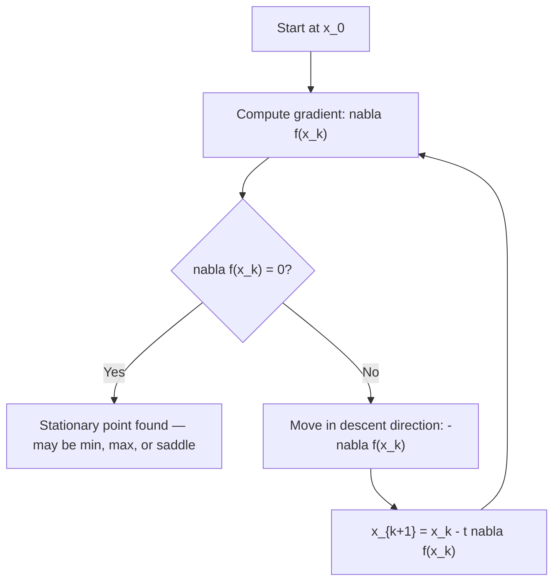

## Unconstrained First-Order Necessary Conditions

### Overview

First-order necessary conditions are the starting point of classical (not necessarily convex) optimization theory: they identify candidate optimal points using only gradient information, without requiring any convexity assumption. Unlike the convex setting, satisfying these conditions is necessary but not sufficient for optimality in general — this distinction is central to understanding why nonconvex optimization is fundamentally harder than convex optimization.

### Stationary Points

**Definition**

For $f: \mathbb{R}^n \to \mathbb{R}$ differentiable, $x^*$ is a **stationary point** (critical point) if:

$$\nabla f(x^*) = 0$$

**Statement (First-Order Necessary Condition)**

If $x^*$ is a **local** minimizer (or maximizer) of $f$ and $f$ is differentiable at $x^*$, then $\nabla f(x^*) = 0$.

**Proof sketch**

Suppose $\nabla f(x^*) \neq 0$. Consider the direction $d = -\nabla f(x^*)$. The directional derivative in this direction is:

$$\nabla f(x^*)^T d = -\|\nabla f(x^*)\|_2^2 < 0$$

A negative directional derivative means $f(x^* + \epsilon d) < f(x^*)$ for sufficiently small $\epsilon > 0$ (by the definition of the derivative as a limit), contradicting local optimality of $x^*$. So $\nabla f(x^*) = 0$ is necessary.

### Necessary, Not Sufficient

**Key Points**

- Stationarity is satisfied by local minima, local maxima, **and saddle points** — the condition $\nabla f(x^*) = 0$ alone cannot distinguish between these three cases.
- This is the fundamental reason first-order conditions alone are insufficient for general (nonconvex) optimization: finding a stationary point does not certify that a minimum — even a local one in a strict sense — has been found, only that no *infinitesimal* improving direction exists to first order.
- Contrast with the convex case: for convex $f$, every stationary point **is** a global minimizer (shown in the convex optimality section), so the necessary condition becomes sufficient. This gap between necessary and sufficient is precisely what convexity closes.

### Geometric Illustration of the Three Stationary Point Types

<svg xmlns="http://www.w3.org/2000/svg" viewBox="0 0 560 260">
<text x="280" y="20" text-anchor="middle" font-size="14" font-weight="bold" fill="#222">Stationary Point Types (svg_diagram)</text>
<line x1="30" y1="220" x2="170" y2="220" stroke="#444" stroke-width="1" />
<path d="M 40 200 Q 100 100 160 200" stroke="#1f6feb" stroke-width="2.5" fill="none" />
<circle cx="100" cy="140" r="4" fill="#111" />
<text x="100" y="235" text-anchor="middle" font-size="11" fill="#333">local min</text>
<line x1="210" y1="220" x2="350" y2="220" stroke="#444" stroke-width="1" />
<path d="M 220 130 Q 280 220 340 130" stroke="#e05252" stroke-width="2.5" fill="none" />
<circle cx="280" cy="196" r="4" fill="#111" />
<text x="280" y="235" text-anchor="middle" font-size="11" fill="#333">local max</text>
<line x1="390" y1="220" x2="530" y2="220" stroke="#444" stroke-width="1" />
<path d="M 400 210 Q 460 90 520 130" stroke="#2ea44f" stroke-width="2.5" fill="none" />
<circle cx="460" cy="150" r="4" fill="#111" />
<text x="460" y="235" text-anchor="middle" font-size="11" fill="#333">saddle point</text>
</svg>

All three configurations satisfy $\nabla f(x^*) = 0$, but only the leftmost is a local minimum.

### Distinction: Local vs. Global, Interior vs. Boundary

**Key Points**

- The first-order necessary condition as stated applies to **unconstrained** optimization, or equivalently to interior points of the feasible set in a constrained problem — at a boundary point of a constrained feasible set, a local minimizer need not satisfy $\nabla f(x^*) = 0$ (constrained first-order conditions, e.g., KKT conditions, apply instead).
- The condition identifies **local** minimizers only; without further global structure (such as convexity, or an exhaustive check of all stationary points on a compact domain via the extreme value theorem), a stationary point provides no information about global optimality.
- Differentiability at $x^*$ is a standing assumption — the condition simply does not apply, or must be replaced by a subgradient-based condition ($0 \in \partial f(x^*)), at points where $f
   is nondifferentiable.

### Worked Example 1: Simple Polynomial

**Example**

$f(x) = x^3 - 3x$ on $\mathbb{R}$.

$$f'(x) = 3x^2 - 3 = 0 \implies x = \pm 1$$

Evaluate: $f(1) = 1 - 3 = -2$, $f(-1) = -1+3 = 2$.

**Output**

Both $x=1$ and $x=-1$ are stationary points. Checking the sign of $f'$ around each (or using the second-derivative test covered elsewhere) reveals $x=-1$ is a local maximum and $x=1$ is a local minimum — neither is a global extremum, since $f(x) \to \pm\infty$ as $x \to \pm\infty$ (the function is unbounded both above and below on $\mathbb{R}$). This illustrates directly that stationarity alone, without further analysis, does not even guarantee local-type classification, let alone global optimality.

### Worked Example 2: A Saddle Point

**Example**

$f(x_1, x_2) = x_1^2 - x_2^2$ on $\mathbb{R}^2$.

$$\nabla f(x) = \begin{bmatrix} 2x_1 \\ -2x_2 \end{bmatrix} = 0 \implies x^* = (0,0)$$

**Output**

$(0,0)$ is the unique stationary point. Along the $x_1$-axis ($x_2=0$), $f(x_1, 0) = x_1^2$ increases away from the origin — looks like a minimum along this slice. Along the $x_2$-axis ($x_1=0$), $f(0,x_2) = -x_2^2$ decreases away from the origin — looks like a maximum along this slice. This is the classic **saddle point** signature: a stationary point that is a local min in some directions and a local max in others, confirming the necessity (but insufficiency) of the first-order condition even more starkly than the 1D example.

### Stationarity Under Reparametrization

**Statement**

If $x^*$ is a stationary point of $f$ and $\phi$ is any invertible, differentiable change of variables with $x = \phi(u)$, then $u^* = \phi^{-1}(x^*)$ is a stationary point of $g(u) = f(\phi(u))$, by the chain rule:

$$\nabla g(u^*) = D\phi(u^*)^T \nabla f(x^*) = D\phi(u^*)^T \cdot 0 = 0$$

**Interpretation**

Stationarity is preserved under smooth invertible reparametrization — this fact underlies why coordinate transformations (e.g., log-transforms in geometric programming, or change of basis) can simplify optimization problems without creating or destroying stationary points, only relocating and relabeling them.

### Relationship to Descent-Direction–Based Algorithms

**Key Points**

- Virtually all gradient-based iterative methods (gradient descent, Newton's method, quasi-Newton methods) are, at their core, searching for a point satisfying the first-order necessary condition — the algorithm's stopping criterion is typically $\|\nabla f(x_k)\| < \epsilon$ for small tolerance $\epsilon$.
- Because stationarity does not certify a minimum in the nonconvex case, practical algorithms often supplement the first-order stopping criterion with second-order checks (e.g., confirming the Hessian is positive semidefinite at the stationary point found) or with multiple random restarts to gain empirical confidence a global — or at least good local — minimum has been reached. [Inference: whether a particular solver applies these supplementary checks by default is implementation-specific; the general practice of combining first-order stopping criteria with second-order verification is standard advice in the optimization literature rather than a universal guarantee about any specific piece of software.]

### Common Pitfalls

**Key Points**

- Concluding that $\nabla f(x^*) = 0$ certifies a local minimum without further checking — it is equally consistent with a local maximum or a saddle point; second-order conditions (covered separately) are needed to distinguish these cases.
- Applying the unconstrained stationarity condition directly at a boundary point of a constrained problem — boundary optimality generally requires $\nabla f(x^*) \neq 0$ paired with the gradient pointing appropriately relative to the feasible region (formalized later via KKT conditions), not $\nabla f(x^*) = 0$.
- Assuming a stationary point search will find the *global* minimum on a general nonconvex function — without convexity or an exhaustive argument, the algorithm may converge to any of possibly many stationary points, with no guarantee of global optimality.
- Forgetting that differentiability is a precondition — nondifferentiable points can be local minima without any zero-gradient certificate at all (e.g., $f(x) = |x|$ at $x=0$, where the necessary condition must be replaced by $0 \in \partial f(0)$).

### Related Topics

- Second-order necessary and sufficient conditions (Hessian-based classification of stationary points)
- KKT conditions for constrained first-order optimality
- Saddle points and their significance in nonconvex optimization (e.g., in deep learning loss landscapes)
- Newton's method and its use of second-order information to accelerate convergence toward stationary points
- Subgradient-based stationarity conditions for nonsmooth functions
- Global optimization strategies (random restarts, basin hopping) when first-order conditions are insufficient