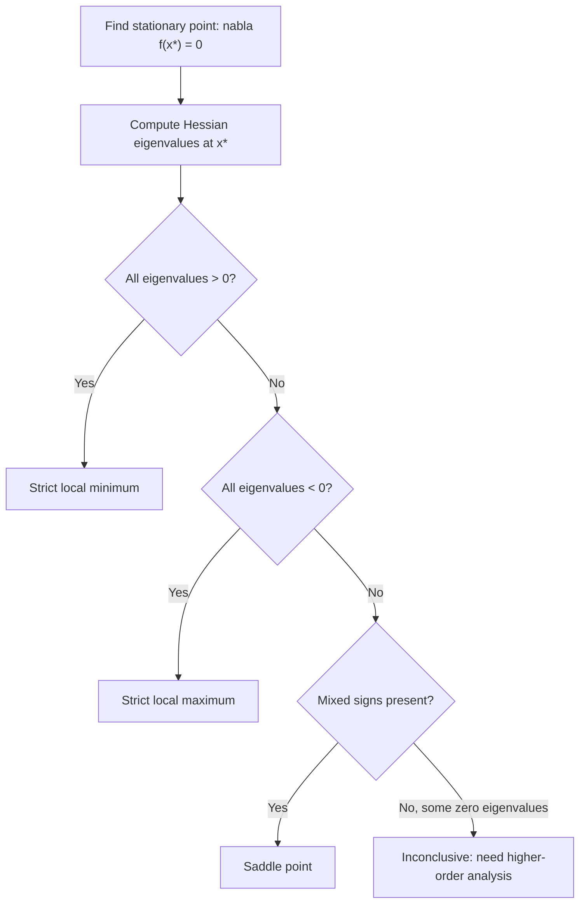

## Unconstrained Second-Order Sufficient Conditions

### Overview

Second-order conditions use Hessian curvature information to resolve exactly the ambiguity first-order conditions leave open: whether a stationary point is a local minimum, local maximum, or saddle point. Sufficient conditions here provide a genuine certificate of local optimality, closing the gap that stationarity alone cannot close in the nonconvex setting.

### Second-Order Sufficient Condition

**Statement**

Let $f: \mathbb{R}^n \to \mathbb{R}$ be twice continuously differentiable near $x^*$. If:

1. $\nabla f(x^*) = 0$ (first-order necessary condition), and
2. $\nabla^2 f(x^*) \succ 0$ (Hessian positive definite at $x^*$)

then $x^*$ is a **strict local minimizer** of $f$.

**Proof sketch**

By Taylor's theorem with the Lagrange remainder, for $x$ near $x^*$:

$$f(x) = f(x^*) + \nabla f(x^*)^T(x-x^*) + \frac{1}{2}(x-x^*)^T \nabla^2 f(\xi) (x-x^*)$$

for some $\xi$ on the segment between $x$ and $x^*$. The first-order term vanishes by condition 1. By continuity of $\nabla^2 f$ and positive definiteness at $x^*$, there is a neighborhood where $\nabla^2 f(\xi) \succeq \frac{m}{2}I$ for some $m > 0$, giving:

$$f(x) - f(x^*) \geq \frac{m}{4}\|x-x^*\|_2^2 > 0 \quad \text{for } x \neq x^* \text{ near } x^*$$

confirming a strict local minimum.

**Interpretation**

The key logical structure: this is a **sufficient**, not necessary, condition — positive definiteness (strict positivity of all eigenvalues) is what makes the condition sufficient rather than merely necessary. It is precisely one notch stronger than the second-order *necessary* condition below, and that extra strictness is what converts "cannot rule out a minimum" into "certified minimum."

### Second-Order Necessary Condition (For Contrast)

**Statement**

If $x^*$ is a local minimizer and $f$ is twice differentiable near $x^*$, then:

1. $\nabla f(x^*) = 0$
2. $\nabla^2 f(x^*) \succeq 0$ (positive **semi**definite — necessary, weaker than the sufficient condition's requirement)

**Key Points**

- The necessary condition uses $\succeq 0$; the sufficient condition uses $\succ 0$. This single-symbol difference marks the boundary between "consistent with a minimum" and "certified minimum."
- The gap between necessary ($\succeq 0$) and sufficient ($\succ 0$) is not closable in general — there exist stationary points with $\nabla^2 f(x^*) \succeq 0$ (but not $\succ 0$) that are **not** local minima, meaning the necessary condition alone leaves genuine ambiguity that only additional information (higher-order terms, or direct function evaluation) can resolve.

### Classification via Eigenvalues of the Hessian

**Statement**

At a stationary point $x^*$ with twice-differentiable $f$, examine the eigenvalues of $\nabla^2 f(x^*)$:

| Eigenvalues | Classification |
| --- | --- |
| All $> 0$ | Strict local minimum |
| All $< 0$ | Strict local maximum |
| Mixed signs (some $>0$, some $<0$) | Saddle point |
| Some zero, rest same sign, none opposite sign | Inconclusive — higher-order terms decide |

**Key Points**

- The "inconclusive" row is the important caveat: when the Hessian is positive semidefinite but singular (has a zero eigenvalue) at a stationary point, second-order information alone cannot classify the point — third or higher derivatives, or direct analysis, are required.
- This table is the direct multivariate generalization of the single-variable second-derivative test ($f''(x^*) > 0 \Rightarrow$ min, $f''(x^*) < 0 \Rightarrow$ max, $f''(x^*) = 0 \Rightarrow$ inconclusive).

### Worked Example 1: Confirming a Strict Local Minimum

**Example**

$f(x_1, x_2) = x_1^2 + 2x_2^2 + x_1x_2$.

$$\nabla f(x) = \begin{bmatrix} 2x_1 + x_2 \\ 4x_2 + x_1 \end{bmatrix} = 0 \implies x^* = (0,0)$$

$$\nabla^2 f(x) = \begin{bmatrix} 2 & 1 \\ 1 & 4 \end{bmatrix}$$

Leading principal minors: $M_1 = 2 > 0$, $M_2 = 8 - 1 = 7 > 0$.

**Output**

$\nabla^2 f(0,0) \succ 0$ (both leading principal minors strictly positive confirms positive definiteness, by Sylvester's criterion). Combined with $\nabla f(0,0) = 0$, this certifies $(0,0)$ is a **strict local minimum**. Since $f$ is in fact a strictly convex quadratic (constant PD Hessian everywhere), this local minimum is additionally the unique global minimum — though that stronger conclusion relies on convexity, not on the second-order sufficient condition alone, which is inherently a local statement.

### Worked Example 2: Inconclusive Case

**Example**

$f(x) = x^4$ on $\mathbb{R}$.

$$f'(x) = 4x^3 = 0 \implies x^* = 0, \qquad f''(x) = 12x^2 \implies f''(0) = 0$$

**Output**

The second-order sufficient condition does not apply ($f''(0) = 0$, not $> 0$), and the necessary condition is satisfied but does not resolve the classification. Direct inspection shows $f(x) = x^4 \geq 0 = f(0)$ for all $x$, so $x^*=0$ **is** in fact a strict global minimum — but this conclusion required going beyond the second-order test, illustrating precisely the inconclusive-case caveat from the table above. This is the same function used earlier to illustrate that convexity does not require Hessian positive-definiteness everywhere.

### Worked Example 3: Distinguishing a Saddle via Mixed Eigenvalues

**Example**

Revisit $f(x_1,x_2) = x_1^2 - x_2^2$ from the first-order conditions material, with stationary point $(0,0)$.

$$\nabla^2 f(x) = \begin{bmatrix} 2 & 0 \\ 0 & -2 \end{bmatrix}$$

Eigenvalues are $2$ and $-2$ — mixed signs.

**Output**

By the classification table, $(0,0)$ is confirmed a **saddle point**, matching the earlier informal slice-by-slice analysis but now certified rigorously via the Hessian's eigenvalue signs rather than by inspecting individual coordinate directions one at a time.

### Second-Order Conditions Flowchart

### Relationship to Newton's Method

**Statement**

Newton's method uses the update:

$$x_{k+1} = x_k - \left[\nabla^2 f(x_k)\right]^{-1} \nabla f(x_k)$$

**Interpretation**

Near a point satisfying the second-order sufficient condition (Hessian positive definite), Newton's method is locally well-defined (the Hessian is invertible) and converges quadratically. Away from such points — e.g., near a saddle point where the Hessian is indefinite — the plain Newton update can behave poorly, potentially converging *toward* a saddle point rather than away from it, since the method only uses stationarity of the local quadratic model and does not itself distinguish minima from saddles. [Inference: the precise behavior (attraction to saddle points, divergence, or well-defined but non-minimizing steps) depends on the specific function and starting point; the general caution that unmodified Newton's method has no inherent bias toward minima over saddles is a standard point made in nonconvex optimization texts, particularly in the context of high-dimensional non-convex loss landscapes.]

**Practical mitigation**

Trust-region methods and Hessian-modification strategies (e.g., adding a multiple of the identity to force positive definiteness, as in Levenberg–Marquardt-style approaches) are standard responses to this issue, ensuring the search direction is a genuine descent direction even when the local Hessian is indefinite.

### Relationship to Strong Convexity (Local vs. Global)

**Key Points**

- The second-order sufficient condition $\nabla^2 f(x^*) \succ 0$ is a purely **local**, pointwise statement — it says nothing about the Hessian's behavior away from $x^*$.
- Strong convexity, by contrast, requires $\nabla^2 f(x) \succeq mI$ **uniformly over the entire domain** — a strictly stronger, global requirement.
- Consequently, a strict local minimum certified by the second-order sufficient condition need not be a global minimum unless additional global structure (convexity, or an exhaustive search over all stationary points) is established separately — this is the same local/global gap that motivates convexity as a modeling assumption in the first place.

### Common Pitfalls

**Key Points**

- Treating positive **semi**definiteness ($\succeq 0$) at a stationary point as sufficient for a local minimum — semidefiniteness alone is only necessary; strict positive definiteness ($\succ 0$) is required for the sufficient condition to apply.
- Concluding "not a local minimum" when the Hessian is positive semidefinite but singular — this case is genuinely inconclusive from second-order information alone, not evidence against a minimum.
- Assuming a certified strict local minimum is automatically the global minimum without separately verifying convexity or performing a broader search — the second-order sufficient condition is local by construction.
- Applying unmodified Newton's method near a suspected saddle point and interpreting convergence as confirmation of a minimum — Newton's method converges to stationary points generally, not selectively to minima, so a self-consistency check (verifying the Hessian at the limit point) is still required.

### Related Topics

- Trust-region methods and Hessian modification strategies for nonconvex Newton-type methods
- Saddle-point escape strategies in nonconvex and high-dimensional optimization (relevant to deep learning loss landscapes)
- Strong convexity as the global strengthening of local positive-definiteness
- Higher-order optimality conditions for degenerate (Hessian-singular) stationary points
- Constrained second-order sufficient conditions (using the Hessian of the Lagrangian, restricted to the tangent space of active constraints)
- Quasi-Newton methods (BFGS, L-BFGS) and their implicit positive-definite Hessian approximations