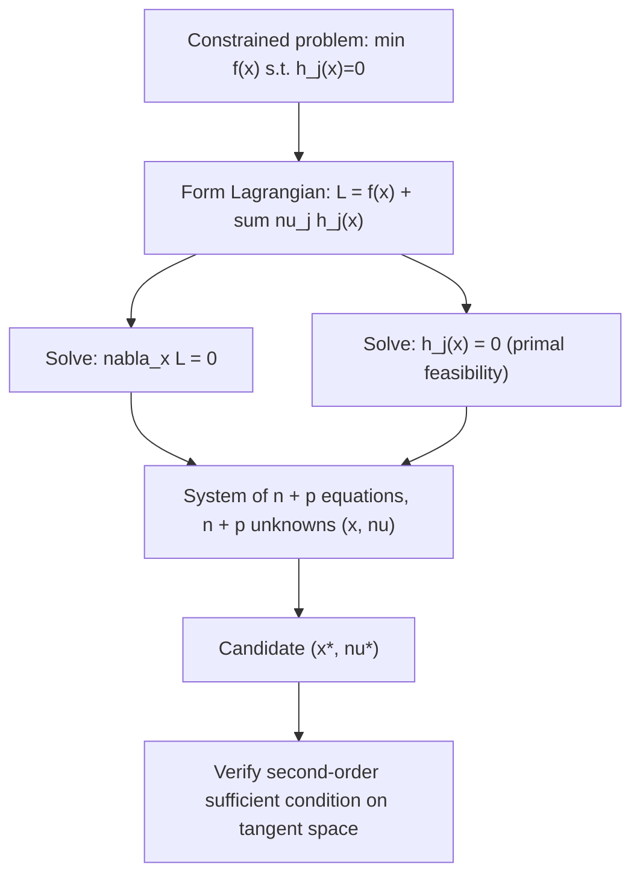

## Constrained Optimization and Lagrange Multipliers

### Overview

Lagrange multipliers convert equality-constrained optimization into an unconstrained stationarity problem in an augmented variable space, by attaching a multiplier to each constraint and requiring the gradient of a combined function — the Lagrangian — to vanish. This is the classical foundation from which the more general KKT conditions (covering inequality constraints as well) are built.

### Problem Setup

**Statement**

$$\min_x f(x) \quad \text{s.t.} \quad h_j(x) = 0, \; j = 1, \dots, p$$

with $f, h_j: \mathbb{R}^n \to \mathbb{R}$ continuously differentiable. No convexity is assumed at this stage — this is the general classical (Lagrangian) theory, applicable to nonconvex problems as well.

### The Lagrangian

**Definition**

$$\mathcal{L}(x, \nu) = f(x) + \sum_{j=1}^p \nu_j \, h_j(x)$$

where $\nu_j \in \mathbb{R}$ are the **Lagrange multipliers**, one per equality constraint.

**Interpretation**

The Lagrangian folds the constraints into the objective as penalty-like terms, but with multiplier signs and magnitudes left free (not fixed penalty weights) — the multipliers are additional variables to be solved for jointly with $x$, not pre-chosen constants.

### First-Order Necessary Conditions (Lagrange Multiplier Theorem)

**Statement**

Suppose $x^*$ is a local minimizer of the constrained problem, and the gradients $\nabla h_1(x^*), \dots, \nabla h_p(x^*)$ are linearly independent (a **constraint qualification**, specifically linear independence constraint qualification / LICQ). Then there exists $\nu^* \in \mathbb{R}^p$ such that:

$$\nabla_x \mathcal{L}(x^*, \nu^*) = \nabla f(x^*) + \sum_{j=1}^p \nu_j^* \nabla h_j(x^*) = 0$$

together with primal feasibility $h_j(x^*) = 0$ for all $j$.

**Interpretation**

Rearranged, this says $\nabla f(x^*) = -\sum_j \nu_j^* \nabla h_j(x^*)$: at a constrained local optimum, the objective gradient must lie in the span of the constraint gradients. Geometrically, $\nabla f(x^*)$ has no component within the tangent space of the constraint surface at $x^*$ — otherwise that component would give a feasible descent direction along the constraint surface, contradicting local optimality.

### Geometric Picture: Tangency of Level Sets

<svg xmlns="http://www.w3.org/2000/svg" viewBox="0 0 520 300">
<text x="260" y="20" text-anchor="middle" font-size="14" font-weight="bold" fill="#222">Lagrange Condition as Gradient Alignment (svg_diagram)</text>
<ellipse cx="260" cy="170" rx="180" ry="30" fill="none" stroke="#1f6feb" stroke-width="1.5" transform="rotate(-15 260 170)" />
<ellipse cx="260" cy="170" rx="120" ry="20" fill="none" stroke="#1f6feb" stroke-width="1.5" transform="rotate(-15 260 170)" />
<ellipse cx="260" cy="170" rx="60" ry="10" fill="none" stroke="#1f6feb" stroke-width="1.5" transform="rotate(-15 260 170)" />
<text x="420" y="70" font-size="11" fill="#1f6feb">level sets of f</text>
<path d="M 100 240 Q 260 100 420 240" stroke="#e05252" stroke-width="2.5" fill="none" />
<text x="420" y="255" font-size="11" fill="#e05252">constraint: h(x) = 0</text>
<circle cx="260" cy="140" r="4" fill="#111" />
<line x1="260" y1="140" x2="260" y2="90" stroke="#2ea44f" stroke-width="2" marker-end="url(#arrow3)" />
<text x="270" y="105" font-size="10" fill="#2ea44f">∇f(x*)</text>
<line x1="260" y1="140" x2="260" y2="190" stroke="#7c3aed" stroke-width="2" marker-end="url(#arrow3)" />
<text x="270" y="180" font-size="10" fill="#7c3aed">∇h(x*)</text>
</svg>

At the constrained optimum, the objective's level curve is tangent to the constraint curve — equivalently, their gradients are parallel (possibly opposite in sign), which is exactly the condition $\nabla f(x^*) = -\nu^* \nabla h(x^*)$.

### Worked Example: Single Equality Constraint

**Example**

$\min_{x_1,x_2} \; x_1^2 + x_2^2 \quad \text{s.t.} \quad x_1 + x_2 = 1$.

$$\mathcal{L}(x, \nu) = x_1^2 + x_2^2 + \nu(x_1+x_2-1)$$

$$\nabla_x \mathcal{L} = \begin{bmatrix} 2x_1 + \nu \\ 2x_2 + \nu \end{bmatrix} = 0 \implies x_1 = x_2 = -\nu/2$$

Substituting into the constraint: $-\nu/2 - \nu/2 = 1 \implies \nu = -1$, so $x_1 = x_2 = 1/2$.

**Output**

$x^* = (1/2, 1/2)$, $\nu^* = -1$. Geometrically, this is the point on the line $x_1+x_2=1$ closest to the origin — consistent with minimizing squared Euclidean distance to the origin subject to the linear constraint, confirming the algebraic solution matches geometric intuition.

### Worked Example: Multiple Constraints

**Example**

$\min_x \; x_1 + x_2 + x_3 \quad \text{s.t.} \quad x_1^2+x_2^2 = 1, \; x_3 = 0$.

$$\mathcal{L} = x_1+x_2+x_3 + \nu_1(x_1^2+x_2^2-1) + \nu_2 x_3$$

$$\nabla_x \mathcal{L} = \begin{bmatrix} 1 + 2\nu_1 x_1 \\ 1 + 2\nu_1 x_2 \\ 1 + \nu_2 \end{bmatrix} = 0$$

From the third row, $\nu_2 = -1$. From the first two, $x_1 = x_2 = -\frac{1}{2\nu_1}$. Substituting into the first constraint: $2 \cdot \frac{1}{4\nu_1^2} = 1 \implies \nu_1 = \pm\frac{1}{\sqrt{2}}$.

**Output**

Two candidate points from $\nu_1 = \pm 1/\sqrt{2}$: $x = (-1/\sqrt2, -1/\sqrt2, 0)$ (from $\nu_1 = 1/\sqrt2$) giving objective value $-\sqrt{2}$, and $x = (1/\sqrt2, 1/\sqrt2, 0)$ (from $\nu_1=-1/\sqrt2$) giving objective value $\sqrt2$. Since the constraint set (a circle in the $x_1,x_2$ plane, crossed with the single point $x_3=0$) is compact, the extreme value theorem guarantees both a global min and max exist among stationary candidates — direct comparison identifies $x^*=(-1/\sqrt2,-1/\sqrt2,0)$ as the global minimizer.

### Second-Order Conditions for Constrained Problems

**Statement**

At a candidate $(x^*, \nu^*)$ satisfying the first-order conditions, a **sufficient** condition for $x^*$ to be a strict local minimizer is that the Hessian of the Lagrangian (with respect to $x$), restricted to the **tangent space** of the constraints, is positive definite:

$$d^T \nabla_{xx}^2 \mathcal{L}(x^*, \nu^*) \, d > 0 \quad \forall d \neq 0 \text{ with } \nabla h_j(x^*)^T d = 0 \, \forall j$$

**Interpretation**

This restricts the second-order test to directions $d$ that stay tangent to the constraint surface — the unconstrained second-order test's global positive-definiteness requirement is relaxed to only the subspace of feasible directions, since directions leaving the constraint surface are irrelevant to local optimality along it. This is the direct generalization needed once curvature in "off-constraint" directions no longer matters.

### Why the Constraint Qualification Matters

**Statement**

Without a constraint qualification (such as LICQ — linear independence of the active constraint gradients), the Lagrange multiplier theorem's conclusion can fail: a local minimizer may exist with **no** valid multiplier vector $\nu^*$ satisfying the stationarity condition.

**Example**

Classic degenerate case: $\min x_1 \;\text{s.t.}\; x_2^2 = x_1^3$ has a cusp at the origin where the constraint gradient vanishes ($\nabla h(0,0) = 0$), violating LICQ; the standard Lagrangian stationarity condition fails to correctly characterize the constrained minimizer at that point, since $\nabla h(0,0)=0$ makes the condition $\nabla f = -\nu \nabla h$ trivially unsolvable in the intended sense. [Inference: this specific example is a standard textbook illustration of constraint-qualification failure; the precise pathological behavior (whether the origin is even a local min of the constrained problem in this instance) depends on careful case analysis of the cuspidal curve, and different texts choose different canonical failure examples — the general principle that LICQ failure can invalidate the theorem's conclusion is the well-established point being illustrated.]

**Interpretation**

This is why the constraint qualification is stated as a hypothesis, not dropped as a technicality — Lagrange multipliers are not guaranteed to exist at every constrained local optimum without it.

### Lagrangian Stationarity System

### Sensitivity Interpretation of Multipliers

**Statement**

Under suitable regularity, the optimal multiplier satisfies:

$$\nu_j^* = \frac{\partial f(x^*(b))}{\partial b_j} \bigg|_{b=0}$$

where $f(x^*(b))$ denotes the optimal objective value as a function of a perturbation $b_j$ added to the $j$-th constraint ($h_j(x) = b_j$ instead of $h_j(x)=0$).

**Interpretation**

Each multiplier measures the marginal rate at which the optimal objective value changes as the corresponding constraint is relaxed or tightened — this "shadow price" interpretation is what gives Lagrange multipliers their significance in economics (marginal utility of relaxing a resource constraint) and engineering design (sensitivity of an optimal design to a specification change), beyond their purely algebraic role in the stationarity system.

### Relationship to Later Constrained Theory

**Key Points**

- The equality-only Lagrangian theory here is a special case of the KKT conditions, which extend the same machinery to inequality constraints by introducing complementary slackness and sign-restricted multipliers.
- For convex problems (convex $f$, convex inequality constraints, affine equality constraints), the Lagrange/KKT stationarity conditions become both necessary **and sufficient** for global optimality (given a constraint qualification such as Slater's condition) — recovering, in the constrained setting, the same necessary-becomes-sufficient upgrade that convexity provides in the unconstrained case.
- The Lagrangian function itself, viewed as a function of $\nu$ for fixed or optimized $x$, is the starting point for Lagrangian duality theory.

### Common Pitfalls

**Key Points**

- Forgetting to verify a constraint qualification before invoking the Lagrange multiplier theorem — without it, the theorem's conclusion (existence of valid multipliers) is not guaranteed, and solving the stationarity system might miss the true constrained optimum entirely.
- Treating the sign of $\nu_j^*$ as meaningful for equality constraints — for equality constraints (unlike inequality constraints in KKT theory), the multiplier's sign is unrestricted and carries no optimality information by itself; only for inequality constraints does sign restriction become part of the necessary conditions.
- Applying the unconstrained second-order sufficient condition (Hessian positive definite over *all* of $\mathbb{R}^n$) instead of the correctly restricted tangent-space version — the constrained version only requires positive definiteness on directions tangent to the constraint surface, a strictly weaker (easier to satisfy) requirement.
- Assuming Lagrangian stationarity alone certifies a global minimum in the general nonconvex constrained case — as with the unconstrained setting, this requires either convexity structure or additional global argument.

### Related Topics

- KKT conditions for inequality-constrained and mixed-constraint problems
- Lagrangian duality and the dual function/dual problem
- Sensitivity analysis and shadow prices in constrained optimization
- Constraint qualifications beyond LICQ (Mangasarian–Fromovitz, Slater's condition)
- Augmented Lagrangian and penalty methods for numerically solving constrained problems
- Second-order sufficient conditions restricted to the critical cone in nonlinear programming