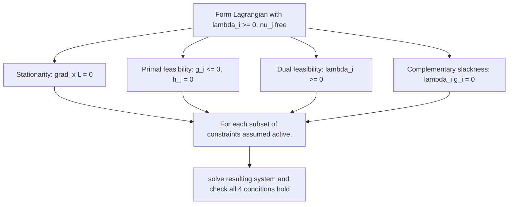

## Karush–Kuhn–Tucker Conditions Derivation

### Overview

The KKT conditions extend the Lagrange multiplier framework to problems with inequality constraints as well as equality constraints, introducing the additional mechanism of complementary slackness to handle constraints that may or may not be "active" at the optimum. They are the single most-used first-order optimality characterization in constrained nonlinear and convex programming.

### Problem Setup

**Statement**

$$\min_x f(x) \quad \text{s.t.} \quad g_i(x) \leq 0, \; i=1,\dots,m, \qquad h_j(x) = 0, \; j=1,\dots,p$$

with $f, g_i, h_j$ continuously differentiable. As with the Lagrangian theory, this setup does not require convexity — the KKT conditions are stated here in the general (possibly nonconvex) setting first.

### The Generalized Lagrangian

**Definition**

$$\mathcal{L}(x, \lambda, \nu) = f(x) + \sum_{i=1}^m \lambda_i g_i(x) + \sum_{j=1}^p \nu_j h_j(x)$$

where $\lambda_i \geq 0$ are multipliers for the inequality constraints and $\nu_j \in \mathbb{R}$ (unrestricted sign) for the equality constraints.

### The Four KKT Conditions

**Statement**

Suppose $x^*$ is a local minimizer and a constraint qualification holds (e.g., LICQ on the active constraint gradients, or Slater's condition in the convex case). Then there exist $\lambda^* \geq 0$, $\nu^* \in \mathbb{R}^p$ such that:

1. **Stationarity:** $\nabla f(x^*) + \sum_i \lambda_i^* \nabla g_i(x^*) + \sum_j \nu_j^* \nabla h_j(x^*) = 0$
2. **Primal feasibility:** $g_i(x^*) \leq 0 \; \forall i$, $h_j(x^*) = 0 \; \forall j$
3. **Dual feasibility:** $\lambda_i^* \geq 0 \; \forall i$
4. **Complementary slackness:** $\lambda_i^* g_i(x^*) = 0 \; \forall i$

**Interpretation**

Complementary slackness is the genuinely new mechanism beyond the equality-only Lagrangian theory: for each inequality constraint, *either* the constraint is active ($g_i(x^*)=0$) *or* its multiplier is zero ($\lambda_i^*=0$) — or both. An inactive constraint (strictly satisfied, $g_i(x^*)<0$) contributes nothing to the stationarity condition, since it plays no local role in blocking movement toward lower objective values.

### Deriving Dual Feasibility ($\lambda_i \geq 0$): Why the Sign Matters

**Statement**

Unlike equality-constraint multipliers, inequality-constraint multipliers must be nonnegative. This follows from the geometry: at an active constraint ($g_i(x^*)=0$), feasible directions $d$ must satisfy $\nabla g_i(x^*)^Td \leq 0$ (not increasing the constraint past zero). For $x^*$ to be optimal, no feasible direction can be a descent direction, so $\nabla f(x^*)^Td \geq 0$ whenever $\nabla g_i(x^*)^Td \leq 0$ for all active $i$.

**Interpretation**

This one-sided implication (descent blocked only when the constraint gradient direction is also one-sided) is exactly what forces the multiplier sign: $\nabla f(x^*)$ must be expressible as a **nonnegative** combination of the active constraint gradients $\nabla g_i(x^*)$ (plus an arbitrary combination of equality constraint gradients, which have no directional restriction). A negative $\lambda_i$ would mean $-\lambda_i \nabla g_i(x^*)$ points in a feasible-descent direction relative to that constraint — contradicting optimality.

### Geometric Illustration

<svg xmlns="http://www.w3.org/2000/svg" viewBox="0 0 520 300">
<text x="260" y="20" text-anchor="middle" font-size="14" font-weight="bold" fill="#222">KKT Stationarity at an Active Inequality Constraint (svg_diagram)</text>
<path d="M 80 250 Q 260 120 460 250" stroke="#e05252" stroke-width="2.5" fill="none" />
<text x="440" y="270" font-size="11" fill="#e05252">g(x) = 0 (boundary)</text>
<path d="M 80 260 Q 260 150 460 260 L 460 280 L 80 280 Z" fill="#ffece8" opacity="0.5" />
<text x="260" y="270" font-size="10" fill="#e05252">g(x) &lt; 0 (feasible)</text>
<circle cx="260" cy="150" r="4" fill="#111" />
<text x="200" y="140" font-size="10" fill="#111">x*</text>
<line x1="260" y1="150" x2="260" y2="90" stroke="#2ea44f" stroke-width="2" marker-end="url(#arrow4)" />
<text x="270" y="105" font-size="10" fill="#2ea44f">-∇f(x*)</text>
<line x1="260" y1="150" x2="260" y2="90" stroke="#7c3aed" stroke-width="2" stroke-dasharray="3,2" marker-end="url(#arrow4)" transform="translate(15,0)" />
<text x="290" y="120" font-size="10" fill="#7c3aed">λ∇g(x*)</text>
</svg>

At the active constraint boundary, $-\nabla f(x^*)$ aligns with $\lambda^* \nabla g(x^*)$ (both pointing "outward" from the feasible region), which is exactly the stationarity condition rearranged.

### Worked Example: Quadratic with Inequality Constraint

**Example**

$\min_x \; x_1^2+x_2^2 \quad \text{s.t.} \quad x_1+x_2 \geq 1$ (rewritten as $g(x) = 1-x_1-x_2 \leq 0$).

$$\mathcal{L} = x_1^2+x_2^2+\lambda(1-x_1-x_2)$$

Stationarity: $2x_1-\lambda=0, $2x_2-\lambda=0 \implies x_1=x_2=\lambda/2
.

**Case 1 — assume constraint active:** $g(x^*)=0 \implies x_1+x_2=1 \implies \lambda/2+\lambda/2=1 \implies \lambda=1$, so $x^* = (1/2,1/2)$. Check dual feasibility: $\lambda=1 \geq 0$. ✓.

**Output**

$x^*=(1/2,1/2)$, $\lambda^*=1$. All four KKT conditions hold: stationarity (by construction), primal feasibility ($1/2+1/2=1 \geq 1$, tight), dual feasibility ($\lambda^*=1\geq0$), complementary slackness ($\lambda^*g(x^*) = 1\cdot 0=0, satisfied since the constraint is active). Since the unconstrained minimizer $(0,0)
 violates the constraint ($0+0 < 1$), the constrained optimum correctly sits on the constraint boundary, consistent with intuition.

### Worked Example: Inactive Constraint Case

**Example**

Same objective, but constraint $x_1+x_2 \geq -5$ (i.e., $g(x) = -5-x_1-x_2 \leq 0$).

The unconstrained minimizer $(0,0)$ already satisfies $0+0=0 \geq -5$ **strictly**.

**Output**

Complementary slackness then forces $\lambda^*=0$ (since $g(x^*) = -5 < 0 \neq 0$, the only way $\lambda^*g(x^*)=0$ can hold is $\lambda^*=0$). With $\lambda^*=0$, stationarity reduces to the plain unconstrained condition $\nabla f(x^*)=0$, correctly recovering $x^*=(0,0)$ — illustrating that an inactive constraint contributes nothing to the solution, exactly as complementary slackness predicts.

### KKT as a System to Solve

**Key Points**

- Complementary slackness effectively means the solver must consider different **combinatorial cases** of which inequality constraints are active — this is why, practically, one often guesses an active set, solves the resulting equality-constrained system, and then verifies dual feasibility and primal feasibility hold for that guess (as done in both worked examples above).
- For problems with many inequality constraints, this combinatorial structure is part of why constrained nonlinear programming is harder than unconstrained — the correct active set is not known in advance and numerical algorithms (active-set methods, interior-point methods) are built specifically to resolve this.

### KKT Conditions in the Convex Case

**Statement**

If $f$ and all $g_i$ are convex, and all $h_j$ are affine, and Slater's condition holds (a strictly feasible point exists), then the KKT conditions are **necessary and sufficient** for global optimality: $x^*$ is globally optimal if and only if there exist $\lambda^*, \nu^*$ satisfying all four KKT conditions.

**Interpretation**

This is the constrained analog of "stationarity is sufficient for convex unconstrained problems" — it is the single most important practical consequence of the entire KKT framework, since it means solving the (in general, only necessary) KKT system is *guaranteed* to produce the global solution whenever the underlying problem is convex with a constraint qualification, removing the combinatorial-search flavor of the general nonconvex case in favor of a direct algebraic characterization.

### Relationship to Lagrangian Duality

**Key Points**

- The stationarity condition, viewed as minimizing $\mathcal{L}(x,\lambda,\nu)$ over $x$ for fixed $(\lambda,\nu)$, is exactly the first-order condition for computing the Lagrangian dual function $g(\lambda,\nu) = \inf_x \mathcal{L}(x,\lambda,\nu)$ — KKT stationarity and dual-function evaluation are two views of the same computation.
- Complementary slackness has a direct dual interpretation: it is exactly the condition for the duality gap to be zero at $(x^*,\lambda^*,\nu^*)$, connecting the KKT system directly to strong duality.

### Common Pitfalls

**Key Points**

- Forgetting dual feasibility ($\lambda_i \geq 0$) when solving the stationarity equations — a candidate solution with a negative $\lambda_i$ does **not** satisfy the KKT conditions, even if it solves the stationarity system algebraically; that candidate must be discarded or the active-set assumption revisited.
- Assuming a constraint is active without checking, or vice versa — complementary slackness must be verified after solving, not assumed at the outset; guessing the wrong active set produces a stationarity solution that fails primal or dual feasibility.
- Applying the "KKT is sufficient for global optimality" shortcut without first confirming convexity of $f$, convexity of each $g_i$, affineness of each $h_j$, and a constraint qualification — without all of these, KKT satisfaction is only necessary, not sufficient, and multiple KKT points (including non-optimal ones) may exist.
- Treating equality-constraint multipliers $\nu_j$ as sign-restricted like the $\lambda_i$ — only inequality multipliers carry the nonnegativity requirement; equality multipliers remain sign-free exactly as in the pure Lagrangian theory.

### Related Topics

- Lagrangian duality, the dual function, and weak/strong duality
- Constraint qualifications (LICQ, Slater's condition, Mangasarian–Fromovitz) and when KKT necessity holds
- Active-set methods and interior-point methods for solving KKT systems numerically
- Complementary slackness and its role in linear programming duality (a special case)
- Second-order sufficient conditions for KKT points (positive definiteness on the critical cone)
- Sensitivity analysis via KKT multipliers as shadow prices for inequality constraints