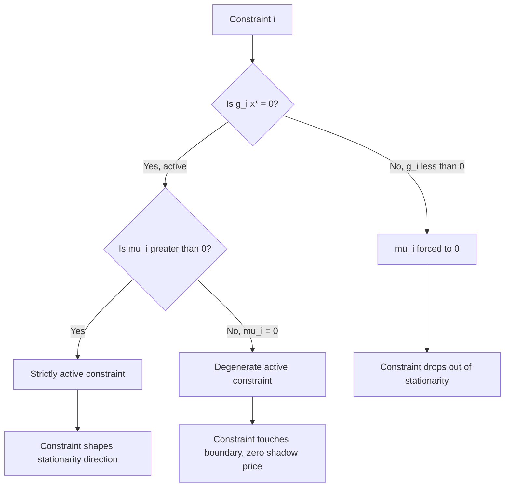

## Complementary Slackness Interpretation

### Definition and Formal Statement

Complementary slackness is one of the four components of the KKT conditions, applying to inequality-constrained optimization problems. Given the general nonlinear program:

$$\min_{x \in \mathbb{R}^n} f(x) \quad \text{s.t.} \quad g_i(x) \le 0, \ i = 1,\dots,m, \quad h_j(x) = 0, \ j = 1,\dots,p$$

with Lagrange multipliers $\mu_i \ge 0$ associated with each inequality constraint $g_i$, the complementary slackness condition requires:

$$\mu_i \, g_i(x^*) = 0, \quad \forall i = 1,\dots,m$$

This is a per-constraint condition: for **each** inequality constraint individually, either its multiplier is zero, or the constraint itself is tight (holds with equality), or both.

### The Core Interpretation: Active vs. Inactive

**Key Points**

- If $g_i(x^*) < 0$ (the constraint is **strictly satisfied**, or "slack"), complementary slackness forces $\mu_i = 0$. A constraint that isn't binding contributes nothing to the first-order stationarity condition.
- If $\mu_i > 0$ (the multiplier is **strictly positive**), complementary slackness forces $g_i(x^*) = 0$. A constraint with a positive "price" on it must be exactly active at the optimum.
- Both $\mu_i = 0$ and $g_i(x^*) = 0$ can hold simultaneously — this is called a **degenerate** or **weakly active** constraint case, and it complicates sensitivity analysis and uniqueness of multipliers.
- It is never the case that both $\mu_i > 0$ and $g_i(x^*) < 0$ hold together — this combination is precisely what complementary slackness rules out.

This gives the practical partition of constraints at a KKT point into three mutually exclusive-or-overlapping categories:

| Case | $g_i(x^*)$ | $\mu_i$ | Interpretation |
| --- | --- | --- | --- |
| Inactive | $< 0$ | $= 0$ | Constraint irrelevant locally |
| Strictly active | $= 0$ | $> 0$ | Constraint binds and "costs" something |
| Degenerate | $= 0$ | $= 0$ | Constraint touches boundary but has zero shadow price |

### Economic and Shadow-Price Reading

**Key Points**

- The multiplier $\mu_i$ measures the marginal rate of change of the optimal objective value with respect to a perturbation of the $i$-th constraint's right-hand side — it is the constraint's **shadow price**.
- If a resource constraint (e.g., $g_i(x) = x^T a_i - b_i \le 0$, a budget or capacity limit) is not fully used ($g_i(x^*) < 0$, meaning slack resource remains), then relaxing that budget slightly cannot improve the objective — hence its shadow price is zero, consistent with $\mu_i = 0$.
- Conversely, if a constraint has positive shadow price ($\mu_i > 0$), the resource is fully consumed ($g_i(x^*) = 0$) — you would benefit from more of it, and you are using all you currently have.
- This is the mathematical formalization of the everyday economic intuition: **you only pay a positive price for a resource that is completely used up.** An unused resource commands no price at the margin.

### Geometric Interpretation

**Key Points**

- Stationarity states $\nabla f(x^*) + \sum_i \mu_i \nabla g_i(x^*) + \sum_j \lambda_j \nabla h_j(x^*) = 0$, i.e., $-\nabla f(x^*)$ (the direction of steepest improvement) is a nonnegative combination of the active constraint gradients.
- Complementary slackness ensures that only the gradients of **active** constraints contribute to this combination — inactive constraints, having $\mu_i = 0$, drop out of the stationarity equation entirely, exactly as they should since they impose no local restriction on movement.
- Geometrically, at the optimum the negative objective gradient lies in the cone generated by the gradients of the constraints that are actually "pressing against" the feasible region at that point.

### Visualizing Complementary Slackness (svg_diagram)

<svg xmlns="http://www.w3.org/2000/svg" viewBox="0 0 720 380">
<text x="360" y="28" font-family="sans-serif" font-size="17" font-weight="bold" text-anchor="middle" fill="#1a1a1a">Complementary Slackness (svg_diagram)</text>
<rect x="60" y="70" width="600" height="120" fill="#f8fafc" stroke="#cbd5e1" stroke-width="1" />
<path d="M 60 190 Q 250 60 660 100" fill="none" stroke="#2563eb" stroke-width="2.5" />
<text x="600" y="90" font-family="sans-serif" font-size="12" fill="#1e3a8a">feasible boundary</text>
<circle cx="360" cy="145" r="6" fill="#dc2626" />
<text x="375" y="150" font-family="sans-serif" font-size="12" font-weight="bold" fill="#7f1d1d">x* (interior point)</text>
<line x1="360" y1="145" x2="360" y2="105" stroke="#94a3b8" stroke-width="1.5" stroke-dasharray="3,2" />
<text x="330" y="220" font-family="sans-serif" font-size="12" fill="#334155">g(x) &lt; 0 here → slack</text>
<text x="330" y="238" font-family="sans-serif" font-size="12" font-weight="bold" fill="#334155">μ = 0</text>
<circle cx="250" cy="103" r="6" fill="#16a34a" />
<text x="150" y="130" font-family="sans-serif" font-size="12" font-weight="bold" fill="#14532d">x** (on boundary)</text>
<line x1="250" y1="103" x2="220" y2="60" stroke="#16a34a" stroke-width="2" marker-end="url(#arrowhead)" />
<text x="130" y="55" font-family="sans-serif" font-size="11" fill="#14532d">∇g direction</text>
<text x="150" y="270" font-family="sans-serif" font-size="12" fill="#334155">g(x) = 0 here → active</text>
<text x="150" y="288" font-family="sans-serif" font-size="12" font-weight="bold" fill="#334155">μ &gt; 0 possible</text>
<rect x="60" y="320" width="600" height="45" rx="6" fill="#fef9c3" stroke="#ca8a04" stroke-width="1" />
<text x="360" y="347" font-family="sans-serif" font-size="12" text-anchor="middle" fill="#713f12">Rule: μᵢ · gᵢ(x*) = 0 always — never both g &lt; 0 and μ &gt; 0 together</text>
</svg>

### Worked Example: Linear Program

Consider $\min -x_1 - x_2$ subject to $g_1(x) = x_1 + x_2 - 4 \le 0$, $g_2(x) = -x_1 \le 0$, $g_3(x) = -x_2 \le 0$.

The optimum is at $x^* = (2,2)$, where $g_1(x^*) = 0$ (active), $g_2(x^*) = -2 < 0$ (inactive), $g_3(x^*) = -2 < 0$ (inactive).

Stationarity: $\nabla f = (-1,-1)$, $\nabla g_1 = (1,1)$, $\nabla g_2 = (-1,0)$, $\nabla g_3 = (0,-1)$.

$$(-1,-1) + \mu_1(1,1) + \mu_2(-1,0) + \mu_3(0,-1) = (0,0)$$

By complementary slackness, since $g_2(x^*) < 0$ and $g_3(x^*) < 0$, we must have $\mu_2 = 0$ and $\mu_3 = 0$. Substituting:

$$(-1,-1) + \mu_1(1,1) = (0,0) \implies \mu_1 = 1$$

This satisfies $\mu_1 = 1 > 0$ with $g_1(x^*) = 0$ — consistent with strict activity, exactly as complementary slackness dictates. The unused constraints $g_2, g_3$ correctly drop out of the stationarity equation.

### Worked Example: Degenerate Case

Consider $\min x_1$ subject to $g_1(x) = x_2 \le 0$ and $g_2(x) = x_1^2 - x_2 \le 0$ at $x^* = (0,0)$.

Both constraints are active: $g_1(0,0) = 0$, $g_2(0,0)=0$. Gradients: $\nabla g_1 = (0,1)$, $\nabla g_2 = (2x_1,-1)|_{(0,0)} = (0,-1)$.

Stationarity: $(1,0) + \mu_1(0,1) + \mu_2(0,-1) = (0,0)$, giving $\mu_1 - \mu_2 = 0$ and forcing the first component $1 = 0$ — **unsatisfiable** for this problem's raw form, indicating this particular constructed example needs $f(x) = x_1$ reconsidered; take instead $f(x) = -x_1$: then $(-1,0)+\mu_1(0,1)+\mu_2(0,-1)=(0,0)$ gives $\mu_1=\mu_2$, and any common value $\mu_1=\mu_2=t\ge 0$ satisfies stationarity — including $t=0$. This demonstrates a genuine degenerate case: multipliers are **not unique**, and the choice $\mu_1=\mu_2=0$ is valid even though both constraints are active, illustrating that active does not imply strictly positive multiplier.

### Complementary Slackness in Duality

**Key Points**

- In the context of Lagrangian duality, complementary slackness is precisely the condition that closes the duality gap between a primal-feasible $x^*$ and dual-feasible $(\mu^*,\lambda^*)$: if both are feasible and complementary slackness holds, then $x^*$ and $(\mu^*,\lambda^*)$ are primal and dual optimal respectively, with zero duality gap.
- This is the basis of the **complementary slackness theorem** used extensively in linear programming: at optimality, if a primal constraint is slack, the corresponding dual variable is zero, and if a dual constraint is slack, the corresponding primal variable is zero.
- In LP simplex-method terms, complementary slackness is exactly why nonbasic variables (at their bounds) correspond to zero reduced-cost slack, and basic variables correspond to tight dual constraints — it underlies the stopping/optimality test of the simplex algorithm.

### Complementary Slackness as a Combinatorial Structure

**Key Points**

- Complementary slackness effectively transforms a continuous optimization problem's optimality certificate into a **combinatorial** question: which subset of constraints is active at the optimum?
- This combinatorial view underlies active-set methods, which iteratively guess the active set, solve the resulting equality-constrained subproblem, and check whether the multipliers and feasibility conditions hold — adjusting the guessed active set if complementary slackness or primal feasibility is violated.
- Interior-point methods instead relax the complementarity condition $\mu_i g_i(x) = 0$ to $\mu_i g_i(x) = -\tau$ for a decreasing sequence of barrier parameters $\tau \to 0^+$, tracing a "central path" that converges to a KKT point satisfying exact complementary slackness in the limit.

### Relation to Constraint Qualifications

**Key Points**

- Complementary slackness is only meaningful as part of the KKT system once a constraint qualification (e.g., LICQ, MFCQ, Slater's condition) guarantees that multipliers exist in the first place; complementary slackness alone does not certify optimality without the accompanying stationarity and dual feasibility conditions.
- Under a CQ, the multipliers satisfying complementary slackness at a local minimum are guaranteed to exist, though they may not be unique unless LICQ specifically holds.

### Complementarity Diagram: Active-Set Case Flow

### Common Misinterpretations

**Key Points**

- Complementary slackness does **not** say that active constraints always have positive multipliers — degeneracy is a valid and common occurrence, especially at points where more constraints are active than the problem's local dimensionality would "need."
- It does **not** apply directly to equality constraints $h_j(x) = 0$; those are already always "active" by definition, and their multipliers $\lambda_j$ are free in sign (unconstrained), so no complementary slackness condition is imposed on them.
- A nonzero multiplier does not, by itself, indicate how much the objective would change under a *large* perturbation — the shadow-price interpretation is inherently a **local, first-order (marginal)** statement, and its validity for finite perturbations depends on higher-order behavior of the problem. [Inference] The precise range over which the marginal interpretation remains accurate depends on the curvature of the active constraints and objective near $x^*$, and would need explicit sensitivity bounds (e.g., via second-order conditions) to quantify for any specific problem instance.

### Related Topics

- KKT stationarity and dual feasibility conditions in full
- Lagrangian duality and strong/weak duality gaps
- Active-set methods vs. interior-point methods for handling complementarity
- Sensitivity analysis: shadow prices and right-hand-side perturbations
- Linear programming duality and the complementary slackness theorem in simplex method
- Degenerate solutions and multiplier non-uniqueness
- Mixed complementarity problems (MCPs) and their solution methods
- Second-order sufficient conditions distinguishing strict vs. degenerate active constraints