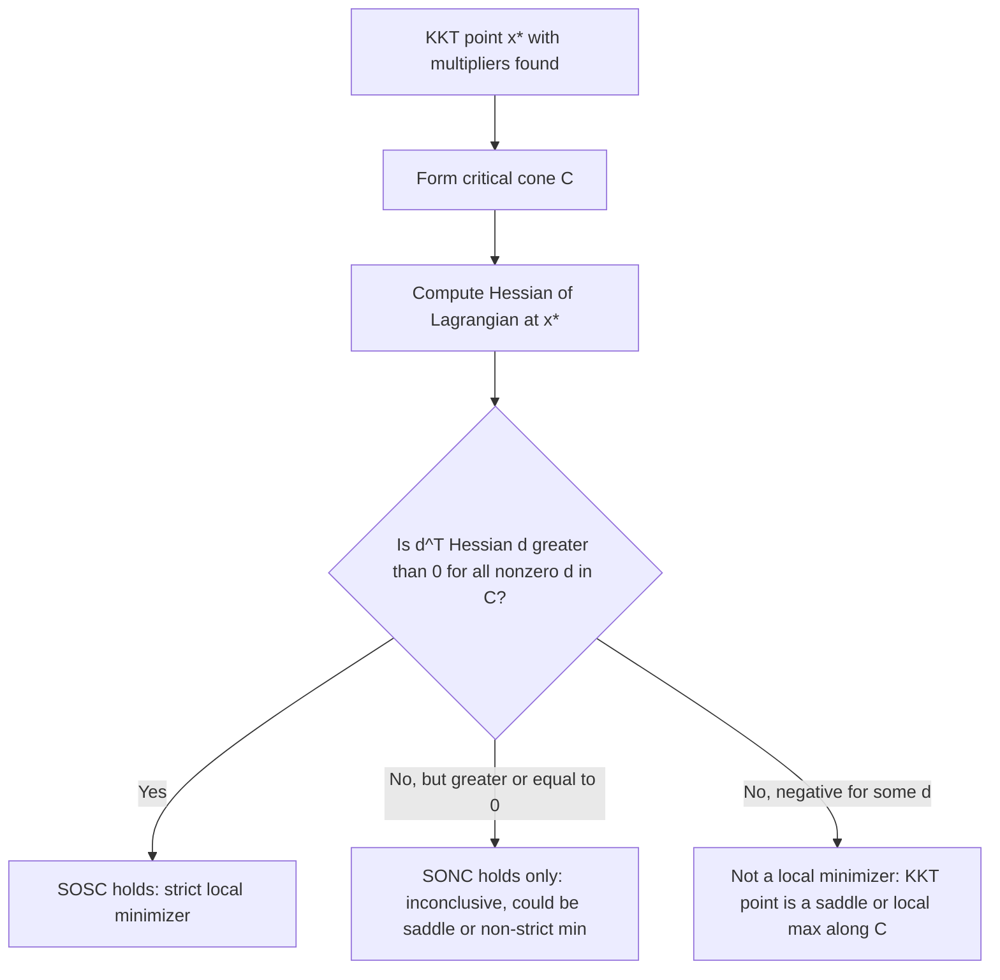

## Second-Order Conditions for Constrained Problems

### Why First-Order Conditions Are Not Enough

The KKT conditions (stationarity, primal feasibility, dual feasibility, complementary slackness) are first-order necessary conditions: they characterize points where no first-order feasible descent direction exists. However, a KKT point can be a local minimum, a local maximum, or a saddle point along the feasible manifold — first-order information alone cannot distinguish among these. Second-order conditions resolve this by examining the curvature of the Lagrangian restricted to the directions that remain feasible to first order.

### The Lagrangian and Its Hessian

For the problem $\min f(x)$ s.t. $g_i(x)\le 0$, $h_j(x)=0$, define the Lagrangian:

$$\mathcal{L}(x,\mu,\lambda) = f(x) + \sum_{i=1}^m \mu_i g_i(x) + \sum_{j=1}^p \lambda_j h_j(x)$$

The Hessian of the Lagrangian with respect to $x$ is:

$$\nabla_{xx}^2 \mathcal{L}(x,\mu,\lambda) = \nabla^2 f(x) + \sum_{i=1}^m \mu_i \nabla^2 g_i(x) + \sum_{j=1}^p \lambda_j \nabla^2 h_j(x)$$

Second-order conditions examine the sign of $d^T \nabla_{xx}^2 \mathcal{L}(x^*,\mu^*,\lambda^*)\, d$ for directions $d$ in an appropriately restricted **critical cone**, not for all $d \in \mathbb{R}^n$.

### The Critical Cone

**Key Points**

- Since constraints restrict feasible movement, curvature only needs to be checked along directions that are tangent to the active constraints and orthogonal to the equality constraints — directions where the first-order behavior is ambiguous and higher-order information is needed to determine optimality.
- The **critical cone** $C(x^*,\mu^*)$ at a KKT point is defined as:

$$C(x^*,\mu^*) = \left\{ d : \nabla g_i(x^*)^T d \le 0 \ \forall i \in \mathcal{A}(x^*),\ \nabla g_i(x^*)^T d = 0 \ \forall i \text{ with } \mu_i^* > 0,\ \nabla h_j(x^*)^T d = 0 \ \forall j \right\}$$

- Directions corresponding to strictly active constraints with **positive multiplier** ($\mu_i^* > 0$) must satisfy $\nabla g_i(x^*)^T d = 0$ exactly (equality, not just $\le 0$), because moving strictly into the interior along such a direction would immediately decrease $f$ to first order via the stationarity condition — the interesting curvature question only arises when the first-order term vanishes.
- Directions corresponding to weakly active constraints ($g_i(x^*) = 0$, $\mu_i^* = 0$, the degenerate case from complementary slackness) only need $\nabla g_i(x^*)^T d \le 0$, since their first-order contribution is already zero regardless of $d$'s sign along that gradient.
- For inactive constraints ($g_i(x^*) < 0$), no restriction is placed on $d$ at all, since small movements cannot violate them.

### Second-Order Necessary Conditions (SONC)

**Key Points**

- If $x^*$ is a local minimizer and LICQ (or another suitable CQ) holds, then there exist KKT multipliers $(\mu^*,\lambda^*)$ such that:

$$d^T \nabla_{xx}^2 \mathcal{L}(x^*,\mu^*,\lambda^*)\, d \ \ge\ 0 \quad \forall d \in C(x^*,\mu^*)$$

- This says the Hessian of the Lagrangian is **positive semidefinite when restricted to the critical cone** — not necessarily positive semidefinite everywhere in $\mathbb{R}^n$.
- SONC is necessary but not sufficient: a point satisfying SONC could still be a saddle point along the critical cone boundary, particularly in degenerate cases where the critical cone contains directions with zero curvature.

### Second-Order Sufficient Conditions (SOSC)

**Key Points**

- If $x^*$ satisfies the KKT conditions with multipliers $(\mu^*,\lambda^*)$, and

$$d^T \nabla_{xx}^2 \mathcal{L}(x^*,\mu^*,\lambda^*)\, d \ >\ 0 \quad \forall d \in C(x^*,\mu^*),\ d \ne 0$$

then $x^*$ is a **strict local minimizer** of the constrained problem.

- The critical distinction from SONC is **strict** positive definiteness (over the nonzero critical cone) rather than semidefiniteness — this rules out flat directions that could hide a saddle or a non-strict minimum.
- SOSC is a sufficient condition only: a strict local minimizer can exist without SOSC holding (e.g., when the objective behaves like $x^4$ along some critical direction — strictly increasing away from the origin, but with zero second-order curvature there).
- Unlike LICQ/MFCQ (constraint qualifications concerning only the constraints), SOSC involves the objective's curvature interacting with the constraints via the Lagrangian, so it is fundamentally a joint condition on $f$, $g_i$, $h_j$ together, evaluated at the specific multipliers satisfying KKT.

### Geometric Picture: Restricting to the Critical Cone

<svg xmlns="http://www.w3.org/2000/svg" viewBox="0 0 740 380">
<text x="370" y="28" font-family="sans-serif" font-size="17" font-weight="bold" text-anchor="middle" fill="#1a1a1a">Critical Cone and Curvature Test (svg_diagram)</text>
<rect x="60" y="60" width="620" height="260" fill="#f8fafc" stroke="#cbd5e1" stroke-width="1" />
<path d="M 400 320 L 400 80" fill="none" stroke="#2563eb" stroke-width="2" />
<text x="410" y="90" font-family="sans-serif" font-size="11" fill="#1e3a8a">constraint boundary g(x)=0</text>
<circle cx="400" cy="200" r="6" fill="#dc2626" />
<text x="415" y="205" font-family="sans-serif" font-size="12" font-weight="bold" fill="#7f1d1d">x*</text>
<path d="M 400 200 L 400 100" stroke="#16a34a" stroke-width="2.5" marker-end="url(#arr1)" />
<path d="M 400 200 L 400 300" stroke="#f59e0b" stroke-width="2.5" stroke-dasharray="4,3" marker-end="url(#arr2)" />

<text x="405" y="115" font-family="sans-serif" font-size="11" fill="`#14532d`">tangent direction d</text>

<text x="405" y="290" font-family="sans-serif" font-size="11" fill="`#92400e`">infeasible direction</text>

<rect x="90" y="330" width="580" height="40" rx="6" fill="#ede9fe" stroke="#7c3aed" stroke-width="1" />
<text x="380" y="355" font-family="sans-serif" font-size="12" text-anchor="middle" fill="#4c1d95">Test dᵀ ∇²L d only along d ∈ critical cone, not all of ℝⁿ</text>
</svg>

### Worked Example: Equality-Constrained Problem

Minimize $f(x_1,x_2) = x_1^2 - x_2^2$ subject to $h(x) = x_2 = 0$.

Lagrangian: $\mathcal{L} = x_1^2 - x_2^2 + \lambda x_2$. Stationarity: $2x_1 = 0, $-2x_2 + \lambda = 0
, and $h(x)=0$ gives $x_2 = 0$, so $x_1=0$, $\lambda=0$. Candidate KKT point: $x^* = (0,0)$, $\lambda^*=0$.

$$\nabla^2_{xx}\mathcal{L} = \begin{pmatrix} 2 & 0 \\ 0 & -2 \end{pmatrix}$$

This Hessian is indefinite over all of $\mathbb{R}^2$ (unconstrained, $x^*$ would be a saddle). But the critical cone here is $C = \{d : d_2 = 0\}$ (tangent to $h(x)=0$). Restricting: $d^T \nabla^2_{xx}\mathcal L\, d = 2d_1^2 > 0$ for all $d = (d_1, 0) \ne 0$. SOSC **holds** — $x^*=(0,0)$ is a strict local minimizer of the *constrained* problem, even though it would be a saddle point of the unconstrained $f$. This demonstrates precisely why the restriction to the critical cone is essential rather than a technicality.

### Worked Example: Inequality-Constrained Problem with Active Constraint

Minimize $f(x) = x_1^2 + x_2^2$ subject to $g(x) = -x_1 - x_2 + 1 \le 0$.

At candidate $x^* = (0.5, 0.5)$: $g(x^*) = 0$ (active). $\nabla f(x^*) = (1,1)$, $\nabla g(x^*) = (-1,-1)$.

Stationarity: $(1,1) + \mu(-1,-1) = (0,0) \implies \mu = 1 > 0$. KKT holds with $\mu^*=1$.

Critical cone: since $\mu^* > 0$, need $\nabla g(x^*)^Td = 0 \implies -d_1 - d_2 = 0 \implies d_2 = -d_1$. So $C = \{(t,-t): t \in \mathbb{R}\}$.

$\nabla^2_{xx}\mathcal L = \nabla^2 f + \mu \nabla^2 g = \begin{pmatrix}2&0\\0&2\end{pmatrix} + 1\cdot\begin{pmatrix}0&0\\0&0\end{pmatrix} = \begin{pmatrix}2&0\\0&2\end{pmatrix}$ (since $g$ is affine, $\nabla^2 g = 0$).

For $d=(t,-t)$: $d^T\nabla^2_{xx}\mathcal L\, d = 2t^2+2t^2=4t^2 > 0$ for $t \ne 0$. SOSC holds — $x^*$ is a strict local (in fact global, by convexity) minimizer.

### The Bordered Hessian Approach (Classical Equality-Only Case)

**Key Points**

- For problems with only equality constraints, an equivalent classical test uses the **bordered Hessian**, which embeds the constraint gradients directly into an augmented matrix:

$$\bar{H} = \begin{pmatrix} 0 & \nabla h(x^*)^T \\ \nabla h(x^*) & \nabla^2_{xx}\mathcal{L}(x^*,\lambda^*) \end{pmatrix}$$

- Second-order sufficiency can be checked via the signs of the last $n-p$ leading principal minors of $\bar H$ (where $p$ is the number of equality constraints), alternating or matching sign patterns depending on the convention used — this is algebraically equivalent to testing definiteness of $\nabla^2_{xx}\mathcal L$ restricted to the tangent subspace $\{d : \nabla h(x^*)^Td = 0\}$.
- The bordered Hessian test is a computational device rather than a distinct theoretical condition; it becomes more cumbersome to extend cleanly once inequality constraints and their associated critical-cone case distinctions (strictly active vs. weakly active) are introduced, which is why the critical-cone formulation is preferred in the general inequality-constrained setting.

### Relation to Convexity

**Key Points**

- If $f$ is convex, each $g_i$ is convex, and each $h_j$ is affine, then **any** KKT point is automatically a global minimizer, and second-order conditions are not needed to confirm local optimality — first-order KKT conditions are already sufficient in this case.
- Second-order conditions become essential precisely when convexity of the problem cannot be assumed — they are the tool for confirming local (not global) optimality in general nonconvex constrained programs.
- Even in the nonconvex case, satisfying SOSC only certifies a strict **local** minimum; nothing in the second-order analysis at a single KKT point provides information about the existence or location of other, possibly better, local minima elsewhere in the feasible set.

### Second-Order Conditions and Numerical Methods

**Key Points**

- Sequential Quadratic Programming (SQP) methods construct a local quadratic model using $\nabla^2_{xx}\mathcal L$ at each iterate; positive definiteness of this Hessian (or a suitable approximation to it, e.g., via BFGS-type updates) restricted to the linearized constraint tangent space affects both the well-posedness of the QP subproblem and local convergence rate.
- When $\nabla^2_{xx}\mathcal L$ is not positive definite on the relevant subspace, practical SQP implementations often modify it (e.g., adding a multiple of the identity, or using a damped/modified Hessian) to maintain a well-posed subproblem — the specific modification strategy varies by implementation. [Inference] The exact impact of such modifications on convergence speed depends on the modification scheme and problem structure, and would require checking the specific solver's documentation or behavior.
- Interior-point methods similarly rely on the Hessian of the barrier-augmented Lagrangian remaining appropriately conditioned near the solution for the Newton steps along the central path to behave well.

### Decision Flow for Classifying a KKT Point

### Common Pitfalls

**Key Points**

- A frequent error is testing definiteness of $\nabla^2_{xx}\mathcal L$ over the **full space** $\mathbb{R}^n$ instead of restricting to the critical cone — this is both unnecessary (too strong a requirement, rejecting valid minimizers) and, in other cases, insufficient (accepting points that fail once the correct restricted directions are checked) depending on the specific structure.
- Confusing the Hessian of $f$ alone with the Hessian of the Lagrangian $\mathcal L$ is another common mistake — the multiplier-weighted curvature of the constraints matters whenever constraints are themselves nonlinear ($\nabla^2 g_i \ne 0$ or $\nabla^2 h_j \ne 0$), and omitting these terms can produce an incorrect definiteness conclusion.
- At degenerate KKT points (weakly active constraints, i.e., $g_i(x^*)=0$ with $\mu_i^*=0$), the critical cone is larger (only requiring $\nabla g_i^Td \le 0$ rather than $=0$), making SOSC harder to satisfy — this is one reason degenerate KKT points are typically more delicate to classify and why nondegeneracy (strict complementarity, $\mu_i^* > 0$ whenever $g_i(x^*)=0$) is often assumed in convergence theory for optimization algorithms.

### Related Topics

- Strict complementarity and its role in local convergence rate guarantees for SQP and interior-point methods
- Sensitivity analysis: how $x^*$ and the optimal value change under perturbation, using second-order data
- Convex quadratic programming and the special role of positive semidefinite Hessians
- Newton's method and quasi-Newton (BFGS) approximations to the Lagrangian Hessian
- Trust-region methods for constrained optimization
- Saddle point characterization in Lagrangian duality
- Nondegenerate vs. degenerate KKT points and their algorithmic implications