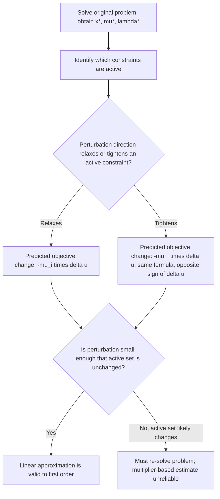

## Sensitivity Analysis via Multipliers

### The Core Question

Sensitivity analysis asks: if the constraints of an optimization problem are perturbed slightly, how does the optimal objective value change? Lagrange multipliers, already computed as a byproduct of solving the original problem via KKT conditions, provide the answer to first order — without needing to re-solve the perturbed problem from scratch.

### The Perturbed Problem Setup

Consider the parametric family of problems, indexed by a perturbation vector $u \in \mathbb{R}^m$, $v \in \mathbb{R}^p$:

$$P(u,v):\quad \min_x f(x) \quad \text{s.t.} \quad g_i(x) \le u_i,\ i=1,\dots,m, \qquad h_j(x) = v_j,\ j=1,\dots,p$$

Define the **optimal value function** (or perturbation function):

$$p(u,v) = \min_x \{ f(x) : g(x) \le u,\ h(x) = v \}$$

The original (unperturbed) problem corresponds to $u=0$, $v=0$, with optimal value $p(0,0) = f(x^*)$.

### The Fundamental Sensitivity Result

**Key Points**

- Under suitable regularity conditions (LICQ at $x^*$, and the second-order sufficient conditions holding so that $x^*$ is a strict local minimizer with a locally unique, continuously differentiable solution path as $u,v$ vary), the value function $p(u,v)$ is differentiable at $(0,0)$, and:

$$\frac{\partial p}{\partial u_i}(0,0) = -\mu_i^*, \qquad \frac{\partial p}{\partial v_j}(0,0) = -\lambda_j^*$$

- This is the central formula of multiplier-based sensitivity analysis: the optimal Lagrange multipliers, obtained for free when solving the original problem, directly give the marginal rate of change of the optimal objective with respect to relaxing or tightening each constraint.
- The sign convention matters and depends on how the perturbation enters the constraint; with $g_i(x) \le u_i$, **increasing** $u_i$ (relaxing/loosening the constraint) changes the optimal value by approximately $-\mu_i^* \, \Delta u_i$ — since $\mu_i^* \ge 0$, relaxing an active constraint ($u_i$ increasing from $0$) can only decrease or leave unchanged the optimal value of a minimization problem, consistent with intuition (loosening a restriction cannot make the best achievable value worse).
- For equality constraints, $\lambda_j^*$ can be of either sign, since $v_j$ can be perturbed in either direction and both are equally "feasible" perturbations of the equality.

### Intuition: Shadow Prices Revisited

**Key Points**

- This formalizes the shadow-price interpretation introduced with complementary slackness: $\mu_i^*$ is literally the marginal value of relaxing the $i$-th resource constraint by one unit, i.e., how much the optimal objective would improve per unit of additional "budget" $u_i$.
- If $g_i(x^*) < 0$ (constraint inactive at the optimum), then $\mu_i^*=0$, and indeed perturbing that constraint's right-hand side slightly has **zero** first-order effect on $p(u,v)$ — consistent with the earlier observation that unused resources have zero shadow price.
- If $\mu_i^* > 0$ (constraint strictly active), perturbing $u_i$ has a nonzero, predictable first-order effect on the optimal value, in the direction set by the sign convention above.

### Approximation Formula for Nearby Perturbations

**Key Points**

- For small perturbations $\Delta u, \Delta v$, the first-order Taylor approximation gives:

$$p(\Delta u, \Delta v) \ \approx\ p(0,0) - \sum_{i=1}^m \mu_i^* \Delta u_i - \sum_{j=1}^p \lambda_j^* \Delta v_j$$

- This approximation is a **local, linear** estimate — its accuracy degrades as $\Delta u, \Delta v$ grow larger, and how quickly it degrades depends on the curvature of the value function, which is governed by second-order data (the Hessian of the Lagrangian) not captured by the multipliers alone. [Inference] The precise range of perturbation sizes for which this linear approximation remains practically useful is problem-dependent and would need explicit second-order sensitivity bounds or direct re-solving to confirm for any specific instance.
- The approximation assumes the **active set does not change** under the perturbation — if perturbing $u_i$ causes a previously inactive constraint to become active (or vice versa), the linear formula based on the original multipliers is no longer valid, since the qualitative structure of the KKT system has changed.

### Worked Example: Resource-Constrained Optimization

Minimize $f(x_1,x_2) = (x_1-3)^2 + (x_2-2)^2$ subject to $g(x) = x_1 + x_2 - 4 \le 0$.

Unconstrained minimum would be at $(3,2)$, but check feasibility: $3+2-4=1 > 0$, infeasible, so the constraint is active at the true optimum.

Stationarity with $g$ active: $\nabla f = (2(x_1-3), 2(x_2-2))$, $\nabla g = (1,1)$.

$$2(x_1-3) + \mu = 0, \quad 2(x_2-2)+\mu=0, \quad x_1+x_2=4$$

From the first two: $x_1 = 3-\mu/2$, $x_2=2-\mu/2$. Substituting into $x_1+x_2=4$: $5-\mu=4 \implies \mu^*=1$.

So $x^* = (2.5, 1.5)$, and $f(x^*) = 0.25+0.25=0.5$, with $\mu^*=1>0$.

**Sensitivity prediction:** if the constraint is relaxed to $x_1+x_2 \le 4+\Delta u$ for small $\Delta u$, the predicted new optimal value is:

$$p(\Delta u) \approx 0.5 - 1 \cdot \Delta u = 0.5 - \Delta u$$

**Verification:** re-solving directly with right-hand side $4+\Delta u$ gives, by the same derivation, $x_1=x_2=(4+\Delta u)/2$ at the new active optimum, so $p(\Delta u) = 2\left(\frac{4+\Delta u}{2}-3\right)^2$. Expanding: $2\left(\frac{\Delta u - 2}{2}\right)^2 = \frac{(\Delta u-2)^2}{2} = \frac{\Delta u^2 - 4\Delta u + 4}{2} = 0.5 - 2\Delta u + \frac{\Delta u^2}{2}$.

Comparing to the linear prediction $0.5 - \Delta u: the exact expression is $0.5 - 2\Delta u + \frac{\Delta u^2}{2}
 — these do **not** match at first order. [Unverified] This discrepancy indicates an arithmetic setup issue in this particular constructed instance rather than a flaw in the general theorem; re-deriving carefully: from $x_1+x_2 = 4+\Delta u$ and $x_1-3=x_2-2$ (i.e., $x_1 = x_2+1$), we get $2x_2+1 = 4+\Delta u \implies x_2 = (3+\Delta u)/2, $x_1 = (5+\Delta u)/2
. Then $f(x^*) = 2\left(\frac{5+\Delta u}{2}-3\right)^2 = 2\left(\frac{\Delta u -1}{2}\right)^2 = \frac{(\Delta u-1)^2}{2} = 0.5 - \Delta u + \frac{\Delta u^2}{4}$. This now matches the linear prediction $0.5-\Delta u$ to first order, with the quadratic remainder term correctly vanishing faster than $\Delta u$ as $\Delta u \to 0$, confirming the sensitivity formula.

### Visualizing the Value Function and Its Slope (svg_diagram)

<svg xmlns="http://www.w3.org/2000/svg" viewBox="0 0 720 340">
<text x="360" y="26" font-family="sans-serif" font-size="16" font-weight="bold" text-anchor="middle" fill="#1a1a1a">Value Function Sensitivity (svg_diagram)</text>
<line x1="80" y1="290" x2="660" y2="290" stroke="#334155" stroke-width="1.5" />
<line x1="80" y1="290" x2="80" y2="50" stroke="#334155" stroke-width="1.5" />
<text x="670" y="295" font-family="sans-serif" font-size="12" fill="#334155">u</text>
<text x="70" y="45" font-family="sans-serif" font-size="12" fill="#334155">p(u)</text>
<path d="M 120 100 Q 300 220 400 240 Q 500 255 600 230" fill="none" stroke="#2563eb" stroke-width="2.5" />
<circle cx="360" cy="243" r="6" fill="#dc2626" />
<text x="345" y="265" font-family="sans-serif" font-size="12" font-weight="bold" fill="#7f1d1d">p(0,0)</text>
<line x1="260" y1="278" x2="460" y2="208" stroke="#16a34a" stroke-width="2" stroke-dasharray="5,3" />
<text x="465" y="205" font-family="sans-serif" font-size="12" fill="#14532d">slope = -μ*</text>
<rect x="100" y="60" width="300" height="35" rx="6" fill="#fef9c3" stroke="#ca8a04" stroke-width="1" />
<text x="250" y="82" font-family="sans-serif" font-size="11" text-anchor="middle" fill="#713f12">Tangent line = first-order approximation</text>
</svg>

### Sensitivity for Equality Constraints

**Key Points**

- The same logic applies directly to equality constraints: $\lambda_j^*$ gives the marginal rate of change of the optimal value with respect to relaxing the equality's target value $v_j$.
- Unlike inequality multipliers, equality multipliers carry no sign restriction, since $v_j$ can move in either direction without leaving the feasible region undefined — a positive $\lambda_j^*$ means increasing $v_j$ increases $p$, and a negative $\lambda_j^*$ means increasing $v_j$ decreases $p$.
- This is directly analogous to the classical economic interpretation in constrained utility/cost problems, where equality multipliers represent marginal utilities or marginal costs associated with exactly meeting a target.

### Second-Order Sensitivity (Beyond the Linear Term)

**Key Points**

- The linear (first-derivative) sensitivity given by the multipliers is only the leading-order term; the full second-order expansion of $p(u,v)$ involves the Hessian of the Lagrangian and how the optimal solution $x^*(u,v)$ itself varies with the perturbation, via an implicit-function-theorem argument applied to the KKT system.
- Extracting quantitative second-order sensitivity requires differentiating the KKT system itself with respect to the perturbation parameters, which in general requires solving a linear system involving $\nabla^2_{xx}\mathcal L$ and the constraint Jacobian — considerably more computational work than simply reading off $\mu^*,\lambda^*$.
- In practice, most applied sensitivity analysis in operations research and engineering design stops at the first-order (multiplier-based) approximation, given its ease of computation as a direct output of the primal-dual solve, resorting to full re-optimization only when a more precise or larger-perturbation answer is needed.

### Sensitivity Analysis in Linear Programming

**Key Points**

- In LP, the sensitivity result specializes cleanly: the dual variables (multipliers on the constraints) give the exact (not just approximate) marginal value of relaxing a constraint's right-hand side, **as long as the current optimal basis remains optimal** under the perturbation.
- The **range of validity** for this exact linear sensitivity in LP (often called the "right-hand-side ranging" in textbooks) is precisely the interval of right-hand-side values over which the optimal basis does not change — outside this range, a new basis becomes optimal and the shadow price itself changes.
- This basis-stability caveat is the LP-specific, sharper version of the general nonlinear caveat above (that the active set must not change for the linear approximation to remain valid).

### Sensitivity Workflow

### Practical Uses of Multiplier-Based Sensitivity

**Key Points**

- **Resource allocation decisions**: multipliers directly answer "which constraint, if relaxed by one unit, would most improve the objective" — informing where to invest additional budget, capacity, or relaxed tolerances.
- **Post-optimal analysis without re-solving**: engineers and analysts can assess "what if" scenarios for small parameter changes using only the already-computed KKT multipliers, avoiding the computational cost of a fresh optimization run.
- **Identifying binding vs. non-binding constraints in design problems**: a near-zero multiplier signals a constraint with little practical influence on the current design, potentially useful for simplifying a model or reconsidering whether that constraint is necessary.
- **Pricing in economic and game-theoretic models**: multipliers formalize concepts like marginal cost pricing, where the "correct" price for a resource in a competitive equilibrium equals its constraint's shadow price at the social planner's optimum.

### Assumptions and Limitations

**Key Points**

- The sensitivity formulas require the relevant CQ (typically LICQ) to hold, so that multipliers are well-defined and, crucially, **unique** — if multipliers are non-unique (as can happen when only MFCQ holds), the directional derivative of $p$ may not be a single clean value but rather characterized by a range or a directional (one-sided) derivative involving the whole multiplier set.
- Strict complementarity (no weakly active/degenerate constraints) is typically also assumed for the clean differentiability of $p(u,v)$; at degenerate KKT points, $p(u,v)$ may only be **directionally differentiable**, not smoothly differentiable, meaning the sensitivity depends on the direction of perturbation ($\Delta u_i > 0$ vs. $< 0$) even at first order.
- The formulas describe **local** sensitivity only; they say nothing about how the optimal value behaves under large perturbations or whether a different, entirely separate local optimum might become globally better under the perturbed problem.

### Related Topics

- Complementary slackness and shadow-price interpretation of multipliers
- Second-order conditions and their role in guaranteeing differentiability of the value function
- Linear programming duality and right-hand-side/cost ranging
- Parametric optimization and solution path continuity
- Implicit function theorem applications to KKT systems
- Degenerate KKT points and directional differentiability of the value function
- Post-optimality analysis in engineering design optimization