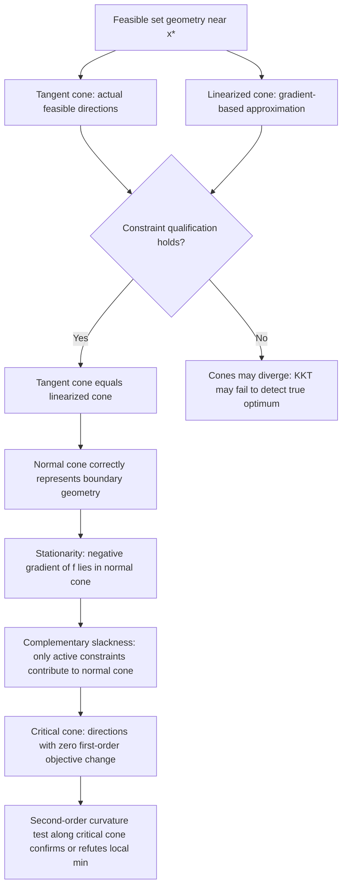

## Geometric Interpretation of Optimality Conditions

### Why Geometry Matters Alongside Algebra

The KKT conditions can be stated purely algebraically (gradient equations, sign constraints, complementary products), but their content is fundamentally geometric: they describe the relationship between the direction of steepest objective improvement and the local shape of the feasible region. Viewing optimality conditions geometrically clarifies *why* the algebraic conditions take the form they do, and makes clear what can go wrong when constraint qualifications fail.

### Unconstrained Case as a Baseline

**Key Points**

- At an unconstrained local minimum $x^*$, the first-order condition $\nabla f(x^*) = 0$ says there is **no direction** in which $f$ decreases to first order — the gradient vanishes because every direction is available, so any nonzero gradient would immediately reveal a descent direction.
- Geometrically, the level set of $f$ through $x^*$ has a well-defined tangent hyperplane there (when $\nabla f(x^*)\ne0$), and $\nabla f(x^*)$ is normal to it, pointing in the direction of steepest ascent.
- Constrained optimization modifies this picture: descent directions may still exist, but they may be **infeasible** — blocked by the boundary of the constraint set. Optimality no longer requires $\nabla f = 0$, only that no *feasible* descent direction exists.

### The Feasible Cone and Descent Directions

**Key Points**

- At a feasible point $\bar x$, a direction $d$ is a **feasible direction** (to first order) if moving slightly along $d$ keeps you inside (or on the boundary of) the feasible region — formally, $d$ lies in the tangent cone $T(\bar x)$.
- A direction $d$ is a **descent direction** for $f$ if $\nabla f(\bar x)^T d < 0$.
- $\bar x$ can only be a local minimizer if **no direction is simultaneously feasible and descent** — otherwise, moving along such a direction would both stay feasible and strictly decrease $f$, contradicting local optimality.
- This "no feasible descent direction" statement is the geometric essence of first-order optimality; the KKT stationarity equation is simply the algebraic certificate that this geometric fact holds.

### Visualizing Feasible vs. Descent Directions (svg_diagram)

<svg xmlns="http://www.w3.org/2000/svg" viewBox="0 0 720 380">
<text x="360" y="26" font-family="sans-serif" font-size="16" font-weight="bold" text-anchor="middle" fill="#1a1a1a">Feasible Cone vs. Descent Cone (svg_diagram)</text>
<rect x="60" y="60" width="600" height="280" fill="#f8fafc" stroke="#cbd5e1" stroke-width="1" />
<path d="M 360 320 L 620 100" fill="none" stroke="#2563eb" stroke-width="2" />
<path d="M 360 320 L 100 100" fill="none" stroke="#2563eb" stroke-width="2" />
<path d="M 620 100 A 260 260 0 0 0 100 100" fill="#dbeafe" fill-opacity="0.4" stroke="none" />
<text x="580" y="90" font-family="sans-serif" font-size="11" fill="#1e3a8a">feasible region boundary</text>
<circle cx="360" cy="320" r="6" fill="#dc2626" />
<text x="375" y="325" font-family="sans-serif" font-size="12" font-weight="bold" fill="#7f1d1d">x̄</text>
<path d="M 360 320 L 470 230" stroke="#16a34a" stroke-width="2.5" marker-end="url(#a1)" />
<text x="480" y="225" font-family="sans-serif" font-size="11" fill="#14532d">feasible + descent?</text>
<path d="M 360 320 L 360 180" stroke="#f59e0b" stroke-width="2.5" marker-end="url(#a2)" />
<text x="370" y="175" font-family="sans-serif" font-size="11" fill="#92400e">-∇f direction (steepest descent, infeasible)</text>
<rect x="90" y="345" width="560" height="0" fill="none" />
<text x="90" y="60" font-family="sans-serif" font-size="11" fill="#334155" />
</svg>

### Stationarity as a Cone-Membership Statement

**Key Points**

- The KKT stationarity condition $\nabla f(x^*) + \sum_i \mu_i^* \nabla g_i(x^*) + \sum_j \lambda_j^* \nabla h_j(x^*) = 0$ can be rewritten as:

$$-\nabla f(x^*) = \sum_{i \in \mathcal{A}(x^*)} \mu_i^* \nabla g_i(x^*) + \sum_j \lambda_j^* \nabla h_j(x^*)$$

- This says $-\nabla f(x^*)$ (the direction of steepest **improvement**) lies in the cone generated by the gradients of the active constraints (with equality-constraint gradients allowed either sign, since $\lambda_j^*$ is unrestricted).
- Geometrically: the only way to improve $f$ locally would require moving in a direction with a positive component along $-\nabla f(x^*)$, but any such direction necessarily violates at least one active constraint, because $-\nabla f(x^*)$ is "trapped" inside the cone of directions that constraints push back against.
- This is precisely why the condition is called **stationarity relative to the feasible set**: the point is a stationary point not because $\nabla f=0$, but because the constraint geometry cancels out the objective's pull in every feasible direction.

### The Normal Cone Perspective

**Key Points**

- The set $N(x^*) = \left\{ \sum_i \mu_i \nabla g_i(x^*) + \sum_j \lambda_j \nabla h_j(x^*) : \mu_i \ge 0,\ \mu_i g_i(x^*)=0 \right\}$ is called the **normal cone** to the feasible set at $x^*$.
- KKT stationarity is exactly the statement $-\nabla f(x^*) \in N(x^*)$ — the negative gradient must be a normal vector to the feasible set at that point.
- This reframing connects constrained optimality directly to convex geometry: for convex feasible sets, the normal cone has a clean, well-studied structure, and $-\nabla f(x^*) \in N(x^*)$ is equivalent to the variational inequality characterization of optimality used broadly in convex analysis.
- The normal cone is a "wedge" perpendicular to the feasible set's boundary at $x^*$; a wider wedge (more constraints simultaneously active, or higher-curvature constraint boundaries) accommodates more possible objective gradients as candidates for optimality.

### Geometric Meaning of Complementary Slackness Revisited

**Key Points**

- Complementary slackness ensures that **only active constraints contribute to the normal cone** — inactive constraints ($g_i(x^*)<0$) are geometrically irrelevant at $x^*$, since the feasible region's local boundary near $x^*$ is shaped only by the constraints actually touching that point.
- A nonzero multiplier $\mu_i^*>0$ geometrically means the constraint's gradient $\nabla g_i(x^*)$ genuinely contributes to "holding back" $-\nabla f(x^*)$; a zero multiplier on an active constraint means that constraint's gradient, while technically part of the boundary there, isn't needed to certify optimality — a degenerate, geometrically "redundant" direction at that specific point.

### Geometric Meaning of Constraint Qualifications

**Key Points**

- Constraint qualifications (LICQ, MFCQ) are exactly the conditions ensuring the **linearized cone** (built from constraint gradients, an algebraic/linear object) accurately represents the **true tangent cone** (built from actual feasible curves through $x^*$, a geometric object) — when a CQ fails, these two cones can diverge, and the algebraic KKT stationarity condition may fail to certify a true geometric local minimum.
- The cusp/tangency examples used to motivate constraint qualifications are precisely cases where the true feasible region "pinches" more tightly than its linearization suggests — the linearized cone is too generous, admitting a spurious "feasible descent direction" that doesn't actually exist in the true nonlinear feasible set.
- Geometrically, LICQ (gradients linearly independent) ensures the constraint surfaces intersect "transversally" (cleanly, without tangency) at $x^*$, which is exactly the condition preventing this pinching phenomenon.

### Second-Order Geometry: Curvature Along the Critical Cone

**Key Points**

- First-order geometric optimality (no feasible descent direction) leaves open directions where $\nabla f(x^*)^Td = 0$ exactly — these are directions tangent to the level set of $f$ **and** tangent to the active constraints simultaneously, forming the critical cone.
- Second-order conditions ask: along these boundary-tangent, level-set-tangent directions, does the feasible region curve away from the objective's improving side, or toward it?
- Geometrically, positive curvature of $\mathcal L$ along the critical cone (SOSC) means that even though first-order information is neutral along $d$, moving along the *actual curved* feasible boundary in direction $d$ increases $f$ — confirming a true local minimum. Negative curvature would mean the curved feasible boundary bends toward lower $f$ values, revealing a non-minimizer disguised by first-order degeneracy.

### Duality Gap as a Geometric Separation

**Key Points**

- In convex problems, the KKT/Lagrangian framework can be understood geometrically as separating hyperplanes: strong duality (guaranteed by Slater's condition) corresponds to the existence of a hyperplane separating the epigraph of the perturbation function $p(u,v)$ from a point representing an infeasible or unattainable improvement.
- The multipliers $(\mu^*,\lambda^*)$ are precisely the coefficients defining this separating hyperplane — geometrically, they define the supporting hyperplane to the value function's epigraph at the origin, whose slope is $(-\mu^*,-\lambda^*)$, exactly matching the sensitivity interpretation from multiplier-based analysis.

### Overview Diagram: From Geometry to Algebra

### Worked Example Revisited Geometrically

Returning to the earlier example: minimize $f(x_1,x_2)=(x_1-3)^2+(x_2-2)^2$ subject to $x_1+x_2\le4$, with optimum at $(2.5,1.5)$ and $\mu^*=1$.

Geometrically, $\nabla f(x^*) = (2(2.5-3), 2(1.5-2)) = (-1,-1)$, pointing from $x^*$ toward the unconstrained minimum $(3,2)$ — this is the direction that would improve $f$, but it points **outward**, directly out of the feasible half-plane $x_1+x_2\le 4$.

The constraint gradient $\nabla g(x^*) = (1,1)$ points in exactly the opposite direction: $-\nabla f(x^*) = (1,1) = 1\cdot\nabla g(x^*)$, confirming $\mu^*=1$ and showing visually that the "pull" of the objective toward $(3,2)$ is exactly canceled by the constraint boundary's own outward normal — the feasible descent direction the objective wants doesn't exist because the constraint boundary is oriented precisely to block it.

### Common Geometric Misunderstandings

**Key Points**

- A common error is picturing $\nabla f(x^*)$ as pointing "into" the feasible region at a constrained minimum — in fact, at a constrained (non-interior) minimum, $\nabla f(x^*)$ typically points **outward**, since the constraint is precisely what is preventing further improvement in that outward direction.
- Another common error is treating the normal cone / KKT stationarity picture as requiring a **unique** decomposition of $-\nabla f(x^*)$ into constraint-gradient components — this decomposition (the multipliers) is unique only under LICQ; under weaker CQs like MFCQ, multiple valid multiplier combinations can represent the same geometric fact.
- It is also easy to conflate "constraint gradient points outward" with "constraint gradient equals normal to the feasible set" loosely — more precisely, for $g_i(x)\le0$, $\nabla g_i(x^*)$ points in the direction of *increasing* $g_i$, i.e., toward infeasibility, which is why it appears with a nonnegative coefficient $\mu_i\ge0$ in $-\nabla f(x^*)$'s decomposition (a direction pushing back against attempted movement toward infeasibility).

### Related Topics

- Tangent cones, linearized cones, and constraint qualifications
- Normal cones and their role in convex analysis and variational inequalities
- Complementary slackness and shadow-price interpretation
- Second-order conditions and curvature along the critical cone
- Separating hyperplane theorems and Lagrangian duality
- Convex sets and supporting hyperplanes
- Subdifferentials and optimality conditions for nonsmooth convex problems