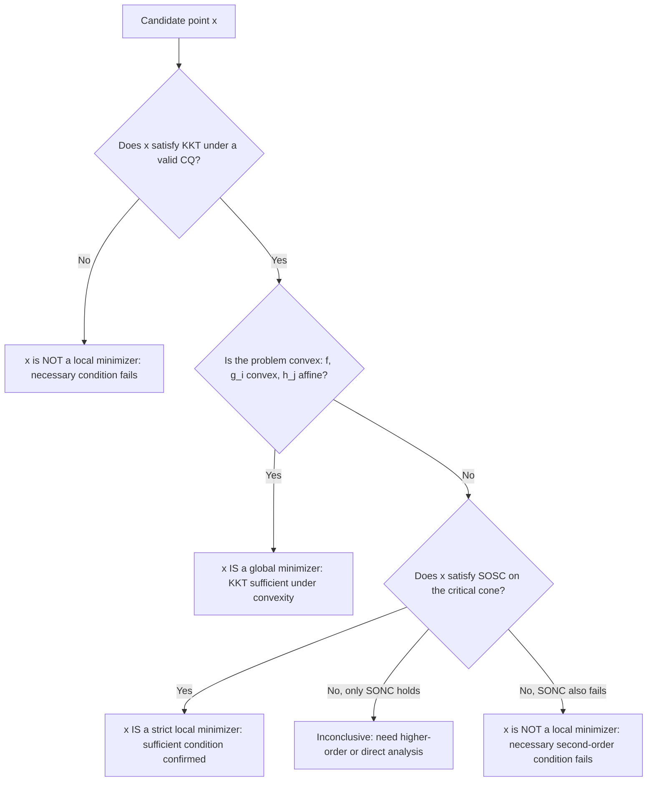

## Necessary Versus Sufficient Condition Distinctions

### Why This Distinction Is Foundational

Nearly every result encountered so far — KKT conditions, constraint qualifications, second-order tests — falls cleanly into one of two logical categories: conditions that **must** hold at any optimum (necessary), and conditions that, if found to hold, **guarantee** a point is an optimum (sufficient). Conflating these two categories is one of the most common sources of error in applied optimization, since a necessary condition alone never certifies optimality, and a sufficient condition's absence never rules it out.

### Formal Logical Structure

**Key Points**

- A condition $C$ is **necessary** for $x^*$ to be a local minimizer if: $x^*$ local minimizer $\implies$ $C$ holds at $x^*$. Equivalently, if $C$ fails at a point, that point cannot be a local minimizer.
- A condition $C$ is **sufficient** for $x^*$ to be a local minimizer if: $C$ holds at $x^*$ $\implies$ $x^*$ is a local minimizer. Equivalently, finding a point satisfying $C$ guarantees optimality without further checking.
- A condition can be necessary without being sufficient, sufficient without being necessary, both (necessary and sufficient — an "if and only if" characterization), or neither.
- Practically: necessary conditions are used to **narrow down candidates** (filter out points that cannot possibly be optimal); sufficient conditions are used to **confirm** that a specific candidate actually is optimal.

### Necessary Conditions in Optimization: An Inventory

**Key Points**

- **Unconstrained, first-order**: $\nabla f(x^*) = 0$ is necessary for a local minimum of a differentiable $f$. It is not sufficient — saddle points and local maxima also satisfy it.
- **Unconstrained, second-order necessary**: $\nabla^2 f(x^*) \succeq 0$ (positive semidefinite) is necessary given $\nabla f(x^*)=0$. Still not sufficient — a Hessian that is PSD but singular can correspond to a saddle-like flat direction (e.g., $f(x)=x^4$ at $x=0$: $f''(0)=0\ge0$, necessary condition holds, and $x=0$ happens to be a minimizer here, but the condition alone does not guarantee this in general).
- **Constrained, first-order (KKT)**: under a constraint qualification, KKT conditions are necessary for a local minimum. They are not sufficient in general nonconvex problems — a KKT point can be a saddle point or local maximum along the feasible set.
- **Constrained, second-order necessary (SONC)**: $d^T\nabla^2_{xx}\mathcal L\,d \ge 0$ for all $d$ in the critical cone is necessary at a local minimum satisfying KKT with a CQ. Still not sufficient, since semidefiniteness (not strict definiteness) allows flat directions that could hide a saddle.

### Sufficient Conditions in Optimization: An Inventory

**Key Points**

- **Unconstrained, second-order sufficient**: $\nabla f(x^*)=0$ and $\nabla^2 f(x^*) \succ 0$ (strictly positive definite) together are sufficient for $x^*$ to be a strict local minimizer. This is not necessary — $f(x)=x^4$ at $x=0$ is a strict local (in fact global) minimizer, yet $f''(0)=0$, failing strict positive definiteness.
- **Constrained, second-order sufficient (SOSC)**: KKT conditions plus $d^T\nabla^2_{xx}\mathcal L\,d>0$ for all nonzero $d$ in the critical cone are sufficient for a strict local minimizer. Again not necessary, for the same flat-direction reason.
- **Convexity-based sufficiency**: if $f$ is convex, each $g_i$ convex, each $h_j$ affine, then **any** point satisfying the first-order KKT conditions is automatically a **global** minimizer — no second-order check is needed at all in this case. This is a much stronger sufficient statement than the general nonconvex SOSC, but it requires the strong structural assumption of convexity.

### The Key Asymmetry: Filtering vs. Confirming

<svg xmlns="http://www.w3.org/2000/svg" viewBox="0 0 720 320">
<text x="360" y="26" font-family="sans-serif" font-size="16" font-weight="bold" text-anchor="middle" fill="#1a1a1a">Necessary Filters, Sufficient Confirms (svg_diagram)</text>
<rect x="60" y="60" width="600" height="70" rx="8" fill="#dbeafe" stroke="#2563eb" stroke-width="1.5" />
<text x="360" y="85" font-family="sans-serif" font-size="13" font-weight="bold" text-anchor="middle" fill="#1e3a8a">All points in the domain</text>
<text x="360" y="105" font-family="sans-serif" font-size="11" text-anchor="middle" fill="#1e3a8a">(candidates before any filtering)</text>
<path d="M 360 130 L 360 160" stroke="#333333" stroke-width="2" marker-end="url(#ar)" />
<rect x="140" y="160" width="440" height="65" rx="8" fill="#fef3c7" stroke="#d97706" stroke-width="1.5" />
<text x="360" y="185" font-family="sans-serif" font-size="13" font-weight="bold" text-anchor="middle" fill="#78350f">Points satisfying necessary conditions</text>
<text x="360" y="205" font-family="sans-serif" font-size="11" text-anchor="middle" fill="#78350f">(KKT / SONC — candidates survive filtering)</text>
<path d="M 360 225 L 360 250" stroke="#333333" stroke-width="2" marker-end="url(#ar)" />
<rect x="220" y="250" width="280" height="55" rx="8" fill="#dcfce7" stroke="#16a34a" stroke-width="1.5" />
<text x="360" y="273" font-family="sans-serif" font-size="13" font-weight="bold" text-anchor="middle" fill="#14532d">Points satisfying sufficient conditions</text>
<text x="360" y="290" font-family="sans-serif" font-size="11" text-anchor="middle" fill="#14532d">(SOSC — confirmed minimizers)</text>
</svg>

**Key Points**

- Necessary conditions shrink the search: instead of checking every point in $\mathbb{R}^n$, one only needs to examine points satisfying the necessary condition (e.g., all KKT points).
- Sufficient conditions provide a **stopping point**: once verified at a specific candidate, no further checking (e.g., comparison against other points, global search) is needed to conclude that candidate is at least a local (or, under convexity, global) minimizer.
- The gap between the necessary-condition set and the sufficient-condition set is exactly where the "hard cases" live — points satisfying KKT and SONC but not SOSC — these require additional analysis (higher-order derivatives, direct comparison, or problem-specific arguments) to classify.

### Worked Example: A Point Satisfying Necessary but Not Sufficient Conditions

Consider $f(x) = x^4 \sin(1/x)$-type pathological behavior aside, use a cleaner constrained example: minimize $f(x_1,x_2) = x_1^2 - x_2^4$ subject to $h(x) = x_2 = 0$.

Lagrangian: $\mathcal L = x_1^2 - x_2^4 + \lambda x_2$. Stationarity: $2x_1=0, $-4x_2^3+\lambda=0
. With $h(x)=x_2=0$: $x_1=0$, $\lambda=0$. Candidate $x^*=(0,0)$.

Critical cone (equality constraint only): $C=\{d : d_2=0\}$. $\nabla^2_{xx}\mathcal L = \begin{pmatrix}2&0\\0&-12x_2^2\end{pmatrix}\Big|_{(0,0)} = \begin{pmatrix}2&0\\0&0\end{pmatrix}$.

For $d=(d_1,0)$: $d^T\nabla^2_{xx}\mathcal L\,d = 2d_1^2 \ge 0$ — **SONC holds** (necessary condition satisfied). But strict positivity for all nonzero $d\in C$ requires checking only $d_1\ne0$ (since $d_2=0$ is forced), and indeed $2d_1^2>0$ whenever $d_1\ne0$ — so **SOSC also holds** here, confirming $x^*=(0,0)$ is a strict local minimizer along the constraint $x_2=0$ (where $f$ reduces to $x_1^2$, unambiguously minimized at $x_1=0$).

This particular instance happens to satisfy both; a genuinely ambiguous case requires the critical cone to contain a direction where the quadratic form is exactly zero — e.g., minimize $f(x_1,x_2)=x_1^2+x_2^4$ (no constraints, unconstrained for simplicity): $\nabla f(0,0)=(0,0)$ (first-order necessary condition holds), $\nabla^2 f(0,0) = \begin{pmatrix}2&0\\0&0\end{pmatrix}$, which is PSD but not PD (SONC holds, SOSC fails along $d=(0,1)$). Yet $(0,0)$ **is** in fact the strict global minimizer, since $x_2^4 > 0$ for all $x_2\ne0$ — demonstrating precisely that **SOSC failing does not mean the point fails to be a minimizer**; it only means second-order analysis alone cannot confirm it, and quartic (or higher, or non-polynomial) information along the flat direction must be examined separately.

### Common Logical Errors in Practice

**Key Points**

- **Error: treating a KKT point as automatically optimal.** KKT is necessary, not sufficient, in general nonconvex problems — many numerical solvers report "converged to a KKT point," which is not the same claim as "found a local (let alone global) minimum," unless convexity or SOSC has been separately verified.
- **Error: assuming failure of a sufficient condition implies non-optimality.** If SOSC fails at a candidate, this says nothing conclusive — the point might still be a (possibly non-strict) local minimum, as the quartic example above shows; further analysis is required rather than automatic rejection.
- **Error: assuming necessary and sufficient conditions are interchangeable in convex problems.** Even though convexity upgrades KKT to being sufficient for global optimality, this equivalence relies specifically on the convexity assumption — it is not a general property of necessary conditions "becoming" sufficient automatically; convexity is doing separate, additional work.
- **Error: forgetting the constraint qualification is a hidden hypothesis.** The statement "KKT is necessary at a local minimum" is only true *given* a CQ holds there — without verifying a CQ, one cannot even assert the weaker necessary-condition claim, let alone treat KKT points as candidates with confidence.

### Necessity and Sufficiency Across the Full Theory: Summary Table

| Condition | Necessary? | Sufficient? | Additional hypothesis needed |
| --- | --- | --- | --- |
| $\nabla f(x^*)=0$ (unconstrained) | Yes | No | — |
| $\nabla^2f(x^*)\succeq0$ (unconstrained, given stationarity) | Yes | No | — |
| $\nabla^2f(x^*)\succ0$ (unconstrained, given stationarity) | No | Yes | — |
| KKT conditions | Yes | No | Requires a CQ (LICQ/MFCQ/Slater) to even be necessary |
| KKT + SONC | Yes | No | Requires CQ |
| KKT + SOSC | No | Yes | — |
| KKT alone, convex problem | Yes | Yes | Requires $f,g_i$ convex, $h_j$ affine |

### Necessity and Sufficiency in Constraint Qualifications Themselves

**Key Points**

- Constraint qualifications are not optimality conditions themselves but hypotheses that make a necessary condition (KKT) actually necessary — LICQ, MFCQ, and Slater's condition are each **sufficient** for "KKT is necessary at a local min," but none of them is itself necessary for that implication to hold (i.e., KKT can still be necessary at a point even if the specific CQ tested happens to fail there, via some other CQ, or by coincidence).
- This creates a second layer of the necessary/sufficient distinction: one is testing sufficient conditions *for the applicability* of a necessary condition — a subtlety that is easy to lose track of when reading "LICQ implies KKT" as though it were a direct optimality statement rather than a qualifying hypothesis.

### Decision Guide: What Can You Conclude?

### Broader Methodological Takeaway

**Key Points**

- Optimization theory is built almost entirely from layered necessary and sufficient statements, each with its own hypotheses (differentiability, constraint qualifications, convexity, strict complementarity) — a rigorous claim of optimality always requires tracking exactly which layer of condition has been verified and under which hypotheses.
- In numerical practice, solvers typically only verify first-order necessary conditions (approximate KKT satisfaction to some tolerance) — reported "optimal" solutions from generic nonlinear solvers should be understood as "satisfies necessary conditions to numerical precision," with the stronger sufficiency claim resting on separate structural facts about the problem (such as verified convexity) that the user must confirm independently.
- This necessary/sufficient scaffolding recurs throughout applied mathematics far beyond optimization — the same logical care applies to conditions for convergence of iterative methods, stability criteria in dynamical systems, and existence/uniqueness theorems for differential equations.

### Related Topics

- KKT conditions and constraint qualifications in depth
- Second-order necessary and sufficient conditions
- Convex optimization and why KKT becomes globally sufficient
- Saddle points and degenerate critical points
- Global versus local optimality in nonconvex programs
- Numerical solver convergence criteria and their relation to necessary conditions
- Strict versus non-strict local minimizers