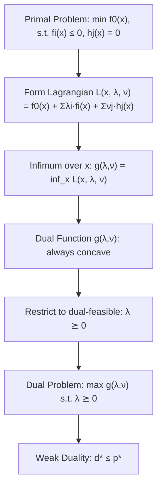

## Dual Function and Dual Problem Formulation

### Motivation

Every constrained optimization problem, called the **primal problem**, has an associated **dual problem** constructed from its Lagrangian. The dual problem provides a lower bound (for minimization) on the optimal primal value, offers an alternative — sometimes easier — problem to solve, and reveals deep structural properties like weak/strong duality and optimality conditions.

### The Primal Problem

Consider a general primal optimization problem in standard form:

$$
\begin{aligned}
\min_{x} \quad & f_0(x) \\
\text{subject to} \quad & f_i(x) \le 0, \quad i = 1, \dots, m \\
& h_j(x) = 0, \quad j = 1, \dots, p
\end{aligned}
$$

where $x \in \mathbb{R}^n$, $f_0$ is the objective function, $f_i$ are inequality constraint functions, and $h_j$ are equality constraint functions. The **domain** $\mathcal{D}$ is the intersection of the domains of all $f_i$ and $h_j$, and the **optimal value** is denoted $p^*$.

No convexity assumption is required to form the dual — duality applies to nonconvex problems too, though the interpretation of the results differs (as covered later under weak/strong duality).

### The Lagrangian

The **Lagrangian** $L: \mathbb{R}^n \times \mathbb{R}^m \times \mathbb{R}^p \to \mathbb{R}$ augments the objective with a weighted sum of the constraints:

$$
L(x, \lambda, \nu) = f_0(x) + \sum_{i=1}^{m} \lambda_i f_i(x) + \sum_{j=1}^{p} \nu_j h_j(x)
$$

- $\lambda_i$ are the **dual variables** (or **Lagrange multipliers**) associated with the inequality constraints $f_i(x) \le 0$.
- $\nu_j$ are the dual variables associated with the equality constraints $h_j(x) = 0$.
- The vectors $\lambda = (\lambda_1, \dots, \lambda_m)$ and $\nu = (\nu_1, \dots, \nu_p)$ are called **dual feasible** when $\lambda \succeq 0$ (i.e., every $\lambda_i \ge 0$).

The sign convention on $\lambda_i \ge 0$ is essential: since $f_i(x) \le 0$ for feasible $x$, adding $\lambda_i f_i(x)$ with $\lambda_i \ge 0$ can only decrease or keep constant the value relative to $f_0(x)$, which underlies the lower-bound property proven next.

### The Lagrange Dual Function

The **dual function** $g: \mathbb{R}^m \times \mathbb{R}^p \to \mathbb{R}$ is defined as the infimum of the Lagrangian over $x$:

$$
g(\lambda, \nu) = \inf_{x \in \mathcal{D}} L(x, \lambda, \nu) = \inf_{x \in \mathcal{D}} \left( f_0(x) + \sum_{i=1}^{m} \lambda_i f_i(x) + \sum_{j=1}^{p} \nu_j h_j(x) \right)
$$

**Key properties of the dual function:**

- **Concavity.** $g(\lambda, \nu)$ is always concave in $(\lambda, \nu)$, regardless of whether the primal problem is convex. This holds because $g$ is the pointwise infimum of a family of affine functions of $(\lambda, \nu)$ (one affine function for each fixed $x$), and the pointwise infimum of affine (hence concave) functions is concave.
- **Possibly $-\infty$.** The infimum may be unbounded below for some $(\lambda, \nu)$, in which case $g(\lambda, \nu) = -\infty$. Such points carry no useful information and are typically excluded from consideration.
- **Domain of $g$.** The effective domain of $g$ is the set of $(\lambda, \nu)$ for which $g(\lambda, \nu) > -\infty$.

**Lower bound property.** For any $\lambda \succeq 0$ and any $\nu$, and for any feasible point $\tilde{x}$ of the primal problem (i.e., $f_i(\tilde{x}) \le 0$ for all $i$, $h_j(\tilde{x}) = 0$ for all $j$):

$$
L(\tilde{x}, \lambda, \nu) = f_0(\tilde{x}) + \sum_{i=1}^{m} \lambda_i f_i(\tilde{x}) + \sum_{j=1}^{p} \nu_j h_j(\tilde{x}) \le f_0(\tilde{x})
$$

since $\lambda_i f_i(\tilde{x}) \le 0$ (as $\lambda_i \ge 0$, $f_i(\tilde{x}) \le 0$) and $\nu_j h_j(\tilde{x}) = 0$. Taking the infimum over $x \in \mathcal{D}$ (which includes $\tilde{x}$) gives:

$$
g(\lambda, \nu) \le L(\tilde{x}, \lambda, \nu) \le f_0(\tilde{x})
$$

Since this holds for every feasible $\tilde{x}$, it holds in particular at the optimum, giving the fundamental bound:

$$
g(\lambda, \nu) \le p^*, \quad \text{for all } \lambda \succeq 0, \nu
$$

This is **weak duality** in embryonic form: any dual-feasible point yields a lower bound on the primal optimal value. This holds unconditionally — no convexity, differentiability, or constraint qualification is required.

### Example: Deriving the Dual Function

Consider a simple quadratic program:

$$
\min_x \; x^2 \quad \text{subject to} \quad x \ge 1 \;\; (\text{i.e., } 1 - x \le 0)
$$

Here $f_0(x) = x^2$ and $f_1(x) = 1 - x \le 0$, with $m = 1$, $p = 0$. The Lagrangian is:

$$
L(x, \lambda) = x^2 + \lambda(1 - x)
$$

To find $g(\lambda) = \inf_x L(x,\lambda)$, since $L$ is a convex quadratic in $x$ (for fixed $\lambda$), set the derivative to zero:

$$
\frac{\partial L}{\partial x} = 2x - \lambda = 0 \quad \Rightarrow \quad x^* = \frac{\lambda}{2}
$$

Substituting back:

$$
g(\lambda) = \left(\frac{\lambda}{2}\right)^2 + \lambda\left(1 - \frac{\lambda}{2}\right) = \frac{\lambda^2}{4} + \lambda - \frac{\lambda^2}{2} = \lambda - \frac{\lambda^2}{4}
$$

**Verification of the lower bound:** the true optimum is $x^* = 1$, $p^* = 1$. Check $g(\lambda) \le 1$ for $\lambda \ge 0$: maximizing $g(\lambda) = \lambda - \lambda^2/4$ over $\lambda$ gives $g'(\lambda) = 1 - \lambda/2 = 0 \Rightarrow \lambda = 2$, and $g(2) = 2 - 1 = 1$. So the bound is tight at $\lambda = 2$ — the dual achieves exactly $p^*$, illustrating strong duality (covered in depth in a later topic).

### Dual Function via Conjugate Functions

For problems with linear or affine constraints, the dual function can often be expressed compactly using the **convex conjugate**:

$$
f^*(y) = \sup_{x \in \operatorname{dom} f} \left( y^T x - f(x) \right)
$$

**Example — linear program standard form:**

$$
\min_x \; c^T x \quad \text{s.t.} \quad Ax = b, \; x \succeq 0
$$

The Lagrangian is $L(x, \lambda, \nu) = c^T x + \nu^T(Ax - b) - \lambda^T x = -b^T \nu + (c + A^T \nu - \lambda)^T x$, which is affine (linear plus constant) in $x$. The infimum of an affine function over all $x \in \mathbb{R}^n$ is $-\infty$ unless the coefficient vector is exactly zero, giving:

$$
g(\lambda, \nu) = \begin{cases} -b^T \nu & \text{if } c + A^T \nu - \lambda = 0 \\ -\infty & \text{otherwise} \end{cases}
$$

This illustrates a common pattern: the dual function is often finite only on a restricted subset of $(\lambda, \nu)$ space, and this restriction itself becomes a constraint in the dual problem.

### The Lagrange Dual Problem

Since $g(\lambda, \nu)$ is a lower bound on $p^*$ for every dual-feasible $(\lambda, \nu)$, the *best* (tightest, largest) such lower bound is obtained by **maximizing** $g$ over all dual-feasible points. This defines the **Lagrange dual problem**:

$$
\begin{aligned}
\max_{\lambda, \nu} \quad & g(\lambda, \nu) \\
\text{subject to} \quad & \lambda \succeq 0
\end{aligned}
$$

- This is a **convex optimization problem** — maximizing a concave function subject to a linear (hence convex) constraint set — *regardless of whether the primal problem is convex*. This is one of the most important structural facts in duality theory: duality converts any problem into a convex maximization problem in the dual variables.
- Feasible points $(\lambda, \nu)$ with $\lambda \succeq 0$ and $g(\lambda,\nu) > -\infty$ are called **dual feasible**.
- The optimal value of the dual problem is denoted $d^*$.
- Because of the derivation above, weak duality always holds:

$$
d^* \le p^*
$$

The quantity $p^* - d^*$ is called the **optimal duality gap**. When this gap is zero, **strong duality** holds — a property examined separately, typically requiring convexity of the primal plus a constraint qualification (such as Slater's condition).

### Implicit Constraints and Domain Restrictions

When forming the Lagrangian, it is often convenient to fold explicit domain restrictions on $x$ (e.g., $x > 0$ for a $\log$ term) into the implicit domain $\mathcal{D}$ rather than adding them as formal constraints. This affects the dual function's finiteness but not the overall duality structure — care must be taken to properly account for the domain when computing $\inf_x L(x, \lambda, \nu)$.

### Dual Problem for the Standard LP

Continuing the linear programming example, plugging $g(\lambda, \nu)$ into the dual problem gives:

$$
\begin{aligned}
\max_{\lambda, \nu} \quad & -b^T \nu \\
\text{subject to} \quad & c + A^T \nu - \lambda = 0 \\
& \lambda \succeq 0
\end{aligned}
$$

Eliminating $\lambda = c + A^T \nu \succeq 0$ simplifies this to the familiar LP dual:

$$
\begin{aligned}
\max_{\nu} \quad & -b^T \nu \\
\text{subject to} \quad & A^T \nu + c \succeq 0
\end{aligned}
$$

This is typically rewritten with $y = -\nu$ to match the standard LP duality form seen in linear programming texts:

$$
\max_y \; b^T y \quad \text{s.t.} \quad A^T y \preceq c
$$

[Inference] The precise sign conventions and variable substitutions vary across textbooks; the structural fact that the dual of a linear program is another linear program is standard and well-established.

### Weak Duality Diagram (svg_diagram)

<svg xmlns="http://www.w3.org/2000/svg" viewBox="0 0 640 260">
  <text x="320" y="24" text-anchor="middle" font-size="16" font-weight="bold" fill="#222">Weak Duality: d* ≤ p* (svg_diagram)</text>
  <line x1="60" y1="150" x2="580" y2="150" stroke="#333" stroke-width="2" />
  <line x1="60" y1="140" x2="60" y2="160" stroke="#333" stroke-width="2" />
  <line x1="580" y1="140" x2="580" y2="160" stroke="#333" stroke-width="2" />
  <circle cx="220" cy="150" r="6" fill="#2266cc" />
  <text x="220" y="130" text-anchor="middle" font-size="13" fill="#2266cc">d* (dual optimal)</text>
  <circle cx="420" cy="150" r="6" fill="#cc3333" />
  <text x="420" y="130" text-anchor="middle" font-size="13" fill="#cc3333">p* (primal optimal)</text>
  <text x="220" y="190" text-anchor="middle" font-size="12" fill="#555">g(λ,ν) values</text>
  <text x="420" y="190" text-anchor="middle" font-size="12" fill="#555">f₀(x) values</text>
  <line x1="80" y1="220" x2="580" y2="220" stroke="#999" stroke-width="1" stroke-dasharray="4,4" />
  <text x="80" y="240" font-size="12" fill="#888">any dual-feasible (λ,ν)</text>
  <text x="480" y="240" font-size="12" fill="#888">any primal-feasible x</text>
  <path d="M 220 150 L 420 150" stroke="#009966" stroke-width="2" stroke-dasharray="6,3" />
  <text x="320" y="105" text-anchor="middle" font-size="12" fill="#009966">duality gap = p* − d* ≥ 0</text>
</svg>

### Relationship Flow (Mermaid)

### Common Pitfalls

- **Sign error on $\lambda$.** Forgetting the requirement $\lambda \succeq 0$ breaks the lower-bound property entirely — the direction of the inequality constraint $f_i(x) \le 0$ is what makes $\lambda_i \ge 0$ necessary.
- **Assuming the infimum is attained.** $g(\lambda, \nu) = \inf_x L(x,\lambda,\nu)$ may not be attained at a finite $x$; the infimum can still be a well-defined finite value or $-\infty$ even when no minimizer exists.
- **Confusing dual feasibility with strong duality.** A dual-feasible point only guarantees a valid lower bound (weak duality); it does not by itself imply the bound is tight.
- **Ignoring implicit constraints.** Omitting domain restrictions (like $\log$ arguments needing to be positive) when computing the infimum can lead to an incorrectly-specified dual function.

**Related Topics:**
- Weak Duality and Strong Duality
- Slater's Constraint Qualification
- Complementary Slackness
- Karush-Kuhn-Tucker (KKT) Conditions
- Duality Gap and Certificate of Suboptimality
- Conjugate Functions and Their Role in Duality
- Dual of Linear and Quadratic Programs
- Saddle-Point Interpretation of Duality
- Sensitivity Analysis via Dual Variables