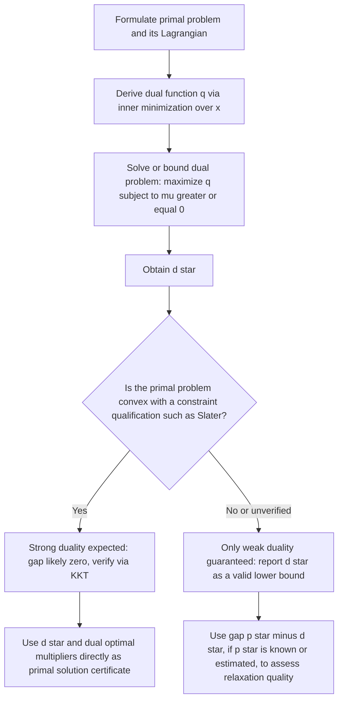

## Weak Duality and Duality Gap

### Restating the Setup

For the primal problem $p^* = \min_x \{f(x) : g_i(x)\le0,\ i=1,\dots,m,\ h_j(x)=0,\ j=1,\dots,p\}$, with Lagrangian $\mathcal L(x,\mu,\lambda) = f(x)+\mu^Tg(x)+\lambda^Th(x)$ and dual function $q(\mu,\lambda) = \inf_x \mathcal L(x,\mu,\lambda)$, the dual problem is $d^* = \max_{\mu\ge0,\lambda} q(\mu,\lambda)$. Weak duality is the statement relating $p^*$ and $d^*$ that holds unconditionally.

### Statement of Weak Duality

**Key Points**

- **Weak duality theorem:** for any primal problem (convex or not) and its Lagrangian dual, $d^* \le p^*$ always holds — no assumptions on differentiability, convexity, or constraint qualifications are required.
- This is among the most general theorems in optimization: it applies to combinatorial problems, nonconvex continuous problems, and problems with disconnected or non-smooth feasible sets alike, as long as the Lagrangian and dual function are well-defined.
- Weak duality is a two-line consequence of the definitions themselves — it requires no deep structural theory, unlike strong duality, which typically requires convexity plus a constraint qualification.

### Proof of Weak Duality

Let $x$ be any primal-feasible point ($g(x)\le0$, $h(x)=0$) and $(\mu,\lambda)$ any dual-feasible point ($\mu \ge 0$). Then:

$$q(\mu,\lambda) = \inf_{x'} \mathcal{L}(x',\mu,\lambda) \ \le\ \mathcal{L}(x,\mu,\lambda) = f(x) + \mu^Tg(x) + \lambda^Th(x)$$

Since $\mu \ge 0$ and $g(x)\le0$, each term $\mu_ig_i(x) \le 0$, so $\mu^Tg(x)\le0$. Since $h(x)=0$, the term $\lambda^Th(x)=0$ regardless of $\lambda$'s sign. Therefore:

$$q(\mu,\lambda) \ \le\ f(x) + \mu^Tg(x) + \lambda^Th(x) \ \le\ f(x)$$

This holds for **every** primal-feasible $x$ and **every** dual-feasible $(\mu,\lambda)$. Taking the infimum over $x$ on the right side and the supremum over $(\mu,\lambda)$ on the left side:

$$d^* = \sup_{\mu\ge0,\lambda} q(\mu,\lambda) \ \le\ \inf_{x \text{ feasible}} f(x) = p^*$$

### The Duality Gap

**Key Points**

- The **duality gap** is defined as $p^* - d^* \ge 0$. Weak duality guarantees this quantity is never negative; it says nothing by itself about whether the gap is exactly zero, small, or large.
- A zero duality gap ($p^*=d^*$) is called **strong duality**, discussed separately — it is not guaranteed by weak duality and requires additional hypotheses.
- A strictly positive duality gap can occur in nonconvex problems even when constraint qualifications hold at the primal optimum — the gap reflects a genuine loss of information when replacing the primal problem with its concave dual relaxation.
- The duality gap can be computed in practice by solving (or bounding) both $p^*$ and $d^*$ independently and comparing; in many applications, only $d^*$ is computed (as a bound), and the gap is estimated rather than computed exactly, since $p^*$ may be intractable to find precisely.

### Visualizing the Duality Gap Across Problem Types (svg_diagram)

<svg xmlns="http://www.w3.org/2000/svg" viewBox="0 0 740 340">
<text x="370" y="26" font-family="sans-serif" font-size="16" font-weight="bold" text-anchor="middle" fill="#1a1a1a">Duality Gap: Convex vs. Nonconvex (svg_diagram)</text>

<text x="200" y="60" font-family="sans-serif" font-size="13" font-weight="bold" text-anchor="middle" fill="`#1e3a8a`">Convex problem (typical)</text>

<line x1="80" y1="150" x2="360" y2="150" stroke="`#334155`" stroke-width="2" />

<circle cx="220" cy="150" r="7" fill="`#7c3aed`" />

<text x="220" y="175" font-family="sans-serif" font-size="12" font-weight="bold" text-anchor="middle" fill="`#4c1d95`">d* = p*</text>

<text x="220" y="195" font-family="sans-serif" font-size="11" text-anchor="middle" fill="`#334155`">(zero gap, given Slater)</text>

<text x="560" y="60" font-family="sans-serif" font-size="13" font-weight="bold" text-anchor="middle" fill="`#7f1d1d`">Nonconvex problem (possible)</text>

<line x1="440" y1="150" x2="700" y2="150" stroke="`#334155`" stroke-width="2" />

<circle cx="490" cy="150" r="7" fill="`#2563eb`" />

<text x="490" y="175" font-family="sans-serif" font-size="12" font-weight="bold" text-anchor="middle" fill="`#1e3a8a`">d*</text>

<circle cx="650" cy="150" r="7" fill="`#dc2626`" />

<text x="650" y="175" font-family="sans-serif" font-size="12" font-weight="bold" text-anchor="middle" fill="`#7f1d1d`">p*</text>

<path d="M 500 150 L 640 150" stroke="`#d97706`" stroke-width="3" stroke-dasharray="6,4" />

<text x="570" y="130" font-family="sans-serif" font-size="11" font-weight="bold" fill="`#92400e`" text-anchor="middle">positive gap</text>

<rect x="80" y="260" width="620" height="55" rx="8" fill="#fef9c3" stroke="#ca8a04" stroke-width="1" />
<text x="390" y="285" font-family="sans-serif" font-size="12" text-anchor="middle" fill="#713f12">Weak duality guarantees d* ≤ p* in BOTH cases</text>
<text x="390" y="303" font-family="sans-serif" font-size="12" text-anchor="middle" fill="#713f12">Strong duality (gap = 0) requires convexity + a CQ, typically</text>
</svg>

### Worked Example: Zero Duality Gap (Convex Case)

Minimize $f(x)=x^2$ subject to $g(x)=x-1\le0$ — reusing the earlier derivation, $q(\mu) = -\mu^2/4-\mu$, giving $d^*=q(0)=0$ (since the unconstrained dual maximizer $\mu=-2$ is infeasible for $\mu\ge0$, so the constrained max is at the boundary $\mu=0$). Direct computation gives $p^*=f(0)=0$ (the unconstrained minimizer $x=0$ is already primal-feasible). Duality gap $= p^*-d^* = 0-0=0$ — **zero gap**, consistent with this being a convex problem where Slater's condition holds (e.g. $x=0.5$ gives $g(0.5)=-0.5<0$, strictly feasible).

### Worked Example: Positive Duality Gap (Nonconvex/Integer Case)

Consider the classic 0-1 integer feasibility-style example: minimize $f(x) = -x$ subject to $x \in \{0,2\}$ (a nonconvex, discrete feasible set) and $g(x) = x - 1 \le 0$ as the only "continuous-looking" constraint, alongside the discrete membership requirement.

Primal-feasible points satisfying both $g(x)\le0$ and $x\in\{0,2\}$: only $x=0$ qualifies ($g(0)=-1\le0$; $g(2)=1>0$ fails). So $p^* = f(0) = 0$.

For the dual, relax the integrality by considering $\mathcal L(x,\mu) = -x + \mu(x-1)$ minimized over $x \in \{0,2\}$ (the discrete set is retained in the inner minimization, since it is the "easy" part being kept, while $g(x)\le0$ is the part being dualized):

$$q(\mu) = \min\{ \mathcal L(0,\mu),\ \mathcal L(2,\mu) \} = \min\{ -\mu,\ -2+\mu \}$$

At $\mu=1$: $q(1) = \min\{-1, -1\} = -1$. Checking whether this is the maximizing $\mu$: for $\mu<1$, $-\mu > -2+\mu$ is false when... evaluating directly, $-\mu$ decreases as $\mu$ increases, while $-2+\mu$ increases as $\mu$ increases; they cross at $\mu=1$ where both equal $-1$, and this crossing point is exactly where the minimum of the two lines is maximized (the standard "max of the min of two crossing lines" structure) — so $d^* = q(1) = -1$.

Duality gap $= p^* - d^* = 0 - (-1) = 1 > 0$ — a **strictly positive gap**, illustrating how retaining a nonconvex (discrete) feasible set inside the inner minimization while dualizing only the continuous inequality constraint can produce a genuine gap, characteristic of Lagrangian relaxation in integer programming.

### Sources of Positive Duality Gap

**Key Points**

- **Nonconvexity of the objective or constraint functions**: even without any discrete variables, a nonconvex $f$ or nonconvex $g_i$ can produce a positive gap, since the dual problem effectively operates on the **convex hull** (technically, the biconjugate) of the Lagrangian's dependence on $x$, discarding information about non-convex "dips" in the true feasible/objective structure.
- **Nonconvex (e.g., discrete or disconnected) feasible sets**: as in the integer-programming example above, retaining a discrete inner minimization set produces a dual function that only sees the convex hull of the discrete points' objective values, missing the true combinatorial structure.
- **Absence of a constraint qualification**: even in continuous nonconvex problems where an optimum exists, if no CQ holds there, the KKT-based reasoning that would otherwise connect $p^*$ and $d^*$ does not apply, and there is no guarantee the gap closes.
- [Inference] The exact magnitude of the duality gap for a specific nonconvex instance generally cannot be bounded a priori without problem-specific structural analysis (e.g., known convexification results for particular problem classes); the general theory only guarantees the gap's *sign* (nonnegative) via weak duality, not its size.

### The Convex Hull Interpretation

**Key Points**

- Geometrically, the duality gap can be understood via the **perturbation function** $p(u,v) = \min_x\{f(x):g(x)\le u, h(x)=v\}$ introduced in sensitivity analysis: $d^*$ equals the value at $(0,0)$ of the **convex hull** (technically, the closed convex envelope) of $p(u,v)$, while $p^*=p(0,0)$ is the true value.
- If $p(u,v)$ is already convex near $(0,0)$ (as it is, under mild conditions, whenever the primal problem is convex), the convex hull agrees with $p$ itself at that point, and the gap is zero — recovering the link between primal convexity and strong duality via this perturbation-function viewpoint.
- If $p(u,v)$ has a "kink" or nonconvex dip near $(0,0)$ (typical of nonconvex or discrete problems), the convex hull can lie strictly below $p(0,0)$ at that point, producing exactly the positive gap seen numerically in the worked example above.

### Practical Uses of Weak Duality Despite a Nonzero Gap

**Key Points**

- **Branch-and-bound pruning**: in combinatorial optimization, the dual value $d^*$ (or any dual-feasible $q(\mu,\lambda)$) provides a valid lower bound on $p^*$ at each node of a search tree; if this bound already exceeds the best known feasible solution's value, that branch can be discarded without further exploration — one of the central computational uses of weak duality in practice.
- **Quality certificates for heuristic solutions**: given any feasible primal solution $\hat x$ (found by a fast heuristic) and any dual-feasible $(\hat\mu,\hat\lambda)$, the ratio or difference $f(\hat x) - q(\hat\mu,\hat\lambda)$ upper-bounds how far $\hat x$ could possibly be from $p^*$ — even without knowing $p^*$ exactly, this provides a certifiable **optimality gap** for the heuristic's output.
- **Lagrangian relaxation as a bounding technique**: iteratively improving $(\mu,\lambda)$ (e.g., via subgradient ascent on the concave $q$) tightens the lower bound $d^*$ progressively, even when it is known in advance the gap will not close to zero, because $q$ remains a genuinely useful, computationally tractable approximation tool.

### Weak Duality Analysis Workflow

### Relation to Complementary Slackness

**Key Points**

- The weak-duality proof's chain of inequalities, $q(\mu,\lambda) \le \mathcal L(x,\mu,\lambda) \le f(x)$, becomes a chain of **equalities** precisely when the duality gap is zero and both $x$ and $(\mu,\lambda)$ are optimal — this equality is what forces $\mu_i^*g_i(x^*)=0$ (complementary slackness) and forces $x^*$ to minimize $\mathcal L(\cdot,\mu^*,\lambda^*)$.
- Conversely, if a positive duality gap exists, no primal-dual pair can produce this chain of equalities, so complementary slackness (in the strong-duality sense) cannot be established from duality theory alone in that case — this is a useful diagnostic: if one suspects a nonzero gap, checking whether complementary slackness can even be consistently satisfied is a natural first test.

### Common Misconceptions About Duality Gaps

**Key Points**

- **Misconception: nonconvex problems always have a positive gap.** This is false — a nonconvex problem can still exhibit zero duality gap in specific instances (e.g., certain nonconvex quadratic problems with special structure, such as the classical S-lemma / trust-region subproblem, are known to enjoy strong duality despite nonconvexity); nonconvexity only removes the general *guarantee* of a zero gap, it does not force a positive one in every case. [Inference] Whether a specific nonconvex problem happens to have zero gap typically requires checking known special-structure results (e.g., S-procedure conditions) or verifying numerically, rather than relying on a blanket rule.
- **Misconception: a small numerically observed gap implies the problem is "nearly convex."** A small gap can arise from many structural reasons unrelated to convexity (e.g., a discrete problem with a large number of near-continuous options), so gap size alone is not a reliable diagnostic of convexity.
- **Misconception: weak duality requires differentiability.** The proof given above uses only feasibility and sign conditions — no derivatives appear anywhere in the argument, so weak duality holds equally for non-differentiable, non-smooth, or even combinatorial (discrete-variable) problems.

### Related Topics

- Strong duality and Slater's condition
- Saddle-point characterization of primal-dual optimal pairs
- Lagrangian relaxation in integer and combinatorial optimization
- Convex hull / biconjugate interpretation of the perturbation function
- Branch-and-bound methods and dual bounding
- Subgradient methods for maximizing the dual function
- The S-lemma and special-structure zero-gap results in nonconvex quadratic optimization