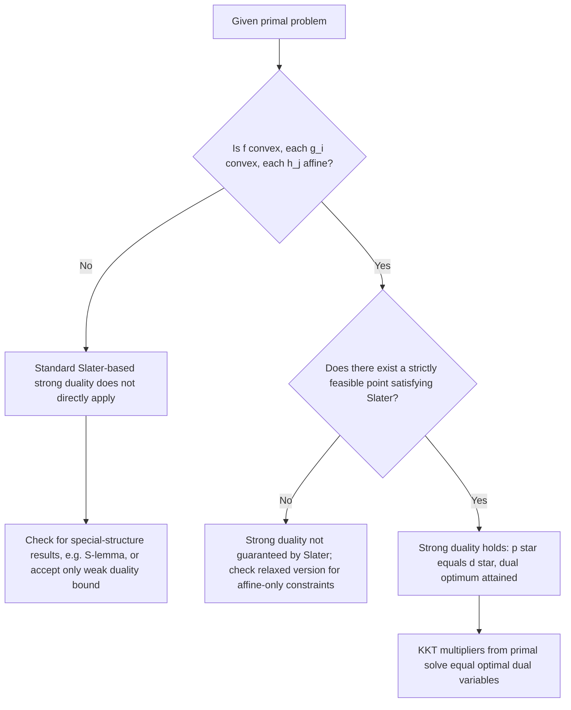

## Strong Duality Conditions

### Defining Strong Duality

Strong duality holds when the primal optimal value $p^*$ and the dual optimal value $d^*$ coincide exactly: $p^* = d^*$, i.e., the duality gap is zero. Unlike weak duality (which holds unconditionally), strong duality requires additional structural hypotheses on the problem — it is the exception that must be proven, not the rule.

### Why Strong Duality Requires More Than Weak Duality

**Key Points**

- Weak duality follows from elementary sign arguments alone; strong duality requires the primal problem's geometry (specifically, the perturbation function's convexity near the origin) to align exactly with the dual's inherently concave structure.
- The general mechanism enabling strong duality is a **separating hyperplane** argument: if the perturbation function $p(u,v) = \min_x{f(x):g(x)\le u,h(x)=v}$ is convex (or can be shown to coincide with its convex hull at the origin), a supporting hyperplane to its epigraph at $(0,0,p(0,0))$ exists, and the coefficients of this hyperplane are exactly the optimal dual multipliers.
- This is why convexity of the primal problem is the central hypothesis in nearly every strong duality result — convexity is precisely what guarantees $p(u,v)$ behaves well enough near the origin for such a separating hyperplane to exist.

### Slater's Condition as the Standard Sufficient Condition

**Key Points**

- For a **convex** primal problem ($f$ convex, each $g_i$ convex, each $h_j$ affine), **Slater's condition** — the existence of a strictly feasible point $\hat x$ with $g_i(\hat x)<0$ for all $i$ and $h_j(\hat x)=0$ for all $j$ — is sufficient for strong duality to hold.
- Slater's condition additionally guarantees the dual optimal value is **attained** (some $(\mu^*,\lambda^*)$ actually achieves $d^*$, rather than merely approaching it as a supremum) — a stronger conclusion than "$d^*=p^*$" alone, which matters for algorithms that need to work with an explicit optimal dual solution rather than a sequence approaching it.
- For problems where all inequality constraints are affine (linear), Slater's condition can be **relaxed**: strict feasibility is not required for the linear constraints — only feasibility (not-necessarily-strict) is needed for those, while strict feasibility is still required for any genuinely nonlinear convex constraints present.
- Slater's condition is a **global** condition (existence of one strictly feasible point anywhere in the feasible region), unlike LICQ/MFCQ, which are checked locally at a specific candidate point — this is often more convenient to verify in practice, especially before the optimal solution itself is known.

### Worked Example: Verifying Slater's Condition Enables Strong Duality

Minimize $f(x_1,x_2)=x_1^2+x_2^2$ subject to $g_1(x)=x_1+x_2-1\le0$ (convex, in fact affine) and $g_2(x)=x_1^2-x_2\le0$ (convex, since $x_1^2$ is convex and the constraint is convex in the standard sense).

Check Slater: try $\hat x=(0,0)$. $g_1(0,0)=-1<0$ ✓. $g_2(0,0)=0$, **not** strictly negative — fails at this point; try $\hat x=(0,-1)$: $g_1(0,-1)=-2<0$ ✓, $g_2(0,-1)=0-(-1)=1>0$ ✗, infeasible. Try $\hat x=(0.1,0.5)$: $g_1=0.1+0.5-1=-0.4<0$ ✓; $g_2=0.01-0.5=-0.49<0$ ✓. Slater's condition holds via this point — strong duality is guaranteed for this convex problem.

### LICQ and MFCQ Are Not, By Themselves, Strong Duality Conditions

**Key Points**

- LICQ and MFCQ are constraint qualifications ensuring KKT is **necessary** at a *given* local minimizer — they are conditions checked at a specific candidate point and are primarily tools for establishing first-order necessary conditions, not general strong-duality guarantees.
- Strong duality is fundamentally a statement about the relationship between the *global* primal optimal value and the *global* dual optimal value across the whole problem — Slater's condition (a global, convexity-paired condition) plays this role for convex problems, whereas LICQ/MFCQ do not directly establish $p^*=d^*$ on their own without the accompanying convexity assumption.
- In convex problems, when both a CQ (like Slater) holds and $x^*$ satisfies KKT, the multipliers obtained from the KKT system are simultaneously the necessary-condition multipliers **and** the optimal dual solution $(\mu^*,\lambda^*)$ — this is the point where the constraint-qualification perspective (from earlier optimality-condition material) and the duality perspective converge into a single object.

### Other Sufficient Conditions for Strong Duality

**Key Points**

- **Linear programming**: strong duality holds for any feasible and bounded LP, with no Slater-type strict feasibility requirement at all — this is a special, stronger result (LP duality theorem) that follows from the polyhedral (piecewise-linear) structure of LP feasible sets, rather than from Slater's condition directly.
- **Convex quadratic programming**: strong duality typically holds under Slater's condition applied to the (convex) quadratic and linear constraints, following the general convex-Slater framework.
- **The S-lemma**: for certain structured nonconvex quadratic problems (specifically, minimizing one quadratic subject to a single quadratic inequality constraint), strong duality can hold even without convexity, via specialized results outside the general convex-Slater framework — a notable exception showing that convexity, while the standard sufficient route, is not strictly necessary for zero duality gap in every problem class. [Inference] The precise scope of problem classes covered by such specialized zero-gap results (beyond the classical single-constraint S-lemma case) is an active and nuanced area, and confirming strong duality for a specific nonconvex instance outside these known cases generally requires direct verification rather than a general theorem.
- **Semidefinite programming**: Slater-type conditions (strict feasibility with respect to the positive semidefinite cone) again serve as the standard sufficient condition for strong duality, extending the same convex-analysis mechanism to matrix-inequality-constrained problems.

### Visualizing Why Convexity Enables Strong Duality (svg_diagram)

<svg viewBox="0 0 740 340" xmlns="http://www.w3.org/2000/svg">
<text x="370" y="26" font-family="sans-serif" font-size="16" font-weight="bold" text-anchor="middle" fill="#1a1a1a">Perturbation Function Convexity (svg_diagram)</text>

<text x="200" y="60" font-family="sans-serif" font-size="13" font-weight="bold" text-anchor="middle" fill="`#1e3a8a`">Convex primal: p(u) is convex</text>

<path d="M 80 200 Q 200 60 320 200" fill="none" stroke="`#2563eb`" stroke-width="2.5"/>

<line x1="100" y1="185" x2="300" y2="185" stroke="`#16a34a`" stroke-width="2" stroke-dasharray="4,3"/>

<text x="200" y="230" font-family="sans-serif" font-size="11" text-anchor="middle" fill="`#14532d`">supporting hyperplane touches at (0, p*)</text>

<text x="200" y="248" font-family="sans-serif" font-size="11" text-anchor="middle" fill="`#14532d`">slope gives optimal multipliers</text>

<text x="560" y="60" font-family="sans-serif" font-size="13" font-weight="bold" text-anchor="middle" fill="`#7f1d1d`">Nonconvex primal: p(u) has a dip</text>

<path d="M 440 200 Q 480 100 520 190 Q 560 250 600 130 Q 640 80 680 200" fill="none" stroke="`#dc2626`" stroke-width="2.5"/>

<line x1="460" y1="180" x2="660" y2="180" stroke="`#d97706`" stroke-width="2" stroke-dasharray="4,3"/>

<text x="560" y="230" font-family="sans-serif" font-size="11" text-anchor="middle" fill="`#92400e`">convex hull line lies BELOW p(0)</text>

<text x="560" y="248" font-family="sans-serif" font-size="11" text-anchor="middle" fill="`#92400e`">dual value d* < p*, gap appears</text>

</svg>

### Verifying Strong Duality in Practice: A Procedure

### Strong Duality and KKT: The Convex Convergence Point

**Key Points**

- When strong duality holds (via Slater) for a convex problem, and $x^*$ is primal optimal with $(\mu^*,\lambda^*)$ dual optimal, then $x^*,\mu^*,\lambda^*$ **automatically satisfy the full KKT system**: stationarity, primal feasibility, dual feasibility, and complementary slackness — this is a converse-type statement to the usual "KKT necessary given a CQ" direction from optimality-condition theory.
- Conversely, in convex problems, **any** point satisfying KKT is both primal and dual optimal — meaning that for convex problems with Slater's condition, KKT is not just necessary but **fully characterizes** optimality, unifying the constraint-qualification perspective and the duality perspective into a single equivalence.
- This equivalence is precisely why solving convex problems via primal-dual interior-point methods is so effective: driving the KKT residual to zero numerically is *simultaneously* solving the primal, solving the dual, and closing the duality gap, all via the same iterative process.

### Failure of Strong Duality: What Goes Wrong Without Slater

**Key Points**

- Even within convex problems, if Slater's condition fails (no strictly feasible point exists — e.g., the feasible region is a single point, or all convex inequality constraints are tight everywhere feasible), strong duality can fail, and specialized (weaker) constraint qualifications or direct analysis may be needed to determine whether the gap is actually zero in that specific degenerate instance.
- A classical illustrative case: convex problems where the feasible set is a single point touched tangentially by a nonlinear convex constraint (analogous to the earlier LICQ-failure tangency example) can exhibit a positive duality gap despite overall convexity, precisely because Slater's strict feasibility requirement cannot be met.
- This illustrates that convexity **alone** is not sufficient for strong duality — the additional regularity condition (Slater's, or an appropriate weaker CQ suited to convex problems) is doing indispensable work, not merely a technical formality.

### Practical Diagnostic Checklist

**Key Points**

- **Step 1**: confirm $f$ is convex, each $g_i$ is convex, and each $h_j$ is affine — if any fails, standard Slater-based strong duality does not apply, and only weak duality (or a specialized result) can be invoked.
- **Step 2**: search for a strictly feasible point — often easiest by inspection for simple constraint sets, or by solving a small auxiliary feasibility LP/NLP (e.g., maximize a slack variable $s$ subject to $g_i(x)\le -s$, $h(x)=0$, and check if the optimal $s^*>0$).
- **Step 3**: if Slater holds, strong duality and dual attainment are both guaranteed — proceed with confidence using either the primal or dual formulation interchangeably, whichever is computationally more convenient.
- **Step 4**: if Slater fails but the problem is still convex, do not assume a gap exists — check for relaxed conditions (e.g., the affine-constraint relaxation of Slater) or attempt direct verification before concluding the gap is nonzero.

### Related Topics

- Weak duality and the duality gap
- Constraint qualifications (LICQ, MFCQ, Slater's condition) in first-order optimality theory
- KKT conditions as a unifying characterization under convexity plus Slater
- Semidefinite programming duality and strict feasibility in matrix inequalities
- The S-lemma and zero-gap results for structured nonconvex quadratics
- Interior-point methods and the primal-dual central path
- Perturbation functions and separating hyperplane arguments in convex analysis