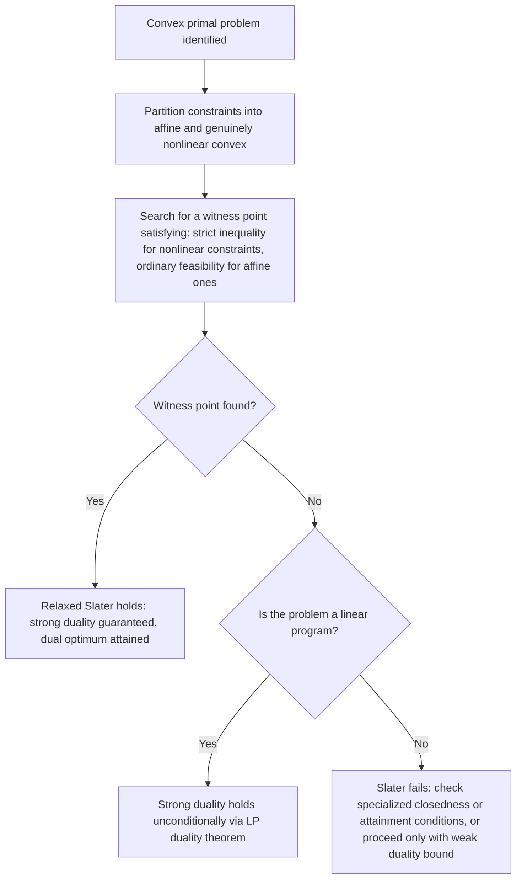

## Slater's Condition and Constraint Qualifications for Duality

### Two Distinct Roles Constraint Qualifications Play

Constraint qualifications appear in two related but logically separate parts of optimization theory: first, as hypotheses guaranteeing that KKT conditions are **necessary** at a specific local minimizer (the role of LICQ, MFCQ discussed earlier); second, as hypotheses guaranteeing that **strong duality** holds globally between the primal and dual problems. Slater's condition is the standard bridge condition that plays this second role for convex problems, and understanding precisely how it differs from, yet connects to, the local constraint qualifications is essential for using duality theory correctly.

### Restating Slater's Condition in the Duality Context

**Key Points**

- For a convex primal problem ($f$ convex, $g_i$ convex, $h_j$ affine), Slater's condition requires the existence of a point $\hat x$ with $g_i(\hat x) < 0$ for all $i$ and $h_j(\hat x) = 0$ for all $j$ — a single, global witness point, not a condition checked at the eventual optimal solution itself.
- This global character is a key practical advantage: Slater's condition can often be verified **before** solving the problem at all (simply by exhibiting some strictly feasible point), unlike LICQ or MFCQ, which are checked at a candidate optimum that may not yet be known.
- When Slater's condition holds, it simultaneously guarantees (a) zero duality gap ($p^*=d^*$) and (b) that the dual optimal value is **attained** by some specific $(\mu^*,\lambda^*)$, rather than merely being approached as a supremum without a maximizing point.

### Why Local CQs (LICQ, MFCQ) Don't Directly Give Strong Duality

**Key Points**

- LICQ and MFCQ are defined **at a specific point** $\bar x$ and describe the local geometry of the active constraints there — they say nothing directly about the global relationship between $p^*$ and $d^*$, which is a statement about the entire feasible region and the entire dual problem, not a local property.
- It is possible for LICQ to hold at the primal optimum $x^*$ of a convex problem while Slater's condition still needs separate verification for the duality-gap conclusion — the two conditions are answering different questions (local multiplier existence/uniqueness vs. global gap closure) even though they often hold together in well-behaved convex problems.
- Conversely, in convex problems, Slater's condition (global) is generally the more useful condition to check for duality purposes precisely because it does not require first finding $x^*$ — whereas LICQ, to be checked at all, presupposes a candidate point has already been identified.

### The Convex-Analysis Mechanism Behind Slater's Sufficiency

**Key Points**

- Slater's condition works by guaranteeing that the perturbation function $p(u,v) = \min_x{f(x):g(x)\le u, h(x)=v}$ is **finite and continuous** in a neighborhood of $(0,0)$, which — combined with the convexity of $p(u,v)$ that follows from the primal problem's own convexity — ensures a supporting hyperplane to the epigraph of $p$ exists exactly at $(0,0,p(0,0))$.
- Without a strictly feasible point, the perturbation function can fail to be continuous or can have a nonconvex "kink" precisely at $u=0,v=0$ (the boundary of feasibility), which is exactly where the supporting-hyperplane argument can break down.
- The slope of this supporting hyperplane, when it exists, gives the optimal dual multipliers $(\mu^*,\lambda^*)$ directly — connecting the duality-gap conclusion to the sensitivity-analysis interpretation of multipliers covered earlier.

### Relaxed Slater's Condition for Affine Constraints

**Key Points**

- When some (or all) inequality constraints are affine, i.e., $g_i(x) = a_i^Tx - b_i$, strict feasibility is **not required** for those specific constraints — ordinary (non-strict) feasibility $g_i(\hat x)\le0$ suffices for them, while strict feasibility $g_i(\hat x)<0$ is still required for any genuinely nonlinear convex $g_i$.
- This relaxation matters practically: many real problems have a mix of linear resource/budget constraints (naturally often tight or boundary-touching) and nonlinear convex constraints (e.g., quadratic risk limits, norm constraints) — the relaxed condition allows the linear constraints to be active at the Slater witness point without invalidating the strong-duality guarantee.
- The underlying reason this relaxation is valid is that affine constraints do not introduce the same curvature-driven "kink" risk in the perturbation function that a tangent nonlinear constraint can — the supporting-hyperplane argument goes through even when a linear constraint is exactly tight at the witness point.

### Worked Example: Relaxed Slater with a Mixed Constraint Set

Minimize $f(x_1,x_2) = x_1^2+x_2^2$ subject to $g_1(x) = x_1+x_2-2 \le 0$ (affine) and $g_2(x) = x_1^2 - x_2 \le 0$ (nonlinear convex).

Try the witness point $\hat x = (1,1)$: $g_1(1,1) = 1+1-2=0$ — **not strict**, but $g_1$ is affine, so this is acceptable under the relaxed condition. $g_2(1,1) = 1-1=0$ — this is **not** strict and $g_2$ is nonlinear, so this witness point fails the relaxed Slater requirement for the nonlinear constraint.

Try $\hat x = (0.5, 1)$: $g_1(0.5,1) = 0.5+1-2=-0.5\le0$ ✓ (affine, non-strict is fine). $g_2(0.5,1) = 0.25-1=-0.75<0$ ✓ (nonlinear, strict as required). Relaxed Slater's condition **holds** via this witness point — strong duality is guaranteed even though the affine constraint could potentially be tight at other candidate witness points.

### Visualizing Standard vs. Relaxed Slater (svg_diagram)

<svg xmlns="http://www.w3.org/2000/svg" viewBox="0 0 740 320">
<text x="370" y="26" font-family="sans-serif" font-size="16" font-weight="bold" text-anchor="middle" fill="#1a1a1a">Standard vs. Relaxed Slater (svg_diagram)</text>
<rect x="60" y="60" width="300" height="220" fill="#f8fafc" stroke="#cbd5e1" stroke-width="1" />
<text x="210" y="80" font-family="sans-serif" font-size="12" font-weight="bold" text-anchor="middle" fill="#1e3a8a">All constraints nonlinear</text>
<path d="M 90 260 Q 200 120 330 240" fill="none" stroke="#2563eb" stroke-width="2" />
<circle cx="210" cy="200" r="6" fill="#16a34a" />
<text x="210" y="225" font-family="sans-serif" font-size="11" text-anchor="middle" fill="#14532d">witness point: strictly inside</text>
<text x="210" y="245" font-family="sans-serif" font-size="11" text-anchor="middle" fill="#14532d">required for EVERY constraint</text>
<rect x="400" y="60" width="300" height="220" fill="#f8fafc" stroke="#cbd5e1" stroke-width="1" />
<text x="550" y="80" font-family="sans-serif" font-size="12" font-weight="bold" text-anchor="middle" fill="#7f1d1d">Mixed affine + nonlinear</text>
<line x1="430" y1="240" x2="670" y2="150" stroke="#d97706" stroke-width="2.5" />
<path d="M 430 260 Q 550 140 670 250" fill="none" stroke="#2563eb" stroke-width="2" />
<circle cx="530" cy="200" r="6" fill="#16a34a" />
<text x="530" y="225" font-family="sans-serif" font-size="11" text-anchor="middle" fill="#14532d">may TOUCH the affine boundary</text>
<text x="530" y="245" font-family="sans-serif" font-size="11" text-anchor="middle" fill="#14532d">must stay strictly inside nonlinear one</text>
</svg>

### Constraint Qualifications for Duality Beyond Slater

**Key Points**

- **Linear programming**: strong duality holds unconditionally for any feasible, bounded LP — no Slater-type strict feasibility witness is needed at all, since the entire feasible region is polyhedral and the perturbation function is automatically piecewise-linear (hence convex and well-behaved) everywhere it is finite.
- **Closedness conditions**: in more general convex analysis, alternative conditions (e.g., requiring the primal optimal value function to be lower semicontinuous, or requiring the constraint set to be "closed" under certain generalized qualification conditions) can substitute for Slater's condition when it fails, though these are more technical and less commonly invoked in applied work than Slater's condition itself.
- **Attainment vs. zero gap**: some weaker conditions guarantee $p^*=d^*$ (zero gap) without guaranteeing the dual optimum is attained — Slater's condition is notable for delivering both conclusions simultaneously, which is part of why it remains the standard, most-taught sufficient condition despite the existence of technically weaker alternatives.

### Practical Verification Workflow for Duality-Oriented CQs

### How This Connects Back to First-Order Optimality Theory

**Key Points**

- Once Slater's condition (or its relaxed form) establishes strong duality for a convex problem, **any** point satisfying the KKT conditions is guaranteed to be both primal- and dual-optimal — collapsing the separate local (LICQ/MFCQ-based) and global (Slater-based) constraint-qualification stories into a single unified equivalence specific to the convex setting.
- This is the precise sense in which convex optimization theory is "complete": first-order conditions (KKT), constraint qualifications (local and global), and duality theory (weak and strong) all lock together consistently, whereas in nonconvex optimization each of these pieces must be handled and verified separately, with no such automatic unification.
- The practical payoff is algorithmic: primal-dual interior-point methods for convex problems can be designed to drive the KKT residual to zero directly, relying on the theoretical guarantee (via Slater) that doing so simultaneously solves the primal, the dual, and certifies a zero duality gap — a guarantee unavailable, in general, for nonconvex problems.

### Common Points of Confusion

**Key Points**

- **Confusing "Slater's condition" with "LICQ evaluated at the optimum."** They serve different theoretical purposes (global duality-gap closure vs. local multiplier necessity/uniqueness) and are checked at different types of points (any strictly feasible point vs. specifically the candidate optimum).
- **Assuming Slater's condition is required for LP duality.** It is not — LP strong duality is unconditional (given feasibility and boundedness), a strictly stronger and different result from the general convex-Slater theorem, which should not be conflated with it.
- **Forgetting the affine-constraint relaxation.** Requiring strict feasibility for affine constraints when only ordinary feasibility is needed can lead to concluding (incorrectly) that Slater's condition fails, when in fact the relaxed version is satisfied and strong duality still holds.
- **Treating Slater's condition as necessary for strong duality.** It is a **sufficient** condition, not a necessary one — strong duality can hold in convex problems even when no strictly feasible point exists, via other (weaker, more technical) qualification conditions; Slater's failure alone does not permit concluding the gap is nonzero without further analysis.

### Related Topics

- Strong duality conditions and the separating hyperplane mechanism
- Weak duality and the duality gap
- LICQ and MFCQ as local constraint qualifications for KKT necessity
- Linear programming duality theorem as an unconditional special case
- Perturbation functions and sensitivity analysis via multipliers
- Semidefinite programming and strict feasibility in matrix-inequality constraints
- Primal-dual interior-point methods and the central path