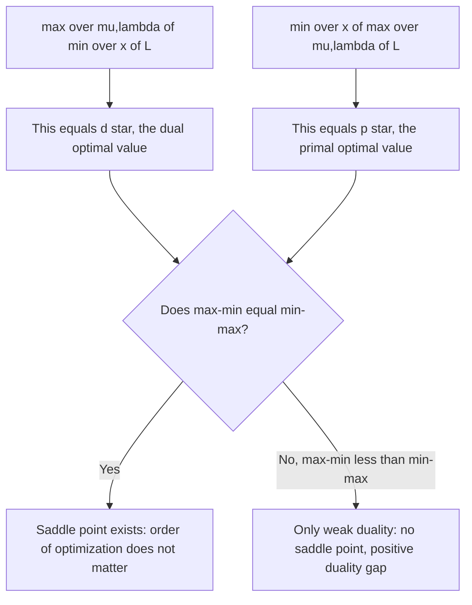

## Saddle Point Theory

### The Saddle Point as a Unifying Concept

Saddle point theory recasts constrained optimization as a two-player equilibrium problem: instead of separately minimizing the primal problem and maximizing the dual problem, a saddle point of the Lagrangian is a single point where neither minimization over the primal variable nor maximization over the dual variables can improve — both directions are simultaneously "settled." This section develops the saddle-point definition directly, shows its equivalence to primal-dual optimality under strong duality, and examines what happens when that equivalence breaks down.

### Formal Definition

**Key Points**

- A point $(x^*,\mu^*,\lambda^*)$ with $\mu^*\ge0$ is a **saddle point** of the Lagrangian $\mathcal L(x,\mu,\lambda) = f(x)+\mu^Tg(x)+\lambda^Th(x)$ if:

$$\mathcal{L}(x^*,\mu,\lambda) \ \le\ \mathcal{L}(x^*,\mu^*,\lambda^*) \ \le\ \mathcal{L}(x,\mu^*,\lambda^*)$$

for **all** $x$ (in the relevant domain) and **all** $\mu\ge0,\lambda$.

- The left inequality says: fixing $x=x^*$, no choice of dual variables $(\mu,\lambda)$ can make $\mathcal L$ larger than its value at $(\mu^*,\lambda^*)$ — i.e., $(\mu^*,\lambda^*)$ maximizes $\mathcal L(x^*,\cdot,\cdot)$ over dual-feasible multipliers.
- The right inequality says: fixing $(\mu,\lambda)=(\mu^*,\lambda^*)$, no choice of $x$ can make $\mathcal L$ smaller than its value at $x^*$ — i.e., $x^*$ **globally** minimizes $\mathcal L(\cdot,\mu^*,\lambda^*)$ over all $x$.
- The name "saddle point" reflects the shape this creates: along the $x$-direction, $\mathcal L$ has a minimum at $x^*$; along the $(\mu,\lambda)$-direction, $\mathcal L$ has a maximum at $(\mu^*,\lambda^*)$ — the graph of $\mathcal L$ near this point curves upward in one set of directions and downward in the other, exactly the geometric shape of a saddle.

### Visualizing the Saddle Shape (svg_diagram)

<svg xmlns="http://www.w3.org/2000/svg" viewBox="0 0 700 360">
<text x="350" y="26" font-family="sans-serif" font-size="16" font-weight="bold" text-anchor="middle" fill="#1a1a1a">Lagrangian Saddle Point (svg_diagram)</text>
<path d="M 100 280 Q 350 180 600 280" fill="none" stroke="#2563eb" stroke-width="2.5" />
<text x="600" y="270" font-family="sans-serif" font-size="11" fill="#1e3a8a">min over x</text>
<path d="M 220 100 Q 350 200 220 300" fill="none" stroke="#dc2626" stroke-width="2.5" />
<path d="M 480 100 Q 350 200 480 300" fill="none" stroke="#dc2626" stroke-width="2.5" />
<text x="460" y="115" font-family="sans-serif" font-size="11" fill="#7f1d1d">max over (μ,λ)</text>
<circle cx="350" cy="200" r="7" fill="#16a34a" />
<text x="365" y="195" font-family="sans-serif" font-size="12" font-weight="bold" fill="#14532d">(x*, μ*, λ*)</text>
<rect x="100" y="320" width="500" height="35" rx="6" fill="#fef9c3" stroke="#ca8a04" stroke-width="1" />
<text x="350" y="343" font-family="sans-serif" font-size="12" text-anchor="middle" fill="#713f12">Minimum along x-axis, maximum along (μ,λ)-axis, at the same point</text>
</svg>

### Equivalence to Primal-Dual Optimality

**Key Points**

- **Theorem:** $(x^*,\mu^*,\lambda^*)$ with $\mu^*\ge0$ is a saddle point of $\mathcal L$ **if and only if** $x^*$ is primal optimal, $(\mu^*,\lambda^*)$ is dual optimal, and strong duality holds ($p^*=d^*$).
- **Proof sketch (saddle point $\Rightarrow$ primal-dual optimal):** the right-hand inequality, holding for all $x$, gives $\mathcal L(x^*,\mu^*,\lambda^*) = \min_x \mathcal L(x,\mu^*,\lambda^*) = q(\mu^*,\lambda^*)$. The left-hand inequality, taking the supremum over $\mu\ge0,\lambda$, combined with the specific choice $\mu=0,\lambda=0$ (which is dual-feasible), gives $\mathcal L(x^*,\mu^*,\lambda^*)\ge \mathcal L(x^*,0,0)=f(x^*)$ is not quite immediate — instead, taking the saddle inequality with $\mu=\mu^*,\lambda=\lambda^*$ itself trivially holds; the substantive content comes from examining $\mu\to\infty$ along directions where $g_i(x^*)>0$ would force the left side to $+\infty$ unless $g(x^*)\le0$, establishing primal feasibility, after which complementary slackness and $\mathcal L(x^*,\mu^*,\lambda^*)=f(x^*)$ follow, giving $q(\mu^*,\lambda^*)=f(x^*)$ — zero gap.
- **Proof sketch (primal-dual optimal + strong duality $\Rightarrow$ saddle point):** this direction is exactly the content of the complementary-slackness derivation from the weak-duality chain covered earlier — strong duality forces both inequalities in that chain to equalities, which unpacks precisely into the saddle-point inequalities.
- This equivalence means saddle-point theory, duality theory, and the KKT/complementary-slackness framework are **three descriptions of the same underlying mathematical fact**, each emphasizing a different aspect: saddle points emphasize the game-theoretic equilibrium structure, duality emphasizes the bounding/gap structure, and KKT emphasizes the differential/gradient structure.

### Saddle Points Require No Constraint Qualification — A Subtlety

**Key Points**

- Unlike the KKT stationarity condition (which requires a constraint qualification such as LICQ or MFCQ to be **necessary** at a local minimizer), the saddle-point definition makes no reference to gradients at all — it is stated purely in terms of function **values**, not derivatives.
- This means that whenever a saddle point does exist, it automatically certifies primal-dual optimality **without needing to invoke any constraint qualification** — the saddle-point condition is inherently a stronger, more global statement than the (possibly CQ-dependent) differential KKT conditions.
- The subtlety is existence, not necessity of a CQ for the certificate itself: a saddle point might simply **fail to exist** for a given nonconvex problem (even one where a local minimizer with KKT-satisfying multipliers exists under a CQ), since the saddle-point condition demands global minimization in $x$, which nonconvexity can easily prevent.
- This clarifies the relationship precisely: constraint qualifications are needed to guarantee that a **KKT point exists and is necessary** at a local minimum; strong duality (e.g., via Slater's condition in the convex case) is needed to guarantee that a **saddle point exists** — these are related but logically distinct existence questions, addressed by different hypotheses.

### Worked Example: Constructing a Saddle Point Directly

Reusing the earlier example: minimize $f(x_1,x_2)=(x_1-3)^2+(x_2-2)^2$ subject to $g(x)=x_1+x_2-4\le0$, with $x^*=(2.5,1.5)$, $\mu^*=1$.

**Right inequality check** (minimization over $x$): $\mathcal L(x,1) = (x_1-3)^2+(x_2-2)^2+(x_1+x_2-4)$ is convex and separable-ish in $x_1,x_2$; its unconstrained global minimum is exactly at $x_1=2.5,x_2=1.5$ as computed earlier via stationarity — confirming $\mathcal L(x^*,1)\le\mathcal L(x,1)$ for all $x$.

**Left inequality check** (maximization over $\mu\ge0$, at fixed $x=x^*$): $\mathcal L(x^*,\mu) = 0.25+0.25+\mu(0) = 0.5$ for **any** $\mu\ge0$, since $g(x^*)=0$ exactly. So the left inequality $\mathcal L(x^*,\mu)\le\mathcal L(x^*,\mu^*)$ becomes $0.5\le0.5$ — holds with equality for every $\mu\ge0$, confirming (rather degenerately, since the active constraint makes the multiplier term vanish regardless of $\mu$) that $(x^*,\mu^*)=(2.5,1.5,1)$ is indeed a saddle point.

### Saddle Points and Game Theory

**Key Points**

- The saddle-point formulation is formally identical to a **two-player zero-sum game**: a "minimizing player" chooses $x$ to minimize $\mathcal L$, a "maximizing player" chooses $(\mu,\lambda)$ (with $\mu\ge0$) to maximize $\mathcal L$, and a saddle point is precisely a **Nash equilibrium** of this game — neither player benefits from unilaterally deviating given the other's choice.
- This game-theoretic reading explains the general **minimax inequality** $\max_{\mu\ge0,\lambda}\min_x \mathcal L(x,\mu,\lambda) \ \le\ \min_x\max_{\mu\ge0,\lambda}\mathcal L(x,\mu,\lambda)$, which always holds (this is exactly weak duality restated: the left side is $d^*$, the right side, after unpacking, equals $p^*$ whenever $x$ is restricted appropriately — the maximizing player, seeing $x$ fixed, can force $\mathcal L\to+\infty$ for any $x$ violating feasibility, effectively recovering $p^*$ on the right).
- A saddle point exists precisely when this minimax inequality holds with **equality** — the order of "who moves first" (minimizer or maximizer) stops mattering, which is exactly the strong-duality condition restated in minimax language.

### Minimax Inequality Diagram

### When Saddle Points Fail to Exist

**Key Points**

- If the primal problem is nonconvex and no constraint qualification, convexification, or specialized structural result guarantees strong duality, a saddle point of the Lagrangian may simply **not exist** — the max-min and min-max values differ, and no single $(x^*,\mu^*,\lambda^*)$ can simultaneously satisfy both inequalities.
- This is the saddle-point-theoretic restatement of a positive duality gap: geometrically, it corresponds to the perturbation function $p(u,v)$ having a nonconvex "dip" at the origin (as discussed in the duality-gap material), which prevents any supporting hyperplane — and hence any saddle point — from existing there.
- In such cases, some algorithms (e.g., certain augmented Lagrangian methods) can still find **local** saddle points of a modified Lagrangian (with an added penalty term that locally convexifies the problem near a candidate solution), even though no saddle point of the original, unmodified Lagrangian exists globally.

### Augmented Lagrangians as a Saddle-Point Restoration Technique

**Key Points**

- The **augmented Lagrangian** adds a quadratic penalty term, e.g., $\mathcal L_c(x,\lambda) = f(x)+\lambda^Th(x) + \frac{c}{2}\|h(x)\|^2$ for equality constraints (with $c>0$ a penalty parameter), which can restore a local saddle-point structure even in problems where the ordinary Lagrangian has none, by effectively adding curvature that suppresses nonconvex "dips" near the solution.
- This technique underlies the **method of multipliers** and modern augmented Lagrangian solvers, which iteratively update both $x$ (via minimizing $\mathcal L_c$) and the multiplier estimate, converging toward a solution without needing the penalty parameter $c$ to grow without bound (unlike a pure penalty method), precisely because the added curvature is enough to locally restore saddle-point structure around the true solution.
- [Inference] The precise conditions under which a given nonconvex problem's augmented Lagrangian acquires a local saddle point for some finite penalty parameter $c$ generally depend on the specific second-order structure of the constraints and objective at the candidate solution, and would need direct verification (e.g., checking a form of the second-order sufficient condition for the augmented problem) rather than a universal guarantee.

### Practical Significance of the Saddle-Point View

**Key Points**

- **Algorithmic design**: primal-dual algorithms (e.g., primal-dual interior-point methods, the alternating direction method of multipliers) are often derived and analyzed directly as iterative schemes seeking a saddle point, rather than separately as primal-improving or dual-improving procedures — the saddle-point framing unifies their convergence analysis.
- **Distributed and decomposed optimization**: in large-scale problems split across multiple agents or subsystems, each agent can independently work toward its part of the saddle-point condition (e.g., minimizing its local piece of $\mathcal L$ given shared multiplier estimates), with the shared multipliers coordinating convergence to a joint saddle point — a natural and widely used architecture for distributed optimization.
- **Robust optimization and game theory applications**: saddle-point problems arise directly (not merely as a reformulation device) in genuinely adversarial settings, such as robust optimization (minimizing worst-case cost over an uncertainty set) and zero-sum games, making saddle-point theory a shared foundation across optimization and game theory rather than a tool specific to duality alone.

### Related Topics

- Weak and strong duality theorems
- Complementary slackness and primal-dual optimality certificates
- Minimax theorems and their role in game theory
- Augmented Lagrangian methods and the method of multipliers
- Primal-dual interior-point methods
- ADMM (Alternating Direction Method of Multipliers) for distributed optimization
- Robust optimization and worst-case formulations as saddle-point problems