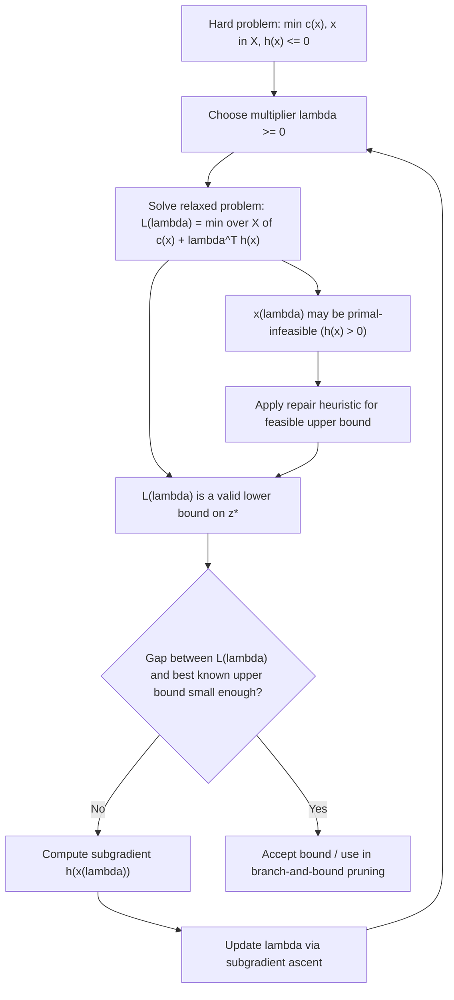

## Lagrangian Relaxation for Hard Problems

### Overview

Lagrangian relaxation is a technique for producing tractable bounds and near-optimal solutions to hard (often combinatorial or nonconvex) optimization problems by moving complicating constraints into the objective, penalized by multipliers. Rather than treating duality purely as a theoretical device, Lagrangian relaxation treats it as an algorithmic strategy: solve a sequence of easier relaxed problems, and use the resulting bound to either certify near-optimality or drive a decomposition scheme like branch-and-bound.

### Motivation: Why Relax?

Many discrete and large-scale optimization problems have a structure where most constraints are "easy" (e.g., they decompose into independent subproblems) but a small subset of "complicating" constraints couples everything together. Examples include:

- Integer programs where relaxing a coupling constraint leaves independent knapsack subproblems.
- Traveling salesman formulations where relaxing the degree constraints leaves a minimum spanning tree problem (the 1-tree relaxation).
- Multi-commodity network flow, where relaxing capacity-sharing constraints leaves independent shortest-path problems per commodity.

**Key Points**

- The goal is not to solve the relaxed problem exactly in place of the original — it's to obtain a bound (for minimization, a lower bound) that is tight enough to be useful.
- The relaxed problem must be significantly easier to solve than the original, or the technique provides no computational benefit.
- The quality of the bound depends on how the multipliers are chosen, which becomes its own optimization problem (the Lagrangian dual).

### General Formulation

Consider the (possibly nonconvex or integer) problem:

$$z^* = \min_{x \in X} \ c(x) \quad \text{s.t.} \quad h(x) \leq 0$$

where $X$ is some, possibly discrete, feasible set (e.g., $X = \{0,1\}^n$) and $h(x) \leq 0$ represents the complicating constraints. The set $X$ itself may encode "easy" constraints that remain in the relaxed subproblem.

The Lagrangian relaxation, for multiplier $\lambda \geq 0$, is:

$$L(\lambda) = \min_{x \in X} \ \left\{ c(x) + \lambda^T h(x) \right\}$$

**[Confirmed]** For any $\lambda \geq 0$, $L(\lambda) \leq z^*$. This is weak duality applied directly to the relaxed problem.

**Derivation.** Let $x^*$ be optimal for the original problem, so $x^* \in X$ and $h(x^*) \leq 0$. Since $\lambda \geq 0$ and $h(x^*) \leq 0$, we have $\lambda^T h(x^*) \leq 0$. Therefore:

$$L(\lambda) \leq c(x^*) + \lambda^T h(x^*) \leq c(x^*) = z^*$$

The first inequality holds because $L(\lambda)$ minimizes over all of $X$, including $x^*$ specifically.

### The Lagrangian Dual Problem

Since every $\lambda \geq 0$ gives a valid lower bound, the best such bound is found by solving:

$$z_D^* = \max_{\lambda \geq 0} \ L(\lambda)$$

**[Confirmed]** $L(\lambda)$ is a concave function of $\lambda$, regardless of the convexity of $c$, $h$, or $X$, because it is a pointwise infimum of affine functions of $\lambda$ (one affine function per $x \in X$). This means the Lagrangian dual is always a concave maximization problem — tractable in principle even when the primal is combinatorially hard.

### The Duality Gap

**[Confirmed]** In general, $z_D^* \leq z^*$, but equality is not guaranteed when $X$ is nonconvex (e.g., discrete). This gap, $z^* - z_D^*$, is called the **duality gap** or **integrality gap** in combinatorial contexts.

**[Inference]** The size of the gap depends on the structure of the problem; it can be shown to relate to the difference between $\text{conv}(X)$ (the convex hull of the feasible set) and $X$ itself. Specifically, the Lagrangian dual value equals the optimal value of the problem obtained by replacing $X$ with its convex hull:

$$z_D^* = \min_{x \in \text{conv}(X)} \ \left\{ c(x) : h(x) \leq 0 \right\}$$

**[Confirmed]** This is a standard structural result (sometimes attributed to Geoffrion) precisely characterizing when Lagrangian relaxation gives a gap-free bound: the gap vanishes exactly when the convex hull relaxation coincides with the true problem restricted to $h(x) \le 0$, which happens automatically for linear programs but not, in general, for integer programs.

### Worked Example: The Assignment-Constrained Knapsack

Consider a generalized assignment-type problem:

$$\min \sum_{i,j} c_{ij} x_{ij} \quad \text{s.t.} \quad \sum_j x_{ij} = 1 \ \forall i, \quad \sum_i a_{ij} x_{ij} \leq b_j \ \forall j, \quad x_{ij} \in \{0,1\}$$

The assignment constraints ($\sum_j x_{ij} = 1$) are easy — they decompose per $i$. The knapsack capacity constraints ($\sum_i a_{ij} x_{ij} \leq b_j$) couple items across $j$, making the whole problem hard.

**Relaxing the capacity constraints** with multipliers $\mu_j \geq 0$:

$$L(\mu) = \min_{x \in \{0,1\}^n,\ \sum_j x_{ij}=1} \ \sum_{i,j} \left( c_{ij} + \mu_j a_{ij} \right) x_{ij} - \sum_j \mu_j b_j$$

**Output**

For fixed $\mu$, this decomposes into $n$ independent problems (one per $i$): assign each item $i$ to the single $j$ that minimizes $c_{ij} + \mu_j a_{ij}$. Each subproblem is solved by simple enumeration over $j$, making $L(\mu)$ trivial to evaluate for any given $\mu$. The hard part shifts entirely to finding the best $\mu$.

**[Confirmed]** This decomposition is the central practical payoff of Lagrangian relaxation: the hard coupled problem becomes many easy independent subproblems, at the cost of having to search over multiplier space.

### Solving the Dual: Subgradient Methods

Since $L(\lambda)$ is concave but generally nondifferentiable (it is a pointwise min over a finite or discrete set of affine functions in $\lambda$, so it is piecewise linear with kinks), the dual problem is typically solved using subgradient ascent rather than gradient-based methods.

**[Confirmed]** For a fixed $\lambda$, let $x(\lambda) \in \arg\min_{x \in X} \{c(x) + \lambda^T h(x)\}$. Then $h(x(\lambda))$ is a subgradient of $L$ at $\lambda$:

$$h(x(\lambda)) \in \partial L(\lambda)$$

**Derivation.** For any $\lambda'$:

$$L(\lambda') = \min_{x \in X}\{c(x) + \lambda'^Th(x)\} \leq c(x(\lambda)) + \lambda'^Th(x(\lambda))$$

$$= \left[c(x(\lambda)) + \lambda^Th(x(\lambda))\right] + (\lambda' - \lambda)^Th(x(\lambda)) = L(\lambda) + (\lambda'-\lambda)^Th(x(\lambda))$$

This is exactly the subgradient inequality $L(\lambda') \leq L(\lambda) + (\lambda'-\lambda)^Tg$ with $g = h(x(\lambda))$, confirming $h(x(\lambda))$ is a valid subgradient.

**The subgradient update:**

$$\lambda^{(k+1)} = \left[ \lambda^{(k)} + \theta_k \, h(x(\lambda^{(k)})) \right]^+$$

where $[\cdot]^+$ denotes projection onto $\lambda \geq 0$ (componentwise max with zero) and $\theta_k > 0$ is a step size.

**[Inference]** A commonly used step-size rule in practice is:

$$\theta_k = \alpha_k \frac{z_{UB} - L(\lambda^{(k)})}{\|h(x(\lambda^{(k)}))\|^2}$$

where $z_{UB}$ is a known upper bound (e.g., from a heuristic feasible solution) and $\alpha_k \in (0, 2)$ is typically decreased over iterations (e.g., halved whenever the bound fails to improve for a fixed number of iterations). This rule is widely used in the operations research literature but is a heuristic choice rather than a uniquely prescribed one — convergence guarantees for subgradient methods generally require $\theta_k \to 0$ with $\sum \theta_k = \infty$, and this particular rule needs to be tuned to satisfy that in practice.

### Diagram: Relaxation and Bounding Workflow

### Using the Bound: Branch-and-Bound Integration

**[Confirmed]** In integer programming, Lagrangian relaxation bounds are frequently embedded inside a branch-and-bound search as an alternative to LP relaxation bounds, particularly when:

- The LP relaxation bound is weak or slow to compute at each node.
- The Lagrangian relaxation exploits special structure (e.g., network flow, matching) not visible after simply dropping integrality.

At each branch-and-bound node, the Lagrangian bound $L(\lambda)$ (optimized over $\lambda$, or approximated via a few subgradient iterations) is used to prune the node if $L(\lambda) \geq z_{UB}$ for a minimization problem, since no feasible solution in that subtree can beat the current best.

**[Inference]** In practice, running the subgradient method to full convergence at every node is often too expensive, so implementations commonly warm-start $\lambda$ from the parent node and run only a limited number of subgradient steps per node, trading bound tightness for speed. The exact trade-off is implementation-specific and depends on problem size and time budget.

### Recovering Primal Feasibility

A persistent practical issue: the minimizer $x(\lambda^*)$ of the Lagrangian subproblem is often **not feasible** for the original problem, because relaxation only guarantees $h(x) \leq 0$ is penalized, not enforced. Two common remedies:

1. **Lagrangian heuristics**: use $x(\lambda^*)$ as a starting point and apply problem-specific repair/rounding heuristics to restore feasibility, accepting some loss of optimality.
2. **Branch-and-bound with Lagrangian bounding**: rather than repairing a single solution, use the bound purely for pruning while the branching process itself eventually produces feasible integer solutions.

**[Inference]** When the duality gap is small (which can sometimes be checked empirically by comparing $z_D^*$ against a strong feasible heuristic solution), the relaxed solution tends to be "close" to feasible, and lightweight repair heuristics tend to perform well. This is problem-dependent and not a guaranteed property.

### Strengthening the Relaxation

Several techniques exist to reduce the duality gap without abandoning the decomposition structure:

- **Lagrangian decomposition (variable splitting)**: introduce a copy $x'$ of $x$, replace $h(x) \le 0$-coupling with a consistency constraint $x = x'$, and relax the consistency constraint instead. This can tighten the bound relative to relaxing $h(x) \leq 0$ directly, at the cost of a larger dual variable space.
- **Adding valid inequalities to $X$** before relaxing, so that $\text{conv}(X)$ used implicitly by the dual is closer to the true integer hull — this connects directly to cutting-plane methods.
- **Surrogate relaxation**: combine multiple complicating constraints into a single weighted constraint before relaxing, which can, in some problem classes, produce a different (sometimes tighter) bound than standard Lagrangian relaxation, though the relationship between the two bounds is problem-dependent rather than uniformly one-directional.

### Comparison: Lagrangian vs. LP Relaxation Bounds

| Aspect | LP Relaxation | Lagrangian Relaxation |
| --- | --- | --- |
| What's relaxed | Integrality constraints ($x \in \{0,1\}^n \to x \in [0,1]^n$) | Selected complicating constraints (multiplier-penalized) |
| Bound tightness | Fixed once formulation is chosen | Tunable via multiplier optimization; can match or exceed LP bound |
| Ease of solving relaxed problem | Requires an LP solver | Often decomposes into simple independent subproblems |
| Relationship | — | **[Confirmed]** $z_D^* \geq z_{LP}^*$ always, when $X$ already includes the integrality constraints being dropped in the LP relaxation and the same constraints are relaxed in both approaches |
| Typical use | General-purpose, solver-supported | Structure-exploiting, custom-implemented |

**[Inference]** The inequality $z_D^* \geq z_{LP}^*$ holds under the common setup where the Lagrangian relaxation keeps integrality in $X$ and only relaxes the linear coupling constraints; the two bounds can coincide exactly when the constraints being relaxed are themselves linear and $X$'s convex hull equals its LP relaxation polytope restricted to those constraints, which happens in totally unimodular cases, among others.

### Conclusion

Lagrangian relaxation converts a hard, coupled optimization problem into a family of easy decomposed subproblems, parameterized by multipliers, that always yield valid bounds via weak duality. Because the resulting dual function is concave regardless of the primal's convexity, it can be optimized systematically with subgradient methods even when the original problem is combinatorial. The technique's core trade-off is between bound tightness (often at least as good as, and sometimes better than, LP relaxation) and the need for problem-specific decomposition structure and feasibility-repair mechanisms, making it most valuable for large-scale structured integer and combinatorial problems rather than as a general-purpose black-box method.

**Related Topics**

- Subgradient methods and convergence rates for nonsmooth concave maximization
- Branch-and-bound and cutting-plane integration with relaxation bounds
- Lagrangian decomposition and variable splitting
- Column generation and Dantzig-Wolfe decomposition (a related dual-based decomposition)
- Totally unimodular matrices and integrality of LP relaxations
- Surrogate relaxation and composite Lagrangian bounds
- Bundle methods as a more stable alternative to subgradient ascent