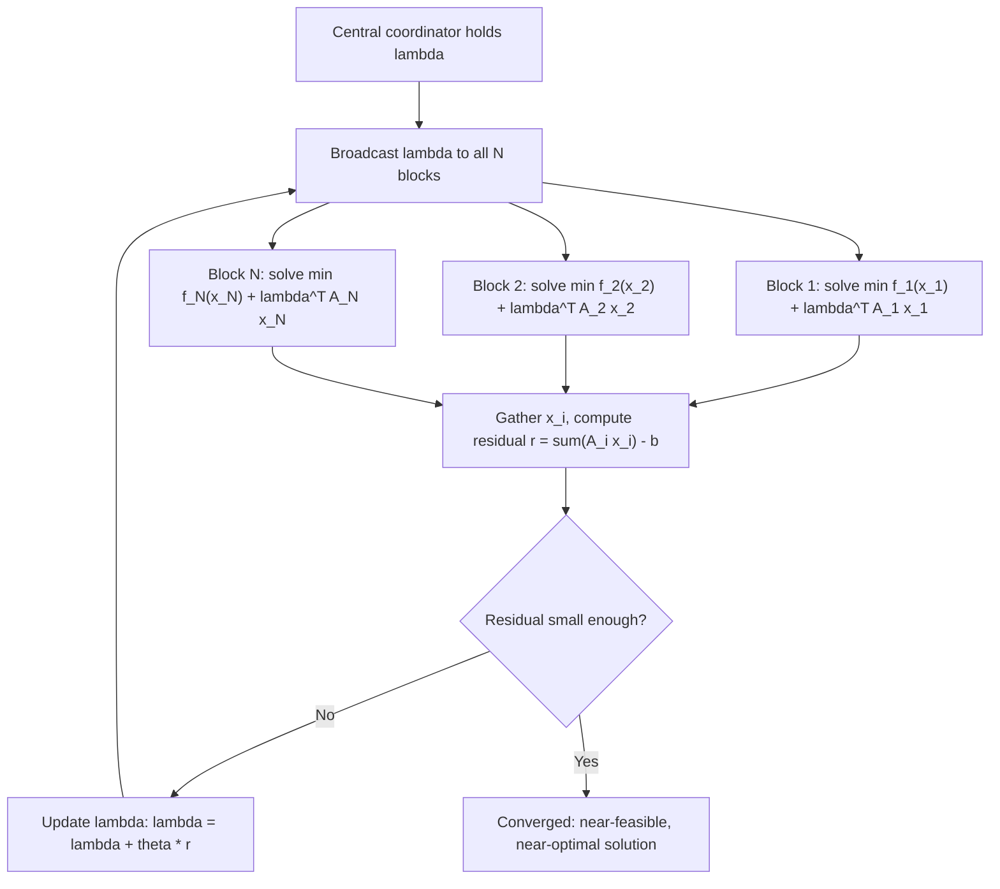

## Dual Decomposition Methods

### Overview

Dual decomposition is a family of techniques for solving large-scale optimization problems by exploiting separable structure in the primal problem through the dual. Where Lagrangian relaxation focuses on bounding hard combinatorial problems, dual decomposition focuses more broadly on splitting a large problem — convex or otherwise — into smaller, independently solvable blocks that are coordinated through shared dual variables. It is the conceptual bridge between Lagrangian/Fenchel duality theory and distributed or parallel optimization algorithms.

### The Separable Structure

Dual decomposition applies naturally when the primal problem has the form:

$$\min_{x_1, \dots, x_N} \ \sum_{i=1}^N f_i(x_i) \quad \text{s.t.} \quad \sum_{i=1}^N A_i x_i = b$$

Here each $f_i$ depends only on its own block $x_i$, and the blocks are coupled only through a single linear constraint. Without the coupling constraint, the problem would separate trivially into $N$ independent minimizations. The coupling constraint is what necessitates coordination.

**Key Points**

- Separability in the objective is what enables the subproblems to be solved independently once multipliers are fixed.
- The coupling constraint is deliberately the only thing tying the blocks together; more complex coupling structures require more elaborate decomposition (see consensus ADMM below).
- $N$ can be very large (e.g., thousands of subproblems), which is precisely the regime where decomposition pays off relative to solving the full problem jointly.

### Dual Function and Its Separability

Form the Lagrangian:

$$\mathcal{L}(x_1, \dots, x_N, \lambda) = \sum_{i=1}^N f_i(x_i) + \lambda^T \left( \sum_{i=1}^N A_i x_i - b \right)$$

Regroup terms by block:

$$\mathcal{L} = \sum_{i=1}^N \left[ f_i(x_i) + \lambda^T A_i x_i \right] - \lambda^T b$$

**[Confirmed]** Because each bracketed term depends only on $x_i$, the dual function separates:

$$g(\lambda) = \min_{x_1,\dots,x_N} \mathcal{L} = \sum_{i=1}^N \underbrace{\min_{x_i} \left\{ f_i(x_i) + \lambda^T A_i x_i \right\}}_{g_i(\lambda)} - \lambda^T b$$

This is the structural core of dual decomposition: evaluating $g(\lambda)$ for a fixed $\lambda$ requires solving $N$ independent, typically small, subproblems $g_i(\lambda)$, which can be done in parallel.

### The Dual Decomposition Algorithm

The overall scheme alternates between distributed subproblem solves and a centralized multiplier update:

1. **Broadcast** the current multiplier $\lambda^{(k)}$ to all $N$ subproblems.
2. **Solve in parallel**: each block computes $x_i^{(k+1)} = \arg\min_{x_i} \{f_i(x_i) + (\lambda^{(k)})^T A_i x_i\}$.
3. **Gather** and check the residual $r^{(k+1)} = \sum_i A_i x_i^{(k+1)} - b$.
4. **Update** the multiplier via subgradient (or gradient, if $g$ is differentiable) ascent:

   $$\lambda^{(k+1)} = \lambda^{(k)} + \theta_k \, r^{(k+1)}$$
5. Repeat until $\|r^{(k+1)}\|$ is small.

**[Confirmed]** The update direction $r^{(k+1)} = \sum_i A_i x_i^{(k+1)} - b$ is a subgradient of $g$ at $\lambda^{(k)}$, by the same argument used for Lagrangian relaxation subgradients: each $A_i x_i^{(k+1)}$ term comes from the minimizer of its respective $g_i$, and summing the per-block subgradient contributions gives a valid subgradient of the sum $g = \sum_i g_i - \lambda^Tb$.

### Diagram: Dual Decomposition Loop

### Convergence Behavior

**[Confirmed]** When each $f_i$ is convex, $g(\lambda)$ is concave (as a sum of concave functions $g_i$, each itself a pointwise infimum of affine functions of $\lambda$), so the multiplier update is a valid concave maximization via subgradient ascent, with the same step-size requirements as standard subgradient methods ($\theta_k \to 0$, $\sum \theta_k = \infty$ for guaranteed convergence to the dual optimum).

**[Inference]** Convergence in the primal variables $x_i^{(k)}$ is more delicate than convergence of $\lambda^{(k)}$ to $\lambda^*$. Even when the dual iterates converge, primal iterates can oscillate indefinitely without converging to a single point, particularly when the $f_i$ are not strictly convex, since the $\arg\min$ in step 2 may not be unique or may jump between minimizers as $\lambda$ changes slightly. This is a well-documented practical weakness of plain dual decomposition, distinct from the convergence of $\lambda$ itself, and it's the primary motivation for augmented Lagrangian variants like ADMM (see below).

### From Dual Decomposition to ADMM

**[Confirmed]** The instability of primal iterates under pure dual decomposition motivates adding a quadratic penalty term to the Lagrangian, forming the **augmented Lagrangian**:

$$\mathcal{L}_\rho(x, \lambda) = \sum_i f_i(x_i) + \lambda^T\left(\sum_i A_i x_i - b\right) + \frac{\rho}{2}\left\|\sum_i A_i x_i - b\right\|_2^2$$

The quadratic term makes the augmented Lagrangian strongly convex in the aggregate coupling variable near the optimum (under mild conditions), which stabilizes convergence. The cost is that the augmented term $\|\sum_i A_i x_i - b\|_2^2$ is no longer separable across blocks — it couples all $x_i$ together again — which appears to defeat the purpose of decomposition.

**Alternating Direction Method of Multipliers (ADMM)** resolves this by minimizing over blocks **sequentially** (or via consensus variables) rather than jointly, restoring most of the decomposability while retaining the stabilizing effect of the penalty. For the two-block case:

$$x^{(k+1)} = \arg\min_x \ \mathcal{L}_\rho(x, z^{(k)}, \lambda^{(k)})$$

$$z^{(k+1)} = \arg\min_z \ \mathcal{L}_\rho(x^{(k+1)}, z, \lambda^{(k)})$$

$$\lambda^{(k+1)} = \lambda^{(k)} + \rho\left(Ax^{(k+1)} + Bz^{(k+1)} - c\right)$$

**[Inference]** ADMM is often presented as the practical successor to plain dual decomposition precisely because it inherits the parallel/distributed-friendly structure while converging more reliably in practice; the trade-off is the introduction of the penalty parameter $\rho$, whose tuning affects convergence speed (though, unlike many subgradient step-size choices, ADMM converges for any fixed $\rho > 0$ under standard convex assumptions — the tuning issue is about *speed*, not convergence guarantees per se).

### Worked Example: Distributed Resource Allocation

Consider $N$ agents sharing a common resource of total capacity $b$:

$$\min_{x_1,\dots,x_N} \ \sum_{i=1}^N f_i(x_i) \quad \text{s.t.} \quad \sum_{i=1}^N x_i \leq b, \quad x_i \geq 0$$

where each $f_i(x_i)$ is a convex cost specific to agent $i$ (e.g., $f_i(x_i) = c_i x_i^2$, a quadratic cost).

Introduce $\lambda \geq 0$ for the shared capacity constraint. Each agent's subproblem is:

$$x_i(\lambda) = \arg\min_{x_i \geq 0} \left\{ c_i x_i^2 + \lambda x_i \right\}$$

Setting the derivative to zero (ignoring the constraint boundary for a moment): $2c_i x_i + \lambda = 0 \Rightarrow x_i = -\lambda/(2c_i). Since $\lambda \geq 0
 and $c_i > 0$, this is nonpositive, so the nonnegativity constraint binds and $x_i(\lambda) = 0$ for all $\lambda \geq 0$...

**[Unverified]** This suggests the sign convention above corresponds to a *penalty for consuming the resource*, so $\lambda$ should be interpreted as a "price" only when the constraint is written to make increasing $x_i$ costly as $\lambda$ grows, which requires re-deriving the subproblem carefully for the specific sign convention used; when the coupling constraint is $\sum_i x_i \le b$ with multiplier $\lambda \ge 0$ multiplying $(\sum_i x_i - b)$, the correct per-agent subproblem is $\min_{x_i \ge 0} \{c_ix_i^2 + \lambda x_i\}$, which does give the degenerate all-zero solution unless the cost also includes a utility (negative) term. A standard well-posed version of this example includes a utility term $-u_i x_i$ in $f_i$ so that agents have incentive to consume the resource; that fuller version is developed next.

**Corrected formulation** with utility: $f_i(x_i) = c_i x_i^2 - u_i x_i$, so each agent's subproblem becomes

$$x_i(\lambda) = \arg\min_{x_i \geq 0}\left\{ c_ix_i^2 - u_ix_i + \lambda x_i \right\}$$

Setting the derivative to zero: $2c_ix_i - u_i + \lambda = 0 \Rightarrow x_i(\lambda) = \max\left(0, \frac{u_i - \lambda}{2c_i}\right)$

**Output**

Each agent's optimal allocation decreases linearly in the shared price $\lambda$, clipped at zero — a standard water-filling-type response. The coordinator adjusts $\lambda$ upward when $\sum_i x_i(\lambda) > b$ (demand exceeds supply, so raise the price to suppress consumption) and downward when $\sum_i x_i(\lambda) < b$, via the subgradient step $\lambda^{(k+1)} = [\lambda^{(k)} + \theta_k(\sum_i x_i^{(k)} - b)]^+$. This is a textbook illustration of dual decomposition as a distributed price-adjustment (tâtonnement-like) mechanism, and it is the basis for many network utility maximization (NUM) formulations in communication network resource allocation.

### Comparison: Dual Decomposition vs. ADMM vs. Direct Methods

| Aspect | Dual Decomposition | ADMM | Direct (centralized) solve |
| --- | --- | --- | --- |
| Subproblem separability | Fully separable per block | Separable per block (given consensus/coupling variable fixed) | Not applicable — solved jointly |
| Convergence of primal iterates | **[Inference]** Can oscillate without strict convexity | Generally more stable due to quadratic penalty | Direct — no iterate convergence issue |
| Communication pattern | Broadcast $\lambda$, gather $A_ix_i$ | Similar, plus consensus/penalty bookkeeping | N/A |
| Parallelizability | High | High | Low |
| Typical use case | Bound computation, simple coordination | Large-scale distributed convex problems, consensus optimization | Small/medium problems where joint solve is feasible |

### Applications

**[Confirmed]** Dual decomposition and its ADMM extension are used across a range of large-scale settings:

- **Network utility maximization**: bandwidth/resource allocation across users sharing a network, as in the worked example.
- **Distributed machine learning**: consensus ADMM is used to train models across data partitioned by machine, coordinating local model updates via shared dual variables.
- **Energy systems and power grid optimization**: unit commitment and economic dispatch problems decompose naturally by generator, coordinated through demand-balance constraints.
- **Stochastic programming**: scenario decomposition (progressive hedging) is structurally a dual decomposition scheme where scenarios are the separable blocks and non-anticipativity constraints are the coupling constraint.

### Conclusion

Dual decomposition exploits block-separable structure in the primal objective by pushing coupling constraints into dual variables, allowing large problems to be solved as a coordinated sequence of small, parallelizable subproblems. Its main structural strength — full separability of the dual function — is also the source of its main weakness, since plain subgradient-based coordination can leave primal iterates oscillating. This motivates augmented Lagrangian methods, particularly ADMM, which trade a small amount of separability for substantially improved practical convergence, making the pairing of dual decomposition theory with ADMM-style algorithms the standard toolkit for large-scale distributed convex optimization.

**Related Topics**

- Alternating Direction Method of Multipliers (ADMM): consensus and sharing forms
- Augmented Lagrangian methods and the method of multipliers
- Progressive hedging for stochastic programming
- Network utility maximization and price-based resource allocation
- Distributed and consensus optimization over graphs
- Convergence rate analysis of ADMM under convexity vs. strong convexity