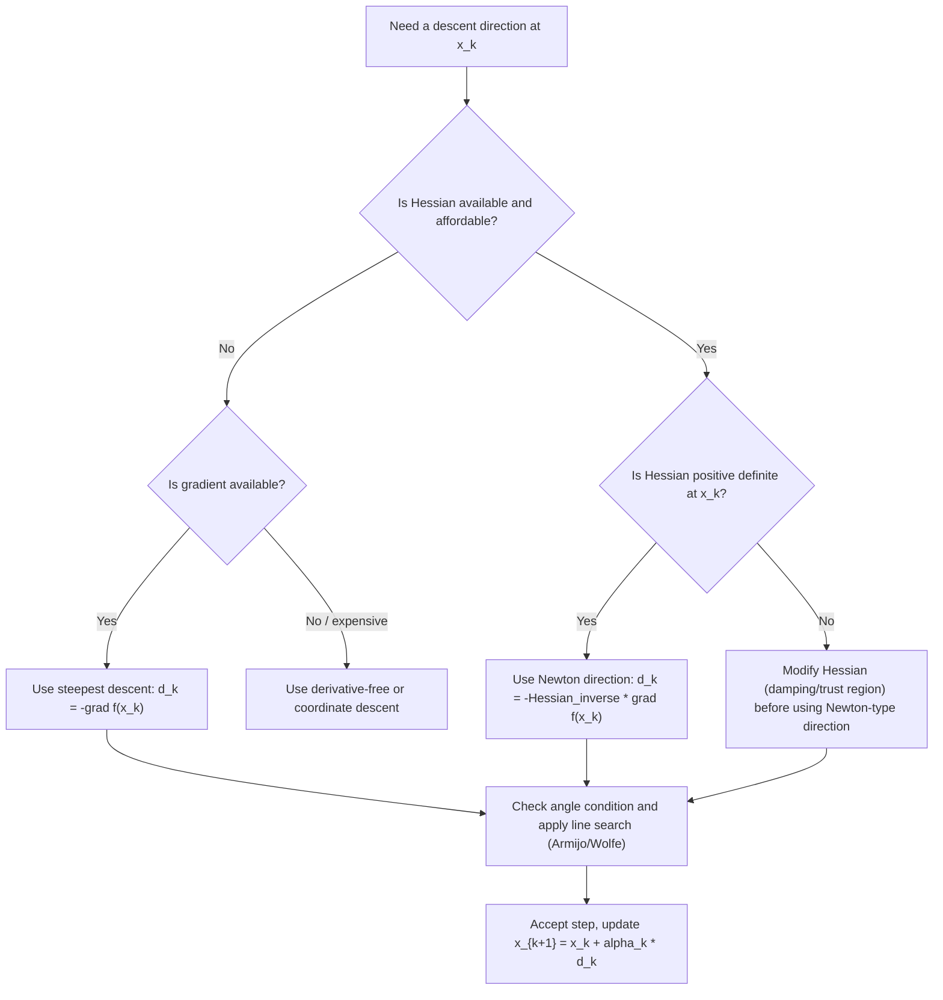

## Descent Direction Concepts

### Overview

A descent direction is a vector along which, starting from a given point, moving a sufficiently small positive step strictly decreases the objective function. This concept underlies essentially every iterative algorithm for unconstrained (and many constrained) optimization problems: gradient descent, Newton's method, quasi-Newton methods, and conjugate gradient methods are all, at their core, strategies for choosing a good descent direction at each iteration and then a suitable step length along it.

### Formal Definition

**[Confirmed]** A vector $d \in \mathbb{R}^n$ is a **descent direction** for a differentiable function $f$ at a point $x$ if there exists some $\bar\alpha > 0$ such that:

$$f(x + \alpha d) < f(x) \quad \text{for all } \alpha \in (0, \bar\alpha]$$

**[Confirmed]** For differentiable $f$, a sufficient (and, generically, necessary-in-the-limit) first-order condition for $d$ to be a descent direction is:

$$\nabla f(x)^T d < 0$$

**Derivation.** By Taylor's theorem, for small $\alpha > 0$:

$$f(x + \alpha d) = f(x) + \alpha \nabla f(x)^T d + o(\alpha)$$

If $\nabla f(x)^T d < 0$, then for sufficiently small $\alpha$, the linear term $\alpha \nabla f(x)^T d$ dominates the $o(\alpha)$ remainder, so $f(x+\alpha d) - f(x) < 0$. This confirms $d$ is a descent direction. The condition is not strictly necessary in general (there exist directions with $\nabla f(x)^Td = 0$ that can still be "descent" in a weaker, higher-order sense at degenerate points), but $\nabla f(x)^Td < 0$ is the standard, generically necessary and sufficient, working criterion used throughout descent-method design.

### Geometric Interpretation

$\nabla f(x)^T d < 0$ states that $d$ makes an obtuse angle with the gradient, i.e., $d$ points into the half-space where $f$ locally decreases. Since $\nabla f(x)$ points in the direction of steepest **increase**, any direction within 90° of $-\nabla f(x)$ (strictly less than 90° from $-\nabla f(x)$) is a valid descent direction.

**Key Points**

- The set of all descent directions at a non-stationary point $x$ (where $\nabla f(x) \neq 0$) forms an open half-space: $\{d : \nabla f(x)^Td < 0\}$.
- At a stationary point ($\nabla f(x) = 0$), no direction satisfies $\nabla f(x)^Td < 0$ strictly — first-order information alone cannot certify a descent direction, and second-order information (the Hessian) is needed to determine whether $x$ is a minimum, maximum, or saddle.
- The steepest descent direction, $d = -\nabla f(x)$, is the specific descent direction that maximizes the instantaneous rate of decrease $\nabla f(x)^Td$ subject to $\|d\|_2 = 1$ (by Cauchy-Schwarz, this is uniquely $-\nabla f(x)/\|\nabla f(x)\|_2$).

### Diagram: Descent Direction Cone

<svg xmlns="http://www.w3.org/2000/svg" viewBox="0 0 500 420">
\<style\>
.lbl { font-family: sans-serif; font-size: 13px; fill: #1a1a1a; }
.lbl-sm { font-family: sans-serif; font-size: 11px; fill: #444; }
.title { font-family: sans-serif; font-size: 15px; font-weight: bold; fill: #1a1a1a; }
\</style\>
<text x="250" y="26" text-anchor="middle" class="title">Descent Direction Half-Space at x (svg_diagram)</text>

<ellipse cx="250" cy="230" rx="180" ry="110" fill="none" stroke="#ccc" stroke-width="1" />
<ellipse cx="250" cy="230" rx="130" ry="78" fill="none" stroke="#ccc" stroke-width="1" />
<ellipse cx="250" cy="230" rx="80" ry="48" fill="none" stroke="#ccc" stroke-width="1" />
<circle cx="250" cy="230" r="3" fill="#333" />
<text x="260" y="225" class="lbl-sm">minimizer</text>

<circle cx="390" cy="180" r="5" fill="#1a1a1a" />
<text x="398" y="175" class="lbl">x</text>

<line x1="390" y1="180" x2="450" y2="140" stroke="#a53b3b" stroke-width="2.5" marker-end="url(#arrowR)" />
<text x="455" y="135" class="lbl-sm" fill="#a53b3b">grad f(x)</text>

<line x1="390" y1="180" x2="330" y2="220" stroke="#2e7d32" stroke-width="2.5" marker-end="url(#arrowG)" />
<text x="270" y="235" class="lbl-sm" fill="#2e7d32">-grad f(x)</text>
<text x="255" y="250" class="lbl-sm" fill="#2e7d32">(steepest descent)</text>

<line x1="440" y1="240" x2="340" y2="120" stroke="#3b6ea5" stroke-width="1.5" stroke-dasharray="4,3" />
<text x="425" y="255" class="lbl-sm" fill="#3b6ea5">boundary: grad f(x)^T d = 0</text>

<path d="M 390 180 L 330 220 L 300 260 L 280 300" fill="none" stroke="#2e7d32" stroke-width="1" stroke-dasharray="2,2" />
<text x="240" y="310" class="lbl-sm">descent half-space: {d : grad f(x)^T d less than 0}</text>
</svg>

### Descent Direction Families by Method

Different optimization algorithms correspond to different choices of descent direction $d_k$ at each iterate $x_k$:

| Method | Descent direction $d_k$ | Notes |
| --- | --- | --- |
| Gradient (steepest) descent | $d_k = -\nabla f(x_k)$ | Simplest choice; ignores curvature |
| Newton's method | $d_k = -[\nabla^2 f(x_k)]^{-1} \nabla f(x_k)$ | Requires $\nabla^2 f(x_k) \succ 0$ for guaranteed descent |
| Quasi-Newton (e.g., BFGS) | $d_k = -B_k^{-1} \nabla f(x_k)$ | $B_k$ approximates the Hessian, updated iteratively |
| Conjugate gradient | $d_k = -\nabla f(x_k) + \beta_k d_{k-1}$ | Combines gradient with previous direction |
| Coordinate descent | $d_k = -\partial f(x_k)/\partial x_i \cdot e_i$ | Restricts descent to a single coordinate axis |

### Newton Direction: When Is It a Descent Direction?

**[Confirmed]** The Newton direction $d_k = -[\nabla^2f(x_k)]^{-1}\nabla f(x_k)$ satisfies the descent condition if and only if the Hessian $\nabla^2 f(x_k)$ is positive definite at $x_k$.

**Derivation.** Compute $\nabla f(x_k)^Td_k$:

$$\nabla f(x_k)^T d_k = -\nabla f(x_k)^T [\nabla^2f(x_k)]^{-1} \nabla f(x_k)$$

If $\nabla^2f(x_k) \succ 0$, then $[\nabla^2f(x_k)]^{-1} \succ 0$ as well (the inverse of a symmetric positive definite matrix is symmetric positive definite), so the quadratic form $\nabla f(x_k)^T[\nabla^2f(x_k)]^{-1}\nabla f(x_k) > 0$ whenever $\nabla f(x_k) \neq 0$. This makes the full expression strictly negative, confirming descent.

**[Confirmed]** When $\nabla^2f(x_k)$ is indefinite or negative definite (as can happen near saddle points or local maxima), the plain Newton direction is not guaranteed to be a descent direction, and can even be an ascent direction. This is a well-known failure mode of unmodified Newton's method away from regions of local convexity, and it motivates modifications such as adding a multiple of the identity to the Hessian (Levenberg-Marquardt-style damping) or using trust-region approaches instead of a pure line search.

### Angle Condition and the Zoutendijk Framework

**[Confirmed]** For convergence guarantees, many descent methods require not just $\nabla f(x_k)^Td_k < 0$, but a **uniform angle condition**: there exists $\epsilon > 0$, independent of $k$, such that

$$\cos\theta_k = \frac{-\nabla f(x_k)^Td_k}{\|\nabla f(x_k)\|\,\|d_k\|} \geq \epsilon > 0 \quad \text{for all } k$$

**[Inference]** This condition prevents the direction from becoming asymptotically orthogonal to $-\nabla f(x_k)$, which would allow the method to satisfy $\nabla f(x_k)^Td_k < 0$ technically while making negligible progress. Combined with a step-size rule satisfying the Wolfe or Armijo conditions, this angle condition underlies the Zoutendijk theorem, which gives global convergence guarantees ($\nabla f(x_k) \to 0$) for a broad class of descent methods, provided $f$ is bounded below and has Lipschitz-continuous gradient.

**[Confirmed]** The steepest descent direction always achieves $\cos\theta_k = 1$ exactly, since $d_k = -\nabla f(x_k)$ is exactly antiparallel to the gradient. Quasi-Newton and Newton directions can have $\cos\theta_k$ bounded away from zero under standard regularity assumptions (e.g., bounded condition number of $B_k$ or $\nabla^2f(x_k)$), but this needs to be verified or enforced (e.g., via Hessian modification) rather than assumed automatically.

### Sufficient Decrease and Step-Length Selection

Having a descent direction alone does not guarantee good algorithmic progress — the step length $\alpha_k$ along $d_k$ must also be chosen carefully. The most common criterion is the **Armijo (sufficient decrease) condition**:

$$f(x_k + \alpha_k d_k) \leq f(x_k) + c_1 \alpha_k \nabla f(x_k)^Td_k, \quad c_1 \in (0, 1)$$

**[Confirmed]** Since $\nabla f(x_k)^Td_k < 0$ by the descent property, the right-hand side is strictly less than $f(x_k)$ for any $\alpha_k > 0$, so this condition enforces a decrease at least proportional to $\alpha_k$ and the directional derivative — ruling out steps that decrease $f$ by only a negligible amount relative to the step taken.

**[Inference]** The Armijo condition alone permits arbitrarily small step sizes to trivially satisfy it, so it is typically paired with a curvature condition (forming the **Wolfe conditions**) or a simple backtracking procedure that starts from a large trial step and shrinks it until sufficient decrease holds, ensuring steps are not needlessly small in practice.

### Worked Example: Comparing Directions at a Point

Let $f(x_1, x_2) = x_1^2 + 10x_2^2$, and consider the point $x = (1, 1)$.

**Gradient:** $\nabla f(x) = (2x_1, 20x_2) = (2, 20)$.

**Steepest descent direction:** $d_{SD} = -(2, 20)$, normalized: $d_{SD}/\|d_{SD}\| = (-2,-20)/\sqrt{404} \approx (-0.0995, -0.995)$.

**Hessian:** $\nabla^2 f(x) = \begin{pmatrix} 2 & 0 \\ 0 & 20\end{pmatrix}$, which is positive definite (diagonal with positive entries), so the Newton direction is guaranteed descent here.

**Newton direction:** $d_N = -[\nabla^2f(x)]^{-1}\nabla f(x) = -\begin{pmatrix}1/2 & 0\\0&1/20\end{pmatrix}\begin{pmatrix}2\\20\end{pmatrix} = -(1, 1) = (-1,-1)$.

**Output**

- $\nabla f(x)^Td_{SD} = (2,20)\cdot(-2,-20) = -404$ (before normalization) — a large negative directional derivative, but this is misleading in isolation because $d_{SD}$ itself is a long vector.
- $\nabla f(x)^Td_N = (2,20)\cdot(-1,-1) = -22$.
- Despite the smaller raw directional derivative, the Newton direction $d_N = (-1,-1)$ points **exactly at the minimizer** $(0,0)$ in this quadratic example, because Newton's method is exact for quadratics: a single full Newton step ($\alpha=1$) reaches the minimizer directly, whereas steepest descent on this ill-conditioned quadratic (condition number $20/2=10$) exhibits the well-known zig-zagging behavior and requires many iterations to converge.

**[Confirmed]** This example illustrates a general principle: raw magnitude of the directional derivative $\nabla f(x)^Td$ is not, by itself, a reliable indicator of algorithmic efficiency — direction quality relative to the function's curvature matters more, which is exactly what second-order (Newton-type) directions incorporate and first-order (gradient) directions do not.

### Diagram: Method Selection Based on Descent Direction Properties

### Conclusion

Descent directions formalize the basic requirement that an iterative optimization step must locally decrease the objective, captured algebraically by the negative directional derivative condition $\nabla f(x)^Td < 0$. While this condition is easy to state, the practical differences between descent-direction choices — steepest descent, Newton, quasi-Newton, conjugate gradient — determine convergence speed far more than the mere fact of descent, since curvature information (or the lack of it) governs how efficiently the direction navigates the function's geometry. Robust algorithms combine a well-chosen descent direction with a step-length rule (Armijo/Wolfe conditions) and, for global convergence guarantees, a uniform angle condition relative to the steepest descent direction.

**Related Topics**

- Line search methods: exact vs. inexact (Armijo, Wolfe, Goldstein conditions)
- Newton's method and Hessian modification strategies (Levenberg-Marquardt, trust regions)
- Conjugate gradient method and direction update formulas (Fletcher-Reeves, Polak-Ribière)
- Quasi-Newton methods: BFGS, L-BFGS, and Hessian approximation updates
- Zoutendijk's theorem and global convergence of descent methods
- Condition number and its effect on steepest descent convergence rate