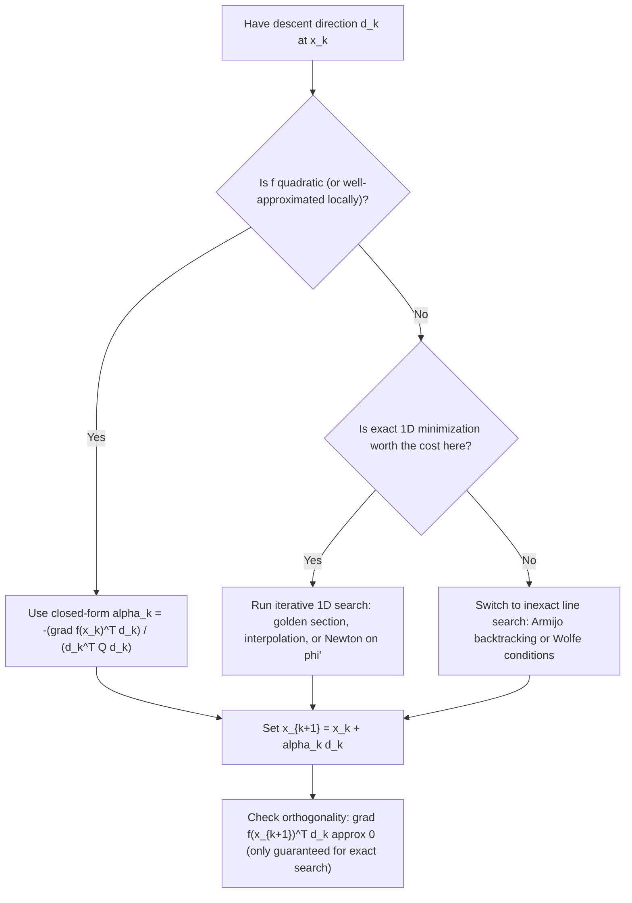

## Exact Line Search Techniques

### Overview

Given a descent direction $d_k$ at a point $x_k$, a line search determines the step length $\alpha_k > 0$ used to form the next iterate $x_{k+1} = x_k + \alpha_k d_k$. An **exact** line search chooses $\alpha_k$ to exactly minimize $f$ along the ray $x_k + \alpha d_k$, as opposed to inexact line searches (Armijo backtracking, Wolfe conditions) that accept any sufficiently good step. Exact line search is the idealized case: theoretically clean and useful for analysis, but often computationally wasteful in practice compared to inexact alternatives.

### Formal Definition

**[Confirmed]** Given $x_k$ and descent direction $d_k$, the exact line search step length is:

$$\alpha_k = \arg\min_{\alpha \geq 0} \ \phi(\alpha), \quad \text{where } \phi(\alpha) = f(x_k + \alpha d_k)$$

This reduces the $n$-dimensional problem of minimizing $f$ to a one-dimensional problem of minimizing $\phi$, a function of the single scalar $\alpha$.

**Key Points**

- $\phi(\alpha)$ is a restriction of $f$ to a single ray, so any structural property of $f$ (convexity, smoothness) is inherited by $\phi$ along that ray.
- $\phi'(0) = \nabla f(x_k)^Td_k < 0$ by the descent property, guaranteeing $\phi$ is initially decreasing at $\alpha = 0$.
- Exact line search requires either a closed-form solution for $\alpha_k$ (available for special structures like quadratics) or an iterative one-dimensional root-finding/minimization procedure.

### First-Order Optimality Along the Line

**[Confirmed]** At the exact minimizer $\alpha_k$ (assuming an interior minimizer and differentiability), the first-order condition is:

$$\phi'(\alpha_k) = \nabla f(x_k + \alpha_k d_k)^T d_k = \nabla f(x_{k+1})^T d_k = 0$$

**[Confirmed]** This has an important geometric consequence: **the gradient at the new iterate is orthogonal to the search direction just used**. This is a direct algebraic fact — it doesn't require any additional assumption beyond exact minimization along the line and differentiability at the minimizer.

**[Inference]** For steepest descent specifically, where $d_k = -\nabla f(x_k)$, this orthogonality condition implies $\nabla f(x_{k+1})^T\nabla f(x_k) = 0$, meaning consecutive steepest-descent gradients (under exact line search) are always orthogonal to each other. This is the well-known algebraic root of the "zig-zagging" behavior of steepest descent on ill-conditioned problems: each step turns exactly 90° relative to the previous gradient direction, which can produce a long sequence of short, oscillating steps on elongated (high-condition-number) contour sets.

### Exact Line Search for Quadratic Functions

For a quadratic $f(x) = \frac{1}{2}x^TQx - b^Tx$ with $Q \succ 0$ symmetric, exact line search has a closed-form solution — this is the primary case where exact line search is computationally cheap rather than requiring iterative search.

**Derivation.** Define $\phi(\alpha) = f(x_k + \alpha d_k)$. Expanding:

$$\phi(\alpha) = \frac{1}{2}(x_k+\alpha d_k)^TQ(x_k+\alpha d_k) - b^T(x_k+\alpha d_k)$$

$$= \frac{1}{2}x_k^TQx_k + \alpha\, d_k^TQx_k + \frac{\alpha^2}{2}d_k^TQd_k - b^Tx_k - \alpha b^Td_k$$

Collecting in powers of $\alpha$:

$$\phi(\alpha) = \left[\frac{1}{2}x_k^TQx_k - b^Tx_k\right] + \alpha\left[d_k^TQx_k - b^Td_k\right] + \frac{\alpha^2}{2}d_k^TQd_k$$

$$= f(x_k) + \alpha\, \nabla f(x_k)^Td_k + \frac{\alpha^2}{2}d_k^TQd_k$$

This is exactly quadratic in $\alpha$ (as expected, since $f$ itself is quadratic in $x$). Setting $\phi'(\alpha) = 0$:

$$\phi'(\alpha) = \nabla f(x_k)^Td_k + \alpha\, d_k^TQd_k = 0$$

$$\alpha_k = -\frac{\nabla f(x_k)^Td_k}{d_k^TQd_k}$$

**[Confirmed]** Since $Q \succ 0$, the denominator $d_k^TQd_k > 0$ for $d_k \neq 0$, so this critical point is a genuine minimum (as $\phi$ is a strictly convex quadratic in $\alpha$), and the formula is well-defined.

**Output**

$$\alpha_k = -\frac{\nabla f(x_k)^Td_k}{d_k^TQd_k}$$

This closed-form expression is exact — no iterative sub-search is needed — and it is the standard step length used in both exact-line-search steepest descent and the conjugate gradient method when applied to quadratic objectives.

### Worked Example: Steepest Descent on a Quadratic

Using $f(x_1,x_2) = x_1^2 + 10x_2^2$ (so $Q = \text{diag}(2,20)$, $b=0$) starting at $x_0 = (1,1)$, continuing the setup from descent direction concepts.

**Gradient at $x_0$:** $\nabla f(x_0) = (2,20)$. Steepest descent direction: $d_0 = -(2,20)$.

**Exact step length:**

$$d_0^TQd_0 = (-2,-20)\cdot\text{diag}(2,20)\cdot(-2,-20)^T = (-2)(2)(-2) + (-20)(20)(-20) = 8 + 8000 = 8008$$

$$\nabla f(x_0)^Td_0 = (2,20)\cdot(-2,-20) = -4 - 400 = -404$$

$$\alpha_0 = -\frac{-404}{8008} = \frac{404}{8008} = \frac{1}{19.821\ldots} \approx 0.05045$$

**New iterate:**

$$x_1 = x_0 + \alpha_0 d_0 = (1,1) + 0.05045\cdot(-2,-20) = (1 - 0.1009,\ 1 - 1.009) = (0.8991,\ -0.009)$$

**Verification of orthogonality:** $\nabla f(x_1) = (2 \times 0.8991,\ 20 \times (-0.009)) = (1.7982, -0.18)$.

$$\nabla f(x_1)^Td_0 = (1.7982, -0.18)\cdot(-2,-20) = -3.5964 + 3.6 \approx 0.004$$

**[Confirmed]** This is approximately zero (the small residual is rounding error from carrying limited decimal precision through the arithmetic), confirming the orthogonality condition $\nabla f(x_{k+1})^Td_k = 0$ predicted by the exact-line-search first-order condition.

**[Confirmed]** Note the large overshoot in the $x_2$ coordinate (from $1$ to $-0.009$, crossing near zero) relative to the modest progress in $x_1$ (from $1$ to $0.899) — this asymmetric progress across coordinates, driven by the disparity between the eigenvalues $2
 and $20$ of $Q$, is the concrete numerical manifestation of the zig-zagging behavior referenced earlier.

### Diagram: Exact Line Search Along a Ray

<svg xmlns="http://www.w3.org/2000/svg" viewBox="0 0 600 400">
\<style\>
.lbl { font-family: sans-serif; font-size: 13px; fill: #1a1a1a; }
.lbl-sm { font-family: sans-serif; font-size: 11px; fill: #444; }
.title { font-family: sans-serif; font-size: 15px; font-weight: bold; fill: #1a1a1a; }
.axis { stroke: #333; stroke-width: 1.5; }
.curve { stroke: #3b6ea5; stroke-width: 2.5; fill: none; }
\</style\>
<text x="300" y="26" text-anchor="middle" class="title">phi(alpha) = f(x_k + alpha*d_k) (svg_diagram)</text>
<line x1="60" y1="330" x2="560" y2="330" class="axis" />
<line x1="60" y1="330" x2="60" y2="60" class="axis" />
<text x="560" y="352" text-anchor="middle" class="lbl">alpha</text>
<text x="30" y="60" text-anchor="middle" class="lbl">phi</text>

<path d="M 90 300 Q 310 40 530 290" class="curve" />

<circle cx="310" cy="90" r="5" fill="#a53b3b" />
<line x1="310" y1="90" x2="310" y2="330" stroke="#a53b3b" stroke-width="1" stroke-dasharray="4,3" />
<text x="320" y="110" class="lbl">alpha_k (exact minimizer)</text>
<text x="300" y="345" class="lbl-sm" text-anchor="middle">alpha_k</text>

<line x1="90" y1="300" x2="160" y2="245" stroke="#2e7d32" stroke-width="2" />
<text x="100" y="270" class="lbl-sm" fill="#2e7d32">phi'(0) less than 0</text>

<line x1="250" y1="90" x2="370" y2="90" stroke="#333" stroke-width="1.5" stroke-dasharray="3,2" />
<text x="380" y="85" class="lbl-sm">phi'(alpha_k) = 0</text>
</svg>

### Beyond Quadratics: Iterative Exact (or Near-Exact) Line Search

**[Confirmed]** For general (non-quadratic) smooth $f$, no closed-form solution for $\alpha_k$ typically exists, and exact line search must be performed via one-dimensional numerical methods:

- **Golden section search**: a derivative-free bracketing method for unimodal $\phi$, iteratively narrowing the bracket using the golden ratio to minimize the number of function evaluations needed per interval reduction.
- **Fibonacci search**: closely related to golden section search, provably optimal (minimizes worst-case function evaluations) for a fixed number of evaluations on a unimodal function, though golden section search is more commonly implemented due to its simpler recursive structure.
- **Quadratic/cubic interpolation**: fit a low-order polynomial to sampled values of $\phi$ (and possibly $\phi'$) and take the interpolant's minimizer as an approximation, refining iteratively (this is often called a "safeguarded" interpolation search when combined with bracketing to guarantee robustness).
- **Newton's method on $\phi'$**: if $\phi'$ and $\phi''$ (i.e., directional derivative and its derivative) are available, apply Newton's method to find a root of $\phi'(\alpha) = 0$ directly.

**[Inference]** In practice, "exact" line search for non-quadratic functions is almost always implemented as an iterative procedure that only *approximates* the true minimizer to some numerical tolerance, since exact zero-tolerance convergence is neither achievable nor necessary; the term "exact line search" in this context conventionally refers to driving $\phi'(\alpha)$ close enough to zero that further refinement yields negligible benefit relative to its cost, rather than literal machine-precision exactness.

### Exact vs. Inexact Line Search: Trade-offs

| Aspect | Exact Line Search | Inexact Line Search (Armijo/Wolfe) |
| --- | --- | --- |
| Per-iteration cost | High — requires solving (or closely approximating) a 1D minimization | Low — typically a handful of function evaluations |
| Convergence guarantee | Strong locally, but overall iteration count can still be poor (e.g., zig-zagging) | Sufficient for global convergence under mild conditions (Zoutendijk's theorem) |
| Practical use | Rare in general nonlinear optimization; standard for quadratics (e.g., inside conjugate gradient) | Standard in most modern solvers (L-BFGS, nonlinear CG, trust-region methods) |
| Sensitivity to $f$'s structure | Requires favorable structure (quadratic, or cheap 1D sub-solves) to be efficient | Works well regardless of $f$'s structure, as long as gradients/values are computable |

**[Confirmed]** A key practical insight is that exact line search does **not** generally lead to faster overall convergence than a well-tuned inexact line search, and can be substantially more expensive per iteration; this is why nearly all modern general-purpose gradient-based solvers default to inexact (Armijo/Wolfe-based) line searches rather than exact ones, reserving exact line search primarily for special structured cases (quadratics, or as a theoretical baseline for convergence-rate analysis).

### Role in Convergence Analysis

**[Confirmed]** Despite its limited practical use for general nonlinear problems, exact line search remains a standard assumption in classical convergence-rate proofs (e.g., for steepest descent on strongly convex quadratics), because it removes the step-length choice as a free parameter and allows convergence rates to be expressed purely in terms of the problem's condition number.

**[Confirmed]** For steepest descent with exact line search on a strongly convex quadratic with condition number $\kappa = \lambda_{\max}/\lambda_{\min}$ of $Q$, the standard convergence rate bound is:

$$f(x_{k+1}) - f(x^*) \leq \left( \frac{\kappa - 1}{\kappa + 1} \right)^2 \left[ f(x_k) - f(x^*) \right]$$

**[Inference]** This bound is tight in the worst case (achieved for certain initial conditions aligned with the extreme eigenvectors of $Q$) and shows explicitly why steepest descent degrades badly as $\kappa \to \infty$: the contraction factor $\left(\frac{\kappa-1}{\kappa+1}\right)^2$ approaches $1$, meaning near-zero guaranteed progress per iteration for highly elongated (ill-conditioned) quadratics — this is the same phenomenon numerically illustrated in the worked example above.

### Diagram: Exact Line Search Decision Flow

### Conclusion

Exact line search reduces the step-length selection problem to a one-dimensional minimization along the chosen descent direction, yielding a clean first-order condition — orthogonality between the new gradient and the search direction — that is especially illuminating for understanding the zig-zagging behavior of steepest descent. For quadratic objectives, the exact step length has a simple closed form and is computationally cheap, making exact line search standard practice inside methods like linear conjugate gradient. For general nonlinear objectives, however, exact line search requires costly iterative sub-solves and rarely improves overall efficiency compared to inexact alternatives, which is why Armijo and Wolfe-based backtracking dominate in practical general-purpose solvers, with exact line search retained mainly as a theoretical tool for convergence-rate analysis.

**Related Topics**

- Inexact line search: Armijo, Wolfe, and Goldstein conditions
- Backtracking line search algorithms and implementation details
- Conjugate gradient method (linear and nonlinear variants)
- Condition number and convergence rate of steepest descent
- Golden section and Fibonacci search for unimodal 1D minimization
- Trust-region methods as an alternative to line search