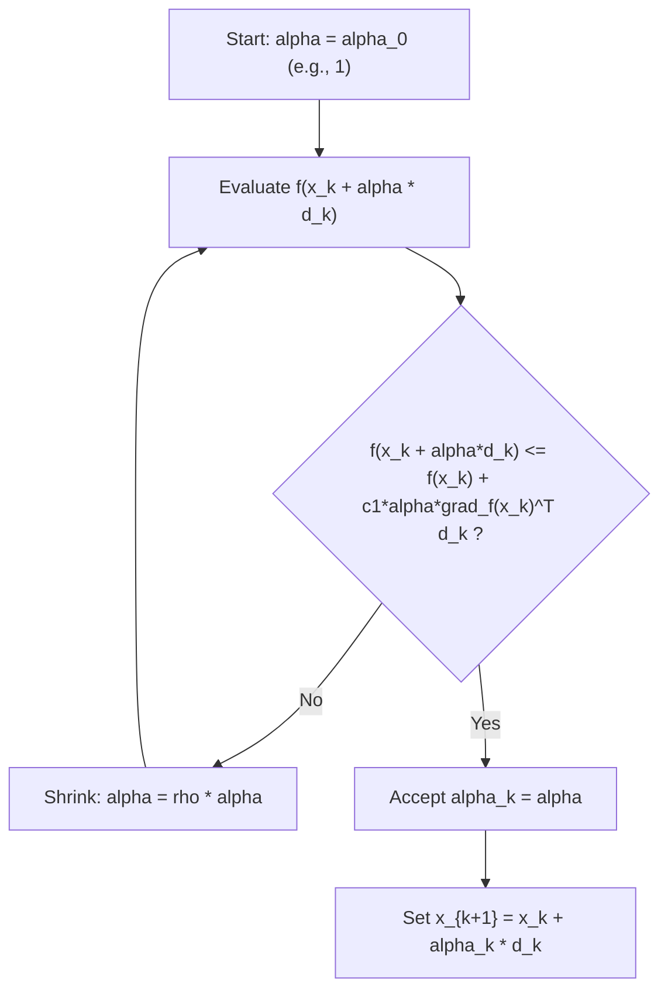

## Inexact Line Search and the Armijo Condition

### Overview

Inexact line search abandons the goal of exactly minimizing $f$ along a search direction and instead accepts any step length that guarantees "sufficient" progress at acceptable cost. The Armijo condition is the most widely used sufficient-decrease criterion, forming the backbone of backtracking line search — the default step-selection strategy in the overwhelming majority of practical gradient-based and quasi-Newton solvers.

### Motivation: Why Not Always Search Exactly?

As established in exact line search techniques, solving $\min_\alpha \phi(\alpha)$ exactly at every iteration is expensive for general nonlinear $f$ and frequently does not translate into meaningfully faster overall convergence. Inexact line search trades a small amount of per-step optimality for a large reduction in per-step cost, typically requiring only a handful of function evaluations rather than an iterative 1D sub-solve.

**Key Points**

- The step length only needs to be "good enough," not optimal, for the overall algorithm to converge at a good rate.
- Acceptance criteria must rule out two failure modes simultaneously: steps that are too long (overshoot, insufficient decrease) and steps that are too short (negligible progress).
- The Armijo condition alone handles the first failure mode; it must be paired with either a curvature condition or a backtracking procedure to handle the second.

### The Armijo (Sufficient Decrease) Condition

**[Confirmed]** Given a descent direction $d_k$ at $x_k$ (so $\nabla f(x_k)^Td_k < 0$), a step length $\alpha > 0$ satisfies the **Armijo condition** if:

$$f(x_k + \alpha d_k) \leq f(x_k) + c_1 \alpha \, \nabla f(x_k)^T d_k$$

for a fixed constant $c_1 \in (0,1)$, typically chosen small, e.g., $c_1 = 10^{-4}$.

**Geometric interpretation.** Define $\ell(\alpha) = f(x_k) + c_1\alpha\,\nabla f(x_k)^Td_k$, a line through $(0, f(x_k))$ with slope $c_1\,\nabla f(x_k)^Td_k$ — a fraction $c_1$ of the true initial slope $\phi'(0) = \nabla f(x_k)^Td_k$. Since $c_1 < 1$ and $\nabla f(x_k)^Td_k < 0$, this line is less steep (closer to horizontal) than the tangent to $\phi$ at $\alpha=0$, but still strictly decreasing. The Armijo condition requires $\phi(\alpha) \leq \ell(\alpha)$: the actual function value must lie on or below this relaxed line.

**[Confirmed]** Because $\phi(\alpha)$ and $\ell(\alpha)$ agree at $\alpha=0$ and $\phi'(0) < \ell'(0)$ (since $c_1 < 1$ makes $\ell$'s slope less negative than $\phi$'s true slope), $\phi(\alpha) < \ell(\alpha)$ holds for sufficiently small $\alpha > 0$ by a first-order Taylor argument — meaning the Armijo condition is always satisfiable for small enough $\alpha$, given any valid descent direction. This guarantees the acceptance criterion is not vacuous.

### Why the Armijo Condition Alone Is Insufficient

**[Confirmed]** The Armijo condition can be satisfied by arbitrarily small $\alpha$, including steps so small that the algorithm makes negligible progress and may fail to converge to a stationary point in a reasonable number of iterations. Formally, if $\phi(\alpha) \le \ell(\alpha)$ holds at some $\alpha_0 > 0$, it typically continues to hold for all smaller $\alpha \in (0, \alpha_0]$ as well (since $\phi$ starts below the more steeply-decreasing true tangent and $\ell$ decreases only at rate $c_1$ times that), so the condition by itself provides a ceiling on acceptable step size but no floor.

This is why the Armijo condition is virtually always used in conjunction with one of two remedies:

1. **Backtracking**: start from a large candidate step (often $\alpha=1$) and shrink geometrically until the condition holds, ensuring the accepted step is not needlessly small relative to what was tried.
2. **Curvature condition**: pair Armijo with a second condition (forming the Wolfe conditions) that explicitly rules out overly short steps by requiring the slope to have flattened sufficiently.

### Backtracking Line Search Algorithm

**[Confirmed]** The standard backtracking procedure, given a descent direction $d_k$, constants $c_1 \in (0,1)$ and shrinkage factor $\rho \in (0,1)$ (commonly $\rho = 0.5$), and initial trial step $\alpha_0$ (often $1$):

1. Set $\alpha \leftarrow \alpha_0$.
2. While $f(x_k + \alpha d_k) > f(x_k) + c_1\alpha\,\nabla f(x_k)^Td_k$: set $\alpha \leftarrow \rho\alpha$.
3. Return $\alpha_k = \alpha$.

**[Confirmed]** This procedure terminates in a finite number of steps because, as shown above, the Armijo condition is guaranteed to hold once $\alpha$ is small enough, and geometric shrinkage reaches that threshold in finitely many halvings (or $\rho$-scalings). Because the search starts from a reasonably large trial step and only shrinks when necessary, it inherently avoids the "too-small-step" failure mode without needing an explicit curvature check.

### Diagram: Backtracking Line Search Flow

### Worked Example: Backtracking on a Quadratic

Using $f(x_1,x_2) = x_1^2 + 10x_2^2$ at $x_0 = (1,1)$ with steepest descent direction $d_0 = -\nabla f(x_0) = -(2,20)$, as in the exact line search example. Take $c_1 = 10^{-4}$, $\rho = 0.5$, $\alpha_0 = 1$.

**Setup:** $f(x_0) = 1 + 10 = 11$. $\nabla f(x_0)^Td_0 = (2,20)\cdot(-2,-20) = -404$.

The Armijo threshold is: $\ell(\alpha) = 11 + 10^{-4}\cdot\alpha\cdot(-404) = 11 - 0.0404\alpha$.

**Trial $\alpha=1$:** $x_0 + d_0 = (1,1)+(-2,-20) = (-1,-19)$. $f(-1,-19) = 1 + 10(361) = 1+3610=3611$.

Check: $3611 \leq 11 - 0.0404 = 10.96$? **No** — reject, shrink.

**Trial $\alpha=0.5$:** $x_0+0.5d_0 = (1,1)+(-1,-10)=(0,-9)$. $f(0,-9)=0+10(81)=810$.

Check: $810 \leq 11-0.0202=10.98$? **No** — reject, shrink.

**Trial $\alpha=0.25$:** $x_0+0.25d_0=(1,1)+(-0.5,-5)=(0.5,-4)$. $f(0.5,-4)=0.25+10(16)=0.25+160=160.25$.

Check: $160.25 \leq 11-0.0101=10.99$? **No** — reject, shrink.

**Trial $\alpha=0.125$:** $x_0+0.125d_0=(1,1)+(-0.25,-2.5)=(0.75,-1.5)$. $f(0.75,-1.5)=0.5625+10(2.25)=0.5625+22.5=23.0625$.

Check: $23.0625 \leq 11-0.00505=10.995$? **No** — reject, shrink.

**Trial $\alpha=0.0625$:** $x_0+0.0625d_0=(1,1)+(-0.125,-1.25)=(0.875,-0.25)$. $f(0.875,-0.25)=0.7656+10(0.0625)=0.7656+0.625=1.3906$.

Check: $1.3906 \leq 11-0.002525=10.997$? **Yes** — accept.

**Output**

Backtracking accepts $\alpha_0 = 0.0625$ after 5 trials (started at $1, halved four times), giving $x_1 = (0.875, -0.25)
 with $f(x_1) \approx 1.39$, down from $f(x_0)=11$. Compare with the exact line search result from the earlier topic ($\alpha_0 \approx 0.0505$, $x_1\approx(0.899,-0.009)$, $f(x_1) \approx 0.808 + 0.00081 \approx 0.809$): the exact search reached a lower objective value at this step, as expected since it exactly minimizes along the ray, but the backtracking step required only 5 cheap function evaluations rather than solving a 1D sub-problem, and both steps land in the same qualitative region.

**[Confirmed]** This example illustrates the practical trade-off directly: inexact (Armijo-backtracking) line search gets "close enough" at a fraction of the per-step cost of exact line search.

### The Wolfe Conditions

**[Confirmed]** The Armijo condition, combined with a **curvature condition**, forms the (weak) **Wolfe conditions**:

$$f(x_k+\alpha d_k) \leq f(x_k) + c_1\alpha\,\nabla f(x_k)^Td_k \qquad \text{(Armijo / sufficient decrease)}$$

$$\nabla f(x_k+\alpha d_k)^Td_k \geq c_2\,\nabla f(x_k)^Td_k \qquad \text{(curvature condition)}$$

with $0 < c_1 < c_2 < 1$ (commonly $c_1=10^{-4}$, $c_2=0.9$ for Newton/quasi-Newton methods, or $c_2 = 0.1$ for nonlinear conjugate gradient).

**[Confirmed]** The curvature condition requires the directional derivative at the new point to have increased (become less negative) by at least a factor $c_2$ relative to the initial slope, directly ruling out steps so short that the slope has not flattened appreciably — this is precisely the "floor" that the Armijo condition alone lacks.

**[Inference]** The **strong Wolfe conditions** replace the curvature condition with $|\nabla f(x_k+\alpha d_k)^Td_k| \leq c_2|\nabla f(x_k)^Td_k|$, additionally preventing $\alpha$ from being so large that the slope has become strongly positive (overshooting past a nearby local minimum along the line); this variant is commonly required by quasi-Newton methods like BFGS to guarantee the curvature condition needed for a positive-definite Hessian approximation update.

### Comparison: Armijo-Backtracking vs. Wolfe Line Search

| Aspect | Armijo Backtracking Alone | Wolfe Conditions |
| --- | --- | --- |
| Prevents too-large steps | Yes (Armijo condition) | Yes (Armijo condition) |
| Prevents too-small steps | Indirectly, via starting from a large trial step | Explicitly, via curvature condition |
| Gradient evaluations needed | Only $\nabla f(x_k)$ once, plus function values during backtracking | Requires $\nabla f(x_k+\alpha d_k)$ at each trial $\alpha$ |
| Typical use | Gradient descent, simple Newton implementations | Quasi-Newton methods (BFGS, L-BFGS) requiring curvature guarantees |
| Implementation complexity | Simple loop | More involved (zoom/bracketing phase typically needed) |

**[Inference]** Armijo backtracking alone is often sufficient and preferred for its simplicity when gradient evaluations are expensive relative to function evaluations, since it needs the gradient only once per outer iteration (to check the descent condition and form $\ell(\alpha)$), whereas full Wolfe line search requires gradient evaluations at every trial point in the general case, which can be significantly more costly depending on the problem's evaluation structure.

### Global Convergence via the Armijo/Wolfe Framework

**[Confirmed]** Under the standard assumptions — $f$ bounded below, $\nabla f$ Lipschitz continuous, and the uniform angle condition on $d_k$ (as introduced in descent direction concepts) — descent methods using either backtracking-Armijo or Wolfe line search satisfy the **Zoutendijk condition**:

$$\sum_{k=0}^{\infty} \cos^2\theta_k \, \|\nabla f(x_k)\|^2 < \infty$$

**[Inference]** Combined with the uniform angle condition ($\cos\theta_k \geq \epsilon > 0$ for all $k$), this forces $\|\nabla f(x_k)\| \to 0$, giving global convergence to a stationary point — this result is what justifies backtracking-Armijo line search as a theoretically sound default choice, not merely a practical convenience, provided the direction sequence satisfies the angle condition.

### Choosing the Armijo Constant $c_1$

**[Inference]** Small values of $c_1$ (e.g., $10^{-4}) are standard in practice because they make the sufficient-decrease requirement easy to satisfy — close to requiring only that $f
 actually decreases, rather than decreases by a large specific margin — which in turn allows backtracking to accept larger step lengths (fewer shrinkage iterations) while still formally guaranteeing enough decrease for the convergence theory to apply. Larger $c_1$ values (closer to $1) impose a stricter decrease requirement, generally causing more backtracking iterations and smaller accepted steps, but this trade-off is a matter of practical tuning rather than a strict correctness requirement, since any fixed $c_1 \in (0,1)
 preserves the theoretical guarantees.

### Conclusion

The Armijo condition provides a computationally cheap, theoretically sound criterion for accepting a step length without solving a full line-search subproblem, at the cost of requiring a companion mechanism — typically backtracking or a curvature condition — to prevent pathologically small steps. Backtracking line search using the Armijo condition is the default choice in most simple gradient-based implementations, while the fuller Wolfe conditions are typically required by quasi-Newton methods that depend on curvature information for stable Hessian approximation updates. Both approaches fit within the broader Zoutendijk convergence framework, giving rigorous global convergence guarantees under standard smoothness assumptions, and both are, in the vast majority of practical settings, preferred over exact line search due to their far lower per-iteration cost.

**Related Topics**

- Wolfe conditions in depth: bracketing and zoom procedures for satisfying strong Wolfe
- Zoutendijk's theorem and global convergence of line-search methods
- BFGS and quasi-Newton curvature conditions requiring Wolfe-compliant steps
- Trust-region methods as an alternative to line search entirely
- Nonmonotone line search techniques for non-convex or highly oscillatory objectives
- Step-length initialization strategies (e.g., using previous iteration's step for warm-starting backtracking)