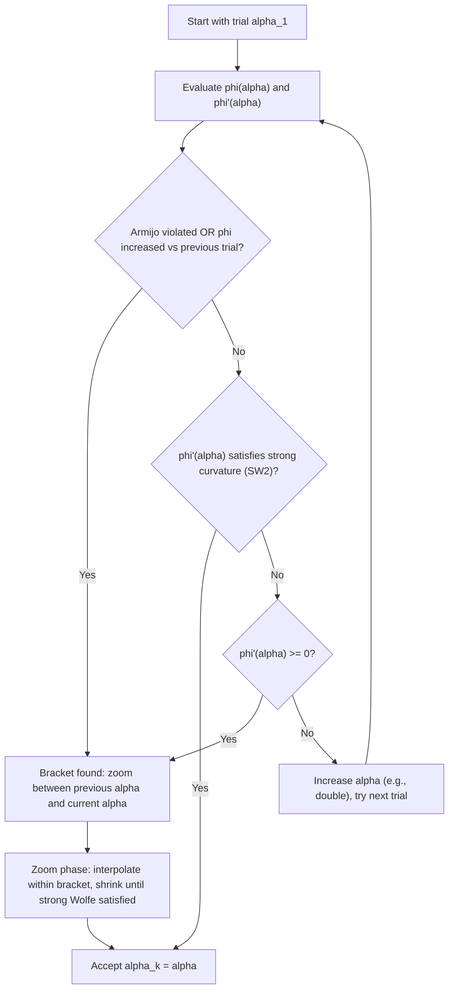

## Wolfe Conditions and Curvature Requirements

### Overview

The Wolfe conditions extend the Armijo sufficient-decrease criterion with an explicit curvature requirement, jointly ruling out step lengths that are too long or too short. They are the standard acceptance criteria underlying line searches in quasi-Newton methods, where the curvature condition additionally serves a structural purpose: guaranteeing that updates like BFGS preserve positive definiteness of the Hessian approximation.

### Recap: The Two Conditions

**[Confirmed]** Given a descent direction $d_k$ at $x_k$ (so $\nabla f(x_k)^Td_k < 0$) and constants $0 < c_1 < c_2 < 1$, the **weak Wolfe conditions** are:

$$f(x_k+\alpha d_k) \leq f(x_k) + c_1\alpha\,\nabla f(x_k)^Td_k \tag{W1: Armijo}$$

$$\nabla f(x_k+\alpha d_k)^Td_k \geq c_2\,\nabla f(x_k)^Td_k \tag{W2: Curvature}$$

As established in inexact line search and the Armijo condition, W1 alone bounds step length from above but not below. W2 supplies the missing lower bound.

### Why the Curvature Condition Rules Out Short Steps

**[Confirmed]** Define $\phi(\alpha) = f(x_k+\alpha d_k)$, so $\phi'(\alpha) = \nabla f(x_k+\alpha d_k)^Td_k$. The curvature condition W2 reads $\phi'(\alpha) \geq c_2\phi'(0)$.

Since $\phi'(0) < 0$ and $c_2 \in (0,1)$, the right-hand side $c_2\phi'(0)$ is a fraction of the (negative) initial slope — less negative than $\phi'(0)$ itself. The condition demands that $\phi'(\alpha)$ has risen at least this much from its steeply negative starting value.

**[Confirmed]** For very small $\alpha$, continuity of $\phi'$ implies $\phi'(\alpha) \approx \phi'(0)$, which generally does **not** satisfy $\phi'(\alpha) \geq c_2\phi'(0)$ when $c_2 < 1$ (since $\phi'(0) < c_2\phi'(0)$ is false when both are negative and $c_2 < 1$ — concretely, $\phi'(0) = -10$, $c_2\phi'(0) = -9$ for $c_2=0.9$, and $-10 \geq -9$ is false). This is precisely why the curvature condition rejects steps that are too short: the slope has not yet flattened enough.

**Key Points**

- Geometrically, W2 requires the tangent line to $\phi$ at the accepted $\alpha$ to be "flatter" (less steeply decreasing, or even increasing) than a fixed fraction of the initial tangent.
- W2 is satisfiable at points beyond a local minimizer of $\phi$ too, since it only constrains the *sign and magnitude* of the slope relative to $c_2\phi'(0)$, not whether $\phi'(\alpha)$ is exactly zero.
- Because W2 permits $\phi'(\alpha) > 0$ (past the minimizer along the ray), the weak Wolfe conditions can accept steps beyond the exact line-search minimizer, which the strong Wolfe conditions (below) explicitly prevent.

### Strong Wolfe Conditions

**[Confirmed]** The **strong Wolfe conditions** replace W2 with a two-sided bound:

$$f(x_k+\alpha d_k) \leq f(x_k) + c_1\alpha\,\nabla f(x_k)^Td_k \tag{SW1: Armijo, same as W1}$$

$$\left|\nabla f(x_k+\alpha d_k)^Td_k\right| \leq c_2\left|\nabla f(x_k)^Td_k\right| \tag{SW2: Strong curvature}$$

**[Confirmed]** SW2 forces $|\phi'(\alpha)|$ to have shrunk to within a fraction $c_2$ of $|\phi'(0)|$, which bounds $\phi'(\alpha)$ both from below (ruling out steps too short, same as weak Wolfe) and from above (ruling out steps so long that $\phi'(\alpha)$ has become strongly positive, i.e., significantly overshot a nearby stationary point of $\phi$).

**[Inference]** In practice, this tighter bracket is what makes the strong Wolfe conditions the preferred choice for quasi-Newton implementations: it keeps the accepted step length close to a local minimizer of $\phi$ (in the sense of small $|\phi'(\alpha)|$) without requiring the full cost of exact line search, striking a middle ground between the two.

### Diagram: Weak vs. Strong Wolfe Acceptance Regions

<svg xmlns="http://www.w3.org/2000/svg" viewBox="0 0 650 420">
\<style\>
.lbl { font-family: sans-serif; font-size: 13px; fill: #1a1a1a; }
.lbl-sm { font-family: sans-serif; font-size: 11px; fill: #444; }
.title { font-family: sans-serif; font-size: 15px; font-weight: bold; fill: #1a1a1a; }
.axis { stroke: #333; stroke-width: 1.5; }
.curve { stroke: #3b6ea5; stroke-width: 2.5; fill: none; }
.armijoline { stroke: #a53b3b; stroke-width: 1.5; stroke-dasharray: 5,3; }
\</style\>
<text x="325" y="26" text-anchor="middle" class="title">Wolfe Acceptance Regions Along phi(alpha) (svg_diagram)</text>
<line x1="60" y1="360" x2="600" y2="360" class="axis" />
<line x1="60" y1="360" x2="60" y2="60" class="axis" />
<text x="600" y="382" text-anchor="middle" class="lbl">alpha</text>
<text x="30" y="60" text-anchor="middle" class="lbl">phi</text>

<path d="M 90 320 Q 330 60 560 200" class="curve" />

<line x1="90" y1="320" x2="560" y2="300" class="armijoline" />
<text x="420" y="290" class="lbl-sm" fill="#a53b3b">Armijo line: f(x_k) + c1*alpha*phi'(0)</text>

<rect x="290" y="60" width="180" height="300" fill="#d8ecd8" opacity="0.4" />
<text x="300" y="80" class="lbl-sm">Weak Wolfe acceptable band</text>

<rect x="310" y="60" width="60" height="300" fill="#a8d5a8" opacity="0.6" />
<text x="300" y="380" class="lbl-sm">Strong Wolfe (narrower)</text>

<circle cx="330" cy="65" r="4" fill="#1a1a1a" />
<text x="335" y="55" class="lbl-sm">alpha* (exact min of phi)</text>
</svg>

### Existence of Points Satisfying the Wolfe Conditions

**[Confirmed]** For $f$ bounded below along the ray $\{x_k+\alpha d_k : \alpha \geq 0\}$ and continuously differentiable, points satisfying the weak (and strong) Wolfe conditions are guaranteed to exist for any $0 < c_1 < c_2 < 1$.

**Proof sketch.** Because $\phi$ is bounded below and $\phi'(0) < 0$, the Armijo line $\ell(\alpha) = \phi(0) + c_1\alpha\phi'(0)$ eventually exceeds $\phi(\alpha)$ from above is not always guaranteed to persist indefinitely, but since $\ell(\alpha) \to -\infty$ as $\alpha \to \infty$ (it has negative slope) while $\phi(\alpha)$ is bounded below, $\ell(\alpha)$ must eventually cross below $\phi(\alpha)$ at some finite $\alpha_1$. On the interval $(0, \alpha_1)$, the Armijo condition $\phi(\alpha) \leq \ell(\alpha)$ holds (by continuity, since it holds near $0$ and the functions cross at $\alpha_1$). By the mean value theorem applied to $\phi$ on $[0,\alpha_1]$, there exists $\alpha_2 \in (0,\alpha_1)$ with

$$\phi'(\alpha_2) = \frac{\phi(\alpha_1)-\phi(0)}{\alpha_1} = \frac{\ell(\alpha_1)-\phi(0)}{\alpha_1} = c_1\phi'(0)$$

Since $c_1 < c_2$ and both $\phi'(0)$ and $c_1\phi'(0)$ are negative with $c_1\phi'(0) > \phi'(0)$ (less negative), we get $\phi'(\alpha_2) = c_1\phi'(0) > c_2\phi'(0)$, satisfying W2 (and, since $c_1\phi'(0)$ is between $0$ and $\phi'(0)$ in magnitude terms and $c_1 < c_2$, the magnitude comparison for SW2 can also be arranged). By continuity, W1 and W2 hold in a neighborhood of $\alpha_2$ as well, establishing that an interval of acceptable step lengths exists.

**[Inference]** This existence argument is why the Wolfe framework is considered theoretically robust: it guarantees the line search will not fail to find an acceptable point, given only mild boundedness and smoothness assumptions on $f$ — no convexity of $f$ itself is required for this existence result.

### The Curvature Condition and Quasi-Newton Methods

**[Confirmed]** In quasi-Newton methods such as BFGS, the Hessian approximation $B_k$ is updated using the pair $s_k = x_{k+1}-x_k = \alpha_kd_k$ and $y_k = \nabla f(x_{k+1}) - \nabla f(x_k)$. The BFGS update preserves positive definiteness of $B_{k+1}$ (given $B_k \succ 0$) if and only if the **curvature (secant) condition**

$$s_k^Ty_k > 0$$

holds.

**Derivation connecting Wolfe curvature to the secant condition.** Expand $s_k^Ty_k$:

$$s_k^Ty_k = \alpha_kd_k^T\left[\nabla f(x_{k+1}) - \nabla f(x_k)\right] = \alpha_k\left[\nabla f(x_{k+1})^Td_k - \nabla f(x_k)^Td_k\right]$$

The Wolfe curvature condition W2 states $\nabla f(x_{k+1})^Td_k \geq c_2\,\nabla f(x_k)^Td_k$. Subtracting $\nabla f(x_k)^Td_k$ from both sides:

$$\nabla f(x_{k+1})^Td_k - \nabla f(x_k)^Td_k \geq (c_2-1)\nabla f(x_k)^Td_k$$

Since $c_2 < 1$, $(c_2-1) < 0$; and since $\nabla f(x_k)^Td_k < 0$ (descent direction), the product $(c_2-1)\nabla f(x_k)^Td_k > 0$ (negative times negative). So:

$$\nabla f(x_{k+1})^Td_k - \nabla f(x_k)^Td_k \geq (c_2-1)\nabla f(x_k)^Td_k > 0$$

Combined with $\alpha_k > 0$, this gives $s_k^Ty_k > 0$ directly.

**Output**

The Wolfe curvature condition W2 mathematically guarantees $s_k^Ty_k > 0$, which is exactly the secant condition needed for the BFGS (and DFP) update formula to preserve positive definiteness of the Hessian approximation. **[Confirmed]** This is the primary structural reason quasi-Newton implementations require Wolfe-compliant (rather than plain Armijo-backtracking) line searches: without it, the Hessian approximation could lose positive definiteness, corrupting subsequent search directions.

### Bracketing and Zoom: Finding a Wolfe Point in Practice

**[Confirmed]** A standard algorithm for locating a point satisfying the strong Wolfe conditions has two phases:

1. **Bracketing phase**: starting from an initial trial $\alpha_1$ (e.g., $1$ or a value informed by the previous iteration), increase $\alpha$ until either (a) the Armijo condition is violated, (b) $\phi(\alpha)$ increases relative to the previous trial, or (c) $\phi'(\alpha) \geq 0$. Any of these signals that an interval containing an acceptable point has been bracketed.
2. **Zoom phase**: given a bracket $[\alpha_{lo}, \alpha_{hi}]$ known to contain a point satisfying strong Wolfe, repeatedly interpolate (e.g., using bisection or cubic interpolation) within the bracket and shrink it, using the same three conditions to decide whether to update $\alpha_{lo}$ or $\alpha_{hi}$, until a strong-Wolfe point is found.

**[Inference]** This bracketing-and-zoom structure (commonly attributed to the presentation in Nocedal and Wright's *Numerical Optimization*) is more involved to implement correctly than simple Armijo backtracking, which is part of why plain backtracking remains popular when the stricter curvature guarantees of Wolfe are not structurally required (e.g., in plain gradient descent, where no Hessian approximation needs protecting).

### Diagram: Wolfe Line Search with Bracketing

### Worked Example: Checking Wolfe Conditions

Continuing $f(x_1,x_2)=x_1^2+10x_2^2$ at $x_0=(1,1)$, $d_0=-(2,20)$, using $c_1=10^{-4}$, $c_2=0.9$ (typical for Newton-type methods).

From the earlier backtracking example, $\phi(0) = 11$, $\phi'(0) = -404$.

**Check $\alpha = 0.0625$ (the Armijo-accepted step from backtracking):**

Armijo (already verified): $\phi(0.0625) = 1.3906 \leq 11 - 0.002525 = 10.997$. **Holds.**

Curvature: need $\nabla f(x_0+0.0625d_0)^Td_0 \geq 0.9 \times (-404) = -363.6$.

At $x_1 = (0.875, -0.25)$: $\nabla f(x_1) = (1.75, -5)$. $\nabla f(x_1)^Td_0 = (1.75,-5)\cdot(-2,-20) = -3.5+100 = 96.5$.

Check: $96.5 \geq -363.6$? **Yes** — curvature condition also holds.

**Output**

The plain Armijo-backtracking step $\alpha=0.0625$ happens to satisfy the (weak) Wolfe curvature condition here as well, since $96.5$ comfortably exceeds $-363.6$. **[Confirmed]** This illustrates that Armijo-accepted steps do not automatically violate the curvature condition — they simply are not *guaranteed* to satisfy it, and cases exist (steps just barely passing Armijo but with $\phi'(\alpha)$ still steeply negative) where backtracking would accept a point that fails W2, which is precisely the gap that necessitates explicit Wolfe-compliant search when the algorithm structurally depends on the curvature guarantee (as BFGS does).

### Practical Constant Choices

**[Confirmed]** Standard recommended values, consistent across most numerical optimization references:

| Method context | Typical $c_1$ | Typical $c_2$ |
| --- | --- | --- |
| Newton and quasi-Newton (BFGS, etc.) | $10^{-4}$ | $0.9$ |
| Nonlinear conjugate gradient | $10^{-4}$ | $0.1$ |

**[Inference]** The smaller $c_2$ used for nonlinear conjugate gradient methods reflects their greater sensitivity to accurately-minimized line searches relative to quasi-Newton methods; a tighter curvature requirement (smaller $c_2$) forces the accepted step closer to the exact line-search minimizer, which helps preserve the conjugacy properties that nonlinear CG directions rely on for good practical performance, though this is a design heuristic tuned empirically rather than derived from a single closed-form optimality argument.

### Conclusion

The Wolfe conditions complete the Armijo sufficient-decrease criterion with a curvature requirement, jointly bracketing the acceptable step length from both above and below. The weak form permits any sufficiently flattened slope, while the strong form tightens this to also exclude significant overshoot, and both admit rigorous existence guarantees given only boundedness and smoothness of the objective along the search ray. Beyond their role in step-length selection, Wolfe conditions serve a structural purpose in quasi-Newton methods: the curvature condition directly implies the secant condition $s_k^Ty_k > 0$ required for BFGS-type updates to preserve positive-definiteness of the Hessian approximation, making Wolfe-compliant line search a near-mandatory companion to quasi-Newton methods rather than merely a refinement of plain backtracking.

**Related Topics**

- BFGS and DFP Hessian approximation updates and the secant equation
- Bracketing-and-zoom line search implementation details
- Nonlinear conjugate gradient methods and sensitivity to line-search accuracy
- Trust-region methods as a curvature-aware alternative to line search
- Limited-memory BFGS (L-BFGS) and line search in large-scale settings
- Goldstein conditions as an alternative two-sided step acceptance criterion