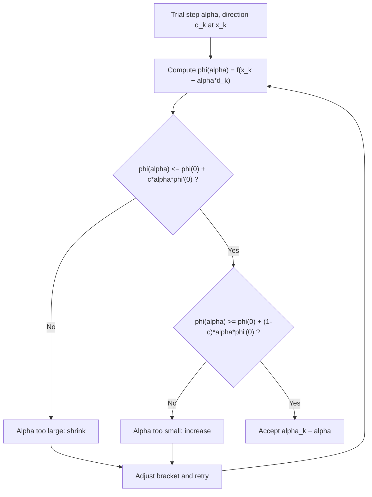

## Goldstein Conditions

### Overview

The Goldstein conditions are a symmetric, two-sided alternative to the Wolfe conditions for accepting a step length in inexact line search. Rather than pairing a sufficient-decrease (Armijo) condition with a separate curvature condition on the derivative, the Goldstein conditions bracket the function value itself between two lines of differing slope, both anchored at the same starting point. They are less commonly used than Wolfe conditions in modern quasi-Newton solvers but remain conceptually important and appear in some trust-region and Newton-type implementations.

### Formal Definition

**[Confirmed]** Given a descent direction $d_k$ at $x_k$ (so $\phi'(0) = \nabla f(x_k)^Td_k < 0$, using $\phi(\alpha) = f(x_k+\alpha d_k)$ as before) and a constant $c \in (0, 1/2)$, a step length $\alpha > 0$ satisfies the **Goldstein conditions** if:

$$f(x_k) + (1-c)\alpha\,\nabla f(x_k)^Td_k \leq f(x_k+\alpha d_k) \leq f(x_k) + c\,\alpha\,\nabla f(x_k)^Td_k$$

Equivalently, in terms of $\phi$:

$$\phi(0) + (1-c)\alpha\phi'(0) \leq \phi(\alpha) \leq \phi(0) + c\,\alpha\,\phi'(0)$$

**Key Points**

- The right-hand inequality is exactly the Armijo condition (with $c$ playing the role of $c_1$).
- The left-hand inequality is the new element: it prevents $\alpha$ from being too small by requiring $\phi(\alpha)$ to lie *below* a second line with a steeper (more negative) slope, $(1-c)\phi'(0)$.
- Both bounding lines pass through the same point $(0, \phi(0))$, differing only in slope — $c\phi'(0)$ for the upper bound and $(1-c)\phi'(0)$ for the lower bound.
- The requirement $c \in (0, 1/2)$ ensures $c < 1-c$, so the upper-bound line (slope $c\phi'(0)$, less negative) sits above the lower-bound line (slope $(1-c)\phi'(0)$, more negative) for $\alpha > 0$, making the sandwich well-defined and non-degenerate.

### Geometric Interpretation

**[Confirmed]** The two lines $\ell_{upper}(\alpha) = \phi(0) + c\alpha\phi'(0)$ and $\ell_{lower}(\alpha) = \phi(0) + (1-c)\alpha\phi'(0)$ form a wedge opening from the common point $(0,\phi(0))$. Since $\phi'(0) < 0$, both lines slope downward, but $\ell_{lower}$ (using the larger-magnitude slope $(1-c)\phi'(0)$) descends more steeply than $\ell_{upper}$. The Goldstein condition requires the graph of $\phi$ to pass through the region between these two lines for the chosen $\alpha$.

**[Confirmed]** This immediately rules out both failure modes symmetrically:

- If $\alpha$ is too large, $\phi(\alpha)$ tends to rise back up (or decrease insufficiently) and violates the upper bound — the standard Armijo rejection of insufficient decrease.
- If $\alpha$ is too small, $\phi(\alpha)$ stays close to $\phi(0) + \alpha\phi'(0)$ (the true initial tangent), which lies *below* $\ell_{lower}$ for small $\alpha$ since the true slope $\phi'(0)$ is more negative than $(1-c)\phi'(0)$ — this violates the lower bound, correctly rejecting overly conservative (small) steps.

### Diagram: Goldstein Acceptance Wedge

<svg xmlns="http://www.w3.org/2000/svg" viewBox="0 0 620 400">
\<style\>
.lbl { font-family: sans-serif; font-size: 13px; fill: #1a1a1a; }
.lbl-sm { font-family: sans-serif; font-size: 11px; fill: #444; }
.title { font-family: sans-serif; font-size: 15px; font-weight: bold; fill: #1a1a1a; }
.axis { stroke: #333; stroke-width: 1.5; }
.curve { stroke: #3b6ea5; stroke-width: 2.5; fill: none; }
.upper { stroke: #a53b3b; stroke-width: 1.5; stroke-dasharray: 5,3; }
.lower { stroke: #b8860b; stroke-width: 1.5; stroke-dasharray: 5,3; }
\</style\>
<text x="310" y="26" text-anchor="middle" class="title">Goldstein Wedge Between Two Lines (svg_diagram)</text>
<line x1="60" y1="350" x2="580" y2="350" class="axis" />
<line x1="60" y1="350" x2="60" y2="60" class="axis" />
<text x="580" y="372" text-anchor="middle" class="lbl">alpha</text>
<text x="30" y="60" text-anchor="middle" class="lbl">phi</text>

<path d="M 90 320 Q 300 80 550 220" class="curve" />

<line x1="90" y1="320" x2="550" y2="270" class="upper" />
<text x="420" y="260" class="lbl-sm" fill="#a53b3b">upper: phi(0) + c*alpha*phi'(0)</text>

<line x1="90" y1="320" x2="330" y2="60" class="lower" />
<text x="200" y="150" class="lbl-sm" fill="#b8860b">lower: phi(0) + (1-c)*alpha*phi'(0)</text>

<rect x="290" y="65" width="150" height="280" fill="#d8ecd8" opacity="0.35" />
<text x="300" y="345" class="lbl-sm">acceptable band</text>
</svg>

### Existence of Goldstein Points

**[Confirmed]** Analogous to the Wolfe conditions, if $\phi$ is bounded below and continuously differentiable with $\phi'(0) < 0$, an interval of step lengths satisfying the Goldstein conditions is guaranteed to exist for any $c \in (0, 1/2)$.

**[Inference]** The existence argument follows a similar structure to the Wolfe existence proof: since $\ell_{upper}(\alpha) \to -\infty$ while $\phi$ is bounded below, the upper (Armijo) bound is eventually violated for large $\alpha$; and since $\phi(\alpha)$ approaches the true tangent line (steeper than $\ell_{lower}$) near $\alpha=0$, the lower bound is violated for small $\alpha$. This squeezes the acceptable region into a genuine interior interval, mirroring the bracketing logic used for Wolfe points but expressed entirely in terms of function values rather than requiring derivative evaluations at trial points.

### Goldstein vs. Wolfe: Key Structural Difference

**[Confirmed]** The most significant practical distinction is that Goldstein conditions can be checked using **function values alone** — no gradient evaluation is required at the trial point $x_k+\alpha d_k$, only at $x_k$ (to compute $\phi'(0)$ once). This is in direct contrast to the Wolfe curvature condition, which requires $\nabla f(x_k+\alpha d_k)^Td_k$ at every trial point.

| Aspect | Goldstein Conditions | Wolfe Conditions |
| --- | --- | --- |
| Gradient evaluations per trial | None (only $\phi'(0)$ needed once) | Required at every trial $\alpha$ (for curvature check) |
| Symmetry of construction | Symmetric wedge around $\phi(0)$-anchored lines | Asymmetric: value condition (Armijo) + derivative condition (curvature) |
| Compatibility with Newton-type methods | Can inadvertently exclude the exact minimizer of a quadratic model in some cases | Generally compatible; strong Wolfe used for quasi-Newton curvature guarantees |
| Common use case | Newton's method line searches, some trust-region-adjacent contexts | Quasi-Newton methods (BFGS, L-BFGS), nonlinear CG |

**[Inference]** The lower gradient-evaluation cost makes Goldstein conditions attractive when gradients are significantly more expensive to compute than function values, but this advantage is less commonly decisive in practice than it might appear, since most modern automatic-differentiation pipelines compute function value and gradient together at similar marginal cost — reducing the practical incentive to prefer Goldstein over Wolfe purely on evaluation-cost grounds in that setting.

### A Known Limitation: Exclusion of the Newton Step

**[Confirmed]** A frequently cited drawback of the Goldstein conditions is that the lower bound can, in certain cases, exclude the step that would be taken by Newton's method (or the exact minimizer of a local quadratic model), because the lower-bound line can cut off part of the region containing that point when the quadratic model is fit to a small curvature. This is a specific, well-documented shortcoming relative to the Wolfe conditions, which do not have this exclusion issue in the same way — the curvature condition in Wolfe is derivative-based rather than a value-based lower cutoff, so it does not analogously carve out the Newton step region.

**[Inference]** This limitation is the primary reason Wolfe conditions are generally preferred over Goldstein conditions in modern quasi-Newton solver implementations, despite the Goldstein conditions' lower per-trial gradient cost; the risk of inadvertently rejecting a good (even optimal, for quadratics) Newton-type step is judged to outweigh the computational savings in most standard software.

### Worked Example: Checking the Goldstein Conditions

Continuing $f(x_1,x_2) = x_1^2+10x_2^2$ at $x_0=(1,1)$, $d_0=-(2,20)$, $\phi(0)=11$, $\phi'(0)=-404$. Take $c = 0.25$ (a valid choice since $0.25 \in (0,0.5)$).

**Upper bound:** $\ell_{upper}(\alpha) = 11 + 0.25\alpha(-404) = 11 - 101\alpha$.

**Lower bound:** $\ell_{lower}(\alpha) = 11 + 0.75\alpha(-404) = 11 - 303\alpha$.

**Check $\alpha = 0.0625$ (the Armijo/backtracking step from earlier):** $\phi(0.0625) = 1.3906$ (computed previously).

Upper: $11 - 101(0.0625) = 11 - 6.3125 = 4.6875. Is $1.3906 \leq 4.6875
? **Yes.**

Lower: $11 - 303(0.0625) = 11 - 18.9375 = -7.9375. Is $1.3906 \geq -7.9375
? **Yes.**

**Output**

Both Goldstein bounds hold at $\alpha=0.0625$, so this step is Goldstein-acceptable as well as Armijo-acceptable. **[Confirmed]** This is expected since $\alpha=0.0625$ was already reasonably far along the backtracking shrinkage process (not an extremely small step), landing comfortably within the wedge; a much smaller $\alpha$ (e.g., an early large trial before sufficient shrinkage) would likely violate only the Armijo (upper) bound, while an extremely tiny $\alpha$, if tested, would risk violating the lower Goldstein bound instead, illustrating the two-sided nature of the criterion.

### Diagram: Goldstein Condition Check Flow

### Relationship to Trust-Region Methods

**[Inference]** Because the Goldstein conditions bound $\phi(\alpha)$ symmetrically using only function values, they share a conceptual affinity with trust-region ratio tests, which similarly compare actual function decrease against a predicted decrease from a local model, without requiring a separate gradient-based curvature check at the trial point. This affinity is informal — the two frameworks are not identical — but it partly explains why Goldstein-type acceptance criteria appear more often in some Newton-type and model-based optimization contexts than in the gradient-heavy quasi-Newton literature, where Wolfe conditions dominate instead.

### Conclusion

The Goldstein conditions offer a value-only, symmetric alternative to the Wolfe conditions for step-length acceptance, bracketing the objective's decrease between two lines of different slope anchored at the current point. Their chief practical advantage — not requiring gradient evaluations at trial points — is offset by a structural drawback: the lower bound can exclude desirable Newton-type steps in certain curvature regimes, which is the primary reason modern quasi-Newton solvers favor Wolfe conditions instead. Both frameworks guarantee existence of an acceptable step interval under mild boundedness and smoothness assumptions, and both fit within the broader family of inexact line search criteria designed to balance per-iteration cost against convergence guarantees.

**Related Topics**

- Wolfe conditions and the curvature condition's role in quasi-Newton updates
- Trust-region methods and the ratio-test acceptance criterion
- Backtracking line search implementation and the Armijo condition
- Line search vs. trust-region: a comparative framework for step control
- Nocedal and Wright-style bracketing-and-zoom algorithms for line search
- Newton's method step acceptance and safeguarding strategies