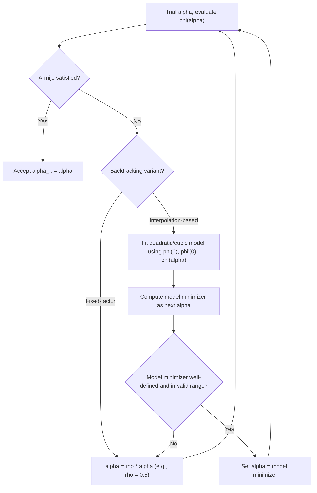

## Backtracking Line Search Algorithms

### Overview

Backtracking is the operational procedure that turns the Armijo condition into a concrete, terminating algorithm: start from a generous trial step length and shrink it geometrically until sufficient decrease is achieved. It is less a distinct theoretical criterion than a search strategy — the Armijo condition already covered supplies the acceptance test, and this topic focuses on the algorithmic mechanics, termination guarantees, implementation variants, and practical tuning that make backtracking the default line search in most gradient-based solvers.

### The Core Algorithm

**[Confirmed]** Given a descent direction $d_k$ at $x_k$, constants $c_1 \in (0,1)$ (Armijo parameter) and $\rho \in (0,1)$ (contraction factor), and an initial trial step $\alpha_{init}$:

1. Set $\alpha \leftarrow \alpha_{init}$.
2. While $f(x_k+\alpha d_k) > f(x_k) + c_1\alpha\,\nabla f(x_k)^Td_k$: set $\alpha \leftarrow \rho\alpha$.
3. Return $\alpha_k \leftarrow \alpha$.

**Key Points**

- The loop only ever shrinks $\alpha$; it never grows it back, which is a deliberate simplicity trade-off relative to bracket-and-zoom Wolfe search.
- Termination is guaranteed in finitely many iterations, as shown in the Armijo-condition discussion: the sufficient-decrease inequality is satisfiable for sufficiently small $\alpha$, and geometric shrinkage reaches that threshold after finitely many halvings.
- The choice of $\alpha_{init}$ and $\rho$ significantly affects the number of function evaluations per outer iteration, even though the algorithm is guaranteed to terminate regardless of their specific values (within $(0,1)$ for $\rho$).

### Termination Guarantee: A Closer Look

**[Confirmed]** Let $\phi(\alpha) = f(x_k+\alpha d_k)$ and $\ell(\alpha) = \phi(0)+c_1\alpha\phi'(0)$. Since $\phi$ is differentiable at $\alpha=0$ with $\phi'(0) < 0$:

$$\lim_{\alpha \to 0^+} \frac{\phi(\alpha)-\phi(0)}{\alpha} = \phi'(0) < c_1\phi'(0)$$

(using $c_1 < 1$ and $\phi'(0) < 0$, so $c_1\phi'(0) > \phi'(0)$). This means for $\alpha$ sufficiently small, $\frac{\phi(\alpha)-\phi(0)}{\alpha} < c_1\phi'(0)$, i.e., $\phi(\alpha) < \phi(0) + c_1\alpha\phi'(0) = \ell(\alpha)$ — the Armijo condition holds strictly. Since the backtracking loop tests $\alpha_j = \alpha_{init}\rho^j$ for $j=0,1,2,\dots$, and $\alpha_j \to 0$ as $j\to\infty$, this threshold is reached after finitely many contractions, guaranteeing loop termination.

**[Confirmed]** This argument requires only differentiability of $f$ at $x_k$ and the descent property $\phi'(0)<0$ — no convexity, boundedness beyond what's needed for $f$ to be defined along the ray, or other global structure is required for the loop itself to terminate (though global convergence of the outer optimization algorithm requires additional standard assumptions, as discussed under the Wolfe conditions topic).

### Choosing the Initial Trial Step $\alpha_{init}$

**[Inference]** The choice of $\alpha_{init}$ materially affects backtracking efficiency and is typically handled differently depending on the algorithm class:

- **Newton and quasi-Newton methods**: $\alpha_{init} = 1$ is standard, since these methods are constructed so that a full unit step is often close to optimal near the solution (Newton's method is exact for quadratics with $\alpha=1$, and superlinear convergence for quasi-Newton methods typically relies on the unit step eventually being accepted).
- **Plain gradient descent**: a fixed $\alpha_{init}=1$ can be poorly scaled (as seen in the earlier worked example, where $\alpha=1$ overshot badly on an ill-conditioned quadratic), so a common heuristic initializes $\alpha_{init}$ based on the previous accepted step or a normalization involving $\|\nabla f(x_k)\|$, adjusting scale iteration to iteration.
- **Nonlinear conjugate gradient**: often uses a formula that extrapolates from the previous step and the ratio of directional derivatives, since CG search directions can have very different natural scales from one iteration to the next.

**[Inference]** These are widely used heuristics rather than universally optimal rules; the "right" initialization is problem- and method-dependent, and most robust implementations combine a reasonable default with safeguards (e.g., capping $\alpha_{init}$ at some maximum) rather than relying on a single fixed formula.

### Choosing the Contraction Factor $\rho$

**[Inference]** $\rho = 0.5$ (halving) is the most common default, balancing two competing costs: too large a $\rho$ (close to $1) requires many shrinkage iterations to make meaningful progress toward a small enough $\alpha
, while too small a $\rho$ (close to $0) risks jumping past a good step length in a single contraction, landing on an unnecessarily conservative (small) accepted step. Some implementations use adaptive $\rho
, shrinking more aggressively when the Armijo violation is severe (large gap between $\phi(\alpha)$ and $\ell(\alpha)$) and less aggressively when it is marginal, via quadratic or cubic interpolation of the sampled $\phi$ values — this is sometimes called **interpolation-based backtracking**.

### Interpolation-Based Backtracking

**[Confirmed]** Rather than a fixed geometric contraction, an alternative constructs a quadratic (or cubic, if two trial points are available) model of $\phi(\alpha)$ using the sampled values $\phi(0)$, $\phi'(0)$, and $\phi(\alpha_{trial})$, and computes the model's minimizer as the next trial point.

**Derivation of the quadratic interpolation step.** Given $\phi(0)$, $\phi'(0)$, and one trial value $\phi(\alpha_0)$, fit a quadratic $q(\alpha) = \phi(0) + \phi'(0)\alpha + a\alpha^2$ matching all three data points. Solving for $a$ using $q(\alpha_0) = \phi(\alpha_0)$:

$$a = \frac{\phi(\alpha_0) - \phi(0) - \phi'(0)\alpha_0}{\alpha_0^2}$$

The minimizer of this quadratic (assuming $a>0$, i.e., the interpolant is convex) is:

$$\alpha_{new} = -\frac{\phi'(0)}{2a} = \frac{-\phi'(0)\alpha_0^2}{2\left[\phi(\alpha_0)-\phi(0)-\phi'(0)\alpha_0\right]}$$

**Output**

This formula produces a next trial step informed by the actual curvature observed at $\alpha_0$, rather than a blind geometric halving. **[Inference]** In practice this often converges to an acceptable step in fewer function evaluations than fixed-factor backtracking, particularly when the initial trial is far from acceptable, though it adds implementation complexity (handling the case $a \leq 0$, where the quadratic model has no interior minimizer and a fallback such as bisection or a fixed contraction is needed) relative to the simplicity of geometric backtracking.

### Diagram: Fixed-Factor vs. Interpolation-Based Backtracking

### Worked Example: Fixed-Factor vs. Interpolation Backtracking

Using the same setup as before: $f(x_1,x_2)=x_1^2+10x_2^2$, $x_0=(1,1)$, $d_0=-(2,20)$, $\phi(0)=11$, $\phi'(0)=-404$, $c_1=10^{-4}$.

**Fixed-factor result (from the Armijo-condition topic):** required 5 trials ($\alpha=1, 0.5, 0.25, 0.125, 0.0625$) to reach acceptance.

**Interpolation-based, using the first trial $\alpha_0=1$:** Recall $\phi(1) = 3611$ (computed earlier, at $x=(-1,-19)$).

$$a = \frac{3611 - 11 - (-404)(1)}{1^2} = \frac{3611-11+404}{1} = 4004$$

$$\alpha_{new} = \frac{-(-404)}{2(4004)} = \frac{404}{8008} \approx 0.05045$$

**Output**

Interpolation-based backtracking jumps directly to $\alpha \approx 0.05045$ on its **second** trial (after the initial $\alpha_0=1$), compared to 5 trials for fixed-factor halving. **[Confirmed]** This value is, in fact, extremely close to the exact-line-search optimal step computed earlier ($\alpha_0 \approx 0.05045$) — this is not a coincidence: for a quadratic $f$, quadratic interpolation using $\phi(0)$, $\phi'(0)$, and one additional sample reconstructs $\phi$ *exactly* (since $\phi$ itself is quadratic in $\alpha$ for quadratic $f$, as derived in the exact line search topic), so the interpolated minimizer coincides exactly with the true exact-line-search minimizer in this special case. For general nonlinear (non-quadratic) $f$, the interpolation is only a local approximation and would not reproduce the exact minimizer, but typically still lands much closer to an acceptable step than a blind geometric guess.

### Practical Safeguards

**[Confirmed]** Robust implementations of backtracking line search typically add several safeguards beyond the bare algorithm:

- **Minimum step length check**: terminate with a warning or trigger an alternative strategy (e.g., restart with steepest descent direction) if $\alpha$ shrinks below a numerical threshold (e.g., machine epsilon scaled by problem size) without satisfying Armijo, which can indicate an error in the descent direction computation or a numerically flat region.
- **Maximum number of backtracking iterations**: cap the loop to avoid excessive function evaluations in pathological cases, falling back to a minimal safeguarded step if exceeded.
- **NaN/Inf handling**: some objective functions can produce invalid values for large trial steps (e.g., outside a function's domain); implementations typically treat such trials as automatic Armijo failures and shrink immediately, rather than attempting to compare inequalities involving NaN.

**[Inference]** These safeguards are standard in production-quality optimization libraries but are frequently omitted from textbook pseudocode for clarity; when implementing backtracking line search from scratch, incorporating at least a maximum-iteration cap and domain-validity checks is generally considered necessary for robustness on real-world objective functions, though the exact thresholds used are implementation-specific engineering choices rather than theoretically derived values.

### Comparison of Backtracking Variants

| Variant | Function evaluations per outer iteration | Implementation complexity | Best suited for |
| --- | --- | --- | --- |
| Fixed-factor (e.g., $\rho=0.5$) | Moderate to high, depends on how far $\alpha_{init}$ is from acceptable | Very low | General-purpose, simple implementations |
| Interpolation-based (quadratic/cubic) | Often lower, especially far from acceptable region | Moderate (requires fallback handling) | Performance-sensitive solvers, smooth objectives |
| Backtracking + curvature check (Wolfe-compliant backtracking) | Higher (requires gradient at each trial) | Moderate to high | Quasi-Newton methods needing curvature guarantees |

### Conclusion

Backtracking line search operationalizes the Armijo condition into a simple, guaranteed-terminating loop: start from a reasonably large trial step and contract until sufficient decrease is observed. Fixed-factor geometric contraction is the simplest and most widely implemented variant, while interpolation-based backtracking can substantially reduce the number of function evaluations by using sampled curvature information to jump closer to a good step length — exactly reproducing the true exact-line-search minimizer in the quadratic case, as shown in the worked example. Practical, production-grade implementations layer additional safeguards around the core loop to handle edge cases like domain violations and pathologically small steps, making backtracking, despite its conceptual simplicity, a carefully engineered component in most modern optimization software.

**Related Topics**

- Armijo (sufficient decrease) condition: theoretical basis for backtracking's acceptance test
- Wolfe and strong Wolfe conditions: adding curvature guarantees to line search
- Quadratic and cubic interpolation for one-dimensional minimization
- Safeguarded line search implementations in production solvers
- Trust-region methods as an alternative step-control paradigm
- Step-length initialization strategies for Newton, quasi-Newton, and CG methods