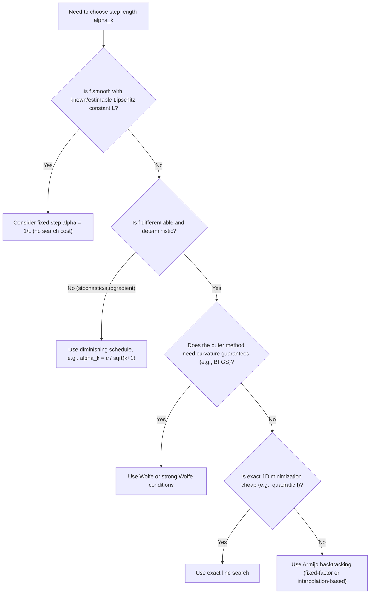

## Step Length Selection Strategies

### Overview

Step length selection is the umbrella problem underlying exact line search, Armijo backtracking, the Wolfe conditions, and Goldstein conditions covered previously: given a descent direction, how should the scalar $\alpha_k$ actually be chosen at each iteration? This topic consolidates those individual criteria into a comparative framework, and covers practical strategies not yet addressed in depth — initialization heuristics, safeguarded interpolation, non-monotone acceptance, and the interaction between step-length choice and overall algorithmic convergence rate.

### The Step Length Selection Problem, Restated

Given $x_k$ and descent direction $d_k$, the goal is to choose $\alpha_k > 0$ so that $x_{k+1} = x_k + \alpha_kd_k$ makes good progress, balancing two competing costs:

$$\text{cost of computing a very accurate } \alpha_k \quad \text{vs.} \quad \text{cost of poor overall convergence from a bad } \alpha_k$$

**Key Points**

- Every step-length strategy is a point on a spectrum between "cheap and rough" (fixed step, simple backtracking) and "expensive and precise" (exact line search).
- The right point on this spectrum depends on the relative cost of function/gradient evaluations, the conditioning of the problem, and whether the outer method (e.g., quasi-Newton) has structural requirements on the step (e.g., curvature conditions for BFGS).
- No single strategy dominates in all situations — the choice is a design decision made jointly with the choice of search direction.

### Summary Comparison of Step Length Strategies

| Strategy | Acceptance criterion | Gradient evals per trial | Guarantees curvature-type control | Typical use |
| --- | --- | --- | --- | --- |
| Fixed step length | None ($\alpha_k = \bar\alpha$ constant) | None | No | Simple SGD variants, theoretical analysis with known Lipschitz constant |
| Diminishing step length | None (schedule, e.g., $\alpha_k = c/k$) | None | No | Stochastic optimization, subgradient methods |
| Exact line search | $\alpha_k = \arg\min_\alpha \phi(\alpha)$ | Iterative 1D sub-solve | Implicitly (achieves $\phi'(\alpha_k)=0$) | Quadratics, linear CG, theoretical baselines |
| Armijo backtracking | Sufficient decrease only | None at trial points | No | General-purpose gradient descent, simple Newton |
| Weak/Strong Wolfe | Sufficient decrease + curvature | Yes, every trial | Yes | Quasi-Newton (BFGS, L-BFGS), nonlinear CG |
| Goldstein | Two-sided value bound | None at trial points | Partial (value-based, can exclude Newton step) | Some Newton-type and model-based methods |

### Fixed Step Length

**[Confirmed]** The simplest strategy sets $\alpha_k = \bar\alpha$, a constant, for all $k$. This requires no additional function or gradient evaluations beyond what is needed to compute $d_k$ itself.

**[Confirmed]** For gradient descent on an $L$-smooth function (i.e., $\nabla f$ is Lipschitz continuous with constant $L$), a fixed step $\bar\alpha \leq 1/L$ guarantees monotonic decrease and convergence to a stationary point.

**Derivation of the descent guarantee.** By the descent lemma (a standard consequence of $L$-smoothness), for any $x, y$:

$$f(y) \leq f(x) + \nabla f(x)^T(y-x) + \frac{L}{2}\|y-x\|^2$$

Setting $y = x_k - \bar\alpha\nabla f(x_k)$ (gradient descent step) and $x=x_k$:

$$f(x_{k+1}) \leq f(x_k) - \bar\alpha\|\nabla f(x_k)\|^2 + \frac{L\bar\alpha^2}{2}\|\nabla f(x_k)\|^2 = f(x_k) - \bar\alpha\left(1-\frac{L\bar\alpha}{2}\right)\|\nabla f(x_k)\|^2$$

For this to guarantee strict decrease whenever $\nabla f(x_k)\neq 0$, we need $\bar\alpha(1-L\bar\alpha/2) > 0$, i.e., $0 < \bar\alpha < 2/L. The choice $\bar\alpha = 1/L
 gives a coefficient of $1 - 1/2 = 1/2$, yielding the commonly cited guarantee:

$$f(x_{k+1}) \leq f(x_k) - \frac{1}{2L}\|\nabla f(x_k)\|^2$$

**Output**

**[Confirmed]** This shows fixed-step gradient descent with $\bar\alpha=1/L$ guarantees monotonic decrease proportional to the squared gradient norm at every iteration, without any line search cost at all — provided $L$ is known or can be estimated. **[Inference]** In practice, $L$ is often unknown or expensive to compute exactly (it requires a bound on the Hessian's spectral norm globally or along the iterate path), which is the main practical obstacle to using fixed-step strategies directly; this motivates either backtracking-based line search (which sidesteps needing $L$ explicitly) or adaptive estimation schemes.

### Diminishing Step Length

**[Confirmed]** In stochastic and subgradient optimization (where exact line search or even reliable sufficient-decrease checks are often infeasible due to noisy or non-differentiable objectives), a common strategy uses a predetermined diminishing schedule, such as $\alpha_k = c/(k+1)$ or $\alpha_k = c/\sqrt{k+1}$, without checking any per-iteration condition on $f$.

**[Confirmed]** The classical condition for convergence guarantees under such schedules (e.g., in subgradient methods) is:

$$\sum_{k=0}^\infty \alpha_k = \infty, \qquad \sum_{k=0}^\infty \alpha_k^2 < \infty$$

**[Inference]** The first condition ensures the cumulative step size is large enough to reach any point in the domain (preventing premature stalling), while the second ensures the steps shrink fast enough to control accumulated noise or subgradient-method oscillation; schedules like $\alpha_k=c/(k+1)$ satisfy both (the harmonic series diverges, but its square is a convergent $p$-series with $p=2>1$), which is why this schedule is a standard textbook default for subgradient methods, though the resulting convergence rate is typically much slower ($O(1/\sqrt{k})$ or similar) than what step-search-based methods achieve on smooth problems.

### Diagram: Step Length Strategy Selection

### Adaptive Step Length: Barzilai-Borwein

**[Confirmed]** The Barzilai-Borwein (BB) method provides a step length for gradient descent derived from an approximate secant condition, without requiring any line search at all:

$$\alpha_k^{BB1} = \frac{s_{k-1}^Ts_{k-1}}{s_{k-1}^Ty_{k-1}}, \qquad \alpha_k^{BB2} = \frac{s_{k-1}^Ty_{k-1}}{y_{k-1}^Ty_{k-1}}$$

where $s_{k-1} = x_k-x_{k-1}$ and $y_{k-1}=\nabla f(x_k)-\nabla f(x_{k-1})$.

**Derivation motivation.** These formulas arise from seeking a scalar $\alpha$ such that $\frac{1}{\alpha}s_{k-1} \approx y_{k-1}$ (i.e., treating $\frac{1}{\alpha}I$ as an approximation to the average Hessian along the step, in the secant-equation sense used by quasi-Newton methods), then solving a least-squares problem for the best such scalar — $\alpha_k^{BB1}$ minimizes $\|s_{k-1}/\alpha - y_{k-1}\|^2$ over $\alpha$, while $\alpha_k^{BB2}$ arises from the symmetric least-squares problem minimizing $\|s_{k-1}-\alpha y_{k-1}\|^2$.

**[Confirmed]** Unlike standard gradient descent step choices, the BB step length is **not** required to be a descent-guaranteeing step in the classical Armijo sense at every iteration — the BB method is typically implemented as a non-monotone method, where $f(x_{k+1})$ is permitted to be larger than $f(x_k)$ at some iterations, with global convergence established using a non-monotone line search condition instead of the standard monotone Armijo rule.

### Non-Monotone Line Search

**[Confirmed]** Non-monotone line search relaxes the requirement that $f(x_{k+1}) < f(x_k)$ strictly at every single iteration, instead requiring sufficient decrease relative to the **maximum** of the objective over the last $M$ iterations:

$$f(x_k+\alpha d_k) \leq \max_{0\leq j\leq \min(k,M-1)} f(x_{k-j}) + c_1\alpha\,\nabla f(x_k)^Td_k$$

**[Inference]** This relaxation is particularly useful for methods like Barzilai-Borwein gradient descent, which can take steps that temporarily increase $f$ but lead to substantially faster overall convergence than strictly monotone methods on ill-conditioned problems — allowing occasional uphill moves gives the method more freedom to escape the zig-zagging pattern characteristic of monotone steepest descent on elongated quadratics, though the precise choice of window size $M$ is a tuning parameter balancing this flexibility against the risk of allowing genuinely poor steps to accumulate.

### Worked Example: Comparing Strategies on the Same Problem

Continuing $f(x_1,x_2)=x_1^2+10x_2^2$, condition number $\kappa=10$, starting at $x_0=(1,1)$.

**Fixed step, $\bar\alpha=1/L$:** Here $L = \lambda_{\max}(Q) = 20$ (the Lipschitz constant of $\nabla f$ equals the largest eigenvalue of $Q$ for a quadratic). So $\bar\alpha = 1/20 = 0.05$.

$$x_1 = x_0 - 0.05\nabla f(x_0) = (1,1) - 0.05(2,20) = (1-0.1,\ 1-1) = (0.9,\ 0)$$

$$f(x_1) = 0.81 + 0 = 0.81$$

**Exact line search (from earlier topic):** $\alpha_0\approx0.05045$, $x_1\approx(0.899,-0.009)$, $f(x_1)\approx0.809$.

**Armijo backtracking (from earlier topic):** $\alpha_0=0.0625$, $x_1=(0.875,-0.25)$, $f(x_1)\approx1.39$.

**Output**

**[Confirmed]** In this single-step comparison, the fixed step $\bar\alpha=1/L=0.05$ and the exact line search step ($\approx0.05045$) produce nearly identical results — unsurprising, since $1/L=1/\lambda_{\max}$ is close to (though not exactly equal to) the exact-line-search optimal step for this particular starting point, while backtracking with $\alpha_0=1$ initial trial required several contractions and landed at a noticeably worse (higher $f$) point after one step. **[Inference]** This ordering is specific to this example and starting point; fixed-step methods do not generally match exact line search this closely at every iteration, and the relative performance of these strategies over many iterations (not just one step) is what ultimately matters for total computational cost — a comparison that would require running each method to convergence rather than examining a single step, which is beyond the scope of this single-step illustration.

### Interaction with Convergence Rate

**[Confirmed]** For strongly convex, $L$-smooth $f$ with condition number $\kappa = L/\mu$ (where $\mu$ is the strong convexity parameter), gradient descent with an appropriately chosen fixed step ($\bar\alpha=1/L$ or the optimal $\bar\alpha=2/(L+\mu)$) achieves the linear convergence rate:

$$f(x_k)-f(x^*) \leq \left(\frac{\kappa-1}{\kappa+1}\right)^{2k}\left[f(x_0)-f(x^*)\right]$$

**[Confirmed]** This is the same rate bound quoted for exact-line-search steepest descent in the exact line search topic — a notable structural fact: for gradient descent on strongly convex smooth functions, a well-chosen fixed step length achieves the same asymptotic worst-case rate as full exact line search, meaning the extra cost of exact (or near-exact) line search does not, in this classical worst-case analysis, buy a better rate than a correctly-tuned constant step.

**[Inference]** This is a large part of why fixed or adaptively-estimated step lengths (rather than expensive line searches) are preferred in large-scale and stochastic settings, including most modern machine learning optimization: the theoretical worst-case rate does not improve with more accurate line search, so the practical question becomes minimizing per-iteration cost rather than per-iteration accuracy, provided a reasonable step size can be estimated or adapted cheaply.

### Conclusion

Step length selection spans a spectrum from costless fixed or diminishing schedules to fully accurate exact line search, with Armijo backtracking, Wolfe conditions, and Goldstein conditions occupying the practical middle ground. The choice among these is governed less by which strategy finds the single best step at each iteration and more by matching per-iteration cost to the actual marginal benefit in convergence rate — a marginal benefit that, for the classical case of strongly convex smooth functions, is provably capped by the condition number regardless of line-search accuracy. Adaptive strategies like Barzilai-Borwein, paired with non-monotone acceptance rules, represent a further refinement that exploits curvature information cheaply while deliberately relaxing the monotone-decrease requirement, often yielding faster practical convergence on ill-conditioned problems than any single monotone strategy from the table above.

**Related Topics**

- Descent lemma and Lipschitz-smoothness-based convergence guarantees
- Barzilai-Borwein gradient methods and spectral step length selection
- Non-monotone line search and its role in escaping zig-zagging behavior
- Strong convexity, condition number, and linear convergence rate bounds
- Stochastic gradient descent step-size schedules and variance considerations
- Adaptive step-size methods in machine learning (AdaGrad, Adam, and related schedules)