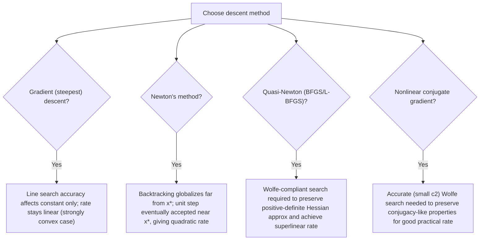

## Convergence Rate Implications of Line Search Choice

### Overview

This topic synthesizes the convergence-rate threads running through the preceding line search discussions into a unified comparison: how does the choice of step-length strategy — exact, Armijo-backtracking, Wolfe, fixed-step — actually affect the asymptotic and non-asymptotic convergence rate of the outer optimization method? The central finding, previewed in step length selection strategies, is that line search accuracy matters far less for worst-case rate than direction quality does, but the relationship is nuanced across convexity classes and method types.

### Rate Classes: A Quick Taxonomy

**[Confirmed]** Convergence rates for iterative descent methods are standardly classified as:

- **Sublinear**: $f(x_k)-f(x^*) = O(1/k)$ or $O(1/\sqrt{k})$ — typical for convex (not strongly convex) objectives, or subgradient methods on nonsmooth problems.
- **Linear (geometric)**: $f(x_k)-f(x^*) \leq c^k[f(x_0)-f(x^*)]$ for some $c\in(0,1)$ — typical for gradient descent on strongly convex smooth functions.
- **Superlinear**: $\|x_{k+1}-x^*\|/\|x_k-x^*\| \to 0$ — typical for quasi-Newton methods (BFGS) under standard assumptions, given Wolfe-compliant line search.
- **Quadratic**: $\|x_{k+1}-x^*\| \leq C\|x_k-x^*\|^2$ — typical for Newton's method near the solution, with unit step length.

**Key Points**

- The rate class is primarily determined by the search **direction**, not the step-length rule: gradient directions give linear rates (at best) on strongly convex problems; Newton directions give quadratic rates near the solution.
- Line search choice mainly affects the **constant** in front of the rate (and whether the theoretical rate is achieved at all in practice, i.e., whether the method converges globally from an arbitrary starting point), rather than the rate class itself.
- The one major exception is Newton's method, where line search choice determines whether the full quadratic rate is realized (unit step accepted) or only a slower rate applies during the early, globalization phase.

### Steepest Descent: Exact vs. Inexact Line Search Rate Comparison

**[Confirmed]** As established previously, steepest descent with exact line search on a strongly convex quadratic with condition number $\kappa$ achieves:

$$f(x_{k+1})-f(x^*) \leq \left(\frac{\kappa-1}{\kappa+1}\right)^2\left[f(x_k)-f(x^*)\right]$$

**[Confirmed]** Gradient descent with a well-chosen **fixed** step $\bar\alpha=2/(L+\mu)$ on a strongly convex, $L$-smooth function achieves the same rate bound:

$$f(x_{k+1})-f(x^*) \leq \left(\frac{\kappa-1}{\kappa+1}\right)^2\left[f(x_k)-f(x^*)\right]$$

**Output**

These two rates are identical in the worst case — exact line search provides **no asymptotic rate improvement** over a correctly-tuned fixed step for gradient descent on this problem class. **[Inference]** This is a somewhat counterintuitive but well-established fact in the convex optimization literature: the reason is that the worst-case analysis for both methods is driven by the same extremal configuration (an eigenvector-aligned starting error under the quadratic model), and exact line search, while optimal *for that specific direction at that specific iterate*, cannot compensate for the fundamental limitation of the steepest-descent direction itself being poorly suited to ill-conditioned problems.

### Armijo Backtracking: Rate with a Worse Constant

**[Confirmed]** Gradient descent using Armijo backtracking (rather than exact line search or a precisely tuned fixed step) still achieves linear convergence on strongly convex, $L$-smooth functions, but the guaranteed contraction factor typically depends on the Armijo parameter $c_1$ and the backtracking factor $\rho$, generally yielding a **weaker** (larger, i.e., slower) worst-case contraction constant than the optimally-tuned fixed-step or exact-line-search rate.

**[Inference]** The practical gap between the backtracking-guaranteed rate and the exact-line-search rate is often much smaller than the worst-case bounds suggest, because backtracking's guaranteed rate is a conservative bound rather than a tight characterization of typical behavior — in practice, backtracking frequently accepts steps close to what exact line search would choose (as seen numerically in the worked examples across earlier topics, where backtracking landed in a similar region to the exact-search result after a modest number of contractions), so the realized rate on typical problems is often much closer to the exact-line-search rate than the conservative theoretical bound implies.

### Diagram: Rate Class vs. Line Search Accuracy

<svg xmlns="http://www.w3.org/2000/svg" viewBox="0 0 640 400">
\<style\>
.lbl { font-family: sans-serif; font-size: 13px; fill: #1a1a1a; }
.lbl-sm { font-family: sans-serif; font-size: 11px; fill: #444; }
.title { font-family: sans-serif; font-size: 15px; font-weight: bold; fill: #1a1a1a; }
.axis { stroke: #333; stroke-width: 1.5; }
\</style\>
<text x="320" y="26" text-anchor="middle" class="title">Rate Class Depends on Direction, Not Line Search (svg_diagram)</text>
<line x1="60" y1="340" x2="600" y2="340" class="axis" />
<line x1="60" y1="340" x2="60" y2="60" class="axis" />
<text x="600" y="362" text-anchor="middle" class="lbl">line search accuracy (fixed to exact)</text>
<text x="30" y="60" text-anchor="middle" class="lbl">rate</text>

<rect x="90" y="230" width="480" height="50" fill="#d8ecd8" opacity="0.5" />
<text x="330" y="260" text-anchor="middle" class="lbl-sm">Gradient direction: linear rate band, roughly flat across line search accuracy</text>

<rect x="90" y="90" width="280" height="40" fill="#f5e0c0" opacity="0.6" />
<text x="230" y="115" text-anchor="middle" class="lbl-sm">Newton, damped/globalized phase: linear</text>
<rect x="370" y="90" width="200" height="40" fill="#a8d5a8" opacity="0.7" />
<text x="470" y="115" text-anchor="middle" class="lbl-sm">Newton, unit step accepted: quadratic</text>
<line x1="370" y1="80" x2="370" y2="340" stroke="#a53b3b" stroke-width="1.5" stroke-dasharray="4,3" />
<text x="375" y="70" class="lbl-sm" fill="#a53b3b">transition point</text>

<text x="330" y="380" text-anchor="middle" class="lbl-sm">Direction quality determines the rate class; line search mainly sets the constant (except for Newton's transition)</text>

</svg>

### Newton's Method: Where Line Search Choice Matters Most

**[Confirmed]** Newton's method is the primary exception to "line search mostly affects the constant." Far from the solution, the plain Newton direction may not even be a descent direction (as discussed in descent direction concepts, when the Hessian is not positive definite), and even when it is, a full unit step can overshoot badly on non-quadratic functions. Line search (typically Armijo backtracking, since Wolfe curvature conditions are less commonly emphasized for pure Newton) is used to **globalize** Newton's method — guaranteeing convergence from an arbitrary starting point rather than only from a neighborhood of the solution.

**[Confirmed]** The standard theoretical result is: sufficiently close to a solution $x^*$ where $\nabla^2f(x^*)\succ0$ and $\nabla^2f$ is Lipschitz continuous, the backtracking line search **eventually always accepts the full step $\alpha_k=1$**, and once this occurs, the method transitions from whatever globalization-phase rate applied to the full **quadratic** convergence rate characteristic of unit-step Newton's method.

**Derivation sketch of eventual unit-step acceptance.** Near $x^*$, a Taylor expansion of $\phi(\alpha) = f(x_k+\alpha d_k^N)$ (where $d_k^N$ is the Newton direction) shows that the Armijo condition at $\alpha=1$ becomes, to leading order:

$$f(x_k+d_k^N) - f(x_k) \approx \nabla f(x_k)^Td_k^N + \frac{1}{2}(d_k^N)^T\nabla^2f(x_k)d_k^N = -\nabla f(x_k)^T[\nabla^2f(x_k)]^{-1}\nabla f(x_k) + \frac{1}{2}\nabla f(x_k)^T[\nabla^2f(x_k)]^{-1}\nabla f(x_k)$$

$$= -\frac{1}{2}\nabla f(x_k)^T[\nabla^2f(x_k)]^{-1}\nabla f(x_k) = \frac{1}{2}\nabla f(x_k)^Td_k^N$$

Since the Armijo condition at $\alpha=1$ requires $f(x_k+d_k^N)-f(x_k) \leq c_1\nabla f(x_k)^Td_k^N$, and the leading-order actual decrease is $\frac{1}{2}\nabla f(x_k)^Td_k^N$ (i.e., exactly half the initial directional derivative), the condition holds for any $c_1 < 1/2$ once the higher-order (cubic and beyond) terms become negligible near $x^*$ — which happens as $x_k\to x^*$. **[Confirmed]** This is precisely why $c_1 = 10^{-4}$ (well below $1/2$) is the standard choice for Newton-type methods: it guarantees the unit step is eventually accepted, enabling the transition to quadratic convergence.

### Quasi-Newton (BFGS): Superlinear Rate Requires Wolfe-Compliant Search

**[Confirmed]** As established under the Wolfe conditions topic, the BFGS Hessian-approximation update preserves positive definiteness if and only if the secant condition $s_k^Ty_k>0$ holds, and this is guaranteed by the Wolfe curvature condition. Without this guarantee (e.g., using plain Armijo backtracking with no curvature check), the BFGS update can produce an indefinite or non-positive-definite $B_k$, corrupting subsequent search directions and potentially destroying the superlinear convergence property entirely, not merely slowing it.

**[Confirmed]** The classical Dennis-Moré characterization of superlinear convergence for quasi-Newton methods requires, among other conditions, that the step lengths satisfy $\alpha_k \to 1$ (unit steps are eventually accepted, analogous to the Newton case) and that the Hessian approximations satisfy an asymptotic directional accuracy condition. Wolfe-compliant line search is the standard mechanism ensuring these conditions can be met in practice, which is why virtually all practical BFGS/L-BFGS implementations use (strong) Wolfe line search rather than plain backtracking.

**Output**

For quasi-Newton methods specifically, line search choice is **not** merely a constant-factor issue — using an inadequate line search (violating curvature guarantees) can degrade the achieved rate class from superlinear to merely linear, or worse, cause outright failure of convergence due to a corrupted Hessian approximation. This is qualitatively different from the gradient-descent case, where exact vs. backtracking line search only affects the linear-rate constant.

### Diagram: Convergence Rate Sensitivity by Method

### Worked Example: Rate Degradation Illustration

Continuing the $\kappa=10$ quadratic $f(x_1,x_2)=x_1^2+10x_2^2$. The exact-line-search / optimal-fixed-step contraction factor is:

$$\left(\frac{\kappa-1}{\kappa+1}\right)^2 = \left(\frac{9}{11}\right)^2 \approx 0.6694$$

**[Inference]** This means, in the worst case (starting error aligned with the extremal eigenvector), roughly $\log(0.01)/\log(0.6694) \approx 11.5$ iterations are needed to reduce the objective error by a factor of 100, regardless of whether exact line search or an optimally-tuned fixed step is used — both share this same worst-case bound. If instead only a loosely-tuned Armijo backtracking is used with a conservative $c_1$ close to its upper limit and few backtracking iterations permitted, the effective contraction factor could be worse than $0.6694$ in the guaranteed bound (though, as noted, this gap between guaranteed and typically-realized behavior tends to be smaller in practice than the conservative worst-case analysis suggests).

**[Confirmed]** No amount of line search refinement changes the $\left(\frac{\kappa-1}{\kappa+1}\right)^2$ factor's dependence on $\kappa$ itself — this is a property of the steepest-descent direction interacting with the problem's conditioning, not of the line search. Reducing this dependence on $\kappa$ requires changing the **direction** (e.g., to a Newton or quasi-Newton direction, or applying preconditioning), which is the central motivation for moving beyond steepest descent entirely, independent of any line search refinement.

### Summary Table: Rate Implications by Method-and-Search Pairing

| Method | Direction | Line search requirement | Achieved rate |
| --- | --- | --- | --- |
| Gradient descent | $-\nabla f(x_k)$ | Fixed $1/L$, exact, or Armijo — any give linear rate | Linear, factor $\left(\frac{\kappa-1}{\kappa+1}\right)^2$, constant depends weakly on search accuracy |
| Newton (globalized) | $-[\nabla^2f]^{-1}\nabla f$ | Armijo backtracking (small $c_1$) | Linear far from $x^*$, quadratic once unit step accepted near $x^*$ |
| BFGS / L-BFGS | Quasi-Newton direction | (Strong) Wolfe required | Superlinear, contingent on curvature condition holding at every step |
| Nonlinear CG | Conjugate-like direction | Wolfe with small $c_2$ (e.g., $0.1$) preferred | Linear to superlinear depending on variant; sensitive to line search accuracy |

### Conclusion

The choice of line search strategy affects convergence rate in two structurally distinct ways. For gradient-direction methods on strongly convex smooth problems, line search accuracy mainly rescales the constant in an already-linear rate whose dependence on the condition number is fixed by the direction choice — exact line search buys essentially nothing over a well-tuned fixed step in the worst case. For Newton and quasi-Newton methods, by contrast, line search choice is load-bearing for the rate *class* itself: Armijo backtracking is what permits Newton's method to globalize while still recovering quadratic convergence near the solution, and Wolfe-compliant curvature control is what allows BFGS-type methods to achieve superlinear convergence at all, rather than merely a better constant. This asymmetry — line search as a minor efficiency lever for first-order methods versus a structural requirement for second-order and quasi-Newton methods — is the key organizing insight connecting all of the individual line search criteria covered in this sequence.

**Related Topics**

- Dennis-Moré characterization of superlinear convergence for quasi-Newton methods
- Newton's method globalization strategies beyond line search (trust regions, Levenberg-Marquardt)
- Preconditioning as a direction-level remedy for ill-conditioning
- Nonlinear conjugate gradient variants (Fletcher-Reeves, Polak-Ribière, Hestenes-Stiefel) and their line search sensitivity
- Complexity theory lower bounds for first-order methods (Nesterov's optimal gradient methods)
- Trust-region methods as a rate-preserving alternative to line search globalization