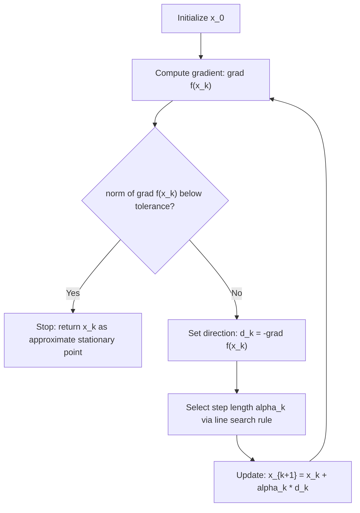

## Steepest Descent Method

### Overview

Steepest descent (also called gradient descent in its basic form) is the foundational first-order optimization method: at each iterate, move in the direction of the negative gradient, the direction of locally steepest decrease. It has already appeared throughout the line search sequence as the running worked example precisely because its simplicity makes it the clearest lens for studying step-length behavior; this topic consolidates its theory as a method in its own right — derivation of the direction, convergence theory, the zig-zagging phenomenon, and its role as a baseline against which more sophisticated methods are measured.

### Derivation: Why the Negative Gradient Is Steepest

**[Confirmed]** At a point $x$ with $\nabla f(x) \neq 0$, consider the problem of finding the unit direction $d$ (i.e., $\|d\|_2=1$) that minimizes the directional derivative $\nabla f(x)^Td$ — the direction of fastest instantaneous decrease.

**Derivation.** By the Cauchy-Schwarz inequality:

$$\nabla f(x)^Td \geq -\|\nabla f(x)\|_2\|d\|_2 = -\|\nabla f(x)\|_2$$

with equality if and only if $d$ is a negative scalar multiple of $\nabla f(x)$, i.e., $d = -\nabla f(x)/\|\nabla f(x)\|_2$. This is the unique unit vector achieving the minimum possible (most negative) directional derivative, confirming that the negative normalized gradient is the direction of steepest decrease in the Euclidean norm.

**Key Points**

- "Steepest" is norm-dependent: the derivation above uses the Euclidean ($\ell_2$) norm; using a different norm (e.g., $\ell_1$ or a general quadratic norm induced by a matrix $M$) yields a different steepest-descent direction, which is the conceptual bridge to preconditioned and Newton-type methods.
- The (unnormalized) steepest descent direction used in practice is simply $d_k = -\nabla f(x_k)$; the normalization only matters for the *identity* of the direction, not for the descent property itself, since any positive scalar multiple of a descent direction is also a descent direction.
- Steepest descent requires only first-order information (the gradient), making it the cheapest-per-iteration method in the descent-direction family covered under descent direction concepts.

### The Basic Algorithm

**[Confirmed]** Given an initial point $x_0$ and a step-length rule (any of exact line search, Armijo backtracking, Wolfe conditions, or a fixed/diminishing schedule, as covered previously):

1. At iteration $k$, compute $\nabla f(x_k)$.
2. Set $d_k = -\nabla f(x_k)$.
3. Choose $\alpha_k$ via the selected step-length rule.
4. Update $x_{k+1} = x_k + \alpha_kd_k = x_k - \alpha_k\nabla f(x_k)$.
5. Terminate when $\|\nabla f(x_k)\|$ is below a specified tolerance, or another stopping criterion is met.

### Diagram: Steepest Descent Iteration Loop

### Convergence: Global Guarantee

**[Confirmed]** For $f$ bounded below with Lipschitz-continuous gradient (constant $L$), steepest descent with any step-length rule satisfying the Zoutendijk-type sufficient decrease property (exact line search, Armijo backtracking, or Wolfe conditions — all covered in prior topics) guarantees:

$$\lim_{k\to\infty} \|\nabla f(x_k)\| = 0$$

**[Confirmed]** This is a direct consequence of steepest descent trivially satisfying the uniform angle condition from descent direction concepts with $\cos\theta_k = 1$ exactly at every iteration (since $d_k$ is exactly antiparallel to $\nabla f(x_k)$), the strongest possible angle condition — so any line search rule that guarantees global convergence for general descent directions automatically guarantees it for steepest descent specifically.

**[Inference]** This global convergence guarantee is unconditional on convexity — it holds for general smooth nonconvex $f$ as well, though in the nonconvex case the guarantee is only that gradient norms vanish (convergence to a stationary point), not that the stationary point is a global or even local minimum.

### Convergence Rate: Strongly Convex Case

**[Confirmed]** As established across the line search topics, for $f$ strongly convex (parameter $\mu$) and $L$-smooth with condition number $\kappa=L/\mu$, steepest descent with exact line search or an optimally-tuned fixed step achieves:

$$f(x_k)-f(x^*) \leq \left(\frac{\kappa-1}{\kappa+1}\right)^{2k}\left[f(x_0)-f(x^*)\right]$$

**Derivation sketch for the quadratic case.** For $f(x)=\frac{1}{2}x^TQx-b^Tx$ with eigenvalues of $Q$ in $[\mu,L]$, steepest descent with exact line search satisfies the classical Kantorovich inequality-based bound. Writing the error in the $Q$-norm, $\|x_k-x^*\|_Q^2 = 2[f(x_k)-f(x^*)]$, the exact-line-search update satisfies

$$\|x_{k+1}-x^*\|_Q^2 \leq \left(\frac{\kappa-1}{\kappa+1}\right)^2\|x_k-x^*\|_Q^2$$

which directly translates to the stated bound on function-value error via the identity relating $\|\cdot\|_Q^2$ to $f(x)-f(x^*)$ for quadratics. **[Confirmed]** This bound is tight — achieved when $x_0-x^*$ is a combination of only the extreme eigenvectors of $Q$ (those associated with $\lambda_{\min}=\mu$ and $\lambda_{\max}=L$) — which is exactly the regime illustrated numerically in the earlier worked examples with $Q=\text{diag}(2,20)$.

### The Zig-Zagging Phenomenon

**[Confirmed]** As derived under exact line search techniques, exact-line-search steepest descent produces consecutive gradients that are exactly orthogonal: $\nabla f(x_{k+1})^T\nabla f(x_k)=0$. On elongated (high-condition-number) quadratic level sets, this orthogonality forces the iterate path to bounce back and forth between the two "walls" of the elongated contour ellipses, taking many short steps to traverse the narrow direction while making comparatively little progress along the long axis per iteration relative to the total path length.

**[Inference]** This is the geometric root cause of the $\kappa$-dependence in the convergence rate: as $\kappa\to\infty$, the contours become increasingly elongated, the zig-zag angle approaches 180° (nearly reversing direction each step), and the effective progress per iteration shrinks toward zero, consistent with the contraction factor $\left(\frac{\kappa-1}{\kappa+1}\right)^2 \to 1$ in that limit.

### Diagram: Zig-Zagging on an Elongated Quadratic

<svg xmlns="http://www.w3.org/2000/svg" viewBox="0 0 600 420">
\<style\>
.lbl { font-family: sans-serif; font-size: 13px; fill: #1a1a1a; }
.lbl-sm { font-family: sans-serif; font-size: 11px; fill: #444; }
.title { font-family: sans-serif; font-size: 15px; font-weight: bold; fill: #1a1a1a; }
.path { stroke: #a53b3b; stroke-width: 2; fill: none; }
\</style\>
<text x="300" y="26" text-anchor="middle" class="title">Zig-Zag Path of Steepest Descent (svg_diagram)</text>

<ellipse cx="300" cy="220" rx="260" ry="80" fill="none" stroke="#ccc" stroke-width="1" />
<ellipse cx="300" cy="220" rx="190" ry="58" fill="none" stroke="#ccc" stroke-width="1" />
<ellipse cx="300" cy="220" rx="120" ry="36" fill="none" stroke="#ccc" stroke-width="1" />
<ellipse cx="300" cy="220" rx="55" ry="17" fill="none" stroke="#ccc" stroke-width="1" />
<circle cx="300" cy="220" r="3" fill="#333" />
<text x="308" y="215" class="lbl-sm">minimizer</text>

<path d="M 90 260 L 250 165 L 150 250 L 260 190 L 200 225 L 280 205 L 250 218 L 295 220" class="path" marker-end="url(#arrow)" />
<circle cx="90" cy="260" r="4" fill="#a53b3b" />
<text x="70" y="280" class="lbl-sm">x_0</text>
<text x="300" y="380" text-anchor="middle" class="lbl-sm">Consecutive steps are orthogonal; progress along the long axis is slow relative to path length</text>

</svg>

### Worked Example: Multi-Iteration Trajectory

Continuing $f(x_1,x_2)=x_1^2+10x_2^2$, $x_0=(1,1)$, using exact line search at each step (formula $\alpha_k = -\nabla f(x_k)^Td_k/(d_k^TQd_k)$ derived under exact line search techniques).

**Iteration 0 (already computed):** $x_1 \approx (0.899, -0.00905)$ (recomputing with more decimal precision from $\alpha_0=404/8008$).

**Iteration 1:** $\nabla f(x_1) = (2\times0.899,\ 20\times(-0.00905)) = (1.798, -0.181)$.

$d_1 = -(1.798,-0.181)$. $d_1^TQd_1 = 2(1.798)^2+20(0.181)^2 = 2(3.233)+20(0.0328) = 6.466+0.655=7.121$.

$\nabla f(x_1)^Td_1 = -[(1.798)^2+(0.181)^2\times20/20]$... more directly: $\nabla f(x_1)^Td_1 = -\|\nabla f(x_1)\|^2$ is not quite right dimensionally here since $Q\ne I$; compute directly: $\nabla f(x_1)^Td_1 = (1.798,-0.181)\cdot(-1.798,0.181) = -(1.798)^2-(0.181)^2 = -3.233-0.0328=-3.265$.

$\alpha_1 = -(-3.265)/7.121 = 0.4586$.

$x_2 = x_1+\alpha_1d_1 = (0.899,-0.00905)+0.4586\times(-1.798,0.181) = (0.899-0.8246,\ -0.00905+0.083) = (0.0744,\ 0.0740)$.

**Output**

$f(x_2) = (0.0744)^2+10(0.0740)^2 = 0.00553+0.0548=0.0603$, down from $f(x_0)=11$ and $f(x_1)\approx0.809$.

**[Confirmed]** Two iterations reduced the objective from $11$ to about $0.06$ — a substantial decrease — but note the characteristic pattern: $x_1$ had nearly eliminated the $x_2$-coordinate ($-0.009$) while leaving $x_1$-coordinate large ($0.899); $x_2
 then swings back to having both coordinates comparable in magnitude ($0.074, 0.074$) rather than continuing to shrink monotonically in each coordinate separately — this oscillating coordinate-wise behavior across iterations is the numerical signature of the zig-zag pattern shown in the diagram above.

### Steepest Descent as a Baseline

**[Confirmed]** Because of the zig-zagging phenomenon and its $\kappa$-dependent rate, steepest descent is rarely used as a production algorithm for ill-conditioned smooth problems in practice; it primarily serves as:

- A **theoretical baseline**: convergence rates of more sophisticated methods (Newton, quasi-Newton, conjugate gradient, accelerated gradient methods) are typically compared against the steepest-descent rate to quantify improvement.
- A **fallback direction**: some robust implementations of Newton-type methods revert to a steepest-descent (or scaled steepest-descent) step when the Newton direction fails the descent test (e.g., due to an indefinite Hessian), as noted under descent direction concepts.
- A **pedagogical tool**: its simplicity makes it the standard first example for introducing line search, convergence rate analysis, and the effect of conditioning — the role it has played throughout this line search sequence.

### Comparison: Steepest Descent vs. Other First-Order and Second-Order Methods

| Method | Per-iteration cost | Rate on strongly convex smooth $f$ | Sensitivity to $\kappa$ |
| --- | --- | --- | --- |
| Steepest descent | Gradient only | Linear, factor $\left(\frac{\kappa-1}{\kappa+1}\right)^2$ | High |
| Nesterov accelerated gradient | Gradient only (with momentum term) | Linear, factor $\left(\frac{\sqrt\kappa-1}{\sqrt\kappa+1}\right)$ | **[Confirmed]** Lower — depends on $\sqrt\kappa$ rather than $\kappa$ |
| Newton's method | Gradient + Hessian (+ solve) | Quadratic (locally) | None locally (rate independent of $\kappa$ near $x^*$) |
| BFGS | Gradient only (+ Hessian approx.) | Superlinear | Low, though initial phase can be affected |
| Conjugate gradient (linear CG, quadratic $f$) | Gradient only | Finite termination in $\leq n$ steps (exact arithmetic); practical rate depends on $\sqrt\kappa$ | **[Confirmed]** Similar improvement to Nesterov, via $\sqrt\kappa$ dependence |

**[Confirmed]** The $\sqrt\kappa$ versus $\kappa$ dependence shown for Nesterov's method and conjugate gradient is a well-established, provable improvement over plain steepest descent's $\kappa$-dependence, and represents the theoretical motivation for momentum-based and conjugate-direction methods — both achieve strictly better worst-case rates using only first-order (gradient) information, without the added per-iteration cost of computing or approximating second-order information.

### Preconditioned Steepest Descent

**[Inference]** A direct remedy for the $\kappa$-dependence, without changing to a fundamentally different method class, is preconditioning: applying steepest descent to the transformed variable $\tilde x = P^{-1/2}x$ for a symmetric positive definite matrix $P$ chosen to approximate $Q$ (or, more generally, the local Hessian), effectively rescaling the problem so its effective condition number is close to $1. This transforms the steepest descent direction in the original variable into $d_k = -P^{-1}\nabla f(x_k)
, and when $P$ closely approximates the Hessian, this direction approaches the Newton direction — illustrating that "steepest descent" and "Newton's method" sit at two ends of a continuum indexed by how well the chosen (possibly implicit) metric $P$ approximates the true local curvature.

### Conclusion

Steepest descent is the simplest and cheapest first-order descent method, always moving along the exact negative gradient, and its convergence properties are fully characterized by the problem's condition number: it converges globally under mild smoothness assumptions regardless of line search rule (owing to its perfect angle-condition alignment), but its linear rate degrades toward the theoretical worst case as $\kappa$ grows, manifesting concretely as the zig-zagging behavior demonstrated in the worked trajectory. Its enduring role is less as a production algorithm for ill-conditioned problems and more as the reference point against which every more sophisticated method in this sequence — Newton, quasi-Newton, conjugate gradient, and accelerated methods — is measured, and as the conceptual anchor connecting search-direction quality (this topic and descent direction concepts) to the step-length machinery (the preceding exact/inexact/Wolfe/Goldstein/backtracking topics) that determines how effectively that direction is actually used at each iteration.

**Related Topics**

- Nesterov's accelerated gradient method and momentum-based acceleration
- Preconditioning and variable-metric methods as a bridge to Newton-type directions
- Conjugate gradient method: linear (quadratic objective) and nonlinear variants
- Newton's method and local quadratic convergence theory
- Condition number estimation and its role in step-size selection
- Convergence theory for nonconvex smooth optimization (stationary point guarantees only)