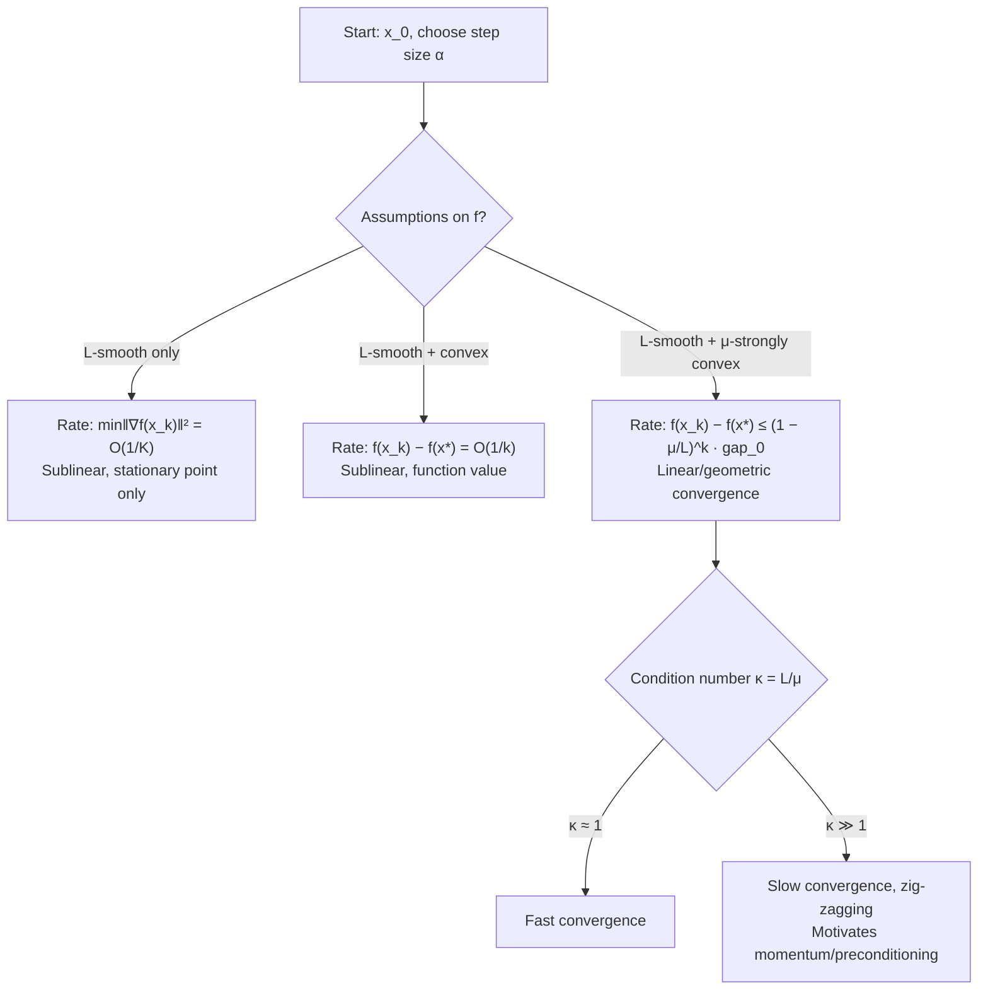

## Convergence Analysis of Gradient Descent

### Overview

Convergence analysis quantifies how quickly (or whether) gradient descent's iterates $x_k$ approach a minimizer $x^*$ as $k \to \infty$. The rate depends on structural assumptions about the objective function $f$: Lipschitz smoothness, convexity, strong convexity, and the choice of step size. This section develops the standard convergence results for gradient descent on unconstrained problems $\min_x f(x)$, $x \in \mathbb{R}^n$.

### Setup and Notation

The gradient descent update is:

$$x_{k+1} = x_k - \alpha_k \nabla f(x_k)$$

where $\alpha_k > 0$ is the step size (learning rate) at iteration $k$. Convergence claims are typically stated in one of three currencies:

- **Iterate convergence**: $\|x_k - x^*\| \to 0$
- **Function value convergence**: $f(x_k) - f(x^*) \to 0$
- **Gradient norm convergence**: $\|\nabla f(x_k)\| \to 0$

These are not equivalent in general. Gradient norm convergence is the weakest (it only certifies a stationary point), function value convergence is standard for convex problems, and iterate convergence is the strongest and requires additional structure (typically strong convexity) to guarantee.

### Core Assumptions

**L-smoothness (Lipschitz continuous gradient)**

$f$ is L-smooth if:

$$\|\nabla f(x) - \nabla f(y)\| \leq L\|x - y\| \quad \forall x, y$$

This bounds how fast the gradient can change and yields the **descent lemma**:

$$f(y) \leq f(x) + \nabla f(x)^\top(y - x) + \frac{L}{2}\|y - x\|^2$$

The descent lemma is the workhorse of nearly all gradient descent convergence proofs — it upper-bounds $f$ by a quadratic, letting us guarantee decrease at each step.

**Convexity**

$f$ is convex if:

$$f(y) \geq f(x) + \nabla f(x)^\top(y - x) \quad \forall x, y$$

**$\mu$-strong convexity**

$f$ is $\mu$-strongly convex ($\mu > 0$) if:

$$f(y) \geq f(x) + \nabla f(x)^\top(y - x) + \frac{\mu}{2}\|y - x\|^2 \quad \forall x, y$$

Strong convexity is a lower quadratic bound, mirroring the upper bound from L-smoothness. Together, L-smoothness and $\mu$-strong convexity sandwich $f$ between two quadratics, which is what produces linear (geometric) convergence rates.

### Step Size Selection

**Key Points**

- For L-smooth $f$, a constant step size $\alpha \leq 1/L$ guarantees monotonic decrease in $f$ at every iteration.
- $\alpha = 1/L$ is the standard theoretical choice; it maximizes the guaranteed per-step decrease in the worst-case analysis.
- Step sizes $\alpha > 2/L$ can cause divergence even for smooth convex $f$; this is a hard threshold from the descent lemma, not a heuristic.
- Diminishing step sizes (e.g., $\alpha_k = c/\sqrt{k}$ or satisfying $\sum \alpha_k = \infty$, $\sum \alpha_k^2 < \infty$) are used when $L$ is unknown or when convergence to an exact minimizer (rather than a neighborhood) is required under weaker assumptions.

Substituting $y = x_{k+1} = x_k - \alpha \nabla f(x_k)$ into the descent lemma:

$$f(x_{k+1}) \leq f(x_k) - \alpha\left(1 - \frac{L\alpha}{2}\right)\|\nabla f(x_k)\|^2$$

For $\alpha \leq 1/L$, the coefficient $\left(1 - \frac{L\alpha}{2}\right) \geq \frac{1}{2}$, giving:

$$f(x_{k+1}) \leq f(x_k) - \frac{\alpha}{2}\|\nabla f(x_k)\|^2$$

This single inequality is the seed for every convergence rate below.

### Convergence Rate: General (Non-Convex) Case

Without convexity, gradient descent is only guaranteed to reach a **stationary point** ($\|\nabla f(x)\| = 0$), not a global or even local minimizer — the objective may have saddle points or local minima.

Summing the per-step decrease inequality from $k = 0$ to $K-1$ and telescoping:

$$\sum_{k=0}^{K-1} \|\nabla f(x_k)\|^2 \leq \frac{2}{\alpha}(f(x_0) - f(x^*))$$

This implies:

$$\min_{0 \leq k \leq K-1} \|\nabla f(x_k)\|^2 \leq \frac{2(f(x_0) - f(x^*))}{\alpha K}$$

**Result**: $\min_{k < K} \|\nabla f(x_k)\| = O(1/\sqrt{K})$ — a **sublinear** rate. To guarantee $\|\nabla f(x_k)\| \leq \epsilon$, one needs $O(1/\epsilon^2)$ iterations. This is the weakest but most broadly applicable guarantee, holding for any L-smooth function regardless of convexity.

### Convergence Rate: Convex Case

For convex, L-smooth $f$ with $\alpha \leq 1/L$, the function value gap converges at rate:

$$f(x_k) - f(x^*) \leq \frac{2L\|x_0 - x^*\|^2}{k}$$

**Result**: $O(1/k)$ sublinear convergence in function value. This is a strict improvement over the non-convex case but is still sublinear — the number of iterations to reach accuracy $\epsilon$ scales as $O(1/\epsilon)$.

Convexity alone does not guarantee iterate convergence rate (only that iterates stay bounded and function values converge); the minimizer $x^*$ need not even be unique without additional structure.

### Convergence Rate: Strongly Convex Case (Linear Convergence)

This is the case where gradient descent achieves its best-known guarantee. For $\mu$-strongly convex, L-smooth $f$, with $\alpha = 1/L$:

$$f(x_{k+1}) - f(x^*) \leq \left(1 - \frac{\mu}{L}\right)(f(x_k) - f(x^*))$$

Unrolling the recursion:

$$f(x_k) - f(x^*) \leq \left(1 - \frac{\mu}{L}\right)^k (f(x_0) - f(x^*))$$

An analogous bound holds for the iterates themselves:

$$\|x_k - x^*\|^2 \leq \left(1 - \frac{\mu}{L}\right)^k \|x_0 - x^*\|^2$$

**Result**: **Linear (geometric) convergence**. The error shrinks by a constant factor $\left(1 - \frac{\mu}{L}\right)$ every iteration. To reach accuracy $\epsilon$ requires $O\left(\kappa \log(1/\epsilon)\right)$ iterations, where $\kappa = L/\mu$ is the **condition number** of the problem.

### The Condition Number and Its Role

**Key Points**

- $\kappa = L/\mu \geq 1$ always, since $L$ (curvature upper bound) is at least as large as $\mu$ (curvature lower bound).
- $\kappa$ close to 1 (well-conditioned problem, level sets near-spherical) → fast convergence, few iterations needed.
- $\kappa \gg 1$ (ill-conditioned, elongated elliptical level sets) → convergence factor $\left(1 - \frac{\mu}{L}\right) \to 1$, meaning very slow practical convergence despite the "linear" label.
- This is why plain gradient descent performs poorly on ill-conditioned problems (e.g., logistic regression with correlated features, poorly scaled variables) even though the theoretical rate is geometric — the base of the geometric decay is close to 1.
- Momentum-based methods and preconditioning (covered in later sections) exist specifically to reduce the effective condition number's impact on convergence speed. [Unverified: the precise speedup depends on the specific accelerated method and problem class, e.g., Nesterov's method improves the iteration complexity dependence from $O(\kappa)$ to $O(\sqrt{\kappa})$ for this problem class, but this claim is deferred to the acceleration section rather than derived here.]

### Illustration: Effect of Condition Number on Convergence Path

<svg xmlns="http://www.w3.org/2000/svg" viewBox="0 0 700 420">
<text x="350" y="28" text-anchor="middle" font-size="18" font-weight="bold" fill="#1a1a1a">Gradient Descent Path: Well- vs Ill-Conditioned (svg_diagram)</text>


<text x="175" y="55" text-anchor="middle" font-size="14" fill="#333">Well-conditioned (κ ≈ 1)</text>

<g>

<ellipse cx="175" cy="220" rx="130" ry="115" fill="none" stroke="`#c7d2fe`" stroke-width="1.5" />

<ellipse cx="175" cy="220" rx="100" ry="88" fill="none" stroke="`#a5b4fc`" stroke-width="1.5" />

<ellipse cx="175" cy="220" rx="70" ry="62" fill="none" stroke="`#818cf8`" stroke-width="1.5" />

<ellipse cx="175" cy="220" rx="40" ry="35" fill="none" stroke="`#6366f1`" stroke-width="1.5" />

<ellipse cx="175" cy="220" rx="12" ry="10" fill="none" stroke="`#4338ca`" stroke-width="1.5" />

<circle cx="175" cy="220" r="3" fill="`#4338ca`" />



```
<polyline points="70,120 110,175 140,205 158,215 168,219 173,220" fill="none" stroke="#dc2626" stroke-width="2.5" marker-end="url(#arrow1)" />
<circle cx="70" cy="120" r="4" fill="#dc2626" />
<text x="55" y="110" font-size="11" fill="#dc2626">x₀</text>
```

</g>


<text x="525" y="55" text-anchor="middle" font-size="14" fill="#333">Ill-conditioned (κ ≫ 1)</text>

<g>

<ellipse cx="525" cy="220" rx="150" ry="45" fill="none" stroke="`#c7d2fe`" stroke-width="1.5" />

<ellipse cx="525" cy="220" rx="120" ry="34" fill="none" stroke="`#a5b4fc`" stroke-width="1.5" />

<ellipse cx="525" cy="220" rx="90" ry="24" fill="none" stroke="`#818cf8`" stroke-width="1.5" />

<ellipse cx="525" cy="220" rx="55" ry="14" fill="none" stroke="`#6366f1`" stroke-width="1.5" />

<ellipse cx="525" cy="220" rx="20" ry="5" fill="none" stroke="`#4338ca`" stroke-width="1.5" />

<circle cx="525" cy="220" r="3" fill="`#4338ca`" />



```
<polyline points="400,140 430,205 400,232 435,213 415,222 460,216 440,222 500,219 480,221 522,220" fill="none" stroke="#dc2626" stroke-width="2" marker-end="url(#arrow2)" />
<circle cx="400" cy="140" r="4" fill="#dc2626" />
<text x="385" y="130" font-size="11" fill="#dc2626">x₀</text>
```

</g>

<text x="175" y="365" text-anchor="middle" font-size="11" fill="#555">Direct path — few iterations</text>

<text x="525" y="365" text-anchor="middle" font-size="11" fill="#555">Zig-zag path — many iterations</text>

<text x="350" y="400" text-anchor="middle" font-size="12" fill="#333" font-style="italic">Convergence factor (1 − μ/L) depends heavily on level-set shape</text>

</svg>

### Summary of Rates

| Assumption | Metric | Rate | Iterations for $\epsilon$-accuracy |
| --- | --- | --- | --- |
| L-smooth only | $\min_k \|\nabla f(x_k)\|^2$ | $O(1/K)$ | $O(1/\epsilon^2)$ |
| L-smooth + convex | $f(x_k) - f(x^*)$ | $O(1/k)$ | $O(1/\epsilon)$ |
| L-smooth + $\mu$-strongly convex | $f(x_k) - f(x^*)$ | $O((1-\mu/L)^k)$ | $O(\kappa \log(1/\epsilon))$ |

### Proof Sketch: Strongly Convex Linear Rate

**Example**

A compact derivation sketch, combining the descent lemma with a consequence of strong convexity known as the **Polyak-Łojasiewicz (PL) inequality**, which strongly convex functions satisfy:

$$\|\nabla f(x)\|^2 \geq 2\mu(f(x) - f(x^*))$$

Starting from the per-step decrease bound with $\alpha = 1/L$:

$$f(x_{k+1}) \leq f(x_k) - \frac{1}{2L}\|\nabla f(x_k)\|^2$$

Apply the PL inequality:

$$f(x_{k+1}) \leq f(x_k) - \frac{1}{2L} \cdot 2\mu(f(x_k) - f(x^*)) = f(x_k) - \frac{\mu}{L}(f(x_k) - f(x^*))$$

Subtracting $f(x^*)$ from both sides:

$$f(x_{k+1}) - f(x^*) \leq \left(1 - \frac{\mu}{L}\right)(f(x_k) - f(x^*))$$

which is the linear recursion stated earlier. Note the PL inequality alone (without full convexity) is sufficient to derive this rate — this observation underlies extensions of linear-convergence results to certain non-convex but PL-satisfying functions (e.g., some over-parameterized neural network loss landscapes). [Inference: this extension is a well-known research direction but its applicability is problem-specific and not derived further here.]

### Convergence Flow Overview



### Practical Implications

**Key Points**

- Theoretical rates assume exact gradients and exact step sizes ($\alpha \leq 1/L$); in practice $L$ is often unknown and estimated via backtracking line search.
- The condition number $\kappa$ is frequently the dominant practical bottleneck — feature scaling, standardization, and preconditioning are common practical remedies that reduce effective $\kappa$.
- The $O(1/k)$ and $O((1-\mu/L)^k)$ rates are **worst-case** guarantees; actual empirical convergence can be faster depending on the specific function and initialization. [Unverified: actual behavior may vary substantially by problem instance.]
- Non-convex settings (most deep learning objectives) rely on the weaker $O(1/\sqrt{K})$ gradient-norm guarantee, which says nothing about the quality of the stationary point reached (saddle vs. local minimum vs. global minimum).

### Conclusion

Gradient descent's convergence rate is governed entirely by how much curvature structure the objective provides: no convexity yields only $O(1/\sqrt{K})$ stationarity guarantees, convexity upgrades this to $O(1/k)$ in function value, and strong convexity yields linear $O((1-\mu/L)^k)$ convergence gated by the condition number $\kappa = L/\mu$. This condition-number dependence is the central practical weakness of vanilla gradient descent and directly motivates the acceleration and preconditioning techniques covered next.

**Related Topics**

- Nesterov's Accelerated Gradient Method and the $O(\sqrt{\kappa})$ complexity improvement
- Backtracking line search and adaptive step size selection
- The Polyak-Łojasiewicz (PL) condition beyond strong convexity
- Preconditioning and variable scaling to reduce effective condition number
- Stochastic gradient descent convergence analysis (noisy gradient case)
- Momentum methods (Heavy Ball, Polyak momentum) and their convergence guarantees
- Convergence analysis of Newton's method and quasi-Newton methods (BFGS, L-BFGS)