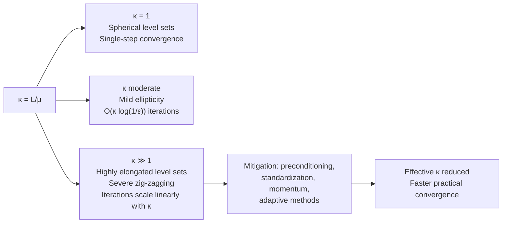

## Condition Number Effects on Convergence

### Overview

The condition number $\kappa$ is the single most influential scalar quantity governing gradient descent's practical convergence speed. While the previous section established that strongly convex, L-smooth functions converge linearly at rate $(1 - \mu/L)^k$, this section isolates $\kappa = L/\mu$ as the object of study: what it measures geometrically, why it dominates iteration complexity, how it arises from Hessian structure, and what strategies mitigate its effects.

### Definition

For a twice-differentiable $\mu$-strongly convex, L-smooth function $f$, the condition number is:

$$\kappa = \frac{L}{\mu} \geq 1$$

When $f$ is quadratic, $f(x) = \frac{1}{2}x^\top A x - b^\top x$ with $A$ symmetric positive definite, $L$ and $\mu$ correspond exactly to the largest and smallest eigenvalues of $A$:

$$L = \lambda_{\max}(A), \quad \mu = \lambda_{\min}(A), \quad \kappa = \frac{\lambda_{\max}(A)}{\lambda_{\min}(A)}$$

This is the same condition number used in numerical linear algebra for matrix conditioning — the two notions coincide for quadratic objectives since $\nabla^2 f(x) = A$ everywhere.

For general (non-quadratic) strongly convex functions, $\kappa$ is defined via global bounds on the Hessian's eigenvalues:

$$\mu I \preceq \nabla^2 f(x) \preceq L I \quad \forall x$$

so $\kappa$ effectively measures the worst-case eigenvalue spread of the Hessian over the entire domain.

### Geometric Interpretation

**Key Points**

- $\kappa$ measures the eccentricity of the function's level sets. For a quadratic, level sets are ellipsoids whose axis ratio is $\sqrt{\kappa}$ (not $\kappa$ itself — this distinction matters for rate comparisons).
- $\kappa = 1$: level sets are perfect spheres. The negative gradient always points directly at the minimizer.
- $\kappa \gg 1$: level sets are highly elongated ellipsoids. The gradient direction is nearly orthogonal to the direction toward $x^*$ except along the major axis, producing a characteristic zig-zag path.
- The zig-zagging is not a numerical artifact — it is the provably optimal behavior of pure gradient descent on an ill-conditioned quadratic with a fixed step size; the method genuinely cannot do better without additional information (e.g., curvature).

### Why Zig-Zagging Happens: Two-Variable Quadratic

Consider $f(x_1, x_2) = \frac{1}{2}(\lambda_1 x_1^2 + \lambda_2 x_2^2)$ with $\lambda_1 \gg \lambda_2 > 0$, so $\kappa = \lambda_1/\lambda_2$. The gradient is $\nabla f = (\lambda_1 x_1, \lambda_2 x_2)$.

With step size $\alpha = 1/\lambda_1$ (required for stability along the steep direction), the update along each axis is:

$$x_1^{(k+1)} = x_1^{(k)}(1 - \alpha\lambda_1) = 0 \quad \text{(converges in one step)}$$


$$x_2^{(k+1)} = x_2^{(k)}(1 - \alpha\lambda_2) = x_2^{(k)}\left(1 - \frac{\lambda_2}{\lambda_1}\right)$$

The step size that stabilizes the steep ($\lambda_1$) direction is far too small to make fast progress along the shallow ($\lambda_2$) direction — this mismatch is the entire mechanism behind slow ill-conditioned convergence. The per-step shrinkage factor along the shallow direction is $\left(1 - \frac{1}{\kappa}\right)$, matching the general linear rate bound.

### Illustration: Eigenvalue Spread and Path Geometry

<svg xmlns="http://www.w3.org/2000/svg" viewBox="0 0 700 380">
<text x="350" y="28" text-anchor="middle" font-size="18" font-weight="bold" fill="#1a1a1a">Level Sets and Eigenvalue Axes (svg_diagram)</text>
<g>
<ellipse cx="350" cy="210" rx="260" ry="70" fill="none" stroke="#c7d2fe" stroke-width="1.5" />
<ellipse cx="350" cy="210" rx="210" ry="56" fill="none" stroke="#a5b4fc" stroke-width="1.5" />
<ellipse cx="350" cy="210" rx="150" ry="40" fill="none" stroke="#818cf8" stroke-width="1.5" />
<ellipse cx="350" cy="210" rx="90" ry="24" fill="none" stroke="#6366f1" stroke-width="1.5" />
<ellipse cx="350" cy="210" rx="35" ry="9" fill="none" stroke="#4338ca" stroke-width="1.5" />
<circle cx="350" cy="210" r="3" fill="#1a1a1a" />
<text x="350" y="200" font-size="11" text-anchor="middle" fill="#1a1a1a">x*</text>



```

<line x1="90" y1="210" x2="610" y2="210" stroke="#059669" stroke-width="1.5" stroke-dasharray="4,3" />
<text x="612" y="214" font-size="12" fill="#059669">λ_min direction (shallow)</text>


<line x1="350" y1="130" x2="350" y2="290" stroke="#b45309" stroke-width="1.5" stroke-dasharray="4,3" />
<text x="358" y="125" font-size="12" fill="#b45309">λ_max direction (steep)</text>


<polyline points="120,140 300,270 155,155 290,262 175,168 280,255 200,180 265,245 225,192 250,232 320,212" fill="none" stroke="#dc2626" stroke-width="2" marker-end="url(#arrow3)" />
<circle cx="120" cy="140" r="4" fill="#dc2626" />
<text x="100" y="128" font-size="11" fill="#dc2626">x₀</text>
```

</g>

<text x="350" y="345" text-anchor="middle" font-size="12" fill="#333" font-style="italic">Each step overshoots along the steep axis, undershoots along the shallow axis</text>

</svg>

### Iteration Complexity Dependence

Recall the linear convergence bound:

$$f(x_k) - f(x^*) \leq \left(1 - \frac{1}{\kappa}\right)^k (f(x_0) - f(x^*))$$

To reach $f(x_k) - f(x^*) \leq \epsilon$, solve for $k$:

$$k \geq \kappa \log\left(\frac{f(x_0) - f(x^*)}{\epsilon}\right)$$

using the standard bound $\log\left(\frac{1}{1-1/\kappa}\right) \approx \frac{1}{\kappa}$ for large $\kappa$. So:

**Result**: iteration complexity scales **linearly in $\kappa$**: $O(\kappa \log(1/\epsilon))$. Doubling $\kappa$ roughly doubles the required iterations. This is the precise sense in which $\kappa$ is the dominant practical bottleneck for gradient descent — worse conditioning translates directly, proportionally, into more iterations.

### Worked Numerical Example

**Example**

Consider $f(x_1, x_2) = \frac{1}{2}(x_1^2 + 100x_2^2)$, so $\lambda_{\max} = 100$, $\lambda_{\min} = 1$, $\kappa = 100$.

- Convergence factor per iteration: $1 - 1/\kappa = 0.99$
- Iterations to reduce the function gap by a factor of $10^{-6}: $k \geq 100 \cdot \ln(10^6) \approx 100 \times 13.8 \approx 1382
   iterations

Compare to a well-conditioned case with $\kappa = 4$:

- Convergence factor: $1 - 1/4 = 0.75$
- Iterations for the same $10^{-6}$ reduction: $k \geq 4 \times 13.8 \approx 56$ iterations

A 25× increase in $\kappa$ produced a roughly 25× increase in required iterations — consistent with the linear-in-$\kappa$ scaling derived above.

### Sources of Ill-Conditioning in Practice

**Key Points**

- **Feature scale disparity**: in regression/ML objectives, features measured on very different numeric scales (e.g., age in years vs. income in dollars) directly inflate the Hessian's eigenvalue spread.
- **Multicollinearity**: highly correlated features in least-squares-type objectives push $\lambda_{\min}(A) \to 0$, driving $\kappa \to \infty$.
- **Deep/narrow network architectures**: loss landscapes in neural networks can exhibit highly anisotropic curvature, with $\kappa$ varying across regions of parameter space. [Unverified: the exact curvature structure is architecture- and data-dependent and is an active empirical research area, not a fixed constant.]
- **Poorly chosen regularization**: very small or absent regularization on ill-posed problems can leave $\lambda_{\min}(A)$ close to zero.

### Mitigation Strategies

**Key Points**

- **Feature standardization/normalization**: rescaling inputs to comparable variance (zero mean, unit variance) is often the cheapest and most effective fix, since it directly reshapes the Hessian's eigenvalue spread for many common loss functions.
- **Preconditioning**: transforming variables via $x = P\tilde{x}$ for a suitable matrix $P$ (e.g., $P \approx A^{-1/2}$ for quadratics) to make the transformed problem's effective condition number close to 1. Newton's method can be viewed as the extreme case of preconditioning using the exact inverse Hessian.
- **Momentum methods**: Heavy Ball and Nesterov's accelerated gradient do not reduce $\kappa$ itself but change the effective dependence of iteration complexity from $O(\kappa)$ to $O(\sqrt{\kappa})$, which is a substantial improvement for large $\kappa$. [Inference: this rate improvement is a well-established theoretical result for the relevant method class, deferred to the acceleration section for full derivation.]
- **Adaptive/coordinate-wise methods**: algorithms such as Adagrad, RMSProp, and Adam implicitly perform a form of diagonal preconditioning, rescaling each coordinate's effective step size based on observed gradient magnitudes.
- **Trust-region and quasi-Newton methods**: (BFGS, L-BFGS) build curvature approximations that adapt to the local conditioning, largely sidestepping the fixed-$\kappa$ dependence of pure gradient descent.

### Condition Number Across the Rate Hierarchy



### Practical Implications

**Key Points**

- Checking or estimating $\kappa$ (e.g., via the ratio of extreme Hessian eigenvalues, or extreme singular values of the design matrix in least squares) is a useful diagnostic before committing to plain gradient descent.
- In practice, $\kappa$ is rarely known exactly for non-quadratic objectives; behavior is often inferred empirically by observing whether convergence stalls or oscillates.
- The condition number bottleneck is specific to fixed-step, first-order methods; it does not equally afflict second-order methods, though those carry higher per-iteration cost ($O(n^2)$ to $O(n^3)$ for Hessian operations vs. $O(n)$ for gradient descent).
- For very large-scale problems, the tradeoff is not simply "reduce $\kappa$" but "reduce $\kappa$ subject to per-iteration cost constraints" — this tradeoff motivates much of the design space in modern optimization algorithms.

### Conclusion

The condition number $\kappa = L/\mu$ governs gradient descent's convergence speed through a direct, linear relationship: iteration complexity is $O(\kappa \log(1/\epsilon))$. Geometrically, $\kappa$ measures the eccentricity of the objective's level sets, and large $\kappa$ produces the characteristic zig-zag convergence path as the fixed step size is forced to balance stability along the steepest curvature direction against progress along the shallowest. Because $\kappa$ arises naturally from feature scaling, multicollinearity, and problem structure, understanding and mitigating it — through standardization, preconditioning, or algorithmic modification — is central to making gradient-based optimization practical.

**Related Topics**

- Nesterov's Accelerated Gradient Method and the $O(\sqrt{\kappa})$ complexity result
- Preconditioned gradient descent and variable transformation techniques
- Newton's method and quasi-Newton methods (BFGS, L-BFGS) as curvature-adaptive alternatives
- Adaptive gradient methods (Adagrad, RMSProp, Adam) as implicit diagonal preconditioners
- Feature scaling and standardization techniques in applied optimization
- Condition number estimation via power iteration and singular value analysis