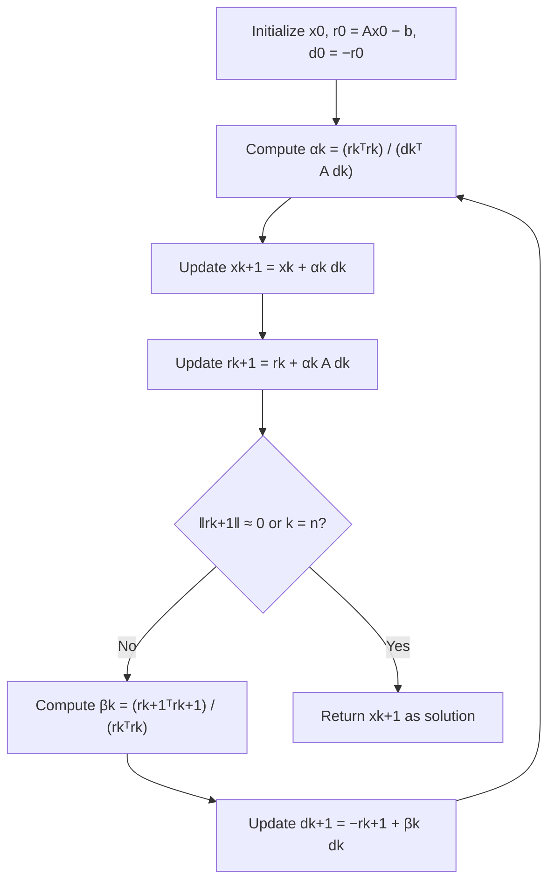

## Conjugate Gradient Method for Quadratics

### Overview

The conjugate gradient (CG) method resolves the zig-zagging problem that plagues gradient descent on ill-conditioned quadratics by choosing search directions that are mutually conjugate with respect to the Hessian, rather than repeatedly using the raw negative gradient. For an $n$-dimensional quadratic, CG guarantees exact convergence in at most $n$ iterations in exact arithmetic — a fundamentally different guarantee from gradient descent's asymptotic linear rate. This section develops CG specifically for quadratic objectives, the setting in which its theory is cleanest and its guarantees are strongest.

### Problem Setup

Consider minimizing the quadratic:

$$f(x) = \frac{1}{2}x^\top A x - b^\top x$$

where $A \in \mathbb{R}^{n \times n}$ is symmetric positive definite. This is equivalent to solving the linear system $Ax = b$, since $\nabla f(x) = Ax - b = 0$ at the minimizer. CG was originally developed (Hestenes and Stiefel) as an iterative linear solver and is best understood as solving $Ax = b$ using only matrix-vector products, without ever forming $A^{-1}$.

### Conjugate (A-Orthogonal) Directions

**Key Points**

- Two nonzero vectors $d_i, d_j$ are **A-conjugate** (or A-orthogonal) if $d_i^\top A d_j = 0$ for $i \neq j$.
- A-conjugacy generalizes ordinary orthogonality: when $A = I$, A-conjugacy reduces to standard orthogonality.
- A set of $n$ mutually A-conjugate, nonzero vectors $\{d_0, \ldots, d_{n-1}\}$ forms a basis for $\mathbb{R}^n$.
- Minimizing $f$ exactly along each direction in an A-conjugate set, one at a time, reaches the global minimizer in exactly $n$ steps — this is the central theorem motivating the method.

**Why conjugacy matters**: with steepest descent, minimizing exactly along the current gradient direction can undo progress made in previous directions (this is precisely the zig-zag behavior). A-conjugate directions guarantee that minimizing along $d_k$ never disturbs the optimality already achieved along $d_0, \ldots, d_{k-1}$.

### The Expanding Subspace Property

Define $\mathcal{K}_k = \text{span}\{d_0, d_1, \ldots, d_{k-1}\}$. If the $d_i$ are A-conjugate and each step exactly minimizes $f$ along $d_k$ starting from $x_k$, then $x_k$ is the exact minimizer of $f$ over the affine subspace $x_0 + \mathcal{K}_k$. This is what forces finite termination: once $\mathcal{K}_n = \mathbb{R}^n$, $x_n$ must be the global minimizer.

### Algorithm Derivation

Rather than requiring a full set of conjugate directions in advance, CG constructs them on the fly using only the current gradient and the previous direction — this is what makes it a practical, matrix-free (in the sense of not requiring $A^{-1}$) algorithm.

**Initialization**:

$$x_0 \text{ given}, \quad r_0 = Ax_0 - b, \quad d_0 = -r_0$$

Here $r_k = \nabla f(x_k) = Ax_k - b$ is the residual, which equals the negative gradient.

**Iteration** (for $k = 0, 1, 2, \ldots$):

$$\alpha_k = \frac{r_k^\top r_k}{d_k^\top A d_k} \quad \text{(exact line search step size)}$$


$$x_{k+1} = x_k + \alpha_k d_k$$


$$r_{k+1} = r_k + \alpha_k A d_k \quad \text{(equivalently, } r_{k+1} = Ax_{k+1} - b\text{)}$$


$$\beta_k = \frac{r_{k+1}^\top r_{k+1}}{r_k^\top r_k} \quad \text{(Fletcher–Reeves formula, quadratic case)}$$


$$d_{k+1} = -r_{k+1} + \beta_k d_k$$

The new direction $d_{k+1}$ is the negative residual (steepest descent direction) corrected by a multiple of the previous direction — this correction is exactly what enforces A-conjugacy with all prior directions, not just the immediately preceding one.

### Key Theoretical Properties

**Key Points**

- **Finite termination**: in exact arithmetic, CG converges to the exact solution in at most $n$ iterations, where $n$ is the problem dimension.
- **Residuals are mutually orthogonal**: $r_i^\top r_j = 0$ for $i \neq j$ — a byproduct of the construction, not an extra assumption.
- **Directions are mutually A-conjugate**: $d_i^\top A d_j = 0$ for $i \neq j$, by construction and induction.
- **Krylov subspace property**: $x_k$ minimizes $f$ over $x_0 + \mathcal{K}_k(A, r_0)$, where $\mathcal{K}_k(A, r_0) = \text{span}\{r_0, Ar_0, A^2 r_0, \ldots, A^{k-1}r_0\}$ is the $k$-th Krylov subspace generated by $A$ and $r_0$.
- Each iteration requires only one matrix-vector product ($Ad_k$), making CG suitable for large sparse systems where forming or factoring $A$ explicitly is infeasible.

### Convergence Rate

Unlike gradient descent's dependence on $\kappa = L/\mu$, CG's convergence bound involves $\sqrt{\kappa}$:

$$\|x_k - x^*\|_A \leq 2\left(\frac{\sqrt{\kappa} - 1}{\sqrt{\kappa} + 1}\right)^k \|x_0 - x^*\|_A$$

where $\|\cdot\|_A$ denotes the A-norm, $\|y\|_A = \sqrt{y^\top A y}$, and $\kappa = \lambda_{\max}(A)/\lambda_{\min}(A)$.

**Result**: this is the same qualitative structure as gradient descent's linear rate, but with $\sqrt{\kappa}$ in place of $\kappa$ in the convergence factor. Since $\frac{\sqrt{\kappa}-1}{\sqrt{\kappa}+1} < \frac{\kappa - 1}{\kappa+1}$ for $\kappa > 1$, CG converges strictly faster than steepest descent on ill-conditioned problems in this asymptotic sense. This mirrors the improvement Nesterov acceleration provides over plain gradient descent, and is not a coincidence — both stem from using information beyond the single most recent gradient.

Additionally, if $A$ has only $m < n$ distinct eigenvalues, CG converges in at most $m$ iterations, regardless of $n$ — a much sharper bound than $n$ when the spectrum is clustered.

### Illustration: CG vs. Steepest Descent Path

<svg xmlns="http://www.w3.org/2000/svg" viewBox="0 0 700 380">
<text x="350" y="28" text-anchor="middle" font-size="18" font-weight="bold" fill="#1a1a1a">Conjugate Gradient vs. Steepest Descent Path (svg_diagram)</text>
<g>
<ellipse cx="350" cy="210" rx="250" ry="70" fill="none" stroke="#c7d2fe" stroke-width="1.5" />
<ellipse cx="350" cy="210" rx="200" ry="56" fill="none" stroke="#a5b4fc" stroke-width="1.5" />
<ellipse cx="350" cy="210" rx="140" ry="39" fill="none" stroke="#818cf8" stroke-width="1.5" />
<ellipse cx="350" cy="210" rx="80" ry="22" fill="none" stroke="#6366f1" stroke-width="1.5" />
<circle cx="350" cy="210" r="3" fill="#1a1a1a" />
<text x="350" y="198" font-size="11" text-anchor="middle" fill="#1a1a1a">x*</text>



```

<polyline points="130,150 290,262 165,163 278,255 195,178 260,240 230,198 340,211" fill="none" stroke="#dc2626" stroke-width="2" marker-end="url(#arrowSD)" />
<circle cx="130" cy="150" r="4" fill="#dc2626" />
<text x="105" y="140" font-size="11" fill="#dc2626">x₀ (steepest descent)</text>


<polyline points="130,150 250,270 350,210" fill="none" stroke="#059669" stroke-width="2.5" marker-end="url(#arrowCG)" />
<circle cx="250" cy="270" r="3.5" fill="#059669" />
<text x="480" y="290" font-size="11" fill="#059669">CG: exact in ≤ n steps</text>
```

</g>

<text x="350" y="345" text-anchor="middle" font-size="12" fill="#333" font-style="italic">CG uses A-conjugate directions — no repeated overshoot along the same axis</text>

</svg>

### Worked Example: 2D Quadratic

**Example**

Minimize $f(x_1, x_2) = \frac{1}{2}(4x_1^2 + x_2^2)$, so $A = \begin{pmatrix}4 & 0\\ 0 & 1\end{pmatrix}$, $b = 0$, and $x^* = (0,0)$.

Starting at $x_0 = (1, 1)$:

- $r_0 = Ax_0 = (4, 1)$, $d_0 = -r_0 = (-4, -1)$
- $\alpha_0 = \frac{r_0^\top r_0}{d_0^\top A d_0} = \frac{16+1}{(-4)(4)(-4) + (-1)(1)(-1)} = \frac{17}{64+1} = \frac{17}{65}$
- $x_1 = x_0 + \alpha_0 d_0 = (1,1) + \frac{17}{65}(-4,-1) = \left(1 - \frac{68}{65},\ 1 - \frac{17}{65}\right) = \left(-\frac{3}{65}, \frac{48}{65}\right)$

Because $A$ here is diagonal with only 2 distinct eigenvalues (4 and 1) in a 2-dimensional problem, CG is guaranteed to reach the exact minimizer by $k = 2$; carrying the computation through $\alpha_1, d_1$ confirms $x_2 = (0,0)$ exactly (in exact arithmetic). This finite-termination behavior — reaching the exact minimizer, not just an $\epsilon$-neighborhood — has no analog in plain gradient descent.

### CG Algorithm Flow



### CG vs. Gradient Descent: Comparison

| Property | Gradient Descent | Conjugate Gradient |
| --- | --- | --- |
| Search direction | $-\nabla f(x_k)$ | A-conjugate combination of $-r_k$ and $d_{k-1}$ |
| Convergence (quadratic) | Linear, factor $(1-1/\kappa)$ | Finite: $\leq n$ steps; asymptotic factor $\frac{\sqrt{\kappa}-1}{\sqrt{\kappa}+1}$ |
| Memory per iteration | $O(n)$ | $O(n)$ (stores $x_k, r_k, d_k$) |
| Matrix-vector products | 1 per iteration | 1 per iteration |
| Requires exact line search | No (fixed or backtracking $\alpha$) | Yes, for the quadratic-case guarantees to hold exactly |
| Best suited for | General smooth objectives | Symmetric positive definite quadratics/linear systems (extendable to general nonlinear via Nonlinear CG) |

### Practical Considerations

**Key Points**

- In exact arithmetic, CG terminates in $\leq n$ steps, but floating-point rounding errors can degrade the mutual A-conjugacy of directions over many iterations, so in practice CG is often run as an iterative method with a convergence tolerance rather than relying on exact $n$-step termination, especially for large $n$.
- CG requires only matrix-vector products with $A$, never $A^{-1}$ or a factorization of $A$ — this is what makes it practical for large sparse systems (e.g., discretized PDEs) where $n$ may be in the millions.
- **Preconditioned CG (PCG)** applies CG to a transformed system with better effective conditioning, using a preconditioner $M \approx A$ that is cheap to invert; this is the standard approach for accelerating CG on ill-conditioned large-scale systems in practice.
- Extending CG to general (non-quadratic) nonlinear objectives — **Nonlinear Conjugate Gradient** — requires replacing the exact line search and linear residual update with approximate line search and formulas like Polak–Ribière or Fletcher–Reeves for $\beta_k$; the finite-termination guarantee is lost in this generalization. [Unverified: nonlinear CG's practical behavior is problem-dependent and its convergence guarantees are weaker than the quadratic case; full treatment deferred to a dedicated section.]

### Conclusion

The conjugate gradient method eliminates gradient descent's zig-zagging by constructing search directions that are A-conjugate rather than repeating the raw gradient direction, using only information from the current residual and previous direction. For quadratic objectives, this yields a striking guarantee unmatched by first-order steepest descent: exact convergence in at most $n$ steps, with an asymptotic convergence factor governed by $\sqrt{\kappa}$ rather than $\kappa$. Because it requires only matrix-vector products, CG remains one of the most widely used methods for large sparse symmetric positive definite linear systems, and its extension to general nonlinear objectives (Nonlinear CG) sacrifices the finite-termination guarantee but retains much of its practical effectiveness.

**Related Topics**

- Preconditioned Conjugate Gradient (PCG) and common preconditioner choices (Jacobi, incomplete Cholesky)
- Nonlinear Conjugate Gradient (Fletcher–Reeves, Polak–Ribière variants)
- Krylov subspace methods more broadly (GMRES, MINRES, Lanczos iteration)
- Relationship between CG and Chebyshev polynomial approximation of the convergence factor
- Nesterov's Accelerated Gradient Method and its structural parallels to CG
- Numerical stability and loss of conjugacy in finite-precision CG implementations