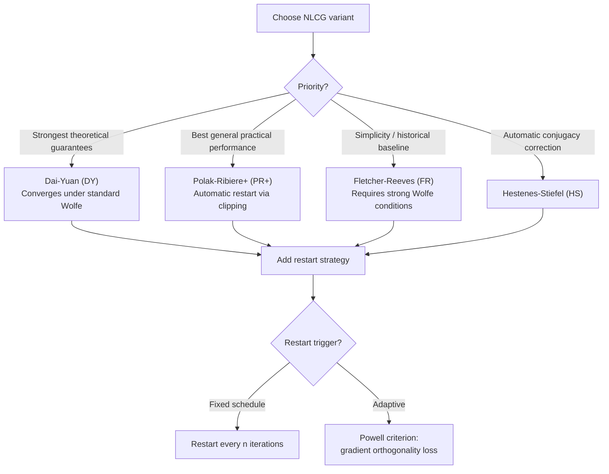

## Nonlinear Conjugate Gradient Variants

### Overview

Nonlinear conjugate gradient (NLCG) extends the conjugate gradient method from quadratic objectives to general smooth nonlinear functions. The extension requires replacing exact line search with approximate line search and reformulating the residual-based update rules, since a general nonlinear $f$ has no fixed matrix $A$ against which to define conjugacy. This section covers the major NLCG variants — Fletcher–Reeves, Polak–Ribière, Hestenes–Stiefel, and Dai–Yuan — their update formulas, convergence properties, and the practical restart strategies needed to maintain reliable behavior.

### From Linear to Nonlinear CG

**Key Points**

- In the quadratic case, the residual $r_k = Ax_k - b$ equals $\nabla f(x_k)$ exactly, and the step size $\alpha_k$ has a closed form. In the nonlinear case, $\nabla f(x_k)$ still plays the role of the residual, but $\alpha_k$ must be found via (inexact) line search since no closed form exists in general.
- The core update structure is preserved:

$$d_k = -\nabla f(x_k) + \beta_k d_{k-1}, \quad x_{k+1} = x_k + \alpha_k d_k$$

- What changes across variants is **only the formula for $\beta_k$** — all NLCG methods share this update skeleton; they differ in how much "memory" of the previous direction is retained.
- The finite-termination guarantee ($\leq n$ iterations) is **lost** in the nonlinear case, since there is no fixed Hessian to be conjugate with respect to, and the notion of a Krylov subspace built from a single matrix no longer applies globally.

### Fletcher–Reeves (FR)

The direct generalization of the quadratic-case formula, replacing the residual $r_k$ with the gradient $\nabla f(x_k)$:

$$\beta_k^{FR} = \frac{\nabla f(x_{k+1})^\top \nabla f(x_{k+1})}{\nabla f(x_k)^\top \nabla f(x_k)}$$

**Key Points**

- Globally convergent under mild conditions (Zoutendijk's condition on the line search) even for non-convex $f$, provided the line search satisfies the strong Wolfe conditions.
- Prone to **jamming**: if $\beta_k^{FR}$ stays large after a poor step, the method can generate a long sequence of very short, ineffective steps, stalling progress. [Unverified: the severity of jamming is problem-dependent and is best characterized as a known practical weakness rather than a universal failure mode.]
- Historically the first NLCG variant (1964) and the theoretical baseline against which later variants are compared.

### Polak–Ribière (PR / PR+)

$$\beta_k^{PR} = \frac{\nabla f(x_{k+1})^\top(\nabla f(x_{k+1}) - \nabla f(x_k))}{\nabla f(x_k)^\top \nabla f(x_k)}$$

**Key Points**

- Uses the change in gradient rather than just its new magnitude, which tends to produce better practical performance than FR, especially after a poor step — an implicit self-correction not present in FR.
- The common variant **PR+** clips the coefficient: $\beta_k^{PR+} = \max(\beta_k^{PR}, 0)$.
- PR+ has a built-in automatic restart mechanism: if $\beta_k^{PR}$ would be negative, PR+ resets to $\beta_k = 0$, which is equivalent to a steepest descent step — this restart improves robustness without an explicit restart rule.
- Global convergence for PR (without clipping) is not guaranteed in general for non-convex $f$, even with exact line search — a known theoretical gap relative to FR. PR+ recovers global convergence guarantees under standard line search conditions.

### Hestenes–Stiefel (HS)

$$\beta_k^{HS} = \frac{\nabla f(x_{k+1})^\top(\nabla f(x_{k+1}) - \nabla f(x_k))}{d_k^\top(\nabla f(x_{k+1}) - \nabla f(x_k))}$$

**Key Points**

- The original formula from the 1952 linear CG paper, generalized directly; it reduces to the same expression as FR and PR in the exact-line-search quadratic case (all classical formulas coincide there).
- The denominator uses $d_k^\top(\nabla f(x_{k+1}) - \nabla f(x_k))$ rather than $\|\nabla f(x_k)\|^2$, which provides a form of automatic conjugacy correction with respect to the previous direction, satisfying the conjugacy condition $d_{k+1}^\top(\nabla f(x_{k+1}) - \nabla f(x_k)) = 0$ by construction regardless of line search accuracy.
- Shares similar practical behavior to PR in most settings but with different worst-case convergence properties.

### Dai–Yuan (DY)

$$\beta_k^{DY} = \frac{\nabla f(x_{k+1})^\top \nabla f(x_{k+1})}{d_k^\top(\nabla f(x_{k+1}) - \nabla f(x_k))}$$

**Key Points**

- A later (1999) variant designed specifically to guarantee global convergence under the weaker (standard) Wolfe conditions, rather than requiring the strong Wolfe conditions needed by FR.
- Maintains a descent direction property ($d_k^\top \nabla f(x_k) < 0$) automatically under standard Wolfe line search — a guarantee that FR, PR, and HS do not all share unconditionally.
- Generally considered to have the strongest theoretical convergence guarantees among the classical formulas, at some cost in typical empirical performance compared to PR+ on many problems. [Unverified: relative empirical performance is problem- and implementation-dependent; this is a general characterization from the literature rather than a fixed ranking.]

### Comparison of Beta Formulas

| Variant | $\beta_k$ Formula (numerator / denominator) | Global Convergence | Practical Robustness |
| --- | --- | --- | --- |
| Fletcher–Reeves (FR) | $\|\nabla f_{k+1}\|^2$ / $\|\nabla f_k\|^2$ | Yes, under strong Wolfe | Prone to jamming |
| Polak–Ribière (PR) | $\nabla f_{k+1}^\top(\nabla f_{k+1}-\nabla f_k)$ / $\|\nabla f_k\|^2$ | Not guaranteed in general | Good in practice |
| Polak–Ribière+ (PR+) | $\max(\beta^{PR}, 0)$ | Yes, with restart property | Good, most widely used |
| Hestenes–Stiefel (HS) | $\nabla f_{k+1}^\top(\nabla f_{k+1}-\nabla f_k)$ / $d_k^\top(\nabla f_{k+1}-\nabla f_k)$ | Similar to PR | Good, automatic conjugacy correction |
| Dai–Yuan (DY) | $\|\nabla f_{k+1}\|^2$ / $d_k^\top(\nabla f_{k+1}-\nabla f_k)$ | Yes, under standard Wolfe | Strong theory, moderate practice |

### Restart Strategies

**Key Points**

- Even variants without automatic restart benefits (like plain FR) are commonly restarted periodically — a standard rule is to reset $d_k = -\nabla f(x_k)$ (a steepest descent step) every $n$ iterations, where $n$ is the problem dimension.
- **Powell restart criterion**: restart when successive gradients lose orthogonality, specifically when $|\nabla f(x_{k+1})^\top \nabla f(x_k)| \geq 0.2\|\nabla f(x_{k+1})\|^2$, signaling that the conjugacy assumption underlying the direction update has broken down.
- Restarting discards accumulated direction history and reverts to the gradient direction, sacrificing short-term progress to regain robustness — a direct trade-off between convergence speed and numerical/theoretical reliability.
- Without restarts, NLCG directions can degrade over many iterations on strongly nonlinear objectives, since the conjugacy relationships that held approximately near a given iterate can break down far from it.

### Line Search Requirements

**Key Points**

- Exact line search (used in the quadratic-case derivation) is generally too expensive or ill-defined for nonlinear $f$; NLCG instead relies on inexact line search satisfying the **Wolfe conditions**:

$$f(x_k + \alpha_k d_k) \leq f(x_k) + c_1 \alpha_k \nabla f(x_k)^\top d_k \quad \text{(sufficient decrease / Armijo)}$$

$$\nabla f(x_k + \alpha_k d_k)^\top d_k \geq c_2 \nabla f(x_k)^\top d_k \quad \text{(curvature condition)}$$

with $0 < c_1 < c_2 < 1$.

- The **strong Wolfe conditions** additionally require $|\nabla f(x_k + \alpha_k d_k)^\top d_k| \leq c_2 |\nabla f(x_k)^\top d_k|$, which is what FR's convergence proof depends on.
- Line search accuracy requirements differ by variant — DY's global convergence holds under the weaker standard Wolfe conditions, which is one of its stated theoretical advantages over FR.

### NLCG Variant Selection Flow

### Worked Example: Rosenbrock Function Sketch

**Example**

Consider the classic non-convex test function $f(x_1, x_2) = 100(x_2 - x_1^2)^2 + (1 - x_1)^2$, with global minimizer at $(1,1)$ inside a narrow, curved valley.

- Plain steepest descent on this function converges extremely slowly, tracing a long oscillating path along the curved valley floor.
- FR-CG typically shows faster progress than steepest descent but can exhibit jamming episodes near the curved region of the valley, where consecutive gradients are nearly parallel, producing very small $\alpha_k$ steps until a restart is triggered.
- PR+ generally navigates the curved valley more smoothly than FR, due to the automatic restart behavior when $\beta_k^{PR}$ would go negative near direction reversals.

[Unverified: this qualitative comparison reflects commonly reported behavior in the numerical optimization literature on this benchmark; exact iteration counts depend on the specific line search parameters, starting point, and implementation.]

### Practical Implementation Considerations

**Key Points**

- NLCG requires only gradient evaluations (no Hessian), making it substantially cheaper per iteration than Newton-type methods — a major reason it remains popular for large-scale problems where storing an approximate Hessian (as in BFGS/L-BFGS) is expensive.
- Compared to L-BFGS, NLCG generally uses less memory ($O(n)$ vs. $O(mn)$ for L-BFGS with memory parameter $m$), but L-BFGS is often preferred in practice when memory permits, due to typically faster convergence.
- Preconditioning can be applied to NLCG analogously to linear CG, though the construction is less standardized than in the linear case.
- Choice of variant in practice often comes down to empirical testing on the specific problem class; PR+ and DY are commonly recommended defaults in modern implementations, with FR retained mainly for its historical/pedagogical role and stronger classical theory under strong Wolfe conditions.

### Conclusion

Nonlinear conjugate gradient generalizes the quadratic CG update skeleton — $d_k = -\nabla f(x_k) + \beta_k d_{k-1}$ — to general smooth objectives by replacing the exact residual-based step and $\beta_k$ formulas with gradient-based analogues (FR, PR, HS, DY) combined with inexact Wolfe line search. The finite-termination guarantee of the quadratic case is lost, and convergence behavior becomes variant-dependent: FR offers the strongest classical theory under strong Wolfe conditions but is prone to jamming, PR+ offers strong practical performance via automatic restart, and DY offers global convergence under weaker line search conditions. Restart strategies — periodic or Powell-criterion-triggered — are essential in practice to maintain robustness as directions lose conjugacy far from quadratic-like local behavior.

**Related Topics**

- L-BFGS and limited-memory quasi-Newton methods as memory-efficient alternatives
- Wolfe conditions and line search algorithms (backtracking, Zoom algorithm)
- Trust-region methods as an alternative to line-search-based globalization
- Preconditioned nonlinear conjugate gradient
- Zoutendijk's theorem and global convergence theory for line-search methods
- Truncated Newton (Newton-CG) methods combining CG with second-order information