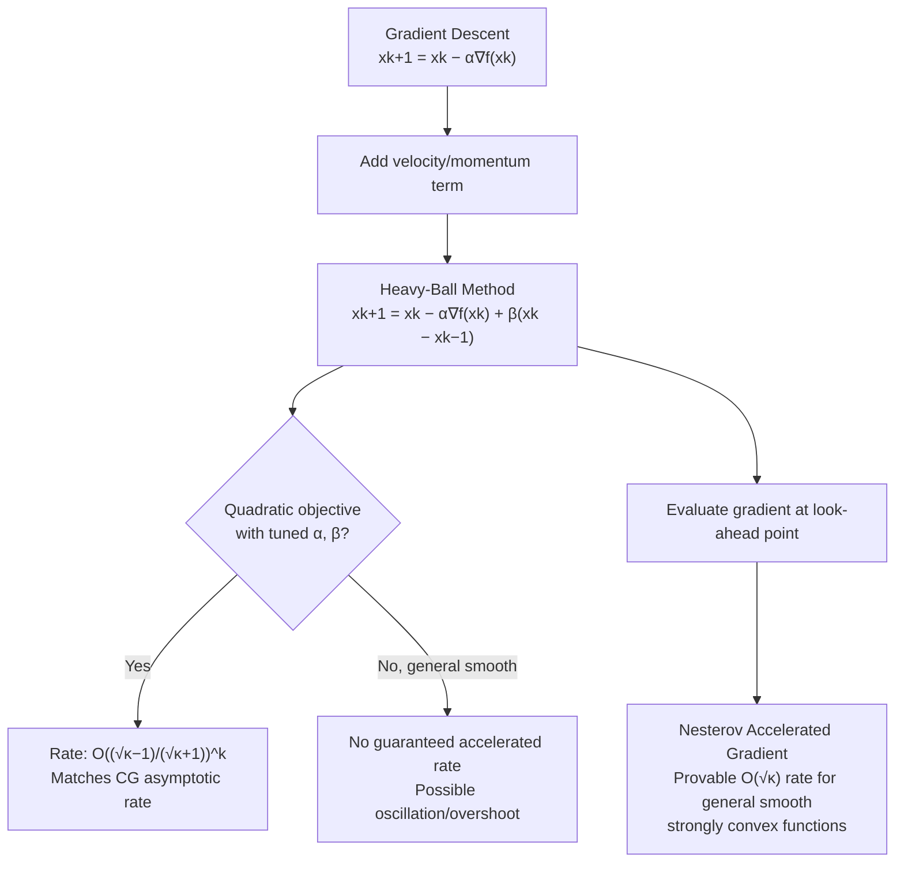

## Momentum and Heavy-Ball Methods

### Overview

The heavy-ball method, introduced by Polyak, was the first momentum-based modification to gradient descent, designed explicitly to damp the zig-zagging caused by ill-conditioning while retaining the low per-iteration cost of first-order methods. Rather than reformulating the search direction via conjugacy (as CG does), momentum methods accumulate a velocity term across iterations, giving the method inertia through narrow curved valleys. This section covers the heavy-ball update rule, its physical motivation, convergence analysis on quadratics, and its relationship to both CG and Nesterov acceleration.

### Physical Motivation

**Key Points**

- The method is named by analogy to a heavy ball rolling down a surface shaped like $f$: friction (the momentum coefficient) dissipates energy, but inertia carries the ball through small oscillations rather than let it zig-zag directly along the steepest local gradient.
- Formally, the continuous-time analog is a damped second-order ODE: $\ddot{x}(t) + \gamma \dot{x}(t) + \nabla f(x(t)) = 0$, contrasted with gradient descent's first-order gradient flow ODE $\dot{x}(t) = -\nabla f(x(t))$.
- The extra "mass" term ($\ddot{x}$) is what allows the method to build velocity along consistently-descending directions and resist reversing direction on every step — this is the mechanism that reduces zig-zagging on elongated level sets.

### The Heavy-Ball Update Rule

$$x_{k+1} = x_k - \alpha \nabla f(x_k) + \beta(x_k - x_{k-1})$$

with $x_{-1} = x_0$ at initialization. The term $\beta(x_k - x_{k-1})$ is the **momentum term**, and $\beta \in [0, 1)$ is the **momentum coefficient**.

**Key Points**

- $\beta = 0$ recovers plain gradient descent exactly.
- The update can be rewritten using an explicit velocity variable: $v_{k+1} = \beta v_k - \alpha \nabla f(x_k)$, $x_{k+1} = x_k + v_{k+1}$, making the "accumulated velocity" interpretation explicit.
- Unlike gradient descent, the update is **not memoryless**: $x_{k+1}$ depends on both $x_k$ and $x_{k-1}$, making heavy-ball a two-step (second-order) recurrence rather than a first-order one.
- Typical values of $\beta$ in practice range from 0.5 to 0.99, with larger $\beta$ appropriate for more ill-conditioned problems, though excessively large $\beta$ risks overshoot and oscillation.

### Convergence on Quadratics

For the quadratic $f(x) = \frac{1}{2}x^\top A x - b^\top x$ with eigenvalues of $A$ in $[\mu, L]$, and with the optimal choice of parameters:

$$\alpha = \frac{4}{(\sqrt{L} + \sqrt{\mu})^2}, \quad \beta = \left(\frac{\sqrt{L} - \sqrt{\mu}}{\sqrt{L} + \sqrt{\mu}}\right)^2$$

the convergence rate becomes:

$$\|x_k - x^*\| \leq C \left(\frac{\sqrt{\kappa} - 1}{\sqrt{\kappa} + 1}\right)^k \|x_0 - x^*\|$$

for some constant $C$ depending on initialization, where $\kappa = L/\mu$.

**Result**: this is the **same $\sqrt{\kappa}$-dependence** achieved by conjugate gradient, a dramatic improvement over plain gradient descent's $\kappa$-dependence. This is the central theoretical justification for momentum: with the right parameters, it converts a linear-in-$\kappa$ iteration complexity into a linear-in-$\sqrt{\kappa}$ complexity, for the quadratic case.

**Key Points**

- This optimal rate holds rigorously **only for quadratic objectives** with the eigenvalue-tuned $\alpha, \beta$ above; on general strongly convex functions, heavy-ball with these parameter choices does not have a global convergence guarantee matching the quadratic rate. [Unverified: this is a known theoretical gap in the literature — heavy-ball's global convergence for general (non-quadratic) strongly convex functions is not guaranteed at the same rate and has documented counterexamples, deferred to convergence-comparison discussions.]
- Nesterov's accelerated gradient method, covered separately, achieves the $O(\sqrt{\kappa})$ rate with a provable guarantee that holds for general smooth strongly convex functions, not just quadratics — this is the key theoretical distinction between heavy-ball and Nesterov momentum.

### Illustration: Momentum Damping the Zig-Zag

<svg xmlns="http://www.w3.org/2000/svg" viewBox="0 0 700 380">
<text x="350" y="28" text-anchor="middle" font-size="18" font-weight="bold" fill="#1a1a1a">Heavy-Ball Momentum vs. Plain Gradient Descent (svg_diagram)</text>
<g>
<ellipse cx="350" cy="210" rx="250" ry="70" fill="none" stroke="#c7d2fe" stroke-width="1.5" />
<ellipse cx="350" cy="210" rx="200" ry="56" fill="none" stroke="#a5b4fc" stroke-width="1.5" />
<ellipse cx="350" cy="210" rx="140" ry="39" fill="none" stroke="#818cf8" stroke-width="1.5" />
<ellipse cx="350" cy="210" rx="80" ry="22" fill="none" stroke="#6366f1" stroke-width="1.5" />
<circle cx="350" cy="210" r="3" fill="#1a1a1a" />
<text x="350" y="198" font-size="11" text-anchor="middle" fill="#1a1a1a">x*</text>



```

<polyline points="130,150 290,262 165,163 278,255 195,178 260,240 230,198 340,211" fill="none" stroke="#dc2626" stroke-width="2" marker-end="url(#arrowGD2)" />
<text x="105" y="140" font-size="11" fill="#dc2626">x₀ (plain GD)</text>


<path d="M130,150 Q220,240 350,210" fill="none" stroke="#059669" stroke-width="2.5" marker-end="url(#arrowMom)" />
<text x="480" y="290" font-size="11" fill="#059669">Heavy-ball: damped, smoother path</text>
```

</g>

<text x="350" y="345" text-anchor="middle" font-size="12" fill="#333" font-style="italic">Momentum accumulates velocity along consistent descent directions</text>

</svg>

### Worked Example: One-Dimensional Intuition

**Example**

Consider $f(x) = \frac{1}{2}\lambda x^2$ (a single-eigenvalue slice). The heavy-ball recurrence becomes:

$$x_{k+1} = x_k - \alpha \lambda x_k + \beta(x_k - x_{k-1}) = (1 + \beta - \alpha\lambda)x_k - \beta x_{k-1}$$

This is a linear second-order recurrence whose characteristic equation is:

$$r^2 - (1 + \beta - \alpha\lambda)r + \beta = 0$$

For appropriately chosen $\alpha, \beta$, the roots $r$ become **complex** with $|r| = \sqrt{\beta}$ — meaning the iterates exhibit **damped oscillation** (decaying amplitude, non-monotonic approach) rather than the purely monotonic geometric decay of plain gradient descent along a single eigendirection. This complex-root regime is what distinguishes heavy-ball's qualitative behavior from gradient descent's on individual eigen-directions, and it is also the source of possible transient overshoot even when the method converges overall.

### Overshoot and Oscillation Risk

**Key Points**

- Because momentum builds velocity, heavy-ball can **overshoot** the minimizer along directions where the gradient recently reversed sign, producing oscillation before settling — a phenomenon absent in plain gradient descent with a stable step size.
- This trade-off is fundamental: the same accumulated velocity that suppresses zig-zag along consistent descent directions can cause overshoot when the local landscape changes direction sharply.
- In practice, this motivates variants like **Nesterov's momentum**, which evaluates the gradient at a look-ahead point rather than the current iterate, partially correcting for overshoot while retaining the accelerated rate — this connection is developed fully in the dedicated acceleration section.
- Momentum coefficient scheduling (e.g., starting small and increasing $\beta$ as training stabilizes) is a common practical heuristic in machine learning contexts to control early-iteration overshoot risk. [Unverified: specific scheduling heuristics are empirically motivated conventions rather than results with general theoretical guarantees.]

### Heavy-Ball vs. Conjugate Gradient

| Property | Heavy-Ball | Conjugate Gradient |
| --- | --- | --- |
| Memory of past directions | Single previous step ($x_{k-1}$) | Effectively all previous directions (via $\beta_k$ recurrence) |
| Convergence rate (quadratic) | $O\left(\left(\frac{\sqrt{\kappa}-1}{\sqrt{\kappa}+1}\right)^k\right)$ with tuned $\alpha, \beta$ | Same asymptotic rate; finite ($\leq n$) termination guarantee |
| Requires exact line search | No | Yes, for quadratic-case guarantees |
| Parameter tuning | Requires knowing/estimating $L, \mu$ for optimal $\alpha, \beta$ | Self-adapting via $\beta_k$ formula, no eigenvalue estimates needed |
| Generalizes to non-quadratic | Yes, but without the same rate guarantee | Yes, via Nonlinear CG, also without finite termination |
| Common ML usage | Very common (SGD with momentum) | Less common in stochastic settings |

### Momentum Method Relationships



### Practical Implementation Considerations

**Key Points**

- In stochastic settings (SGD with momentum), the heavy-ball update is applied per mini-batch gradient, and momentum additionally serves to smooth out gradient noise across iterations, not just to accelerate convergence — a role distinct from its deterministic-setting motivation.
- Common practical defaults in machine learning use fixed $\beta$ (e.g., 0.9) rather than the theoretically optimal eigenvalue-dependent value, since $L$ and $\mu$ are typically unknown or infeasible to estimate for large nonlinear models.
- Heavy-ball's lack of a general nonlinear/non-quadratic convergence guarantee is a genuine theoretical limitation, but empirically it remains widely used and effective as a practical accelerant across many non-convex optimization problems, including neural network training. [Unverified: broad empirical effectiveness on non-convex problems is widely reported in practice but is not the same as a theoretical convergence guarantee for that setting.]
- The method requires storing one additional vector ($x_{k-1}$ or the velocity $v_k$), a modest $O(n)$ memory overhead compared to plain gradient descent.

### Conclusion

The heavy-ball method introduces a velocity/momentum term into gradient descent, motivated by the physical analogy of a damped heavy ball rolling through a valley, to reduce the zig-zagging caused by ill-conditioning. On quadratic objectives with optimally tuned parameters, it achieves the same $O(\sqrt{\kappa})$-type convergence factor as conjugate gradient — a substantial improvement over plain gradient descent's $O(\kappa)$ dependence — though this guarantee does not extend with the same strength to general non-quadratic strongly convex functions, a gap that motivates Nesterov's accelerated gradient method. The accumulated velocity that suppresses zig-zag can also cause overshoot and oscillation, a trade-off central to understanding momentum's behavior in both deterministic and stochastic optimization settings.

**Related Topics**

- Nesterov's Accelerated Gradient Method and look-ahead gradient evaluation
- SGD with momentum in stochastic optimization settings
- Adam and other adaptive momentum-based optimizers
- Second-order ODE analysis of optimization algorithms (continuous-time limits)
- Restart strategies for momentum methods (analogous to NLCG restarts)
- Convergence rate comparison table across gradient descent, heavy-ball, CG, and Nesterov acceleration