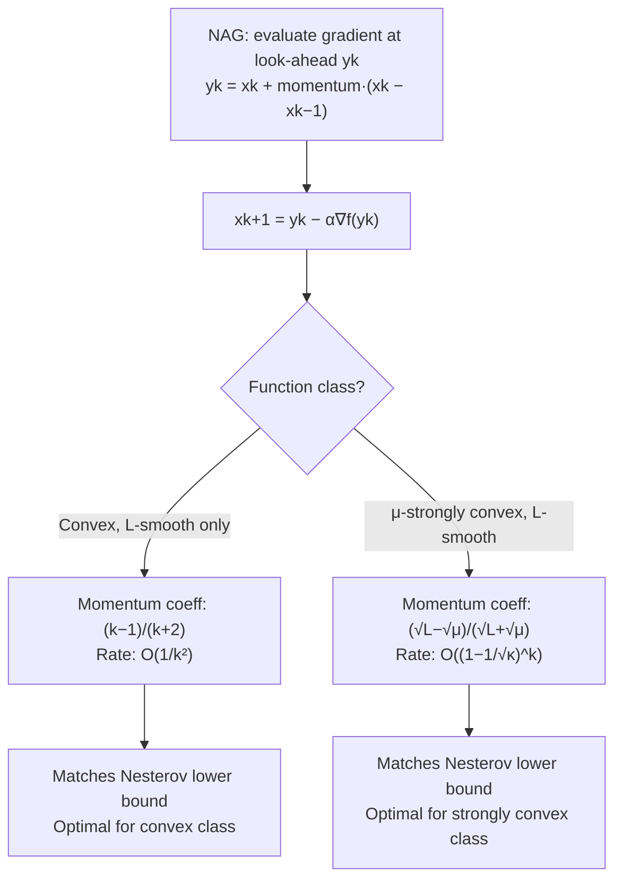

## Nesterov Accelerated Gradient Method

### Overview

Nesterov's accelerated gradient (NAG) method, introduced by Nesterov in 1983, resolves the theoretical gap left by heavy-ball momentum: it achieves an $O(1/k^2)$ convergence rate in function value for general smooth convex functions (not just quadratics), and an $O(\sqrt{\kappa}\log(1/\epsilon))$ iteration complexity for smooth strongly convex functions — both provably optimal among first-order methods that only access gradient information. This section develops the NAG update rule, its look-ahead structure, the convergence guarantees, and its relationship to heavy-ball momentum.

### The Look-Ahead Idea

**Key Points**

- Heavy-ball evaluates the gradient at the current point $x_k$ and then adds momentum. NAG instead evaluates the gradient at an **extrapolated look-ahead point**, then uses that gradient to update.
- This seemingly small reordering — gradient at a predicted future point rather than the current point — is what closes the theoretical gap and yields provable acceleration for general smooth convex/strongly convex functions, not just quadratics.
- Intuitively, the look-ahead point anticipates where momentum is about to carry the iterate, allowing the gradient step to partially "correct" for overshoot before it happens — this is often cited as the mechanistic explanation for NAG's improved robustness relative to heavy-ball on non-quadratic objectives.

### The NAG Update Rule (Convex Case)

$$y_k = x_k + \frac{k-1}{k+2}(x_k - x_{k-1})$$

$$x_{k+1} = y_k - \alpha \nabla f(y_k)$$

with $x_{-1} = x_0$ and $\alpha \leq 1/L$.

**Key Points**

- $y_k$ is the look-ahead (extrapolated) point; the gradient is evaluated at $y_k$, not at $x_k$.
- The momentum coefficient $\frac{k-1}{k+2}$ is **iteration-dependent**, increasing toward 1 as $k \to \infty$, unlike heavy-ball's typically fixed $\beta$.
- This particular schedule is not arbitrary — it is derived from an optimization of the convergence proof itself (via an auxiliary sequence argument), and departing from it can lose the accelerated rate guarantee.

### Convergence Rate: Convex Case

For convex, L-smooth $f$ with step size $\alpha \leq 1/L$:

$$f(x_k) - f(x^*) \leq \frac{2L\|x_0 - x^*\|^2}{(k+1)^2}$$

**Result**: $O(1/k^2)$ convergence in function value — a quadratic improvement over plain gradient descent's $O(1/k)$ rate for the same (merely convex, not strongly convex) function class. To reach accuracy $\epsilon$ requires $O(1/\sqrt{\epsilon})$ iterations, compared to $O(1/\epsilon)$ for plain gradient descent.

### Convergence Rate: Strongly Convex Case

For the strongly convex NAG variant (using a fixed momentum coefficient derived from $\kappa$ rather than the $\frac{k-1}{k+2}$ schedule):

$$y_k = x_k + \frac{\sqrt{L} - \sqrt{\mu}}{\sqrt{L} + \sqrt{\mu}}(x_k - x_{k-1})$$

$$x_{k+1} = y_k - \alpha \nabla f(y_k), \quad \alpha = \frac{1}{L}$$

the convergence rate becomes:

$$f(x_k) - f(x^*) \leq C\left(1 - \frac{1}{\sqrt{\kappa}}\right)^k$$

for some constant $C$ depending on the initialization.

**Result**: iteration complexity $O(\sqrt{\kappa}\log(1/\epsilon))$ — the square-root improvement over plain gradient descent's $O(\kappa\log(1/\epsilon))$, and critically, this rate is **proven for general smooth strongly convex functions**, not restricted to quadratics as heavy-ball's matching rate is.

### Optimality: Nesterov's Lower Bound

**Key Points**

- Nesterov also proved a matching **lower bound**: no first-order method that only queries gradients (and forms iterates as linear combinations of previous gradients) can achieve a better worst-case rate than $O(1/k^2)$ for smooth convex functions, or better than $O\left(\left(\frac{\sqrt{\kappa}-1}{\sqrt{\kappa}+1}\right)^k\right)$ for smooth strongly convex functions, over the relevant function classes.
- This makes NAG (and CG, in the quadratic case) **optimal** first-order methods in the worst-case sense — no clever choice of first-order method can asymptotically beat this rate on the hardest instances in the function class.
- This optimality claim is specifically about **worst-case complexity over a function class**; it does not mean NAG is fastest on every individual problem instance, only that no first-order method has a better guaranteed worst-case rate.

### Illustration: Convergence Rate Comparison

<svg xmlns="http://www.w3.org/2000/svg" viewBox="0 0 700 400">
<text x="350" y="28" text-anchor="middle" font-size="18" font-weight="bold" fill="#1a1a1a">Convergence Rate Comparison: f(xk) − f(x*) vs. Iteration k (svg_diagram)</text>
<line x1="80" y1="330" x2="650" y2="330" stroke="#333" stroke-width="1.5" />
<line x1="80" y1="330" x2="80" y2="60" stroke="#333" stroke-width="1.5" />
<text x="365" y="365" text-anchor="middle" font-size="13" fill="#333">Iteration k</text>
<text x="35" y="200" text-anchor="middle" font-size="13" fill="#333" transform="rotate(-90 35 200)">f(xk) − f(x*)</text>

<path d="M100,90 Q200,220 300,270 T650,315" fill="none" stroke="#dc2626" stroke-width="2.5" />
<text x="500" y="300" font-size="12" fill="#dc2626">Gradient Descent: O(1/k)</text>

<path d="M100,90 Q180,260 280,305 T650,325" fill="none" stroke="#2563eb" stroke-width="2.5" />
<text x="470" y="240" font-size="12" fill="#2563eb">NAG (convex): O(1/k²)</text>

<path d="M100,90 C 200,120 300,180 400,250 C 480,300 550,320 620,328" fill="none" stroke="#b45309" stroke-width="2" stroke-dasharray="5,3" />
<text x="440" y="175" font-size="12" fill="#b45309">GD (strongly convex): (1−1/κ)^k</text>

<path d="M100,90 C 150,140 200,220 260,280 C 330,320 420,328 500,329" fill="none" stroke="#059669" stroke-width="2.5" stroke-dasharray="5,3" />
<text x="180" y="110" font-size="12" fill="#059669">NAG (strongly convex): (1−1/√κ)^k</text>
<circle cx="100" cy="90" r="4" fill="#1a1a1a" />
<text x="90" y="80" font-size="11" fill="#1a1a1a">k=0</text>
</svg>

### Worked Example: Iteration Count Comparison

**Example**

For a strongly convex problem with $\kappa = 10000$ and target accuracy $\epsilon = 10^{-6}$ relative to the initial gap:

- Plain gradient descent: $k \geq \kappa \log(1/\epsilon) \approx 10000 \times 13.8 \approx 138{,}000$ iterations
- NAG (strongly convex variant): $k \geq \sqrt{\kappa}\log(1/\epsilon) \approx 100 \times 13.8 \approx 1{,}380$ iterations

This 100× reduction in required iterations directly reflects the $\sqrt{\kappa}$ vs. $\kappa$ dependence, and the gap widens as $\kappa$ grows — the more ill-conditioned the problem, the larger NAG's relative advantage over plain gradient descent.

### NAG vs. Heavy-Ball vs. CG

| Property | Heavy-Ball | Nesterov (NAG) | Conjugate Gradient |
| --- | --- | --- | --- |
| Gradient evaluated at | Current point $x_k$ | Look-ahead point $y_k$ | Current point $x_k$ |
| Provable rate, general smooth strongly convex $f$ | Not guaranteed at accelerated rate | $O(\sqrt{\kappa}\log(1/\epsilon))$, proven | N/A (defined for quadratics; extends via NLCG without the same guarantee) |
| Provable rate, quadratics | $O(\sqrt{\kappa}\log(1/\epsilon))$ with tuned params | Same asymptotic rate | Finite termination ($\leq n$ steps); same asymptotic factor |
| Momentum coefficient | Typically fixed | Iteration-dependent (convex case) or $\kappa$-derived (strongly convex case) | Self-adapting via $\beta_k$ formula |
| Worst-case optimality | Not proven optimal | Proven optimal among first-order methods | Optimal for quadratics (matches Krylov lower bounds) |

### NAG Convergence Structure

### Practical Considerations

**Key Points**

- Like heavy-ball, NAG requires only gradient evaluations, giving it the same low per-iteration cost as plain gradient descent — the acceleration is essentially "free" in terms of per-step computation, at the cost of storing one extra iterate.
- In the strongly convex variant, NAG requires knowledge (or estimation) of $L$ and $\mu$ to set the optimal momentum coefficient — a practical limitation shared with heavy-ball's optimally-tuned parameters, and often addressed via adaptive restart schemes in practice.
- **Adaptive restart** (resetting the momentum term when function value increases, or when the momentum direction and gradient direction disagree) is a widely used practical technique to prevent the oscillatory behavior that can occur especially in the convex-case schedule, which does not automatically damp like the strongly-convex variant does. [Unverified: specific restart heuristics and their empirical benefit are implementation-dependent conventions from the numerical optimization literature.]
- In stochastic settings (deep learning), NAG-style momentum is used in practice (e.g., "Nesterov momentum" in SGD variants), though the clean $O(1/k^2)$/$O(\sqrt{\kappa}\log(1/\epsilon))$ guarantees are deterministic-gradient results and do not directly transfer to the stochastic-gradient setting without modification.
- NAG's non-monotonic behavior (function value can temporarily increase between iterations, unlike plain gradient descent with $\alpha \leq 1/L$, which decreases monotonically) is a known practical characteristic, not a bug — it stems from the same look-ahead/overshoot dynamics that enable acceleration.

### Conclusion

Nesterov's accelerated gradient method modifies momentum-based gradient descent by evaluating the gradient at an extrapolated look-ahead point rather than the current iterate, using a carefully derived, iteration-dependent (or $\kappa$-derived) momentum coefficient. This yields provably optimal first-order convergence rates — $O(1/k^2)$ for general smooth convex functions and $O(\sqrt{\kappa}\log(1/\epsilon))$ for smooth strongly convex functions — closing the theoretical gap left by heavy-ball momentum, which only achieves the matching $\sqrt{\kappa}$-type rate on quadratics. Nesterov's matching lower bound establishes that no first-order method can do better in the worst case, making NAG (alongside CG for the quadratic case) a benchmark of first-order optimality, while practical use still requires attention to parameter estimation and restart strategies to manage its characteristic non-monotonic, oscillatory behavior.

**Related Topics**

- Adaptive restart schemes for Nesterov acceleration
- Nesterov momentum in stochastic gradient descent (deep learning optimizers)
- Lower bound theory for first-order convex optimization methods
- Accelerated proximal gradient methods (FISTA) for composite/non-smooth objectives
- Continuous-time ODE interpretations of Nesterov acceleration
- Adam, AdaGrad, and RMSProp as adaptive extensions building on momentum ideas