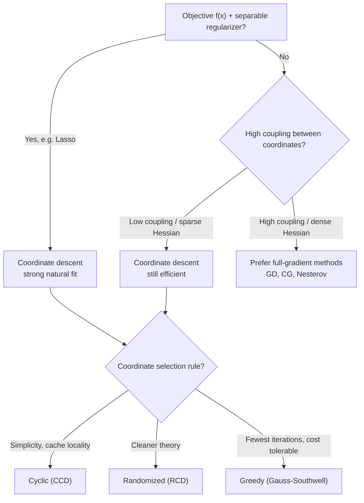

## Coordinate Descent Methods

### Overview

Coordinate descent takes a fundamentally different approach to reducing per-iteration cost and handling ill-conditioning: instead of moving along the full gradient direction in all $n$ dimensions simultaneously, it minimizes the objective one coordinate (or block of coordinates) at a time, holding all others fixed. This section covers the core algorithm, its cyclic and randomized variants, convergence guarantees under different structural assumptions, and its relationship to the gradient-based methods covered previously.

### Core Algorithm

For $f: \mathbb{R}^n \to \mathbb{R}$, the coordinate descent update at iteration $k$, cycling through coordinate $i$, is:

$$x_k^{(i)} = \arg\min_{t \in \mathbb{R}} f(x_k^{(1)}, \ldots, x_k^{(i-1)}, t, x_{k-1}^{(i+1)}, \ldots, x_{k-1}^{(n)})$$

with all other coordinates held at their most recent values. A full **cycle** (or epoch) updates all $n$ coordinates once.

**Key Points**

- The per-coordinate subproblem is a **one-dimensional minimization**, often solvable in closed form or cheaply via a short line search — this is the main source of coordinate descent's low per-iteration cost.
- No gradient of the full function $f$ is required at each substep; only the **partial derivative** with respect to the coordinate being updated, $\partial f / \partial x_i$.
- The method requires no step size tuning in its exact-minimization form, since each coordinate subproblem is solved exactly (or to high accuracy) rather than taking a fixed-size step.

### Gradient-Based Coordinate Descent Variant

When exact 1D minimization is expensive or lacks a closed form, a gradient-step variant is more common:

$$x_{k+1}^{(i)} = x_k^{(i)} - \alpha_i \frac{\partial f}{\partial x_i}(x_k)$$

updating only coordinate $i$ at step $k$, with $\alpha_i$ typically chosen as $1/L_i, where $L_i
 is the Lipschitz constant of $\partial f/\partial x_i$ with respect to coordinate $i$ (the **coordinate-wise Lipschitz constant**).

**Key Points**

- Coordinate-wise Lipschitz constants $L_i$ can differ substantially across coordinates, and using per-coordinate step sizes $1/L_i$ (rather than a single global $1/L$) is what makes this variant efficient — this is a form of implicit diagonal preconditioning.
- This variant directly generalizes to composite objectives $f(x) + \sum_i g_i(x_i)$ with a separable non-smooth regularizer $g_i$ (e.g., $\ell_1$ regularization), via **coordinate-wise proximal steps** — a major reason coordinate descent is heavily used in sparse learning (Lasso, elastic net).

### Selection Rules: Cyclic vs. Randomized vs. Greedy

**Key Points**

- **Cyclic coordinate descent (CCD)**: updates coordinates in a fixed order $1, 2, \ldots, n, 1, 2, \ldots$. Simple and cache-friendly, but worst-case convergence can be slower than randomized variants on adversarially ordered problems.
- **Randomized coordinate descent (RCD)**: selects the coordinate to update uniformly at random (or with importance sampling proportional to $L_i$) at each step. Has cleaner, more general convergence proofs than cyclic order and is the variant most commonly analyzed theoretically.
- **Greedy (Gauss-Southwell) coordinate descent**: selects the coordinate with the largest partial derivative magnitude at each step. Converges in fewer iterations in many cases but requires computing all $n$ partial derivatives to make the selection, eliminating the low-per-step-cost advantage unless the full gradient is cheap to maintain incrementally.
- The choice between these is a genuine cost/iteration-count trade-off: greedy selection reduces iteration count but raises per-iteration cost back toward that of full gradient descent, while randomized/cyclic selection keeps per-iteration cost low at the expense of possibly more iterations.

### Convergence Analysis: Randomized Coordinate Descent

For $L$-coordinate-smooth convex $f$ (meaning each $L_i \leq L$), randomized coordinate descent with step size $1/L_i$ satisfies:

$$\mathbb{E}[f(x_k)] - f(x^*) \leq \frac{2n \bar{L} R^2}{k}$$

where $\bar{L}$ is related to the average coordinate-wise smoothness and $R = \|x_0 - x^*\|$.

**Key Points**

- The expectation is over the random coordinate selection sequence — this is a **convergence-in-expectation** guarantee, not a deterministic one, reflecting the algorithm's stochastic nature.
- The $O(n/k)$ rate (in expectation) compares to full gradient descent's $O(1/k)$ rate, but each coordinate descent iteration is roughly $n$ times cheaper (updating one coordinate vs. computing the full $n$-dimensional gradient) — so total computational cost is comparable in the convex case, with the practical advantage depending on problem structure (e.g., sparsity, separability) rather than the raw rate comparison alone.
- For $\mu$-strongly convex $f$, randomized coordinate descent achieves a linear convergence rate analogous to gradient descent's, with a condition-number-like quantity based on coordinate-wise smoothness constants replacing the single global $\kappa$.

### Illustration: Coordinate Descent Path

<svg xmlns="http://www.w3.org/2000/svg" viewBox="0 0 700 380">
<text x="350" y="28" text-anchor="middle" font-size="18" font-weight="bold" fill="#1a1a1a">Coordinate Descent Path: Axis-Aligned Steps (svg_diagram)</text>
<g>
<ellipse cx="350" cy="210" rx="230" ry="90" fill="none" stroke="#c7d2fe" stroke-width="1.5" />
<ellipse cx="350" cy="210" rx="180" ry="70" fill="none" stroke="#a5b4fc" stroke-width="1.5" />
<ellipse cx="350" cy="210" rx="120" ry="47" fill="none" stroke="#818cf8" stroke-width="1.5" />
<ellipse cx="350" cy="210" rx="60" ry="24" fill="none" stroke="#6366f1" stroke-width="1.5" />
<circle cx="350" cy="210" r="3" fill="#1a1a1a" />
<text x="350" y="198" font-size="11" text-anchor="middle" fill="#1a1a1a">x*</text>



```

<polyline points="150,120 150,195 260,195 260,230 320,230 320,215 345,215 345,210 350,210" fill="none" stroke="#dc2626" stroke-width="2.5" marker-end="url(#arrowCD)" />
<circle cx="150" cy="120" r="4" fill="#dc2626" />
<text x="130" y="110" font-size="11" fill="#dc2626">x₀</text>
```

</g>

<text x="350" y="345" text-anchor="middle" font-size="12" fill="#333" font-style="italic">Each step moves along a single coordinate axis only</text>

</svg>

### Worked Example: Quadratic Coordinate Descent

**Example**

Minimize $f(x_1, x_2) = \frac{1}{2}(4x_1^2 + x_2^2) - x_1 - x_2$, starting at $x_0 = (0, 0)$, using exact cyclic coordinate minimization.

**Step 1 (coordinate 1)**: fix $x_2 = 0$, minimize over $x_1$: $\frac{\partial f}{\partial x_1} = 4x_1 - 1 = 0 \Rightarrow x_1 = 0.25$. New point: $(0.25, 0)$.

**Step 2 (coordinate 2)**: fix $x_1 = 0.25$, minimize over $x_2$: $\frac{\partial f}{\partial x_2} = x_2 - 1 = 0 \Rightarrow x_2 = 1$. New point: $(0.25, 1)$.

**Step 3 (coordinate 1)**: fix $x_2 = 1$, minimize over $x_1$: same as step 1 since $f$ is separable in this diagonal case, $x_1 = 0.25$ again — **no change**.

Because this particular $f$ is **separable** (no cross terms between $x_1, x_2$), coordinate descent reaches the exact minimizer $(0.25, 1)$ in a single cycle. This is a special case: separable quadratics are solved exactly in one pass, while non-separable quadratics (with off-diagonal Hessian terms) require multiple cycles and can exhibit the same zig-zagging character as gradient descent on ill-conditioned problems, since the axis-aligned steps cannot move diagonally toward $x^*$ in a single move.

### When Coordinate Descent Excels

**Key Points**

- **Separable regularizers**: problems of the form $\min_x f(x) + \sum_i g_i(x_i)$ (e.g., Lasso: $f$ smooth + $\lambda\|x\|_1$) are natural fits, since the coordinate-wise subproblem often has a closed-form solution (e.g., soft-thresholding for $\ell_1$).
- **Very high-dimensional, sparse problems**: when $n$ is large but the gradient/Hessian have exploitable sparsity structure, updating one coordinate at a time can be made very cheap using incremental updates to cached quantities (e.g., residuals in linear regression).
- **Support Vector Machine (SVM) dual problems**: box-constrained coordinate descent (e.g., SMO-style algorithms) is a classical and still-used approach, since the dual SVM problem decomposes naturally per-coordinate (or per-pair, in SMO's case) with simple box constraints.
- Coordinate descent is generally **less competitive** for dense problems with strong coordinate coupling (highly non-diagonal Hessian structure), where full-gradient methods or CG typically converge faster in wall-clock terms despite higher per-iteration cost.

### Coordinate Descent vs. Full-Gradient Methods

| Property | Gradient Descent | Coordinate Descent |
| --- | --- | --- |
| Update scope | All $n$ coordinates simultaneously | One coordinate (or block) at a time |
| Per-iteration cost | $O(n)$ (full gradient) | $O(1)$ to $O(n/\text{block size})$ typically |
| Step size | Global $\alpha \leq 1/L$ | Per-coordinate $\alpha_i \leq 1/L_i$ |
| Best suited for | Dense, well-coupled objectives | Separable, sparse, or block-structured objectives |
| Handles non-smooth separable regularizers | Requires proximal gradient extension | Naturally, via per-coordinate proximal step |
| Convergence (convex) | $O(1/k)$ | $O(n/k)$ in expectation (randomized variant); comparable total cost |

### Coordinate Descent Decision Flow



### Practical Implementation Considerations

**Key Points**

- Maintaining incrementally updated auxiliary quantities (e.g., residuals $r = Ax - b$ in least-squares-type problems) is essential for making each coordinate update $O(1)$ or $O(\text{nnz per column})$ rather than requiring a full $O(n)$ recomputation — this is the standard implementation pattern in practice (e.g., in `glmnet`-style Lasso solvers).
- **Block coordinate descent** generalizes single-coordinate updates to updating groups of coordinates jointly, useful when natural variable groupings exist (e.g., one "block" per layer in some structured models) and can improve convergence when coordinates within a block are strongly coupled.
- Parallelization of coordinate descent is non-trivial: naive simultaneous updates of multiple coordinates can break convergence guarantees due to stale/conflicting information; specialized parallel/asynchronous variants exist but require careful analysis. [Unverified: parallel coordinate descent convergence guarantees are an active and nuanced research area with results that depend heavily on the specific asynchronous update model used.]
- Coordinate descent for non-convex objectives (e.g., some matrix factorization problems) is common in practice despite weaker theoretical guarantees, often justified by strong empirical performance on specific structured problem classes.

### Conclusion

Coordinate descent trades the simultaneous, all-coordinate updates of gradient-based methods for a sequence of cheap, one-dimensional (or block-wise) subproblems, making it especially effective for separable, sparse, or block-structured objectives such as $\ell_1$-regularized regression and SVM duals. Its convergence theory — strongest for the randomized selection variant — yields rates comparable in total computational cost to full-gradient methods for convex objectives, with the practical advantage stemming from problem structure (closed-form subproblems, incremental updates, separable regularizers) rather than from a raw asymptotic-rate improvement. Understanding when coordinate coupling is weak enough to favor this approach, versus when full-gradient or second-order methods dominate, is central to applying it effectively.

**Related Topics**

- Proximal coordinate descent for Lasso and elastic net regularization
- Block coordinate descent and alternating minimization
- Sequential Minimal Optimization (SMO) for SVM dual problems
- Randomized Kaczmarz method as a related row/coordinate-sampling approach for linear systems
- Parallel and asynchronous coordinate descent algorithms
- Coordinate-wise Lipschitz constant estimation techniques