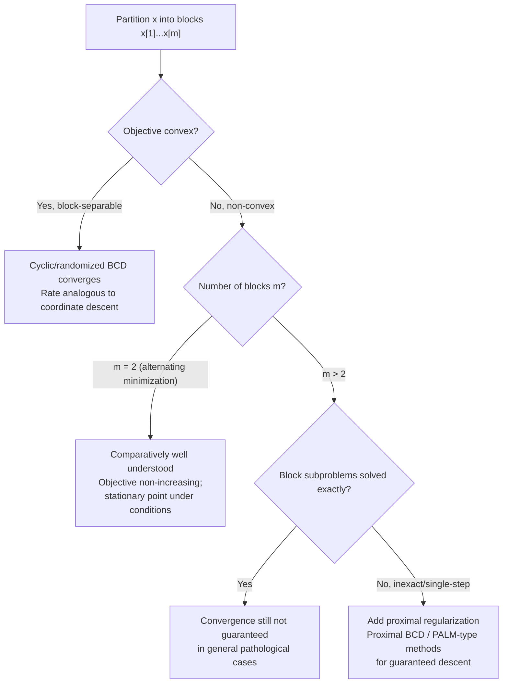

## Block Coordinate Descent

### Overview

Block coordinate descent (BCD) generalizes single-coordinate descent by partitioning the variable vector into disjoint blocks and minimizing over one block at a time, holding the others fixed. This intermediate granularity — between updating a single coordinate and updating all $n$ coordinates simultaneously — is particularly effective when natural variable groupings exist and when coordinates within a block are strongly coupled but blocks are weakly coupled to each other. This section covers the BCD update rule, convergence theory (including its more delicate non-convex behavior), block selection strategies, and its central role in alternating minimization schemes.

### Problem Setup and Block Partitioning

Partition $x \in \mathbb{R}^n$ into $m$ disjoint blocks $x = (x_{[1]}, x_{[2]}, \ldots, x_{[m]})$, where $x_{[j]} \in \mathbb{R}^{n_j}$ and $\sum_j n_j = n$. The BCD update, cycling through block $j$, is:

$$x_{[j]}^{k} = \arg\min_{t \in \mathbb{R}^{n_j}} f(x_k^{[1]}, \ldots, x_k^{[j-1]}, t, x_{k-1}^{[j+1]}, \ldots, x_{k-1}^{[m]})$$

**Key Points**

- $m = n$ with $n_j = 1$ for all $j$ recovers ordinary (single-)coordinate descent exactly — BCD is a strict generalization.
- $m = 1$ recovers direct full minimization of $f$ in one step (trivial, and generally intractable for the original reason gradient-based methods are used at all).
- The block subproblem is itself a full optimization problem over $\mathbb{R}^{n_j}$, which may be solved exactly, approximately, or via a single gradient/proximal step — this flexibility is central to BCD's wide applicability.

### Why Blocking Helps: Structural Motivation

**Key Points**

- Many problems have natural block structure where variables within a block interact strongly (justifying joint optimization) but blocks interact weakly or through simple coupling (justifying the alternating scheme).
- Classic example: **matrix factorization** $\min_{U,V} \|X - UV^\top\|_F^2$. Fixing $V$, the subproblem in $U$ is a convex least-squares problem (and vice versa), even though the joint problem in $(U,V)$ is non-convex — this is the canonical motivating structure for BCD.
- Blocking can also make each subproblem embarrassingly parallel-izable *within* the block-solve step (e.g., solving many independent least-squares rows simultaneously), even though the outer alternation between blocks remains sequential.

### Convergence Theory: Convex Case

**Key Points**

- For jointly convex $f$ with block-separable structure and exact block minimization, cyclic BCD converges to the global minimizer, with convergence rate results analogous to (single-)coordinate descent — $O(1/k)$ for general convex $f$, linear for strongly convex $f$, though the precise constants depend on cross-block coupling strength (captured via block-wise Lipschitz/smoothness constants).
- Unlike full gradient descent, BCD requires **no single global step size**: each block subproblem can use a block-appropriate step size or be solved exactly, similar to single-coordinate descent's per-coordinate $1/L_i$.
- Convergence for exact block minimization with 2 blocks under convexity is classical and well-established; guarantees become more delicate as $m$ grows or when block subproblems are solved only approximately.

### Convergence Theory: Non-Convex Case

This is where BCD's theory departs most significantly from coordinate descent's, and where care is required.

**Key Points**

- For **non-convex** $f$ (e.g., matrix factorization, many block-structured deep learning subproblems), cyclic BCD is only guaranteed to converge to a **stationary point**, not a global or even local minimum — the same limitation as gradient descent on general non-convex objectives.
- A critical subtlety: **BCD convergence for non-convex problems generally requires each block subproblem to be solved to (near-)exact optimality**, or requires additional regularity conditions (e.g., block-wise strong convexity, or the Kurdyka–Łojasiewicz property) — inexact or single-gradient-step block updates on non-convex problems can fail to converge or converge to non-stationary points without these safeguards. [Unverified: the precise conditions under which inexact BCD converges on non-convex problems form a substantial and technical body of literature; this is a summary characterization rather than a complete account of the conditions.]
- With only 2 blocks, cyclic BCD on non-convex $f$ (the classical "alternating minimization" setting) is comparatively well-understood, but convergence to a global minimum is still not guaranteed in general — only convergence of the objective value sequence and, under additional assumptions, convergence of iterates to a stationary point.
- With $m > 2$ blocks and non-convex coupling, cyclic BCD **can fail to converge** even when each block subproblem is solved exactly, in certain constructed pathological examples — this motivates the use of proximal regularization terms in practical non-convex BCD implementations to guarantee descent and convergence (proximal BCD / PALM-type methods).

### Illustration: Alternating Block Updates

<svg xmlns="http://www.w3.org/2000/svg" viewBox="0 0 700 380">
<text x="350" y="28" text-anchor="middle" font-size="18" font-weight="bold" fill="#1a1a1a">Block Coordinate Descent: Alternating Minimization (svg_diagram)</text>
<g>
<ellipse cx="350" cy="210" rx="220" ry="100" fill="none" stroke="#c7d2fe" stroke-width="1.5" />
<ellipse cx="350" cy="210" rx="170" ry="78" fill="none" stroke="#a5b4fc" stroke-width="1.5" />
<ellipse cx="350" cy="210" rx="110" ry="52" fill="none" stroke="#818cf8" stroke-width="1.5" />
<ellipse cx="350" cy="210" rx="55" ry="26" fill="none" stroke="#6366f1" stroke-width="1.5" />
<circle cx="350" cy="210" r="3" fill="#1a1a1a" />
<text x="350" y="196" font-size="11" text-anchor="middle" fill="#1a1a1a">(U*, V*)</text>



```
<polyline points="140,110 140,205 305,205 305,225 335,225 335,213 348,213 348,210" fill="none" stroke="#dc2626" stroke-width="2.5" marker-end="url(#arrowBCD)" />
<circle cx="140" cy="110" r="4" fill="#dc2626" />
<text x="115" y="100" font-size="11" fill="#dc2626">(U₀, V₀)</text>
```

</g>

<text x="200" y="345" text-anchor="middle" font-size="12" fill="`#059669`">Vertical: minimize over U (fix V)</text>

<text x="530" y="345" text-anchor="middle" font-size="12" fill="`#b45309`">Horizontal: minimize over V (fix U)</text>

</svg>

### Worked Example: Alternating Least Squares (Matrix Factorization)

**Example**

Consider $\min_{U \in \mathbb{R}^{n \times r}, V \in \mathbb{R}^{m \times r}} \|X - UV^\top\|_F^2$ for a target matrix $X \in \mathbb{R}^{n \times m}$.

**Block 1 (fix $V$, solve for $U$)**: with $V$ fixed, this is a standard linear least-squares problem, solved in closed form:

$$U \leftarrow XV(V^\top V)^{-1}$$

**Block 2 (fix $U$, solve for $V$)**: symmetric closed-form update:

$$V \leftarrow X^\top U(U^\top U)^{-1}$$

This is **Alternating Least Squares (ALS)**, a widely used matrix factorization algorithm (e.g., in recommender systems). Each block subproblem is convex and solved exactly in closed form via a linear system, even though the joint problem in $(U, V)$ is non-convex due to the bilinear coupling $UV^\top$. The objective value is guaranteed to be non-increasing across iterations, since each block step exactly minimizes over its block, but convergence is only to a stationary point of the joint non-convex problem, and the specific point reached depends on initialization.

### Block Selection Strategies

**Key Points**

- **Cyclic**: fixed round-robin order over blocks — simplest and most common in practice (e.g., standard ALS alternates $U, V, U, V, \ldots$).
- **Randomized**: block selected at random each iteration — as with single-coordinate descent, this often yields cleaner theoretical guarantees, particularly in the convex case.
- **Greedy/Gauss-Southwell block selection**: choosing the block whose update would most decrease $f$ — more expensive to evaluate but can reduce iteration count, mirroring the single-coordinate trade-off.
- Block **size and grouping** itself is a design choice distinct from selection order: coarser blocks (larger $n_j$) increase per-block subproblem cost but can better capture strong intra-block coupling, while finer blocks reduce to single-coordinate descent's low per-step cost.

### Block Coordinate Descent vs. Related Methods

| Property | Coordinate Descent | Block Coordinate Descent | Full Gradient Descent |
| --- | --- | --- | --- |
| Update granularity | Single coordinate | Group of coordinates (block) | All coordinates |
| Subproblem type | 1D minimization | Multi-dimensional minimization over block | N/A (single gradient step) |
| Natural fit | Separable objectives | Objectives with block structure (e.g., bilinear) | Dense, fully-coupled objectives |
| Non-convex convergence | Stationary point (with standard step-size conditions) | Stationary point, but requires care (exact/near-exact block solves or proximal regularization) | Stationary point (standard non-convex GD theory) |
| Classic examples | Lasso, SVM dual (SMO) | Matrix factorization (ALS), EM algorithm as related alternating scheme | General smooth optimization |

### BCD Convergence Considerations Flow



### Practical Implementation Considerations

**Key Points**

- When exact block minimization is unavailable in closed form, a common practical compromise is to take a single (proximal) gradient step within each block rather than solving the block subproblem to full optimality — this trades some convergence guarantee strength for much lower per-iteration cost.
- **Proximal BCD / PALM (Proximal Alternating Linearized Minimization)** methods add a proximal term to each block update specifically to guarantee sufficient decrease and recover convergence guarantees in the non-convex, inexact-block-solve setting.
- BCD's alternating structure appears under different names across fields with essentially the same mathematical core: Alternating Least Squares (recommender systems), the Expectation-Maximization algorithm's alternating structure (statistics, though EM has its own distinct convergence theory), and alternating projections (feasibility problems).
- Initialization matters substantially for non-convex BCD (e.g., ALS) since different starting points can converge to different stationary points with different objective values — a practical concern absent from convex single-block optimization. [Unverified: the extent of initialization sensitivity is problem-specific and is a well-documented empirical phenomenon in matrix factorization literature rather than a universal quantified result.]

### Conclusion

Block coordinate descent generalizes coordinate descent by grouping variables into blocks and alternately minimizing over each block, making it especially well-suited to problems with natural block structure such as bilinear matrix factorization. Its convergence theory is straightforward in the convex, block-separable case (paralleling coordinate descent), but becomes substantially more delicate for non-convex objectives, where exact or near-exact block solves, careful handling of the two-block alternating-minimization case, or proximal regularization (PALM-type methods) are often necessary to guarantee convergence to a stationary point. This alternating-minimization pattern recurs across many areas of applied optimization under different names, making BCD one of the more structurally distinctive methods relative to the purely first-order gradient-based methods covered previously.

**Related Topics**

- Alternating Least Squares (ALS) for matrix and tensor factorization
- Proximal Alternating Linearized Minimization (PALM) for non-convex BCD
- Expectation-Maximization (EM) algorithm as a related alternating scheme
- Alternating Direction Method of Multipliers (ADMM) for constrained/composite problems
- Kurdyka–Łojasiewicz property and its role in non-convex convergence proofs
- Tensor decomposition methods using block coordinate updates