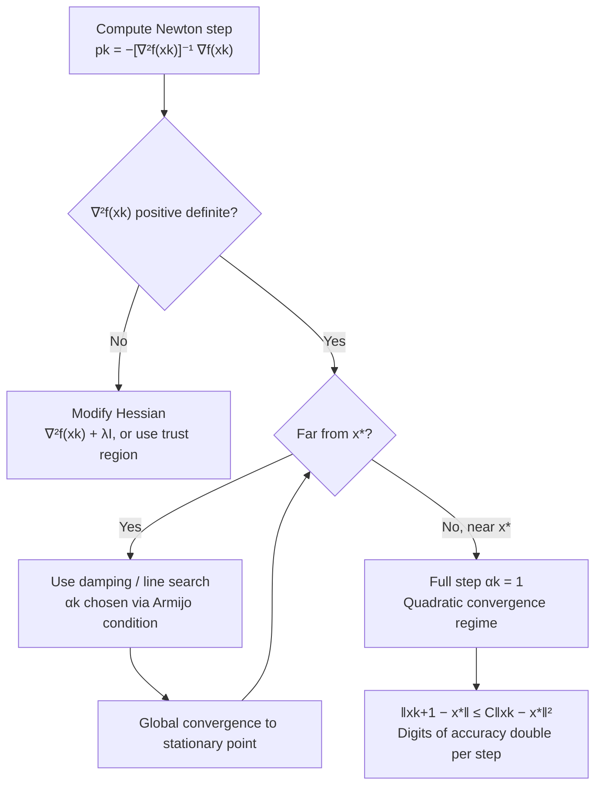

## Newton's Method Derivation and Convergence

### Overview

Newton's method departs from the purely first-order methods covered so far by using second-order (curvature) information — the Hessian — to construct a locally more accurate model of the objective at each iterate. This yields **quadratic convergence** near a minimizer, a qualitatively faster rate than any first-order method's linear or accelerated-linear rate, at the cost of computing and solving a linear system involving the Hessian at every step. This section derives the method from a quadratic Taylor approximation, establishes its local convergence theory, and examines the global convergence failure modes that motivate damped and globalized variants.

### Derivation from Quadratic Approximation

Given a twice-differentiable $f$, the second-order Taylor expansion around the current iterate $x_k$ is:

$$f(x_k + p) \approx f(x_k) + \nabla f(x_k)^\top p + \frac{1}{2}p^\top \nabla^2 f(x_k) p$$

**Key Points**

- Newton's method minimizes this local quadratic model **exactly** at each step, in contrast to gradient descent, which follows only the linear (first-order) term.
- Setting the gradient of the quadratic model (with respect to $p$) to zero: $\nabla f(x_k) + \nabla^2 f(x_k) p = 0$, giving the **Newton step**:

$$p_k = -[\nabla^2 f(x_k)]^{-1} \nabla f(x_k)$$

- The update rule is:

$$x_{k+1} = x_k - [\nabla^2 f(x_k)]^{-1} \nabla f(x_k)$$

- This is well-defined only when $\nabla^2 f(x_k)$ is invertible; when $\nabla^2 f(x_k)$ is positive definite, $p_k$ is guaranteed to be a descent direction, since $\nabla f(x_k)^\top p_k = -\nabla f(x_k)^\top [\nabla^2 f(x_k)]^{-1} \nabla f(x_k) < 0$.

### Interpretation: Root-Finding on the Gradient

**Key Points**

- Newton's method for optimization is equivalent to applying **Newton's method for root-finding** to the equation $\nabla f(x) = 0$ — the first-order optimality condition.
- The classical Newton root-finding update $x_{k+1} = x_k - [J(x_k)]^{-1} g(x_k)$ for solving $g(x) = 0$ becomes exactly the optimization update when $g = \nabla f$ and $J = \nabla^2 f$.
- This connection explains why Newton's method converges to **any** stationary point (minimum, maximum, or saddle) with equal local convergence speed — it has no inherent preference for minimizers, since it is fundamentally solving $\nabla f(x) = 0$, not directly minimizing $f$. This is a key qualitative difference from gradient descent, which always moves in a descent direction.

### Local Convergence: Quadratic Rate

**Key Points**

- Under standard regularity conditions — $f$ twice continuously differentiable, $\nabla^2 f$ Lipschitz continuous near $x^*$, and $\nabla^2 f(x^*)$ positive definite (nonsingular) — Newton's method exhibits **local quadratic convergence**:

$$\|x_{k+1} - x^*\| \leq C\|x_k - x^*\|^2$$

for some constant $C > 0$ depending on the Lipschitz constant of the Hessian and $\|[\nabla^2 f(x^*)]^{-1}\|$.

- **Result**: once $x_k$ is sufficiently close to $x^*$, the number of correct digits in $x_k$ roughly **doubles** every iteration — a dramatically faster local rate than any linear or even accelerated-linear ($\sqrt{\kappa}$) rate achievable by first-order methods.
- This quadratic rate is **local only**: it is guaranteed only once $x_k$ enters a sufficiently small neighborhood of $x^*$ (informally, once $\|x_k - x^*\|$ is small enough that $C\|x_k - x^*\| < 1$). Outside this neighborhood, Newton's method carries **no convergence guarantee at all** in its pure (undamped) form.

### Worked Example: Quadratic Convergence in Action

**Example**

Consider $f(x) = \frac{1}{2}x^\top A x - b^\top x$ (quadratic), so $\nabla f(x) = Ax - b$ and $\nabla^2 f(x) = A$ (constant, independent of $x$).

The Newton update is:

$$x_{k+1} = x_k - A^{-1}(Ax_k - b) = x_k - x_k + A^{-1}b = A^{-1}b = x^*$$

**Result**: Newton's method converges to the exact minimizer of any quadratic function in **exactly one step**, regardless of starting point or the condition number $\kappa$. This is the extreme case of quadratic convergence — the local quadratic model is exact for a quadratic objective, so there is no approximation error to iterate away. This single-step property is the clearest illustration of why curvature information eliminates the condition-number dependence that plagues first-order methods.

### Illustration: Newton Step via Quadratic Model

<svg xmlns="http://www.w3.org/2000/svg" viewBox="0 0 700 400">
<text x="350" y="28" text-anchor="middle" font-size="18" font-weight="bold" fill="#1a1a1a">Newton Step: Exact Minimization of Local Quadratic Model (svg_diagram)</text>
<line x1="60" y1="340" x2="650" y2="340" stroke="#333" stroke-width="1.5" />
<text x="355" y="370" text-anchor="middle" font-size="13" fill="#333">x</text>

<path d="M80,300 C 180,60 280,50 350,150 C 420,240 500,80 620,260" fill="none" stroke="`#6366f1`" stroke-width="2.5" />

<text x="560" y="240" font-size="12" fill="`#6366f1`">f(x)</text>

<path d="M230,320 Q350,90 470,320" fill="none" stroke="#dc2626" stroke-width="2" stroke-dasharray="6,3" />
<text x="470" y="310" font-size="12" fill="#dc2626">Quadratic model at xk</text>
<circle cx="350" cy="150" r="4" fill="#1a1a1a" />
<line x1="350" y1="150" x2="350" y2="340" stroke="#1a1a1a" stroke-width="1" stroke-dasharray="3,2" />
<text x="350" y="358" text-anchor="middle" font-size="11" fill="#1a1a1a">xk</text>
<circle cx="350" cy="95" r="4" fill="#dc2626" />
<line x1="350" y1="95" x2="350" y2="90" stroke="#dc2626" />
<text x="350" y="80" text-anchor="middle" font-size="11" fill="#dc2626">min of quadratic model = xk+1</text>
<line x1="350" y1="340" x2="350" y2="340" stroke="#059669" stroke-width="2" />
</svg>

### Global Convergence Failure Modes

Pure Newton's method (with a fixed unit step, $\alpha = 1$) has no global convergence guarantee. Several distinct failure modes arise:

**Key Points**

- **Divergence from a poor starting point**: if $x_0$ is far from $x^*$, the quadratic model can be a poor approximation of $f$, and the resulting step can move the iterate further from $x^*$ or even cause oscillation without convergence.
- **Non-positive-definite Hessian**: away from a strict local minimum, $\nabla^2 f(x_k)$ may be indefinite or singular. When indefinite, the Newton direction may not be a descent direction at all — it can point toward a saddle point or even locally uphill.
- **Attraction to saddle points**: because Newton's method solves $\nabla f(x) = 0$ without distinguishing minima from saddles, it can converge to a saddle point instead of a minimizer, especially problematic in high-dimensional non-convex problems (a documented concern in some non-convex optimization landscapes, including certain neural network loss surfaces). [Unverified: the practical prevalence of saddle-point attraction for Newton-type methods is landscape-dependent and is best understood as a known theoretical risk rather than a quantified universal rate.]
- **Singular or ill-conditioned Hessian**: when $\nabla^2 f(x_k)$ is nearly singular, the Newton step $p_k = -[\nabla^2 f(x_k)]^{-1}\nabla f(x_k)$ can become extremely large, causing severe overshoot even when the direction is theoretically correct.

### Damped Newton's Method

A standard remedy is to introduce a step size (damping factor) $\alpha_k$ chosen via line search:

$$x_{k+1} = x_k - \alpha_k [\nabla^2 f(x_k)]^{-1} \nabla f(x_k)$$

**Key Points**

- With $\alpha_k$ chosen via a backtracking line search satisfying the Armijo condition, damped Newton's method achieves global convergence to a stationary point under standard smoothness assumptions, provided the Hessian remains positive definite along the iterate sequence.
- Near the solution, the line search naturally selects $\alpha_k \to 1$, so the method **transitions automatically from globally safe steps to full, quadratically-convergent Newton steps** as $x_k$ approaches $x^*$ — this is the standard practical strategy for combining global reliability with fast local convergence.
- When $\nabla^2 f(x_k)$ is not positive definite, damping alone does not fix the direction problem; **modified Newton methods** (adding a multiple of the identity, $\nabla^2 f(x_k) + \lambda I$, to force positive definiteness) or trust-region approaches are used instead.

### Per-Iteration Cost

**Key Points**

- Each Newton iteration requires: (1) computing $\nabla^2 f(x_k)$ — $O(n^2)$ storage and typically $O(n^2)$ to $O(n^3)$ computation depending on function structure; (2) solving the linear system $\nabla^2 f(x_k) p = -\nabla f(x_k)$ — $O(n^3)$ via direct factorization (e.g., Cholesky) for a dense Hessian, or less for sparse/structured Hessians.
- This is substantially more expensive per iteration than gradient descent's $O(n)$ or CG's $O(n)$ (per matrix-vector product), which is the central cost/benefit trade-off between Newton's method and first-order methods: far fewer iterations, but each iteration is far more expensive.
- For large-scale problems where forming or factoring the full Hessian is infeasible, **quasi-Newton methods** (BFGS, L-BFGS) and **Newton-CG** (using CG to approximately solve the Newton system without forming the Hessian explicitly) are the standard practical compromises, covered in dedicated sections.

### Newton's Method vs. First-Order Methods

| Property | Gradient Descent | Nesterov Acceleration | Newton's Method |
| --- | --- | --- | --- |
| Information used | Gradient only | Gradient only | Gradient + Hessian |
| Local convergence rate | Linear, $O((1-1/\kappa)^k)$ | Linear, $O((1-1/\sqrt{\kappa})^k)$ | Quadratic, $O(\|x_k-x^*\|^2)$ |
| Condition number dependence | Strong ($\kappa$) | Reduced ($\sqrt{\kappa}$) | None (locally) |
| Per-iteration cost | $O(n)$ | $O(n)$ | $O(n^3)$ (dense) |
| Global convergence (undamped) | Yes, with $\alpha \leq 1/L$ | Yes, with $\alpha \leq 1/L$ | Not guaranteed |
| Global convergence (with globalization) | N/A (already global) | N/A (already global) | Yes, via damping/line search |
| Distinguishes minima from saddles | Implicitly, via descent property | Implicitly, via descent property | No (solves ∇f = 0 directly) |

### Newton's Method Convergence Flow

### Practical Considerations

**Key Points**

- Newton's method is most attractive when $n$ is small to moderate (Hessian computation/factorization is affordable) and high precision is required, since quadratic convergence makes reaching very high accuracy (e.g., $10^{-12}$) cheap once near the solution — a regime where linear-rate first-order methods would require many more iterations.
- For large-scale machine learning problems (millions of parameters), pure Newton's method is typically infeasible due to Hessian cost, motivating the widespread use of quasi-Newton and Hessian-free (Newton-CG) alternatives instead.
- Automatic differentiation tools can compute exact Hessians for many objectives, removing the historical burden of hand-deriving second derivatives, though the computational cost of forming/factoring the Hessian remains regardless of how it is obtained.
- The saddle-point-attraction concern is a genuine practical motivation for **not** using pure Newton's method in high-dimensional non-convex settings (e.g., deep learning) without modification, favoring instead first-order or modified second-order methods with explicit negative-curvature handling. [Unverified: this is a general characterization from the optimization literature rather than a claim about a specific quantified failure rate.]

### Conclusion

Newton's method achieves locally quadratic convergence — a qualitatively faster rate than any first-order method — by exactly minimizing a second-order Taylor approximation at each iterate, equivalent to applying root-finding to the gradient's zero-set. This power comes with real costs: $O(n^3)$ per-iteration expense for dense Hessians, no global convergence guarantee without damping or trust-region safeguards, and no inherent ability to distinguish minima from saddle points. Damped Newton's method, which uses line search far from the solution and transitions to full Newton steps near it, is the standard practical remedy for the global convergence gap, while quasi-Newton and Newton-CG methods (covered next) address the per-iteration cost gap for large-scale problems.

**Related Topics**

- Quasi-Newton methods and the BFGS update formula
- Limited-memory BFGS (L-BFGS) for large-scale problems
- Newton-CG (truncated Newton) methods using conjugate gradient for the Newton system
- Trust-region methods as an alternative globalization strategy to line search
- Modified Newton methods for indefinite Hessians (Levenberg-Marquardt style damping)
- Saddle-point avoidance strategies in non-convex second-order optimization