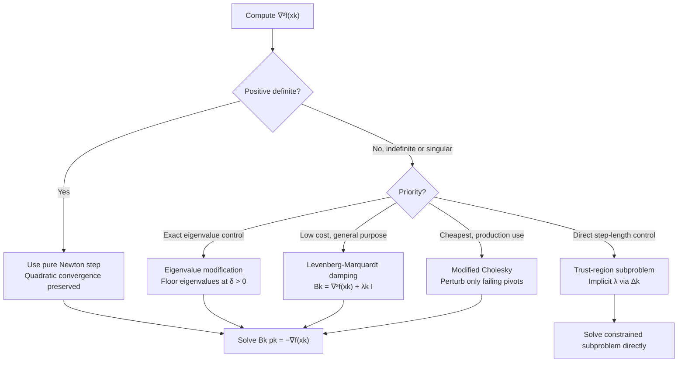

## Modified Newton Methods for Nonconvexity

### Overview

Pure Newton's method breaks down away from a strict local minimum: an indefinite or singular Hessian can produce an ascent direction, an undefined step, or a direction toward a saddle point rather than a minimizer. Modified Newton methods repair this by altering the Hessian itself — before solving the Newton system — so that the resulting direction is always a well-defined descent direction, while preserving the fast local quadratic convergence of pure Newton's method near a genuine minimum. This section covers the principal modification strategies: Hessian eigenvalue modification, Levenberg-Marquardt damping, modified Cholesky factorization, and their trust-region relationship.

### The Core Problem: Indefinite Hessians

**Key Points**

- The Newton step $p_k = -[\nabla^2 f(x_k)]^{-1}\nabla f(x_k)$ is a descent direction only when $\nabla^2 f(x_k)$ is positive definite; this guarantees $\nabla f(x_k)^\top p_k < 0$.
- When $\nabla^2 f(x_k)$ has one or more negative eigenvalues (indefinite), the raw Newton direction may increase $f$ locally, may point toward a saddle point, or — if $\nabla^2 f(x_k)$ is singular — may be undefined entirely (the linear system has no unique solution).
- This is not a rare edge case in non-convex optimization: saddle points, by definition, have indefinite Hessians, and non-convex objectives (neural network losses, non-convex matrix factorization, many physical simulation objectives) can have iterates pass near or through regions of indefinite curvature routinely, not just at isolated points.
- The general strategy across all modification methods below is the same: replace $\nabla^2 f(x_k)$ with a related matrix $B_k$ that is provably positive definite (or positive semidefinite with safeguards), while keeping $B_k$ close to $\nabla^2 f(x_k)$ when the latter is already well-behaved, so quadratic convergence is not sacrificed unnecessarily near genuine minima.

### Eigenvalue Modification

**Key Points**

- Given the eigendecomposition $\nabla^2 f(x_k) = Q\Lambda Q^\top$ with $\Lambda = \text{diag}(\lambda_1, \ldots, \lambda_n)$, construct a modified diagonal $\hat{\Lambda}$ by replacing any non-positive or too-small eigenvalue $\lambda_i$ with a positive floor value $\delta > 0$: $\hat{\lambda}_i = \max(\lambda_i, \delta)$.
- The modified Hessian is $B_k = Q\hat{\Lambda}Q^\top$, which is guaranteed positive definite by construction, and equals $\nabla^2 f(x_k)$ exactly when the original Hessian is already positive definite with all eigenvalues $\geq \delta$ — this is what preserves quadratic convergence near genuine minima.
- The main practical drawback is cost: full eigendecomposition is $O(n^3)$, the same asymptotic order as the Newton system solve itself, making this approach primarily useful for moderate $n$ or when the eigendecomposition is needed for other purposes (e.g., certifying a saddle point via negative eigenvalue detection).
- This method gives the most direct control over the resulting curvature but is rarely the cheapest option in practice compared to the alternatives below.

### Levenberg-Marquardt Style Damping

$$B_k = \nabla^2 f(x_k) + \lambda_k I$$

for a scalar $\lambda_k \geq 0$, chosen adaptively at each iteration.

**Key Points**

- Adding $\lambda_k I$ shifts every eigenvalue of $\nabla^2 f(x_k)$ up by $\lambda_k$; choosing $\lambda_k > |\lambda_{\min}(\nabla^2 f(x_k))|$ (when $\lambda_{\min} < 0$) guarantees $B_k$ is positive definite.
- $\lambda_k = 0$ recovers pure Newton's method exactly when the Hessian is already positive definite — the damping only activates when needed, similar in spirit to the eigenvalue-floor approach but computationally cheaper since it avoids full eigendecomposition.
- As $\lambda_k \to \infty$, the direction $p_k = -B_k^{-1}\nabla f(x_k)$ rotates toward the steepest descent direction $-\nabla f(x_k)$ (scaled), and the step length shrinks — this gives Levenberg-Marquardt damping a natural interpretation as **interpolating between Newton's method and gradient descent**, controlled by a single scalar.
- $\lambda_k$ is typically adapted per iteration: increased when a step fails to decrease $f$ sufficiently (indicating the local quadratic model is untrustworthy) and decreased when steps succeed (allowing the method to approach pure Newton behavior and recover quadratic convergence as $x_k \to x^*$).
- This is the same damping mechanism used in the classical Levenberg-Marquardt algorithm for nonlinear least squares, generalized here to general Newton-type optimization.

### Modified Cholesky Factorization

**Key Points**

- Rather than modifying eigenvalues explicitly, **modified Cholesky** algorithms attempt a standard Cholesky factorization $\nabla^2 f(x_k) = LL^\top$ and, upon detecting a failure (a non-positive pivot, signaling indefiniteness), perturb the diagonal element being factored just enough to keep the factorization proceeding with positive pivots.
- This produces an implicit factorization $LL^\top = \nabla^2 f(x_k) + E$ for some (typically diagonal, or diagonal plus small correction) perturbation matrix $E$, without ever explicitly forming $E$ or performing a full eigendecomposition.
- The main practical advantage is **cost**: modified Cholesky costs the same $O(n^3/3)$ as standard Cholesky factorization (for dense Hessians), substantially cheaper than the $O(n^3)$ eigendecomposition approach with a larger constant factor, making it the more common choice in production second-order solvers.
- Because the perturbation $E$ is applied only where needed (only at pivots that would otherwise be non-positive), the method leaves directions of already-positive curvature largely undisturbed, similarly to the eigenvalue-floor approach's locality property.

### Illustration: Modification Strategies Compared

<svg xmlns="http://www.w3.org/2000/svg" viewBox="0 0 700 400">
<text x="350" y="28" text-anchor="middle" font-size="18" font-weight="bold" fill="#1a1a1a">Hessian Modification: Eigenvalue Shift (svg_diagram)</text>
<line x1="80" y1="340" x2="620" y2="340" stroke="#333" stroke-width="1.5" />
<text x="350" y="368" text-anchor="middle" font-size="13" fill="#333">Eigenvalue index</text>
<line x1="80" y1="340" x2="80" y2="70" stroke="#333" stroke-width="1.5" />
<text x="45" y="200" text-anchor="middle" font-size="13" fill="#333" transform="rotate(-90 45 200)">Eigenvalue magnitude</text>
<line x1="80" y1="220" x2="620" y2="220" stroke="#999" stroke-width="1" stroke-dasharray="4,2" />
<text x="625" y="224" font-size="11" fill="#999">0</text>

<circle cx="150" cy="120" r="5" fill="#dc2626" />
<circle cx="250" cy="180" r="5" fill="#dc2626" />
<circle cx="350" cy="260" r="5" fill="#dc2626" />
<circle cx="450" cy="300" r="5" fill="#dc2626" />
<circle cx="550" cy="150" r="5" fill="#dc2626" />
<text x="150" y="100" font-size="11" fill="#dc2626" text-anchor="middle">Original (indefinite)</text>

<circle cx="150" cy="120" r="5" fill="#059669" />
<circle cx="250" cy="180" r="5" fill="#059669" />
<circle cx="350" cy="200" r="5" fill="#059669" />
<circle cx="450" cy="200" r="5" fill="#059669" />
<circle cx="550" cy="150" r="5" fill="#059669" />
<line x1="350" y1="260" x2="350" y2="200" stroke="#059669" stroke-width="1.5" stroke-dasharray="3,2" />
<line x1="450" y1="300" x2="450" y2="200" stroke="#059669" stroke-width="1.5" stroke-dasharray="3,2" />
<text x="450" y="330" font-size="11" fill="#059669" text-anchor="middle">Modified: floor at δ &gt; 0</text>
</svg>

### Worked Example: Levenberg-Marquardt Damping on an Indefinite Quadratic

**Example**

Consider a saddle point neighborhood modeled by $\nabla^2 f(x_k) = \begin{pmatrix} 2 & 0 \\ 0 & -1 \end{pmatrix}$ (eigenvalues $2$ and $-1$: indefinite).

Pure Newton's method: $B_k^{-1}$ does not exist as a valid descent-direction generator since one eigenvalue is negative — the raw Newton step along the second coordinate would move **toward** increasing $f$, not away from it.

Applying Levenberg-Marquardt damping with $\lambda_k = 2$:

$$B_k = \begin{pmatrix} 2 & 0 \\ 0 & -1 \end{pmatrix} + 2I = \begin{pmatrix} 4 & 0 \\ 0 & 1 \end{pmatrix}$$

Both eigenvalues (4 and 1) are now positive, so $B_k$ is positive definite and $p_k = -B_k^{-1}\nabla f(x_k)$ is guaranteed to be a descent direction. Note $\lambda_k = 2$ was chosen larger than $|-1|$ (the magnitude of the negative eigenvalue) specifically to flip the sign of the problematic eigenvalue while leaving the already-positive eigenvalue's sign unchanged — a small $\lambda_k$ closer to 1 would only reduce the negative eigenvalue's magnitude without eliminating it, still leaving $B_k$ indefinite.

### Relationship to Trust-Region Methods

**Key Points**

- Trust-region methods offer an alternative, closely related solution to the same indefiniteness problem: instead of modifying the Hessian directly, they constrain the step $p_k$ to lie within a region $\|p_k\| \leq \Delta_k$ around $x_k$, solving $\min_p \nabla f(x_k)^\top p + \frac{1}{2}p^\top \nabla^2 f(x_k) p$ subject to that constraint.
- The trust-region subproblem's solution (via the classical result of Moré and Sorensen) implicitly corresponds to solving a Levenberg-Marquardt-style system $(\nabla^2 f(x_k) + \lambda I)p = -\nabla f(x_k)$ for some $\lambda \geq 0$ determined by the trust-region radius $\Delta_k$ — this is a precise mathematical equivalence, not just a loose analogy.
- The key practical distinction is **which quantity is controlled directly**: Levenberg-Marquardt-style damping methods choose $\lambda_k$ directly and let the resulting step length vary, while trust-region methods choose the step-length bound $\Delta_k$ directly and solve for the implied $\lambda$ — the two approaches are complementary parameterizations of essentially the same underlying idea.
- Trust-region methods additionally handle the indefinite case more gracefully in one respect: when $\nabla^2 f(x_k)$ is indefinite, the trust-region subproblem still has a well-defined bounded solution (the constraint $\|p_k\| \leq \Delta_k$ prevents the unbounded steps that indefiniteness could otherwise cause), without requiring an explicit modification step first.

### Comparison of Modification Strategies

| Method | Cost (dense Hessian) | Locality (preserves good directions) | Common Use Case |
| --- | --- | --- | --- |
| Eigenvalue modification | $O(n^3)$, larger constant | High — exact eigenvalue floor | Moderate $n$; when eigenvalues needed anyway |
| Levenberg-Marquardt damping | $O(n^3)$ (system solve) | Moderate — uniform shift affects all eigenvalues | General-purpose; classical nonlinear least squares |
| Modified Cholesky | $O(n^3/3)$, smaller constant | High — perturbs only problematic pivots | Production second-order solvers; large dense systems |
| Trust-region (implicit) | $O(n^3)$ (subproblem solve) | High — bounded step regardless of definiteness | When step-length control is the primary concern |

### Modification Strategy Decision Flow

### Practical Considerations

**Key Points**

- All modification strategies introduce at least one algorithmic parameter (the eigenvalue floor $\delta$, the damping scalar $\lambda_k$, or the trust-region radius $\Delta_k$) that must be adapted across iterations — poorly tuned adaptation schemes can degrade practical performance even when the theoretical descent-direction guarantee holds.
- Near a genuine local minimum where $\nabla^2 f(x_k)$ is already well-conditioned and positive definite, all these methods reduce to (or very nearly to) pure Newton's method, so **quadratic local convergence is generally preserved** once the iterate is close enough to a strict local minimum — this preservation property is the central design goal shared across all the strategies above.
- These modification strategies address the indefiniteness/descent-direction problem specifically; they do not by themselves solve the separate global convergence problem covered under damped Newton's method (line search on step length), so practical implementations typically combine Hessian modification **with** a line search or trust-region globalization strategy together.
- In very large-scale settings where even a single $O(n^3)$-cost factorization is infeasible, these dense-matrix modification techniques are typically replaced by Hessian-free approaches (Newton-CG with negative curvature detection during the CG iterations themselves) rather than explicit Hessian modification. [Unverified: the specific negative-curvature-handling mechanisms in Hessian-free Newton-CG variants are a related but distinct technical topic, noted here for context rather than derived.]

### Conclusion

Modified Newton methods address pure Newton's method's central weakness in non-convex settings — an indefinite or singular Hessian producing an unreliable or undefined search direction — by replacing the Hessian with a nearby positive definite matrix before solving the Newton system. Eigenvalue modification offers the most direct control at the highest cost, Levenberg-Marquardt damping offers a cheap, interpretable interpolation between Newton's method and gradient descent, and modified Cholesky factorization offers the cheapest practical implementation by perturbing only the pivots that would otherwise fail. All three converge to the same underlying goal — a positive definite $B_k$ that equals $\nabla^2 f(x_k)$ whenever the latter is already well-behaved — and are mathematically closely related to trust-region methods, which solve the same indefiniteness problem by bounding step length rather than modifying the Hessian directly.

**Related Topics**

- Trust-region subproblem solution methods (Moré-Sorensen algorithm, dogleg method)
- Newton-CG (truncated Newton) with negative curvature detection
- Saddle-point escape strategies in non-convex optimization
- BFGS and quasi-Newton methods as alternatives that maintain positive definiteness by construction
- Nonlinear least squares and the classical Levenberg-Marquardt algorithm
- Cubic regularization methods for non-convex Newton-type optimization