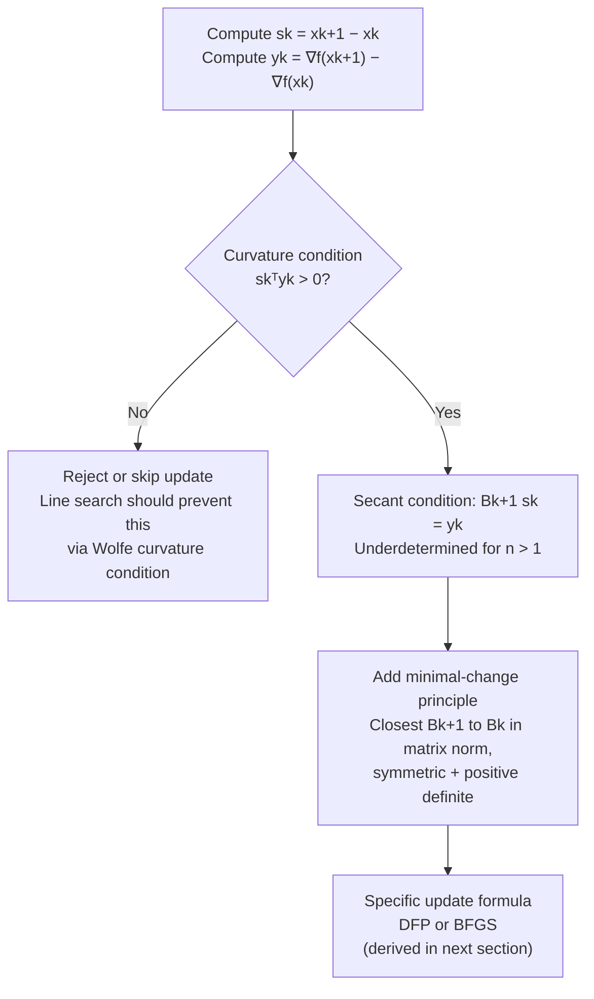

## Quasi-Newton Motivation and Secant Condition

### Overview

Quasi-Newton methods address Newton's method's central practical weakness — the $O(n^3)$ cost of forming and factoring the exact Hessian at every iteration — by building and cheaply updating an *approximation* to the Hessian (or its inverse) using only gradient information already computed during the optimization. The approximation is constrained by the **secant condition**, a single linear equation derived from the mean value theorem that any reasonable curvature approximation should satisfy. This section develops the motivation for quasi-Newton methods, derives the secant condition, and examines why it alone is insufficient to pin down a unique update — setting up the specific update formulas (DFP, BFGS) covered in the next section.

### Motivation: The Cost of Exact Hessians

**Key Points**

- Newton's method requires, at every iteration: forming $\nabla^2 f(x_k)$ (which may itself cost $O(n^2)$ evaluations for a dense Hessian, or more depending on how derivatives are obtained), and solving the linear system $\nabla^2 f(x_k)p = -\nabla f(x_k)$, costing $O(n^3)$ via direct factorization.
- For problems with $n$ in the thousands or millions (common in machine learning, large-scale engineering optimization), this per-iteration cost is prohibitive, even though Newton's method needs far fewer iterations than first-order methods.
- The core quasi-Newton insight: an iteration already computes $\nabla f(x_k)$ (needed regardless of method), and the **change** in gradient across an iteration, $\nabla f(x_{k+1}) - \nabla f(x_k)$, contains information about curvature along the direction traveled — this information is available essentially "for free," without any additional function or derivative evaluations beyond what gradient-based methods already require.
- Quasi-Newton methods exploit this by maintaining an evolving approximation $B_k \approx \nabla^2 f(x_k)$ (or $H_k \approx [\nabla^2 f(x_k)]^{-1}$), updated cheaply (typically $O(n^2)$ per iteration, a full order of magnitude cheaper than $O(n^3)$) using only the gradient information from the current and previous iterate.

### Deriving the Secant Condition

Consider the first-order Taylor expansion of the gradient around $x_{k+1}$:

$$\nabla f(x_k) \approx \nabla f(x_{k+1}) + \nabla^2 f(x_{k+1})(x_k - x_{k+1})$$

Rearranging:

$$\nabla f(x_{k+1}) - \nabla f(x_k) \approx \nabla^2 f(x_{k+1})(x_{k+1} - x_k)$$

Define:

$$s_k = x_{k+1} - x_k \quad \text{(the step taken)}, \qquad y_k = \nabla f(x_{k+1}) - \nabla f(x_k) \quad \text{(the gradient change)}$$

This gives the approximate relationship $y_k \approx \nabla^2 f(x_{k+1}) s_k$, which becomes **exact** for a quadratic function (where $\nabla^2 f$ is constant everywhere). Quasi-Newton methods impose this relationship **exactly** on the Hessian approximation $B_{k+1}$, giving the **secant condition** (also called the **quasi-Newton condition**):

$$B_{k+1} s_k = y_k$$

**Key Points**

- The name "secant condition" refers to its one-dimensional analog: the secant method for root-finding approximates a derivative using a finite difference of function values at two points, exactly as $y_k/s_k$ (in 1D) approximates $f''$ using a finite difference of gradient values.
- For general (non-quadratic) $f$, the secant condition is imposed as an exact constraint on the *approximation* $B_{k+1}$ even though it only holds approximately for the *true* Hessian — this is a deliberate modeling choice, not an approximation error being ignored.
- The inverse formulation is equally standard and more directly useful for computing the search direction: $H_{k+1} y_k = s_k$, where $H_k \approx [\nabla^2 f(x_k)]^{-1}$.

### Curvature Condition: When the Secant Equation is Solvable

**Key Points**

- For $B_{k+1}$ to be positive definite (required for the resulting quasi-Newton direction to be a descent direction) and satisfy the secant condition, a necessary condition on the observed data $(s_k, y_k)$ is the **curvature condition**:

$$s_k^\top y_k > 0$$

- This can be verified directly: since $B_{k+1}$ is positive definite and $B_{k+1}s_k = y_k$, we have $s_k^\top y_k = s_k^\top B_{k+1} s_k > 0$ whenever $s_k \neq 0$ — so the curvature condition is a **necessary** consequence of requiring a positive definite update, not an arbitrary extra assumption.
- For convex $f$, the curvature condition $s_k^\top y_k > 0$ holds automatically for any step (a direct consequence of convexity), which is one reason quasi-Newton methods have their cleanest theory in the convex setting.
- For non-convex $f$, $s_k^\top y_k > 0$ is **not automatic** and can fail for a poorly chosen step; standard practice enforces it via a line search satisfying the (strong) **Wolfe conditions**, whose curvature condition is specifically designed to guarantee $s_k^\top y_k > 0$ — this is a direct structural link between the line search requirements and the quasi-Newton update's validity, not a coincidental shared name.

### Why the Secant Condition Alone Is Insufficient

**Key Points**

- The secant condition $B_{k+1}s_k = y_k$ is a single vector equation (n scalar equations) constraining a symmetric $n \times n$ matrix, which has $n(n+1)/2$ independent degrees of freedom for $n > 1$ — the secant condition alone leaves the update **underdetermined** for $n > 1$.
- This underdetermination is precisely what necessitates an additional principle to pin down a unique, practically useful update formula — the standard resolution is to seek the matrix $B_{k+1}$ satisfying the secant condition that is, in a precise matrix-norm sense, the **closest** to the previous approximation $B_k$, while also remaining symmetric and positive definite.
- Different choices of matrix norm in this "closest update" principle lead to different classical quasi-Newton formulas — the Davidon-Fletcher-Powell (DFP) update and the Broyden-Fletcher-Goldfarb-Shanno (BFGS) update both arise from this minimal-change philosophy but with different norms and different variables ($B_k$ directly vs. $H_k = B_k^{-1}$), covered in the next section's derivation.
- This underdetermination is the mathematical reason quasi-Newton methods are a **family** of related methods rather than a single algorithm — the secant condition is the shared constraint, but the specific update rule requires an additional design choice.

### Illustration: Secant Approximation to Curvature

<svg xmlns="http://www.w3.org/2000/svg" viewBox="0 0 700 400">
<text x="350" y="28" text-anchor="middle" font-size="18" font-weight="bold" fill="#1a1a1a">Secant Approximation to Curvature — 1D Analogy (svg_diagram)</text>
<line x1="60" y1="330" x2="640" y2="330" stroke="#333" stroke-width="1.5" />
<text x="350" y="358" text-anchor="middle" font-size="13" fill="#333">x</text>
<line x1="60" y1="330" x2="60" y2="60" stroke="#333" stroke-width="1.5" />
<text x="30" y="200" text-anchor="middle" font-size="13" fill="#333" transform="rotate(-90 30 200)">∇f(x)</text>

<path d="M100,280 C 200,250 300,120 500,90" fill="none" stroke="#6366f1" stroke-width="2.5" />
<text x="520" y="90" font-size="12" fill="#6366f1">True ∇f(x)</text>
<circle cx="220" cy="230" r="5" fill="#dc2626" />
<text x="220" y="252" font-size="11" fill="#dc2626" text-anchor="middle">∇f(xk)</text>
<circle cx="420" cy="115" r="5" fill="#dc2626" />
<text x="420" y="100" font-size="11" fill="#dc2626" text-anchor="middle">∇f(xk+1)</text>

<line x1="180" y1="252" x2="470" y2="95" stroke="#059669" stroke-width="2" stroke-dasharray="6,3" />
<text x="500" y="145" font-size="12" fill="#059669">Secant slope ≈ yk / sk</text>
<line x1="220" y1="230" x2="420" y2="230" stroke="#b45309" stroke-width="1.5" stroke-dasharray="3,2" />
<text x="320" y="248" font-size="11" fill="#b45309" text-anchor="middle">sk = xk+1 − xk</text>
<line x1="420" y1="230" x2="420" y2="115" stroke="#b45309" stroke-width="1.5" stroke-dasharray="3,2" />
<text x="450" y="180" font-size="11" fill="#b45309" text-anchor="middle">yk</text>
</svg>

### Worked Example: Computing s_k and y_k

**Example**

Consider $f(x_1, x_2) = \frac{1}{2}(4x_1^2 + x_2^2)$, with $\nabla f(x) = (4x_1, x_2)$, at iterates $x_k = (1, 1)$ and $x_{k+1} = (0.2, 0.8)$ (produced by some quasi-Newton or line-search step).

$$s_k = x_{k+1} - x_k = (0.2 - 1,\ 0.8 - 1) = (-0.8, -0.2)$$

$$\nabla f(x_k) = (4, 1), \quad \nabla f(x_{k+1}) = (0.8, 0.8)$$

$$y_k = \nabla f(x_{k+1}) - \nabla f(x_k) = (0.8 - 4,\ 0.8 - 1) = (-3.2, -0.2)$$

Checking the curvature condition:

$$s_k^\top y_k = (-0.8)(-3.2) + (-0.2)(-0.2) = 2.56 + 0.04 = 2.6 > 0$$

The curvature condition holds, so a positive definite $B_{k+1}$ satisfying $B_{k+1}s_k = y_k$ exists in principle; the specific formula for constructing it (BFGS or DFP) is what the next section derives. Note that since the true Hessian here is $A = \text{diag}(4,1)$ (constant, since $f$ is quadratic), we can verify $As_k = (4)(-0.8), (1)(-0.2)) = (-3.2, -0.2) = y_k$ exactly — confirming the secant condition holds exactly (not just approximately) for quadratic objectives, consistent with its derivation.

### Secant Condition vs. Exact Newton

| Property | Exact Newton's Method | Quasi-Newton Methods |
| --- | --- | --- |
| Curvature information source | Analytic/computed $\nabla^2 f(x_k)$ | Approximated from $(s_k, y_k)$ pairs across iterations |
| Per-iteration cost | $O(n^3)$ (factorization) | $O(n^2)$ (typical update) |
| Additional derivative evaluations needed | Yes (full Hessian) | No (gradient only, already required) |
| Positive definiteness | Not guaranteed (needs modification, see previous section) | Can be guaranteed by construction (BFGS, under curvature condition) |
| Exactness on quadratics | Exact in 1 step | Exact in at most $n$ steps (finite termination, shown in next section) |
| Local convergence rate | Quadratic | Superlinear (typically), under standard conditions |

### From Secant Condition to Update Formula

### Practical Considerations

**Key Points**

- The pair $(s_k, y_k)$ is computed from quantities already available after any gradient-based step, meaning quasi-Newton methods add essentially no extra evaluation cost beyond what a first-order method already incurs — the only added cost is the $O(n^2)$ matrix update itself.
- Ensuring the curvature condition $s_k^\top y_k > 0$ holds in practice is a real implementation concern for non-convex objectives; standard practice is to use a line search enforcing the (strong) Wolfe conditions specifically because its curvature sub-condition guarantees $s_k^\top y_k > 0$, and to skip the quasi-Newton update (retaining the previous $B_k$) on the rare iteration where it fails despite the line search.
- Storing a dense $n \times n$ approximation $B_k$ or $H_k$ still costs $O(n^2)$ memory, which becomes prohibitive for very large $n$ (millions of parameters) — this limitation motivates **limited-memory** variants (L-BFGS) that avoid storing the full matrix explicitly, covered in a dedicated later section.
- The choice between updating $B_k$ (Hessian approximation) versus $H_k = B_k^{-1}$ (inverse Hessian approximation) directly is largely a matter of computational convenience: maintaining $H_k$ directly avoids solving a linear system at each step (the search direction becomes simply $p_k = -H_k \nabla f(x_k)$, a matrix-vector product), which is why most practical implementations maintain the inverse approximation.

### Conclusion

Quasi-Newton methods build cheap, updatable approximations to Newton's method's curvature information by exploiting gradient differences already computed during optimization, rather than forming the exact Hessian. The secant condition $B_{k+1}s_k = y_k$, derived from a first-order Taylor expansion of the gradient, is the foundational constraint every quasi-Newton update must satisfy, and the curvature condition $s_k^\top y_k > 0$ is both a necessary consequence of requiring positive definiteness and a practical requirement enforced via Wolfe line search conditions. Because the secant condition alone underdetermines the update for $n > 1$, a minimal-change principle is needed to select a unique, practically useful formula — setting up the DFP and BFGS derivations that follow.

**Related Topics**

- BFGS update formula derivation and its minimal-change (Frobenius/weighted norm) justification
- Davidon-Fletcher-Powell (DFP) update as the dual/predecessor formula to BFGS
- Limited-memory BFGS (L-BFGS) for large-scale problems
- Wolfe line search conditions and their role in guaranteeing the curvature condition
- Finite termination of quasi-Newton methods on quadratic objectives
- Superlinear convergence theory for quasi-Newton methods