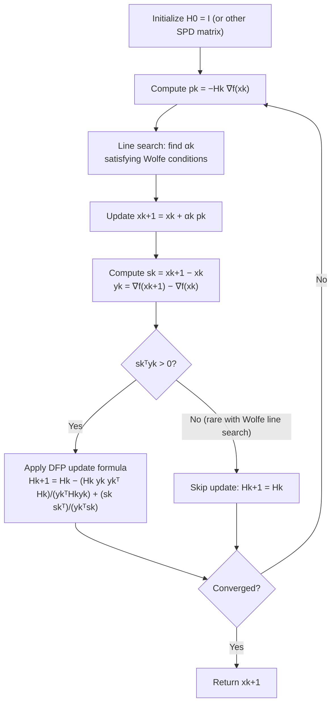

## DFP Update Formula

### Overview

The Davidon-Fletcher-Powell (DFP) update, developed by Davidon in 1959 and refined by Fletcher and Powell in 1963, was the first practical quasi-Newton formula and historically the method that established the entire quasi-Newton family as a viable alternative to exact Newton's method. DFP directly updates an approximation $H_k \approx [\nabla^2 f(x_k)]^{-1}$ to the *inverse* Hessian, derived by minimizing a weighted matrix norm subject to the secant condition. This section derives the DFP formula, establishes its key structural properties (symmetry, positive definiteness preservation, finite termination on quadratics), and situates it relative to BFGS, its successor and dual formula.

### The Minimal-Change Variational Principle

As established previously, the secant condition alone underdetermines the update for $n > 1$. DFP resolves this by posing an explicit optimization problem: among all matrices satisfying the secant condition, find the one closest to the current approximation.

**Key Points**

- DFP works with the **inverse** Hessian approximation $H_k \approx [\nabla^2 f(x_k)]^{-1}$ directly, using the inverse form of the secant condition: $H_{k+1} y_k = s_k$.
- The update is derived by solving:

$$H_{k+1} = \arg\min_{H} \|H - H_k\|_W \quad \text{subject to} \quad H = H^\top, \quad H y_k = s_k$$

where $\|\cdot\|_W$ is a weighted Frobenius norm with a specific weight matrix $W$ chosen so the resulting formula has a closed form and is basis-independent (invariant to linear changes of variable).

- This is a genuine constrained optimization problem in matrix space — the "closest symmetric matrix satisfying the secant condition" principle is what makes the update unique and well-defined, resolving the underdetermination noted previously.

### The DFP Update Formula

$$H_{k+1} = H_k - \frac{H_k y_k y_k^\top H_k}{y_k^\top H_k y_k} + \frac{s_k s_k^\top}{y_k^\top s_k}$$

**Key Points**

- The update consists of the previous approximation $H_k$ plus two **rank-one** correction terms — this rank-two total update structure (one rank-one term subtracted, one added) is a defining structural feature shared with BFGS, differing only in which variable ($H_k$ vs. $B_k$) and which specific terms appear.
- The subtracted term removes the component of curvature information along the previous $y_k$ direction that is no longer consistent with the new secant condition; the added term inserts the new curvature information $s_k s_k^\top / y_k^\top s_k$ along the step direction.
- All quantities needed ($H_k y_k$, $y_k^\top H_k y_k$, $y_k^\top s_k$) are computable via matrix-vector products and inner products, giving the update an $O(n^2)$ per-iteration cost — the intended improvement over Newton's $O(n^3)$.
- The search direction at each step is then $p_k = -H_k \nabla f(x_k)$, a simple matrix-vector product, avoiding any linear system solve.

### Positive Definiteness Preservation

**Key Points**

- If $H_k$ is symmetric positive definite and the curvature condition $s_k^\top y_k > 0$ holds, then $H_{k+1}$ produced by the DFP formula is **also guaranteed symmetric positive definite** — this is a theorem, not an empirical observation, and it is one of DFP's most important properties.
- This means that starting from any symmetric positive definite $H_0$ (commonly $H_0 = I$) and maintaining the curvature condition at every step (via Wolfe line search), the entire sequence $H_0, H_1, H_2, \ldots$ remains positive definite automatically — no explicit modification step (as required for indefinite Newton Hessians) is ever needed.
- This is a substantial practical advantage over pure or even modified Newton's method: DFP (and BFGS) sidestep the entire indefinite-Hessian problem covered in modified Newton methods by construction, rather than requiring after-the-fact correction.
- The proof relies on a rank-one update identity showing $v^\top H_{k+1} v > 0$ for all nonzero $v$, given $v^\top H_k v > 0$ and $s_k^\top y_k > 0$ — a standard but nontrivial linear algebra argument specific to this update structure.

### Illustration: Rank-Two Update Structure

<svg xmlns="http://www.w3.org/2000/svg" viewBox="0 0 700 380">
<text x="350" y="28" text-anchor="middle" font-size="18" font-weight="bold" fill="#1a1a1a">DFP Update: Rank-Two Correction to Hk (svg_diagram)</text>
<g transform="translate(80,70)">
<rect x="0" y="0" width="110" height="110" fill="#e0e7ff" stroke="#6366f1" stroke-width="1.5" />
<text x="55" y="130" text-anchor="middle" font-size="13" fill="#333">Hk</text>
</g>

<text x="230" y="130" font-size="24" fill="#333">−</text>

<g transform="translate(270,70)">
<rect x="0" y="0" width="110" height="110" fill="#fee2e2" stroke="#dc2626" stroke-width="1.5" />
<text x="55" y="55" text-anchor="middle" font-size="11" fill="#7f1d1d">Hk yk ykᵀ Hk</text>
<text x="55" y="70" text-anchor="middle" font-size="11" fill="#7f1d1d">──────────</text>
<text x="55" y="85" text-anchor="middle" font-size="11" fill="#7f1d1d">ykᵀ Hk yk</text>
<text x="55" y="130" text-anchor="middle" font-size="13" fill="#333">rank-one, subtract</text>
</g>

<text x="420" y="130" font-size="24" fill="#333">+</text>

<g transform="translate(460,70)">
<rect x="0" y="0" width="110" height="110" fill="#d1fae5" stroke="#059669" stroke-width="1.5" />
<text x="55" y="55" text-anchor="middle" font-size="11" fill="#065f46">sk skᵀ</text>
<text x="55" y="70" text-anchor="middle" font-size="11" fill="#065f46">─────</text>
<text x="55" y="85" text-anchor="middle" font-size="11" fill="#065f46">ykᵀ sk</text>
<text x="55" y="130" text-anchor="middle" font-size="13" fill="#333">rank-one, add</text>
</g>

<text x="640" y="130" font-size="24" fill="#333">=</text>

<text x="350" y="240" text-anchor="middle" font-size="13" fill="#333">Hk+1 — satisfies Hk+1 yk = sk exactly, remains symmetric positive definite</text>

</svg>

### Worked Example: One DFP Update Step

**Example**

Consider $f(x_1, x_2) = \frac{1}{2}(4x_1^2 + x_2^2)$, starting with $H_0 = I$ at $x_0 = (1, 1)$.

$\nabla f(x_0) = (4, 1)$. Take a step (via line search) to $x_1 = (0.2, 0.8)$, so:

$$s_0 = (-0.8, -0.2), \quad \nabla f(x_1) = (0.8, 0.8), \quad y_0 = (0.8 - 4,\ 0.8 - 1) = (-3.2, -0.2)$$

Compute the needed scalar quantities:

$$y_0^\top s_0 = (-3.2)(-0.8) + (-0.2)(-0.2) = 2.56 + 0.04 = 2.6$$

$$H_0 y_0 = I \cdot y_0 = (-3.2, -0.2), \quad y_0^\top H_0 y_0 = (-3.2)^2 + (-0.2)^2 = 10.24 + 0.04 = 10.28$$

Applying the DFP formula:

$$H_1 = I - \frac{(-3.2,-0.2)(-3.2,-0.2)^\top}{10.28} + \frac{(-0.8,-0.2)(-0.8,-0.2)^\top}{2.6}$$

Computing the outer products and combining term by term yields a specific symmetric positive definite $H_1$ satisfying $H_1 y_0 = s_0$ exactly by construction — this exact satisfaction of the secant condition after every update, regardless of how many iterations have elapsed, is what distinguishes quasi-Newton curvature tracking from a simple running average or heuristic estimate.

### Finite Termination on Quadratics

**Key Points**

- For a quadratic objective $f(x) = \frac{1}{2}x^\top A x - b^\top x$ with $A$ symmetric positive definite, DFP with exact line search at each step satisfies $H_n = A^{-1}$ **exactly** after at most $n$ steps — the inverse Hessian approximation converges to the exact inverse Hessian in finite steps, mirroring conjugate gradient's finite-termination property.
- This is not a coincidence: DFP (with exact line search) generates search directions that are **A-conjugate**, exactly matching the conjugate gradient directions derived earlier — DFP can be shown to be mathematically equivalent to conjugate gradient on quadratic objectives under exact line search, a deep structural connection between the two method families covered in this course.
- Once $H_k = A^{-1}$ exactly (which can happen before $k = n$ in degenerate cases, analogous to CG's early termination with clustered eigenvalues), the next step is exactly the Newton step, landing exactly on $x^*$.
- This finite-termination property does **not** extend to non-quadratic objectives, where $H_k$ only converges to $[\nabla^2 f(x^*)]^{-1}$ asymptotically as $x_k \to x^*$, not in finitely many exact steps.

### DFP's Practical Limitation: Sensitivity to Inexact Line Search

**Key Points**

- DFP's strong theoretical properties (positive definiteness preservation, finite termination) rely on the curvature condition $s_k^\top y_k > 0$ holding, but DFP is empirically known to be considerably more sensitive to inexact (non-exact) line search than its successor BFGS — small line search inaccuracies can degrade DFP's practical convergence noticeably.
- This practical fragility, discovered through extensive numerical testing in the 1970s, is the primary historical reason BFGS displaced DFP as the standard quasi-Newton method in most modern software, despite both formulas sharing the same rank-two update structure and theoretical guarantees under exact line search. [Unverified: the precise mechanism of DFP's greater sensitivity to inexact line search relative to BFGS is a well-documented empirical finding from the numerical optimization literature rather than something derived here from first principles.]
- DFP remains historically and pedagogically important as the first quasi-Newton method and as the "dual" formula to BFGS (the two can be derived from each other by swapping the roles of $B_k \leftrightarrow H_k$ and $s_k \leftrightarrow y_k$ in the respective derivations), a relationship made precise in the BFGS derivation.

### DFP vs. Newton's Method vs. Gradient Descent

| Property | Gradient Descent | DFP | Newton's Method |
| --- | --- | --- | --- |
| Curvature information | None | Approximated via $(s_k, y_k)$ pairs | Exact $\nabla^2 f(x_k)$ |
| Per-iteration cost | $O(n)$ | $O(n^2)$ | $O(n^3)$ |
| Positive definiteness | N/A (no matrix) | Guaranteed, by construction | Not guaranteed |
| Convergence on quadratics | Linear, $\kappa$-dependent | Finite ($\leq n$ steps), equivalent to CG | Exact in 1 step |
| Local convergence rate (general) | Linear | Superlinear | Quadratic |
| Sensitivity to line search accuracy | Low (fixed step often suffices) | High | N/A (typically exact Hessian available) |

### DFP Update Flow

### Practical Considerations

**Key Points**

- Because of its documented sensitivity to inexact line search, DFP is rarely the default choice in modern optimization software; BFGS (covered next) is preferred in essentially all standard implementations (e.g., `scipy.optimize.minimize(method='BFGS')` has no DFP counterpart in most mainstream libraries).
- DFP's theoretical elegance and its equivalence to conjugate gradient on quadratics make it valuable for building intuition about the broader quasi-Newton family, even though it is superseded in practice.
- As with all dense quasi-Newton methods, DFP requires $O(n^2)$ memory to store $H_k$, which becomes prohibitive for very large $n$ — the same limitation that motivates limited-memory variants for BFGS, covered later.
- The rank-two update structure (one subtracted, one added rank-one term) recurs, with different specific terms, in the BFGS formula — recognizing this shared skeleton makes the transition to BFGS mostly a matter of tracking which variable (H vs. B) and which vectors (s vs. y) play which role.

### Conclusion

The DFP update formula was the first practical quasi-Newton method, deriving a rank-two correction to an inverse Hessian approximation $H_k$ by minimizing a weighted matrix norm subject to the secant condition. It guarantees positive definiteness preservation by construction (eliminating the indefinite-Hessian problem that plagues Newton's method), achieves finite termination on quadratics equivalent to conjugate gradient, and offers $O(n^2)$ per-iteration cost — but its practical sensitivity to inexact line search led to its replacement by BFGS as the standard choice in modern software, despite sharing the same theoretical foundation and rank-two structural form.

**Related Topics**

- BFGS update formula and its structural relationship (duality) to DFP
- Broyden family of updates unifying DFP, BFGS, and intermediate formulas
- Limited-memory BFGS (L-BFGS) for large-scale problems
- Equivalence of DFP with exact line search to conjugate gradient on quadratics
- Superlinear convergence theory for quasi-Newton methods
- Wolfe line search conditions and their role in curvature condition satisfaction