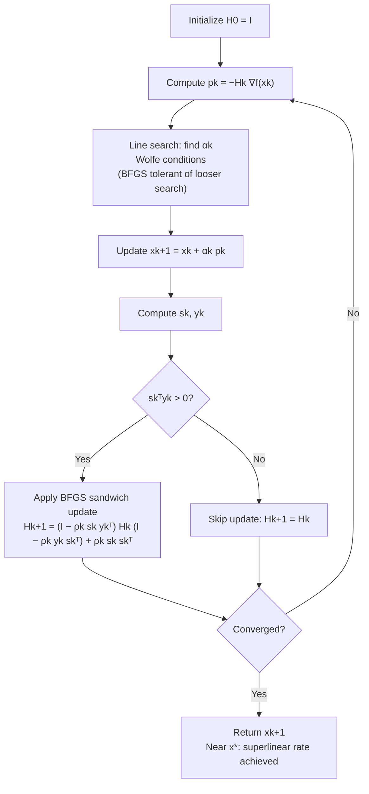

## BFGS Update Formula

### Overview

The Broyden-Fletcher-Goldfarb-Shanno (BFGS) update, independently derived by four researchers in 1970, is the dual formula to DFP and has become the de facto standard quasi-Newton method in practical optimization software. BFGS can be derived either directly (updating $B_k \approx \nabla^2 f(x_k)$) or, more usefully in practice, via the Sherman-Morrison-Woodbury formula applied to DFP's dual relationship, yielding a direct update for $H_k \approx [\nabla^2 f(x_k)]^{-1}$. This section derives the BFGS formula, establishes why it is markedly more robust to inexact line search than DFP, and covers its finite-termination and superlinear convergence properties.

### Duality with DFP

**Key Points**

- DFP was derived by minimizing $\|H - H_k\|_W$ subject to the secant condition $Hy_k = s_k$ on the **inverse** Hessian approximation $H$. BFGS is derived by the symmetric construction: minimizing $\|B - B_k\|_W$ subject to the **direct** secant condition $Bs_k = y_k$ on the Hessian approximation $B$ itself.
- This means the BFGS formula for $B_{k+1}$ is obtained from the DFP formula for $H_{k+1}$ by the substitution $H \leftrightarrow B$, $s_k \leftrightarrow y_k$ — a precise algebraic duality, not merely a loose analogy.
- Applying this same substitution to DFP's rank-two formula and then inverting (via the Sherman-Morrison-Woodbury identity, since a rank-two update to $B_k$ corresponds to a specific rank-two update to $B_k^{-1}$) yields a direct, closed-form update for the **inverse** approximation $H_k \approx B_k^{-1}$ — this is the form used in essentially all practical BFGS implementations, since it avoids solving a linear system at every step, exactly as with DFP.

### The BFGS Update Formula (Inverse Form)

$$H_{k+1} = \left(I - \frac{s_k y_k^\top}{y_k^\top s_k}\right) H_k \left(I - \frac{y_k s_k^\top}{y_k^\top s_k}\right) + \frac{s_k s_k^\top}{y_k^\top s_k}$$

**Key Points**

- This is the standard practical form, updating the inverse Hessian approximation directly so the search direction is again a simple matrix-vector product: $p_k = -H_k \nabla f(x_k)$.
- The direct (non-inverse) form, updating $B_k \approx \nabla^2 f(x_k)$, is:

$$B_{k+1} = B_k - \frac{B_k s_k s_k^\top B_k}{s_k^\top B_k s_k} + \frac{y_k y_k^\top}{y_k^\top s_k}$$

which has exactly the same rank-two structure as DFP's $H$-update, with $B \leftrightarrow H$ and $s_k \leftrightarrow y_k$ swapped throughout — the duality is visible directly by comparing this to the DFP formula from the previous section.

- Both forms cost $O(n^2)$ per update via outer products and matrix-vector products, matching DFP's per-iteration cost.

### Positive Definiteness Preservation

**Key Points**

- As with DFP, if $H_k$ (or $B_k$) is symmetric positive definite and the curvature condition $s_k^\top y_k > 0$ holds, then $H_{k+1}$ (or $B_{k+1}$) produced by BFGS is guaranteed symmetric positive definite — this property transfers directly from DFP via the duality relationship.
- Starting from $H_0 = I$ (the standard default) and maintaining the curvature condition at each step via Wolfe line search, positive definiteness is preserved automatically throughout the entire iteration sequence, exactly as with DFP.
- This shared guarantee means BFGS retains all of DFP's theoretical robustness to the indefinite-Hessian problem that plagues Newton's method, while — as covered next — substantially improving on DFP's practical robustness to line search inaccuracy.

### Why BFGS Outperforms DFP in Practice

**Key Points**

- Extensive numerical testing beginning in the 1970s established that BFGS converges reliably under significantly less accurate line searches than DFP requires — this empirical robustness is BFGS's primary practical advantage and the main reason it displaced DFP as the standard method.
- One structural explanation offered in the literature: BFGS tends to **self-correct** more effectively when a poor step temporarily distorts the Hessian approximation, because the rank-two update's structure more strongly damps the effect of a single bad $(s_k, y_k)$ pair on subsequent search directions, whereas DFP updates can allow a poor approximation to persist and compound over several iterations. [Unverified: this self-correction explanation is a commonly cited structural intuition in the optimization literature rather than a single clean theorem; the precise mechanism is a more nuanced result involving eigenvalue behavior of the update under inexact steps.]
- In practice, this means BFGS with a simple backtracking Armijo line search (not even requiring the full Wolfe curvature condition to be checked as carefully) often performs well, whereas DFP implementations more commonly require a more carefully tuned line search to avoid degraded performance.
- This robustness difference, not a difference in asymptotic convergence rate (both share the same superlinear rate under standard conditions), is the deciding practical factor in essentially all modern software defaults.

### Illustration: BFGS Rank-Two Update to H

<svg xmlns="http://www.w3.org/2000/svg" viewBox="0 0 700 380">
<text x="350" y="28" text-anchor="middle" font-size="18" font-weight="bold" fill="#1a1a1a">BFGS Update: Sandwich Form for Hk+1 (svg_diagram)</text>
<g transform="translate(50,70)">
<rect x="0" y="0" width="90" height="90" fill="#e0e7ff" stroke="#6366f1" stroke-width="1.5" />
<text x="45" y="45" text-anchor="middle" font-size="11" fill="#333">I − skykᵀ/ykᵀsk</text>
</g>

<text x="165" y="120" font-size="20" fill="#333">×</text>

<g transform="translate(190,70)">
<rect x="0" y="0" width="70" height="90" fill="#e0e7ff" stroke="#6366f1" stroke-width="1.5" />
<text x="35" y="50" text-anchor="middle" font-size="13" fill="#333">Hk</text>
</g>

<text x="280" y="120" font-size="20" fill="#333">×</text>

<g transform="translate(300,70)">
<rect x="0" y="0" width="90" height="90" fill="#e0e7ff" stroke="#6366f1" stroke-width="1.5" />
<text x="45" y="45" text-anchor="middle" font-size="11" fill="#333">I − yksk ᵀ/ykᵀsk</text>
</g>

<text x="415" y="120" font-size="20" fill="#333">+</text>

<g transform="translate(440,70)">
<rect x="0" y="0" width="90" height="90" fill="#d1fae5" stroke="#059669" stroke-width="1.5" />
<text x="45" y="45" text-anchor="middle" font-size="11" fill="#065f46">sk skᵀ / ykᵀsk</text>
</g>

<text x="350" y="220" text-anchor="middle" font-size="13" fill="#333">"Sandwich" form: projects out old sk-direction curvature, inserts new</text>

<text x="350" y="245" text-anchor="middle" font-size="13" fill="#333">Guaranteed symmetric positive definite when skᵀyk &gt; 0</text>

</svg>

### Worked Example: One BFGS Update Step

**Example**

Using the same setup as the DFP worked example — $f(x_1,x_2) = \frac{1}{2}(4x_1^2+x_2^2)$, $H_0 = I$, $x_0=(1,1)$, stepping to $x_1=(0.2,0.8)$:

$$s_0 = (-0.8,-0.2), \quad y_0 = (-3.2,-0.2), \quad y_0^\top s_0 = 2.6$$

Compute $\rho_0 = 1/(y_0^\top s_0) = 1/2.6 \approx 0.3846$.

The BFGS sandwich update with $H_0 = I$ simplifies (since $H_0 y_0 = y_0$) to:

$$H_1 = I - \rho_0(s_0 y_0^\top + y_0 s_0^\top) + \rho_0^2 y_0^\top y_0 \cdot s_0 s_0^\top + \rho_0 s_0 s_0^\top$$

Substituting the numerical values of $s_0$, $y_0$, and $\rho_0$ and carrying out the outer products yields a specific symmetric positive definite $H_1$ satisfying the secant condition $H_1 y_0 = s_0$ exactly — as with DFP, this exact satisfaction holds regardless of how far $x_1$ is from $x^*$, since it follows from the update's algebraic construction rather than from proximity to the solution.

### Finite Termination and Superlinear Convergence

**Key Points**

- Like DFP, BFGS with exact line search on a quadratic objective achieves $H_n = A^{-1}$ exactly within $n$ steps, and generates A-conjugate search directions — the same finite-termination and CG-equivalence properties established for DFP transfer to BFGS by the same underlying mechanism.
- For general (non-quadratic) smooth strongly convex objectives, BFGS achieves **local superlinear convergence**:

$$\lim_{k \to \infty} \frac{\|x_{k+1} - x^*\|}{\|x_k - x^*\|} = 0$$

- **Result**: superlinear convergence is strictly faster than any fixed linear rate (like gradient descent's or heavy-ball's $O((1-1/\kappa)^k)$) but is generally slower than Newton's method's quadratic rate — BFGS occupies a middle ground, trading some ultimate convergence speed for the $O(n^2)$-per-iteration cost savings relative to Newton's $O(n^3)$.
- This superlinear rate is a **local** result (near $x^*$, under standard smoothness assumptions), analogous to Newton's method's local quadratic rate being local rather than global — global convergence again requires a proper line search (Wolfe conditions), and near a well-conditioned minimum, BFGS's $H_k$ approximation asymptotically approaches $[\nabla^2 f(x^*)]^{-1}$, which is the mechanism underlying the superlinear rate.

### BFGS vs. DFP vs. Newton's Method

| Property | DFP | BFGS | Newton's Method |
| --- | --- | --- | --- |
| Variable updated | $H_k$ directly | $H_k$ directly (via dual $B_k$ derivation) | Exact $\nabla^2 f(x_k)$ |
| Per-iteration cost | $O(n^2)$ | $O(n^2)$ | $O(n^3)$ |
| Positive definiteness | Guaranteed | Guaranteed | Not guaranteed |
| Local convergence rate | Superlinear | Superlinear | Quadratic |
| Robustness to inexact line search | Lower | Higher (primary practical advantage) | N/A |
| Finite termination on quadratics | Yes, ≤ n steps | Yes, ≤ n steps | 1 step |
| Standard default in modern software | Rare | Yes (e.g., `scipy.optimize.minimize`) | Used when Hessian affordable |

### BFGS Update Flow

### Practical Considerations

**Key Points**

- BFGS is the standard default quasi-Newton method across nearly all general-purpose optimization libraries (e.g., `scipy.optimize.minimize(method='BFGS')`, MATLAB's `fminunc`), reflecting its established practical robustness advantage over DFP.
- As with DFP, BFGS requires $O(n^2)$ memory to store $H_k$ explicitly, making it impractical for very large-scale problems (millions of parameters); this shared limitation motivates **L-BFGS**, the limited-memory variant covered next, which never forms $H_k$ explicitly.
- A common practical safeguard, beyond the basic curvature-condition check, is **damped BFGS** or explicit skipping of the update when $s_k^\top y_k$ is small relative to $\|s_k\|\|y_k\|$ (near-violation of the curvature condition), to avoid numerically unstable updates even when the condition technically holds.
- Because BFGS shares DFP's finite-termination and CG-equivalence properties on quadratics, but with superior practical robustness on general non-quadratic objectives, it is generally considered the more broadly useful of the two classical formulas for essentially all practical purposes, with DFP retained mainly for its historical and pedagogical role.

### Conclusion

The BFGS update formula is the dual of DFP — derived by minimizing a weighted norm subject to the secant condition on the direct Hessian approximation $B_k$ rather than its inverse — and yields a closed-form rank-two "sandwich" update for the inverse approximation $H_k$ that guarantees positive definiteness by construction whenever the curvature condition holds. While BFGS shares DFP's finite-termination on quadratics and superlinear local convergence rate on general smooth objectives, its markedly greater empirical robustness to inexact line search has made it the standard default quasi-Newton method in essentially all modern optimization software, with DFP retained primarily for historical and pedagogical purposes as the formula that established the quasi-Newton approach.

**Related Topics**

- Limited-memory BFGS (L-BFGS) for large-scale problems
- Broyden family of updates unifying DFP, BFGS, and intermediate formulas
- Superlinear convergence proofs for quasi-Newton methods (Dennis-Moré characterization)
- Damped BFGS and safeguards for near-violated curvature conditions
- Wolfe line search implementation details (Zoom algorithm, strong Wolfe conditions)
- Quasi-Newton methods for constrained optimization (SQP)