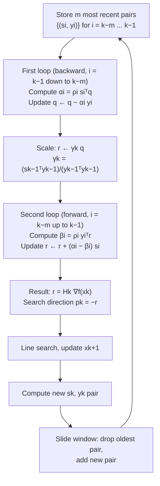

## Limited-Memory BFGS for Large-Scale Problems

### Overview

L-BFGS resolves the one remaining practical barrier to BFGS's broad applicability: the $O(n^2)$ memory required to store the dense inverse Hessian approximation $H_k$, which becomes infeasible once $n$ reaches into the hundreds of thousands or millions — the regime typical of modern machine learning and large-scale scientific computing. Rather than storing $H_k$ explicitly, L-BFGS stores only a small, fixed number of recent $(s_k, y_k)$ vector pairs and reconstructs the action of $H_k$ on a vector on demand, using a computationally efficient recursive procedure. This section derives the two-loop recursion at the heart of L-BFGS, analyzes its memory and computational cost, and covers the practical considerations that distinguish it from full BFGS.

### The Memory Problem

**Key Points**

- Full BFGS (and DFP) require storing the dense $n \times n$ matrix $H_k$, costing $O(n^2)$ memory — for $n = 10^6$ (a modest size by modern deep learning standards), this is $10^{12}$ floating-point entries, entirely infeasible on any current hardware.
- The key structural observation enabling L-BFGS: $H_k$ is never actually needed as an explicit matrix — the algorithm only ever needs the **matrix-vector product** $H_k \nabla f(x_k)$ to compute the search direction $p_k = -H_k \nabla f(x_k)$.
- L-BFGS exploits this by storing only the $m$ most recent pairs $\{(s_i, y_i)\}_{i=k-m}^{k-1}$ (typically $m$ between 3 and 20 in practice) and computing $H_k \nabla f(x_k)$ implicitly through a sequence of vector operations derived from unrolling the BFGS recursive update formula — never forming $H_k$ as a matrix at any point.
- Memory cost drops from $O(n^2)$ to $O(mn)$ — for $m = 10$ and $n = 10^6$, this is $10^7$ entries, a $10^5\times$ reduction, making L-BFGS practical at scales where full BFGS is entirely impossible.

### Deriving the Two-Loop Recursion

Recall the BFGS inverse update:

$$H_{k+1} = V_k^\top H_k V_k + \rho_k s_k s_k^\top, \quad \text{where } V_k = I - \rho_k y_k s_k^\top, \quad \rho_k = \frac{1}{y_k^\top s_k}$$

**Key Points**

- Unrolling this recursion backward through the $m$ most recent iterations expresses $H_k \nabla f(x_k)$ as a product of these $V_i$ matrices (and their transposes) applied to some initial matrix $H_k^{(0)}$ (commonly a scaled identity), without ever needing to form or store any $V_i$ or intermediate $H$ explicitly as a matrix.
- The resulting **two-loop recursion** computes $r = H_k \nabla f(x_k)$ using only vector inner products and vector-scalar multiplications on the stored $\{s_i, y_i\}$ pairs — this is the algorithmic heart of L-BFGS and what makes it practical.
- The initial approximation $H_k^{(0)}$ is typically chosen as a scaled identity, $H_k^{(0)} = \gamma_k I$, with the scaling factor $\gamma_k = \frac{s_{k-1}^\top y_{k-1}}{y_{k-1}^\top y_{k-1}}$ — this particular scaling choice approximates the curvature of the true Hessian along the most recent direction and is standard practice, substantially improving practical performance over a fixed $H_k^{(0)} = I$.

### The Two-Loop Recursion Algorithm

Given $\nabla f(x_k)$ and the stored pairs $\{(s_i, y_i)\}_{i=k-m}^{k-1}$ with $\rho_i = 1/(y_i^\top s_i)$:

**First loop (backward, computing $\alpha_i$ coefficients)**:

$$q \leftarrow \nabla f(x_k)$$


$$\text{for } i = k-1, k-2, \ldots, k-m: \quad \alpha_i = \rho_i s_i^\top q, \quad q \leftarrow q - \alpha_i y_i$$

**Scaling**:

$$r \leftarrow \gamma_k q, \quad \gamma_k = \frac{s_{k-1}^\top y_{k-1}}{y_{k-1}^\top y_{k-1}}$$

**Second loop (forward, computing $\beta_i$ coefficients)**:

$$\text{for } i = k-m, k-m+1, \ldots, k-1: \quad \beta_i = \rho_i y_i^\top r, \quad r \leftarrow r + (\alpha_i - \beta_i)s_i$$

**Result**: $r = H_k \nabla f(x_k)$, so the search direction is $p_k = -r$.

**Key Points**

- The algorithm makes exactly two passes over the $m$ stored pairs — one backward, one forward — each pass costing $O(mn)$ operations (an inner product and a vector update per stored pair), for total cost $O(mn)$ per iteration.
- This is a dramatic improvement over full BFGS's $O(n^2)$ per-iteration cost when $m \ll n$, which is the typical regime — for $m = 10$ and $n = 10^6$, this is a $10^5\times$ reduction in per-iteration cost, matching the memory savings.
- The two-loop recursion produces **exactly** the same result as applying the full BFGS update formula with the given initial $H_k^{(0)}$ and the $m$ stored pairs — it is an algebraically exact reformulation, not an approximation of the BFGS update itself; the only approximation in L-BFGS relative to full BFGS is the truncation to the most recent $m$ pairs (discarding older curvature information).

### Illustration: Sliding Window of Stored Pairs

<svg xmlns="http://www.w3.org/2000/svg" viewBox="0 0 700 340">
<text x="350" y="28" text-anchor="middle" font-size="18" font-weight="bold" fill="#1a1a1a">L-BFGS Sliding Window of (sk, yk) Pairs (svg_diagram)</text>
<line x1="60" y1="180" x2="640" y2="180" stroke="#333" stroke-width="1.5" />
<text x="350" y="205" text-anchor="middle" font-size="12" fill="#333">Iteration k</text>
<g id="pairs">
<rect x="80" y="150" width="45" height="60" fill="#e5e7eb" stroke="#9ca3af" />
<rect x="135" y="150" width="45" height="60" fill="#e5e7eb" stroke="#9ca3af" />
<rect x="190" y="150" width="45" height="60" fill="#e5e7eb" stroke="#9ca3af" />
<text x="200" y="240" font-size="11" fill="#9ca3af" text-anchor="middle">discarded (older than m)</text>



```
<rect x="260" y="150" width="45" height="60" fill="#c7d2fe" stroke="#6366f1" />
<rect x="315" y="150" width="45" height="60" fill="#a5b4fc" stroke="#6366f1" />
<rect x="370" y="150" width="45" height="60" fill="#818cf8" stroke="#6366f1" />
<rect x="425" y="150" width="45" height="60" fill="#6366f1" stroke="#4338ca" />
<text x="342" y="240" font-size="11" fill="#4338ca" text-anchor="middle">stored window (m most recent pairs)</text>

<rect x="495" y="150" width="45" height="60" fill="#fef3c7" stroke="#b45309" stroke-dasharray="4,2" />
<text x="517" y="240" font-size="11" fill="#b45309" text-anchor="middle">current xk</text>
```

</g>

<text x="350" y="290" text-anchor="middle" font-size="12" fill="#333" font-style="italic">Window slides forward each iteration: oldest pair dropped, newest pair added</text>

</svg>

### Comparison: Memory and Cost Scaling

| Method | Memory | Cost per iteration | Practical limit on $n$ |
| --- | --- | --- | --- |
| Newton's method | $O(n^2)$ (Hessian) | $O(n^3)$ (factorization) | Thousands |
| BFGS (full) | $O(n^2)$ ($H_k$) | $O(n^2)$ (matrix-vector, update) | Tens of thousands |
| L-BFGS | $O(mn)$ | $O(mn)$ | Millions to billions |
| Gradient descent | $O(n)$ | $O(n)$ | Unbounded by memory |

### Worked Example: Cost Comparison at Scale

**Example**

Consider a problem with $n = 10^7$ parameters (a large-scale machine learning model) and $m = 10$ stored pairs for L-BFGS.

- Full BFGS: memory $\approx (10^7)^2 = 10^{14}$ entries — at 8 bytes per double-precision float, this is $8 \times 10^{14}$ bytes $= 800$ TB, far beyond any practical system's memory.
- L-BFGS: memory $\approx m \times n = 10 \times 10^7 = 10^8$ entries $\approx 800$ MB — comfortably within a single modern machine's RAM.
- Per-iteration cost follows the same ratio: L-BFGS's $O(mn) = O(10^8)$ operations per iteration versus full BFGS's $O(n^2) = O(10^{14})$ — a $10^6\times$ reduction, making the difference between infeasible and routine.

This scaling relationship is precisely why L-BFGS, not full BFGS, is the standard choice for large-scale smooth optimization problems in practice.

### Convergence Properties

**Key Points**

- L-BFGS does **not** inherit full BFGS's superlinear convergence guarantee in general — truncating to $m$ stored pairs discards curvature information from earlier iterations, and the resulting approximation $H_k$ need not converge to $[\nabla^2 f(x^*)]^{-1}$ as $k \to \infty$ the way full BFGS's does.
- In practice, L-BFGS still exhibits **fast linear convergence** and, empirically, often behaves comparably to full BFGS on many problems, but the clean theoretical superlinear guarantee is generally lost with finite $m$. [Unverified: precise theoretical convergence rate characterizations for L-BFGS under general non-convex or non-quadratic conditions are more intricate than full BFGS's, and the exact rate achieved is problem- and implementation-dependent.]
- Larger $m$ generally improves the quality of the curvature approximation (closer to full BFGS behavior) at the cost of proportionally higher memory and per-iteration cost — this is the central tuning trade-off in L-BFGS, and the appropriate $m$ is typically chosen empirically for a given problem class, commonly in the range of 3–20.
- On quadratic objectives, if $m \geq n$ (all pairs retained, no truncation), L-BFGS reduces exactly to full BFGS and inherits its finite-termination property; the truncation to $m < n$ is precisely what distinguishes L-BFGS's behavior from full BFGS on quadratics as well as general objectives.

### L-BFGS Two-Loop Recursion Flow



### Practical Implementation Considerations

**Key Points**

- L-BFGS is the standard large-scale smooth optimization method in practice, widely available (e.g., `scipy.optimize.minimize(method='L-BFGS-B')`, which additionally supports simple box constraints) and used as a component within many machine learning training pipelines for models where full-batch or large-batch gradients are computed.
- The choice of $m$ is typically small (3–20) in practice; increasing $m$ beyond this range often yields diminishing practical improvement relative to the added memory and computational cost, though the optimal value is problem-dependent. [Unverified: the specific diminishing-returns range is a commonly cited practical guideline rather than a derived theoretical result.]
- As with full BFGS, maintaining the curvature condition $s_k^\top y_k > 0$ (typically via Wolfe line search) remains necessary; L-BFGS implementations commonly skip storing a pair (rather than skipping the entire iteration) when this condition is violated, simply proceeding with the existing window.
- In stochastic settings (mini-batch gradients, common in deep learning), the curvature condition and the general stability of the $(s_k, y_k)$ pairs become less reliable due to gradient noise across batches, which has motivated specialized **stochastic L-BFGS / online L-BFGS** variants with modified pair-selection and damping strategies; this is a distinct and more delicate topic from the deterministic-gradient L-BFGS covered here. [Unverified: stochastic quasi-Newton methods are an active area with multiple competing formulations, and their relative practical merits are still an evolving area of the literature.]

### Conclusion

L-BFGS makes quasi-Newton optimization practical at the scale of millions or billions of variables by replacing full BFGS's explicit $O(n^2)$-memory inverse Hessian approximation with an implicit representation: a sliding window of the $m$ most recent $(s_k, y_k)$ pairs, combined with the two-loop recursion that computes the exact matrix-vector product $H_k \nabla f(x_k)$ in $O(mn)$ operations without ever forming $H_k$ explicitly. This reduces both memory and per-iteration cost by a factor of roughly $n/m$ relative to full BFGS, at the cost of losing the clean superlinear convergence guarantee due to truncated curvature history — a trade-off that has nonetheless made L-BFGS the standard choice for large-scale smooth deterministic optimization across scientific computing and machine learning.

**Related Topics**

- L-BFGS-B for simple box-constrained large-scale optimization
- Stochastic and online L-BFGS variants for mini-batch/noisy gradient settings
- Hessian-free (Newton-CG) methods as an alternative large-scale second-order approach
- Choice of initial scaling γk and its effect on practical L-BFGS performance
- Memory-efficient storage schemes for the sliding window of (sk, yk) pairs
- Comparison of L-BFGS versus Adam and other adaptive first-order methods in deep learning