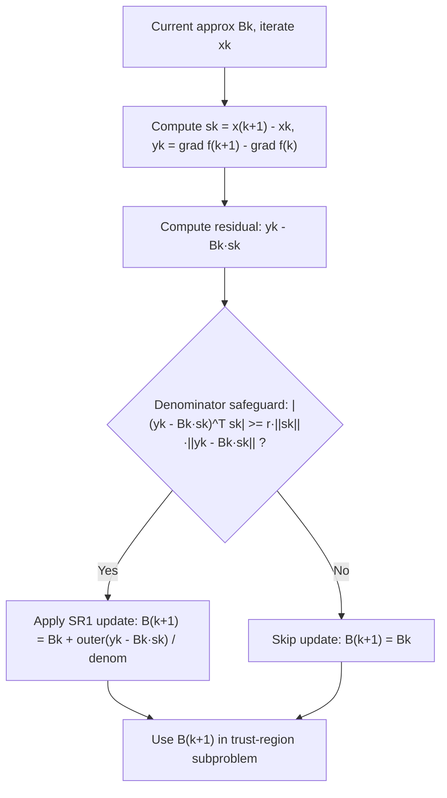

## Symmetric Rank-One (SR1) Updates

### Overview

The **Symmetric Rank-One (SR1)** update is a quasi-Newton method for approximating the Hessian (or its inverse) using only gradient information, updating the approximation by a single symmetric rank-one matrix at each iteration. Unlike BFGS, SR1 does not guarantee positive definiteness of the updated matrix, but it often produces more accurate Hessian approximations and is particularly effective in trust-region frameworks.

### The Secant Equation

Quasi-Newton methods build an approximation $B_k$ to the true Hessian $\nabla^2 f(x_k)$ (or $H_k \approx [\nabla^2 f(x_k)]^{-1}$) that satisfies the **secant condition**:

$$
B_{k+1} s_k = y_k
$$

where:

$$
s_k = x_{k+1} - x_k, \qquad y_k = \nabla f(x_{k+1}) - \nabla f(x_k)
$$

The secant equation ensures the updated Hessian approximation correctly reproduces the observed curvature along the most recent step direction.

### Derivation of the SR1 Update

The SR1 method seeks the simplest possible update — a rank-one correction:

$$
B_{k+1} = B_k + \sigma v v^T
$$

for some scalar $\sigma$ and vector $v$, chosen so that the secant equation holds. Substituting into the secant equation:

$$
B_k s_k + \sigma v (v^T s_k) = y_k \quad \Rightarrow \quad \sigma v (v^T s_k) = y_k - B_k s_k
$$

This requires $v$ to be parallel to $(y_k - B_k s_k)$. Setting $v = y_k - B_k s_k$ and solving for $\sigma$ using $v^T s_k = (y_k - B_k s_k)^T s_k$:

$$
\sigma = \frac{1}{(y_k - B_k s_k)^T s_k}
$$

This yields the **SR1 update formula**:

$$
B_{k+1} = B_k + \frac{(y_k - B_k s_k)(y_k - B_k s_k)^T}{(y_k - B_k s_k)^T s_k}
$$

By an entirely analogous derivation applied to the inverse Hessian approximation $H_k \approx B_k^{-1}$ (swapping the roles of $s_k$ and $y_k$), the **inverse SR1 update** is:

$$
H_{k+1} = H_k + \frac{(s_k - H_k y_k)(s_k - H_k y_k)^T}{(s_k - H_k y_k)^T y_k}
$$

### Key Properties

- **Symmetry preserved.** Since the update term $vv^T$ is always symmetric, $B_{k+1}$ remains symmetric whenever $B_k$ is symmetric.
- **Rank-one update.** Only one outer product is added per iteration, in contrast to BFGS's rank-two update.
- **No guaranteed positive definiteness.** Unlike BFGS, SR1 updates can produce indefinite matrices even when $B_k$ is positive definite. This makes SR1 unsuitable for plain line-search Newton-type methods (which require a positive definite Hessian approximation to guarantee a descent direction), but suitable for **trust-region methods**, which do not require positive definiteness.
- **Superior curvature approximation.** [Inference] In practice, SR1 often generates Hessian approximations that converge to the true Hessian more accurately than BFGS, particularly useful when second-order information (e.g., for trust-region subproblems) is important, though this depends on problem structure and is not a universal guarantee.
- **Unique rank-one update.** Among all symmetric rank-one updates satisfying the secant equation, the SR1 formula is essentially the *only* one (up to the choice of denominator sign), making the derivation exact rather than heuristic.

### The Numerical Breakdown Problem

The SR1 update has a critical numerical issue: the denominator $(y_k - B_k s_k)^T s_k$ can be zero or very close to zero, even when $y_k \ne B_k s_k$, causing the update to be undefined or numerically unstable (division by near-zero producing enormous entries).

**Standard safeguard — skipping the update.** The update is applied only when the denominator is sufficiently large relative to the vector norms:

$$
\left| (y_k - B_k s_k)^T s_k \right| \ge r \, \|s_k\| \, \|y_k - B_k s_k\|
$$

for some small constant $r \in (0, 1)$, commonly $r = 10^{-8}$. If this condition fails, the update is **skipped** for that iteration (i.e., $B_{k+1} = B_k$), and the algorithm proceeds with the old approximation.

### SR1 in Trust-Region Methods

Because SR1 does not preserve positive definiteness, it is almost always paired with a **trust-region** strategy rather than a line-search strategy:

$$
\min_{p} \; m_k(p) = f(x_k) + \nabla f(x_k)^T p + \frac{1}{2} p^T B_k p \quad \text{s.t.} \quad \|p\| \le \Delta_k
$$

Trust-region subproblems are well-posed even when $B_k$ is indefinite, since the trust-region radius constraint $\|p\| \le \Delta_k$ bounds the step regardless of the curvature model's shape. This is a primary practical motivation for using SR1 over BFGS: SR1 can represent negative curvature directions faithfully (useful near saddle points), which BFGS structurally cannot.

### Worked Example

Let $n = 2$, with initial Hessian approximation $B_0 = I$ (identity), and suppose one step produces:

$$
s_0 = \begin{bmatrix} 1 \\ 0 \end{bmatrix}, \qquad y_0 = \begin{bmatrix} 2 \\ 1 \end{bmatrix}
$$

**Step 1 — Compute $B_0 s_0$:**

$$
B_0 s_0 = \begin{bmatrix} 1 \\ 0 \end{bmatrix}
$$

**Step 2 — Compute $y_0 - B_0 s_0$:**

$$
y_0 - B_0 s_0 = \begin{bmatrix} 2 \\ 1 \end{bmatrix} - \begin{bmatrix} 1 \\ 0 \end{bmatrix} = \begin{bmatrix} 1 \\ 1 \end{bmatrix}
$$

**Step 3 — Compute the denominator $(y_0 - B_0 s_0)^T s_0$:**

$$
\begin{bmatrix} 1 & 1 \end{bmatrix} \begin{bmatrix} 1 \\ 0 \end{bmatrix} = 1
$$

**Step 4 — Check the safeguard condition:** with $\|s_0\| = 1$, $\|y_0 - B_0 s_0\| = \sqrt{2}$, and $r = 10^{-8}$:

$$
|1| \ge 10^{-8} \cdot 1 \cdot \sqrt{2} \quad \checkmark \text{ (safe to update)}
$$

**Step 5 — Form the outer product and update:**

$$
(y_0 - B_0 s_0)(y_0 - B_0 s_0)^T = \begin{bmatrix} 1 \\ 1 \end{bmatrix} \begin{bmatrix} 1 & 1 \end{bmatrix} = \begin{bmatrix} 1 & 1 \\ 1 & 1 \end{bmatrix}
$$

$$
B_1 = I + \frac{1}{1} \begin{bmatrix} 1 & 1 \\ 1 & 1 \end{bmatrix} = \begin{bmatrix} 2 & 1 \\ 1 & 2 \end{bmatrix}
$$

**Verification:** Check $B_1 s_0 = y_0$:

$$
\begin{bmatrix} 2 & 1 \\ 1 & 2 \end{bmatrix} \begin{bmatrix} 1 \\ 0 \end{bmatrix} = \begin{bmatrix} 2 \\ 1 \end{bmatrix} = y_0 \quad \checkmark
$$

The secant equation is satisfied exactly, confirming the update.

### SR1 vs. BFGS Comparison

| Property | SR1 | BFGS |
|---|---|---|
| Update rank | 1 | 2 |
| Positive definiteness preserved | No | Yes (with appropriate step sizes) |
| Denominator can vanish | Yes, requires skipping safeguard | No (curvature condition typically enforced via line search) |
| Best paired with | Trust-region methods | Line-search methods |
| Hessian approximation accuracy | [Inference] Often more accurate in practice | Good, but structurally biased toward positive definiteness |
| Handles negative curvature | Yes | No |

### SR1 Update Flow (Mermaid)

### Geometric Interpretation Diagram (svg_diagram)

<svg xmlns="http://www.w3.org/2000/svg" viewBox="0 0 640 300">
  <text x="320" y="24" text-anchor="middle" font-size="16" font-weight="bold" fill="#222">SR1 Rank-One Correction (svg_diagram)</text>
  <line x1="80" y1="260" x2="580" y2="260" stroke="#333" stroke-width="1" />
  <line x1="80" y1="260" x2="80" y2="50" stroke="#333" stroke-width="1" />
  <text x="590" y="264" font-size="12" fill="#555">dim 1</text>
  <text x="70" y="45" font-size="12" fill="#555">dim 2</text>
  <line x1="80" y1="260" x2="280" y2="260" stroke="#2266cc" stroke-width="3" />
  <text x="180" y="278" text-anchor="middle" font-size="12" fill="#2266cc">step s_k</text>
  <line x1="80" y1="260" x2="240" y2="140" stroke="#cc3333" stroke-width="3" />
  <text x="150" y="190" text-anchor="middle" font-size="12" fill="#cc3333">B_k·s_k</text>
  <line x1="80" y1="260" x2="320" y2="100" stroke="#009966" stroke-width="3" />
  <text x="330" y="90" text-anchor="middle" font-size="12" fill="#009966">y_k (true curvature)</text>
  <line x1="240" y1="140" x2="320" y2="100" stroke="#996600" stroke-width="2" stroke-dasharray="5,3" />
  <text x="310" y="130" text-anchor="middle" font-size="11" fill="#996600">residual v = y_k − B_k s_k</text>
</svg>

### Common Pitfalls

- **Applying SR1 in a pure line-search Newton method.** Without a trust-region safeguard, an indefinite $B_k$ can produce an ascent direction rather than a descent direction, breaking convergence guarantees.
- **Ignoring the skip condition.** Implementing the raw formula without the denominator safeguard leads to numerical blow-up whenever $(y_k - B_k s_k)^T s_k \approx 0$.
- **Expecting monotonic improvement.** [Inference] Because updates are sometimes skipped, the Hessian approximation does not improve strictly every iteration; convergence behavior can be non-monotonic in early iterations, though this is a well-documented characteristic rather than a flaw unique to any implementation.
- **Confusing SR1 with Broyden's method.** Broyden's method (for nonlinear equations) is also a rank-one update but does **not** enforce symmetry; SR1 is specifically the symmetric variant tailored for Hessian approximation in optimization.

**Related Topics:**
- BFGS and Limited-Memory BFGS (L-BFGS)
- Broyden's Method for Nonlinear Systems
- Trust-Region Methods and Subproblem Solvers
- Davidon-Fletcher-Powell (DFP) Update
- Quasi-Newton Convergence Theory
- Positive Definiteness Preservation in Quasi-Newton Updates
- Dogleg and Steihaug-Toint Methods for Trust Regions