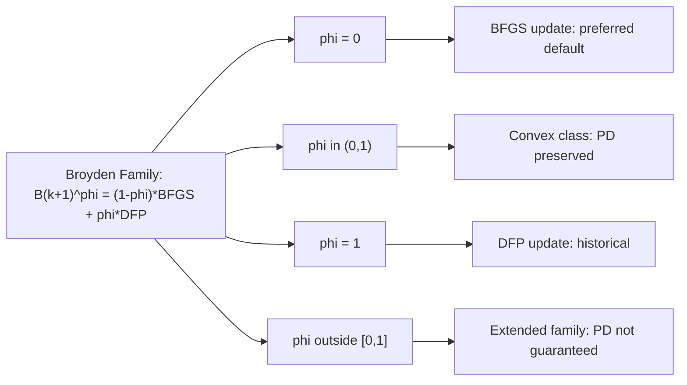

## Broyden Family of Updates

### Overview

The **Broyden family** is a one-parameter family of quasi-Newton updates that includes both DFP and BFGS as special cases, along with an infinite continuum of updates interpolating between them. It provides a unifying framework for understanding rank-two secant updates and highlights _why_ BFGS emerged as the practically preferred member of the family.

### Background: The Two Rank-Two Updates

Before defining the family, recall the two classical rank-two updates for the Hessian approximation $B_k$, both satisfying the secant equation $B_{k+1} s_k = y_k$:

**DFP update** (originally derived for the inverse Hessian $H_k$, then translated to $B_k$ via the Sherman-Morrison-Woodbury formula):

$$ B_{k+1}^{DFP} = \left(I - \frac{y_k s_k^T}{y_k^T s_k}\right) B_k \left(I - \frac{s_k y_k^T}{y_k^T s_k}\right) + \frac{y_k y_k^T}{y_k^T s_k} $$

**BFGS update:**

$$ B_{k+1}^{BFGS} = B_k - \frac{B_k s_k s_k^T B_k}{s_k^T B_k s_k} + \frac{y_k y_k^T}{y_k^T s_k} $$

Both are rank-two updates (each differs from $B_k$ by the sum of two rank-one matrices) and both preserve positive definiteness under the **curvature condition** $y_k^T s_k > 0$.

### The Broyden Family Formula

The Broyden family combines these two updates via a scalar interpolation parameter $\phi \in \mathbb{R}$:

$$ B_{k+1}^{\phi} = (1 - \phi) B_{k+1}^{BFGS} + \phi , B_{k+1}^{DFP} $$

An equivalent and more commonly cited closed form is:

$$ B_{k+1}^{\phi} = B_k - \frac{B_k s_k s_k^T B_k}{s_k^T B_k s_k} + \frac{y_k y_k^T}{y_k^T s_k} + \phi , (s_k^T B_k s_k) , w_k w_k^T $$

where $w_k$ is defined as:

$$ w_k = \frac{y_k}{y_k^T s_k} - \frac{B_k s_k}{s_k^T B_k s_k} $$

- When $\phi = 0$: recovers exactly the **BFGS** update.
- When $\phi = 1$: recovers exactly the **DFP** update.
- For $\phi \in (0, 1)$: produces a **convex combination**, sometimes called the **Broyden convex class**.
- For $\phi < 0$ or $\phi > 1$: still a valid member of the (extended) Broyden family, though positive definiteness is no longer automatically guaranteed.

### Key Theoretical Properties

- **Secant equation satisfied for all $\phi$.** Every member of the family satisfies $B_{k+1}^{\phi} s_k = y_k$ exactly, since both DFP and BFGS individually satisfy it and the secant equation is linear in $B_{k+1}$.
- **Positive definiteness in the convex class.** For $\phi \in [0, 1]$ and under the curvature condition $y_k^T s_k > 0$, $B_{k+1}^{\phi}$ is positive definite whenever $B_k$ is positive definite. This is because $w_k w_k^T \succeq 0$ and the coefficient $\phi (s_k^T B_k s_k) \ge 0$ in this range, added to an already positive-definite BFGS update.
- **Invariance under exact line search.** [Inference] For quadratic objective functions with exact line searches, all members of the Broyden family (regardless of $\phi$) generate identical sequences of iterates ${x_k}$ — a classical and well-documented result — though this equivalence generally breaks down for non-quadratic functions or inexact line searches.
- **Finite termination on quadratics.** Every member of the convex Broyden class inherits the quadratic termination property: applied to a strictly convex quadratic with exact line search, the method converges to the minimizer in at most $n$ steps and $B_n$ equals the true (constant) Hessian.
- **Hereditary conjugacy.** The search directions generated by any fixed-$\phi$ member of the family are mutually conjugate with respect to the quadratic's Hessian, analogous to the conjugate gradient method.

### Why BFGS ($\phi = 0$) Is Preferred in Practice

Although the theoretical properties above hold across the convex class, BFGS is overwhelmingly the default choice in practical software. Reasons include:

- **Self-correcting property.** [Inference] BFGS has a documented tendency to self-correct poor scaling or eigenvalue estimates in the Hessian approximation over iterations more robustly than DFP, a property analyzed extensively in the optimization literature, though the precise rate depends on problem conditioning.
- **Superior empirical performance.** [Inference] Extensive numerical testing since the 1970s has consistently found BFGS outperforms DFP on general nonlinear (non-quadratic) problems, even though both share identical theoretical guarantees on quadratics.
- **Dual symmetry with DFP.** DFP updates $H_k$ (inverse Hessian) directly using the same formula structure that BFGS uses for $B_k$ — the two methods are "duals" of each other under the $B \leftrightarrow H$, $s \leftrightarrow y$ swap. This symmetry is why the family can be parameterized smoothly between them.

### Inverse Formulation

Because software typically maintains the inverse Hessian approximation $H_k$ directly (to avoid solving a linear system at each step), the Broyden family also has an inverse form, obtained by applying the Sherman-Morrison-Woodbury formula to $B_{k+1}^\phi$. The inverse update is more algebraically involved and is generally expressed via a dual parameter $\theta(\phi)$ rather than $\phi$ directly, reflecting the nonlinear relationship between updating $B_k$ and updating $H_k = B_k^{-1}$.

### Worked Example: Constructing an Intermediate Member

Let $n = 2$ with:

$$ B_k = I, \qquad s_k = \begin{bmatrix} 1 \ 0 \end{bmatrix}, \qquad y_k = \begin{bmatrix} 2 \ 1 \end{bmatrix} $$

**Step 1 — Confirm curvature condition:**

$$ y_k^T s_k = 2 > 0 \quad \checkmark $$

**Step 2 — Compute the BFGS update ($\phi = 0$):**

$$ B_k s_k = \begin{bmatrix} 1 \ 0 \end{bmatrix}, \qquad s_k^T B_k s_k = 1 $$

$$ B_{k+1}^{BFGS} = I - \frac{\begin{bmatrix}1\0\end{bmatrix}\begin{bmatrix}1&0\end{bmatrix}}{1} + \frac{\begin{bmatrix}2\1\end{bmatrix}\begin{bmatrix}2&1\end{bmatrix}}{2} = I - \begin{bmatrix}1&0\0&0\end{bmatrix} + \begin{bmatrix}2&1\1&0.5\end{bmatrix} = \begin{bmatrix}2&1\1&1.5\end{bmatrix} $$

**Step 3 — Compute $w_k$:**

$$ w_k = \frac{1}{2}\begin{bmatrix}2\1\end{bmatrix} - \frac{1}{1}\begin{bmatrix}1\0\end{bmatrix} = \begin{bmatrix}1\0.5\end{bmatrix} - \begin{bmatrix}1\0\end{bmatrix} = \begin{bmatrix}0\0.5\end{bmatrix} $$

**Step 4 — Choose $\phi = 0.5$ and compute the correction term:**

$$ \phi (s_k^T B_k s_k), w_k w_k^T = 0.5 \times 1 \times \begin{bmatrix}0\0.5\end{bmatrix}\begin{bmatrix}0 & 0.5\end{bmatrix} = 0.5 \times \begin{bmatrix}0&0\0&0.25\end{bmatrix} = \begin{bmatrix}0&0\0&0.125\end{bmatrix} $$

**Step 5 — Add to BFGS to get $B_{k+1}^{0.5}$:**

$$ B_{k+1}^{0.5} = \begin{bmatrix}2&1\1&1.5\end{bmatrix} + \begin{bmatrix}0&0\0&0.125\end{bmatrix} = \begin{bmatrix}2&1\1&1.625\end{bmatrix} $$

**Verification — secant equation:**

$$ \begin{bmatrix}2&1\1&1.625\end{bmatrix}\begin{bmatrix}1\0\end{bmatrix} = \begin{bmatrix}2\1\end{bmatrix} = y_k \quad \checkmark $$

The intermediate member correctly satisfies the secant equation, confirming that any $\phi$ produces a valid update.

### Comparison Table

|$\phi$ value|Update name|Positive definite (under curvature cond.)|Typical use|
|---|---|---|---|
|$\phi = 0$|BFGS|Yes|Default in most solvers|
|$\phi = 1$|DFP|Yes|Historical; rarely default today|
|$0 < \phi < 1$|Broyden convex class|Yes|Research, hybrid strategies|
|$\phi < 0$ or $\phi > 1$|Extended Broyden family|Not guaranteed|Rare; theoretical study|

### Broyden Family Structure (Mermaid)

### Interpolation Diagram (svg_diagram)

<svg viewBox="0 0 640 220" xmlns="http://www.w3.org/2000/svg"> <text x="320" y="24" text-anchor="middle" font-size="16" font-weight="bold" fill="#222">Broyden Family Interpolation Parameter φ (svg_diagram)</text> <line x1="80" y1="120" x2="560" y2="120" stroke="#333" stroke-width="2"/> <line x1="80" y1="110" x2="80" y2="130" stroke="#333" stroke-width="2"/> <line x1="560" y1="110" x2="560" y2="130" stroke="#333" stroke-width="2"/> <circle cx="80" cy="120" r="6" fill="#2266cc"/> <text x="80" y="100" text-anchor="middle" font-size="13" fill="#2266cc">φ = 0 (BFGS)</text> <circle cx="560" cy="120" r="6" fill="#cc3333"/> <text x="560" y="100" text-anchor="middle" font-size="13" fill="#cc3333">φ = 1 (DFP)</text> <circle cx="320" cy="120" r="5" fill="#009966"/> <text x="320" y="145" text-anchor="middle" font-size="12" fill="#009966">φ = 0.5 (convex mix)</text> <line x1="80" y1="120" x2="560" y2="120" stroke="#999" stroke-width="6" stroke-dasharray="1,0" opacity="0.15"/> <text x="320" y="175" text-anchor="middle" font-size="12" fill="#555">Positive definiteness preserved for φ ∈ [0, 1]</text> <line x1="30" y1="120" x2="70" y2="120" stroke="#aa8800" stroke-width="2" stroke-dasharray="4,3"/> <text x="30" y="145" font-size="11" fill="#aa8800">φ &lt; 0: PD not guaranteed</text> <line x1="570" y1="120" x2="610" y2="120" stroke="#aa8800" stroke-width="2" stroke-dasharray="4,3"/> <text x="575" y="145" font-size="11" fill="#aa8800">φ &gt; 1: PD not guaranteed</text> </svg>

### Common Pitfalls

- **Assuming all $\phi$ perform equally in practice.** While theoretically equivalent on quadratics with exact line search, [Inference] performance diverges substantially on general nonlinear problems with inexact line search — BFGS ($\phi=0$) is consistently the most robust choice in that setting.
- **Neglecting the curvature condition.** As with BFGS and DFP individually, $y_k^T s_k > 0$ must hold for the convex class to guarantee positive definiteness; without it (or a suitable line search enforcing the Wolfe conditions), the update can fail.
- **Confusing the $B$-form and $H$-form parameters.** The interpolation parameter for the direct Hessian update ($\phi$) is not numerically identical to the interpolation parameter used in the corresponding inverse-Hessian update; conflating them leads to incorrect implementations.
- **Overlooking numerical conditioning outside $[0,1]$.** Venturing outside the convex class for experimentation requires additional safeguards, since positive definiteness and even well-posedness of the update are no longer automatic.

**Related Topics:**

- BFGS Update Derivation and Properties
- DFP Update Derivation and Properties
- Symmetric Rank-One (SR1) Updates
- Sherman-Morrison-Woodbury Formula
- Wolfe Conditions and Curvature Condition
- Quasi-Newton Convergence Theory
- Self-Scaling Variable Metric Methods
