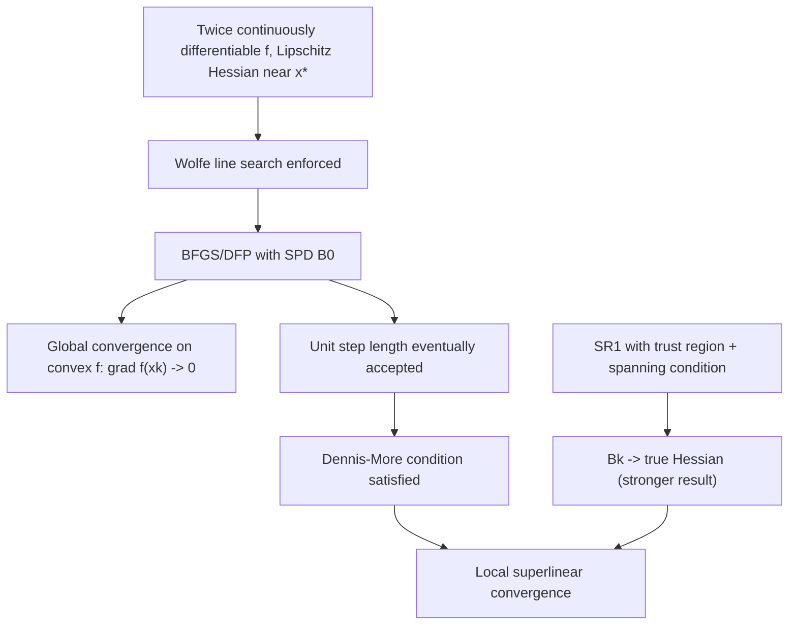

## Convergence Properties of Quasi-Newton Methods

### Overview

Quasi-Newton methods occupy a middle ground between gradient descent (linear convergence, cheap per-iteration cost) and Newton's method (quadratic convergence, expensive per-iteration cost). Their signature theoretical result is **local superlinear convergence** without requiring explicit second-derivative computation. This topic surveys the main convergence results, the conditions under which they hold, and how they compare across the major update formulas.

### Types of Convergence Rates (Background)

For a sequence ${x_k} \to x^_$, define $e_k = |x_k - x^_|$. The standard classifications:

- **Linear convergence:** $e_{k+1} \le c , e_k$ for some $c \in (0,1)$.
- **Superlinear convergence:** $\displaystyle \lim_{k \to \infty} \frac{e_{k+1}}{e_k} = 0$.
- **Quadratic convergence:** $e_{k+1} \le c , e_k^2$ for some $c > 0$.

Quasi-Newton methods, under standard assumptions, achieve **superlinear** — not quadratic — convergence. Quadratic convergence is the hallmark of exact Newton's method, which uses the true Hessian rather than an approximation.

### Global Convergence: Line-Search Quasi-Newton Methods

**Assumptions typically required:**

- $f$ is twice continuously differentiable.
- The level set ${x : f(x) \le f(x_0)}$ is bounded, and $f$ is bounded below.
- $\nabla^2 f$ is Lipschitz continuous in a neighborhood of the solution (for the superlinear rate; global convergence itself needs less).
- The line search satisfies the **Wolfe conditions** (sufficient decrease and curvature).
- The Hessian approximations $B_k$ have bounded condition number (uniformly positive definite, bounded above and below).

**Global convergence result.** For BFGS with a Wolfe line search on a **convex** objective function, the method is globally convergent: $\nabla f(x_k) \to 0$ as $k \to \infty$, regardless of the starting point $x_0$ and initial Hessian approximation $B_0$ (subject to $B_0$ being symmetric positive definite). This is a well-established classical result in the optimization literature.

[Inference] For general **nonconvex** functions, global convergence of BFGS with a Wolfe line search is not guaranteed in general and remains a subtler theoretical question — counterexamples showing failure of convergence exist for certain nonconvex functions, though such pathological cases are considered rare in practice.

### Local Superlinear Convergence: The Dennis-Moré Characterization

The central theoretical result governing quasi-Newton convergence rates is the **Dennis-Moré theorem**, which gives a necessary and sufficient condition for superlinear convergence.

**Dennis-Moré condition.** Suppose $x_k \to x^_$ where $\nabla^2 f(x^_)$ is positive definite, and $B_k$ are the quasi-Newton Hessian approximations used to generate steps $p_k = -B_k^{-1} \nabla f(x_k)$. Then $x_k \to x^*$ superlinearly if and only if:

$$ \lim_{k \to \infty} \frac{|(B_k - \nabla^2 f(x^*)) s_k|}{|s_k|} = 0 $$

where $s_k = x_{k+1} - x_k$. This condition states that the Hessian approximation error need only vanish **along the direction of the step** $s_k$ — not in every direction. This is a substantially weaker (and more achievable) requirement than demanding $B_k \to \nabla^2 f(x^*)$ in the full matrix norm, and it explains why superlinear convergence is attainable even though $B_k$ typically does **not** converge to the true Hessian in general.

**Consequence for BFGS.** Under the standing assumptions (convexity, Lipschitz continuous Hessian near $x^*$, Wolfe line search with eventual unit step length acceptance), BFGS satisfies the Dennis-Moré condition and therefore converges **superlinearly**.

### Convergence Rate Summary Table

|Method|Local rate (standard assumptions)|Requires exact Hessian|Requires line search safeguards|
|---|---|---|---|
|Gradient descent|Linear|No|Yes (or fixed step)|
|Newton's method|Quadratic|Yes|Often none near solution|
|BFGS|Superlinear|No|Yes (Wolfe conditions)|
|DFP|Superlinear|No|Yes (Wolfe conditions)|
|SR1 (with trust region)|Superlinear (often faster in practice)|No|Trust-region safeguard, not line search|
|L-BFGS (limited memory)|Linear to superlinear|No|Yes (Wolfe conditions)|

[Inference] The comparative statement that SR1 is "often faster in practice" than BFGS reflects widely cited numerical experience in the literature but is not a formally proven asymptotic rate superiority; it depends on the specific problem and safeguard implementation.

### Convergence Rate of SR1

SR1's convergence theory differs structurally from BFGS/DFP because SR1 does not guarantee positive definiteness and is typically embedded in a trust-region method rather than a line search.

**Key SR1 convergence result.** Under suitable conditions — including that the sequence of steps ${s_k}$ spans $\mathbb{R}^n$ infinitely often (a linear independence condition) and the denominator safeguard is respected — the SR1 Hessian approximations satisfy:

$$ \lim_{k \to \infty} |B_k - \nabla^2 f(x^*)| = 0 $$

This is a **stronger** convergence statement than the Dennis-Moré condition: SR1, when it works, can converge to the _actual_ Hessian matrix, not merely satisfy the weaker directional condition. [Inference] This is often cited as the theoretical explanation for SR1's strong empirical performance in trust-region settings, since an accurate full Hessian approximation improves the trust-region subproblem's fidelity to the true objective, though this convergence to the true Hessian is conditional on the spanning assumption holding, which is not automatic.

### The Role of Unit Step Lengths

A subtle but essential ingredient in the superlinear convergence proofs is that the line search must **eventually accept the unit step length** $\alpha_k = 1$ for all sufficiently large $k$. This is proven to occur automatically for BFGS under the standard assumptions (it is not imposed as a separate requirement) — a result sometimes called the **Dennis-Moré-Powell theorem** — but it is a nontrivial part of the proof and explains why the Wolfe conditions (which permit $\alpha_k = 1$ when appropriate, unlike stricter backtracking-only rules) are the natural line search pairing for quasi-Newton methods.

### Why Not Quadratic Convergence?

A frequent conceptual question is why quasi-Newton methods, which are explicitly designed to mimic Newton's method, fall short of quadratic convergence. The reason is structural:

- Newton's method uses $B_k = \nabla^2 f(x_k)$ exactly at every iteration, re-evaluated fresh each step.
- Quasi-Newton methods build $B_k$ **incrementally** from gradient differences, carrying forward information from all previous iterations via the recursive update formula.
- The Dennis-Moré condition only requires the approximation to become accurate along the _step direction_, asymptotically — the approximation error in other directions can persist without preventing superlinear convergence, but this same feature prevents the stronger quadratic rate, which would require full second-order accuracy at every step.

### Finite Termination on Quadratic Functions

A special and instructive case: for a **strictly convex quadratic** function $f(x) = \frac{1}{2}x^T A x - b^T x$ with $A \succ 0$, and using an **exact line search**, any member of the Broyden convex class (including BFGS and DFP) satisfies:

- The search directions $p_0, p_1, \dots, p_{n-1}$ are mutually $A$-conjugate.
- The method terminates at the exact minimizer in at most $n$ iterations.
- $B_n = A$ exactly (the Hessian approximation recovers the true Hessian after at most $n$ steps).

This finite-termination property is a **global**, exact result specific to quadratics — distinct from the local, asymptotic superlinear convergence rate that applies to general nonlinear functions.

### Convergence Rate Comparison Diagram (svg_diagram)

<svg viewBox="0 0 640 300" xmlns="http://www.w3.org/2000/svg"> <text x="320" y="24" text-anchor="middle" font-size="16" font-weight="bold" fill="#222">Error Decay: Convergence Rate Comparison (svg_diagram)</text> <line x1="70" y1="260" x2="600" y2="260" stroke="#333" stroke-width="1"/> <line x1="70" y1="260" x2="70" y2="50" stroke="#333" stroke-width="1"/> <text x="610" y="264" font-size="12" fill="#555">iteration k</text> <text x="55" y="45" font-size="12" fill="#555">error e_k</text> <path d="M 90 60 L 200 130 L 310 175 L 420 205 L 530 225" stroke="#cc3333" stroke-width="2" fill="none"/> <text x="540" y="222" font-size="12" fill="#cc3333">Linear (gradient descent)</text> <path d="M 90 60 L 200 150 L 250 220 L 280 250 L 300 258" stroke="#2266cc" stroke-width="2" fill="none"/> <text x="310" y="215" font-size="12" fill="#2266cc">Superlinear (quasi-Newton)</text> <path d="M 90 60 L 150 180 L 175 245 L 185 259" stroke="#009966" stroke-width="2" fill="none"/> <text x="195" y="255" font-size="12" fill="#009966">Quadratic (Newton)</text> </svg>

### Convergence Theory Dependency Flow (Mermaid)

### Common Pitfalls

- **Expecting quadratic convergence from BFGS.** This is a common misconception; the correct and provable rate under standard assumptions is superlinear, not quadratic.
- **Ignoring the role of the line search.** Superlinear convergence proofs depend critically on Wolfe conditions and eventual unit-step acceptance; using only a crude backtracking rule that never tries $\alpha_k = 1$ can degrade the observed rate to linear.
- **Assuming $B_k \to \nabla^2 f(x^*)$ for BFGS.** This is false in general for BFGS/DFP — only the weaker Dennis-Moré directional condition is guaranteed. Full Hessian convergence is a distinguishing (conditional) property of SR1, not BFGS.
- **Applying quadratic-function finite-termination results to general nonlinear problems.** The $n$-step exact termination property is specific to strictly convex quadratics with exact line search and does not transfer to general nonlinear functions, which instead exhibit only asymptotic superlinear behavior.
- **Neglecting global convergence assumptions.** [Inference] Convexity of $f$ is doing significant work in the global convergence result; applying BFGS to a nonconvex problem without safeguards (e.g., damped updates, trust-region variants) can lead to failure to converge in some cases, even though it frequently performs well in practice.

**Related Topics:**

- BFGS Update Derivation and Properties
- Broyden Family of Updates
- Symmetric Rank-One (SR1) Updates
- Wolfe Conditions and Line Search Theory
- Newton's Method and Quadratic Convergence
- Trust-Region Methods and Convergence Theory
- Limited-Memory BFGS (L-BFGS)
- Conjugate Gradient Method and Finite Termination
