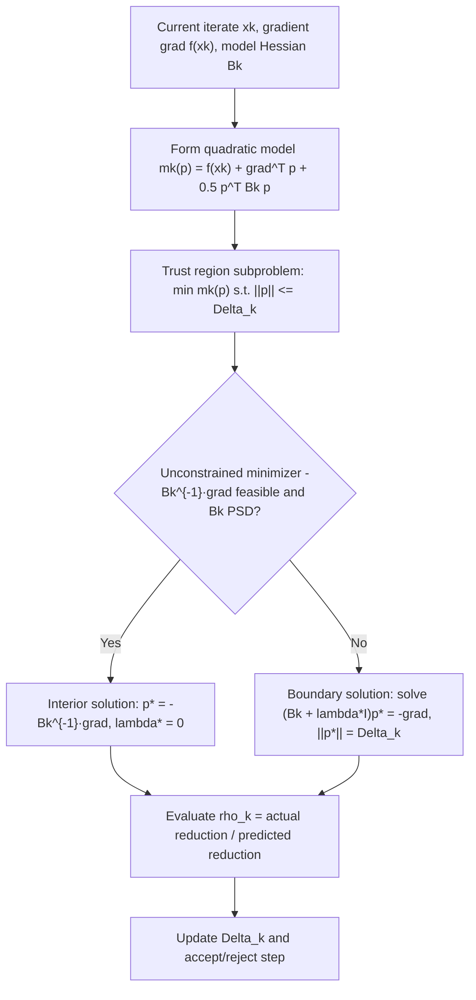

## Trust Region Subproblem Formulation

### Overview

Trust-region methods are an alternative to line-search methods for globalizing Newton-type and quasi-Newton iterations. Instead of first choosing a direction and then a step length, trust-region methods define a region around the current iterate within which a local model is *trusted* to approximate the objective, then solve a constrained subproblem to find the best step within that region. This topic covers the formulation of that subproblem, its theoretical properties, and the main solution strategies.

### The Quadratic Model

At iterate $x_k$, the objective is approximated by a quadratic model built from a first- or second-order Taylor expansion:

$$
m_k(p) = f(x_k) + \nabla f(x_k)^T p + \frac{1}{2} p^T B_k p
$$

where:

- $p \in \mathbb{R}^n$ is the candidate step, so the trial point is $x_k + p$.
- $B_k$ is a symmetric matrix approximating $\nabla^2 f(x_k)$ — this may be the exact Hessian, a quasi-Newton approximation (BFGS, SR1), or even $B_k = 0$ in the simplest variants.
- $m_k(0) = f(x_k)$ and $\nabla m_k(0) = \nabla f(x_k)$, so the model matches the objective's value and gradient exactly at the current point.

Unlike line-search methods, $B_k$ is **not required to be positive definite** — this is a central structural advantage of the trust-region framework, since it permits safe use of indefinite Hessian approximations (e.g., from SR1, or the exact Hessian near a saddle point).

### The Trust Region Subproblem (TRS)

The **trust region subproblem** restricts the step to a ball of radius $\Delta_k > 0$ around the origin:

$$
\begin{aligned}
\min_{p \in \mathbb{R}^n} \quad & m_k(p) = f(x_k) + \nabla f(x_k)^T p + \frac{1}{2} p^T B_k p \\
\text{subject to} \quad & \|p\| \le \Delta_k
\end{aligned}
$$

where $\|\cdot\|$ is typically the Euclidean norm (though scaled or elliptical norms are also used in some formulations). $\Delta_k$ is the **trust-region radius**, updated adaptively at each iteration based on how well the model predicted the actual reduction in $f$.

**Key structural facts:**

- The TRS is a **nonconvex** optimization problem in general (since $B_k$ may be indefinite), yet it is one of the few nonconvex problems that can be **solved globally and efficiently** — a notable exception to the general difficulty of nonconvex optimization.
- The constraint set $\{p : \|p\| \le \Delta_k\}$ is compact, so a global minimizer of $m_k$ over this set always exists (by the extreme value theorem), regardless of the definiteness of $B_k$.

### The Optimality Conditions for the TRS

The following characterization is the foundation of essentially all TRS solution algorithms.

**Theorem (characterization of the global solution).** A vector $p^*$ is a global solution of the trust region subproblem if and only if $p^*$ is feasible ($\|p^*\| \le \Delta_k$) and there exists a scalar $\lambda^* \ge 0$ such that:

$$
(B_k + \lambda^* I) p^* = -\nabla f(x_k)
$$

$$
\lambda^* (\Delta_k - \|p^*\|) = 0 \quad \text{(complementarity)}
$$

$$
(B_k + \lambda^* I) \succeq 0 \quad \text{(positive semidefiniteness)}
$$

This result is sometimes attributed to Gay and Sorensen (developed independently by both in the early 1980s). It shows that the solution to the trust-region subproblem is precisely the solution to a **shifted linear system**, where the shift $\lambda^*$ is chosen to make $(B_k + \lambda^* I)$ positive semidefinite and simultaneously satisfy the complementarity condition.

**Interpretation of the two cases:**

- **Interior solution ($\|p^*\| < \Delta_k$):** complementarity forces $\lambda^* = 0$, so $p^* = -B_k^{-1} \nabla f(x_k)$ is simply the **unconstrained Newton step**, valid when $B_k \succeq 0$ and this step already lies within the trust region.
- **Boundary solution ($\|p^*\| = \Delta_k$):** $\lambda^* > 0$ is required, effectively adding a regularization term $\lambda^* I$ to $B_k$ before solving — this connects the trust-region step directly to **Tikhonov regularization** / ridge-regression-style damping, and explains the close relationship between trust-region methods and the **Levenberg-Marquardt algorithm**.

### Why an Exact Solution Is Rarely Computed

Solving the TRS to full optimality requires finding $\lambda^*$ such that $\|p(\lambda^*)\| = \Delta_k$ exactly (in the boundary case), which in turn requires an eigendecomposition or iterative root-finding on the **secular equation**:

$$
\phi(\lambda) = \frac{1}{\|p(\lambda)\|} - \frac{1}{\Delta_k} = 0, \qquad p(\lambda) = -(B_k + \lambda I)^{-1} \nabla f(x_k)
$$

This is computationally expensive for large $n$ (comparable to an eigenvalue problem), so in practice **approximate** subproblem solvers are used instead — the two most common being the **dogleg method** and the **Steihaug-Toint conjugate gradient method** (covered as separate topics). These approximate solvers only need to achieve a **sufficient decrease** in $m_k$, not the exact global minimizer, to preserve the overall convergence theory of the trust-region algorithm.

### The Trust-Region Algorithm Loop (Context for the Subproblem)

The subproblem is embedded in an outer loop that adapts $\Delta_k$ based on the **ratio of actual to predicted reduction**:

$$
\rho_k = \frac{f(x_k) - f(x_k + p_k)}{m_k(0) - m_k(p_k)}
$$

- $\rho_k$ close to $1$: the model was accurate; the step is accepted and $\Delta_k$ may be increased.
- $\rho_k$ small or negative: the model was poor; the step is rejected and $\Delta_k$ is decreased.
- Intermediate $\rho_k$: the step is accepted but $\Delta_k$ is left unchanged.

This adaptive mechanism, and the precise thresholds used, are typically treated as a separate topic (the trust-region update algorithm); this section focuses only on the subproblem itself.

### Worked Example

Let $n = 2$ at some iterate $x_k$ with:

$$
\nabla f(x_k) = \begin{bmatrix} 2 \\ -1 \end{bmatrix}, \qquad B_k = \begin{bmatrix} 4 & 0 \\ 0 & 1 \end{bmatrix}, \qquad \Delta_k = 1
$$

**Step 1 — Check the unconstrained (Newton) minimizer of $m_k$:**

Since $B_k \succ 0$ (eigenvalues $4$ and $1$, both positive):

$$
p_N = -B_k^{-1} \nabla f(x_k) = -\begin{bmatrix} 1/4 & 0 \\ 0 & 1 \end{bmatrix}\begin{bmatrix} 2 \\ -1 \end{bmatrix} = \begin{bmatrix} -0.5 \\ 1 \end{bmatrix}
$$

**Step 2 — Check feasibility:**

$$
\|p_N\| = \sqrt{(-0.5)^2 + 1^2} = \sqrt{1.25} \approx 1.118 > \Delta_k = 1
$$

The unconstrained minimizer lies **outside** the trust region, so the solution must lie on the **boundary**: $\|p^*\| = 1$, requiring $\lambda^* > 0$.

**Step 3 — Solve for $\lambda^*$ using the shifted system.** With $B_k$ diagonal, $(B_k + \lambda I)$ is also diagonal, giving:

$$
p(\lambda) = -\begin{bmatrix} \frac{2}{4+\lambda} \\ \frac{-1}{1+\lambda} \end{bmatrix} = \begin{bmatrix} \frac{-2}{4+\lambda} \\ \frac{1}{1+\lambda} \end{bmatrix}
$$

We need $\|p(\lambda)\|^2 = 1$:

$$
\frac{4}{(4+\lambda)^2} + \frac{1}{(1+\lambda)^2} = 1
$$

**Step 4 — Solve numerically.** Trying $\lambda = 1$:

$$
\frac{4}{25} + \frac{1}{4} = 0.16 + 0.25 = 0.41 \quad (\text{too small, need larger contribution} \Rightarrow \text{decrease } \lambda)
$$

Trying $\lambda = 0.5$:

$$
\frac{4}{20.25} + \frac{1}{2.25} \approx 0.198 + 0.444 = 0.642 \quad (\text{still less than } 1)
$$

Trying $\lambda = 0.1$:

$$
\frac{4}{16.81} + \frac{1}{1.21} \approx 0.238 + 0.826 = 1.064 \quad (\text{slightly above } 1)
$$

[Unverified] The exact root lies between $\lambda = 0.1$ and $\lambda = 0.5$ (closer to $0.1$–$0.15$ based on the trend above); a precise value requires a numerical root-finder (e.g., Newton's method on the secular equation) rather than hand calculation, so this example illustrates the *method*, not a fully resolved numeric answer.

**Step 5 — Interpretation.** Once $\lambda^*$ is found (numerically), $p^* = p(\lambda^*)$ gives the boundary solution, which lies in the direction that balances the pull of $-\nabla f(x_k)$ against the curvature encoded in $B_k$, scaled to exactly meet the radius constraint $\|p^*\| = \Delta_k$.

### Comparison: Line Search vs. Trust Region

| Aspect | Line Search | Trust Region |
|---|---|---|
| Order of decisions | Direction first, then step length | Region first, then best point in region |
| Requires $B_k \succ 0$ (or PD-ified) | Yes | No |
| Handles indefinite $B_k$ | Requires modification (e.g., modified Cholesky) | Naturally, via the subproblem |
| Subproblem cost | Cheap (1D search along a line) | More expensive (up to a small eigenproblem) |
| Compatible update types | BFGS (needs SPD) | SR1, exact Hessian, BFGS all work |
| Adaptivity mechanism | Step length $\alpha_k$ | Region radius $\Delta_k$ |

### Trust Region Subproblem Flow (Mermaid)

### Feasible Region Diagram (svg_diagram)

<svg xmlns="http://www.w3.org/2000/svg" viewBox="0 0 500 400">
  <text x="250" y="24" text-anchor="middle" font-size="16" font-weight="bold" fill="#222">Trust Region Subproblem Geometry (svg_diagram)</text>
  <circle cx="250" cy="220" r="120" fill="#e6f0fa" stroke="#2266cc" stroke-width="2" />
  <text x="250" y="105" text-anchor="middle" font-size="12" fill="#2266cc">||p|| ≤ Δk</text>
  <circle cx="250" cy="220" r="3" fill="#333" />
  <text x="250" y="240" text-anchor="middle" font-size="11" fill="#333">p = 0 (current point)</text>
  <line x1="250" y1="220" x2="400" y2="150" stroke="#cc3333" stroke-width="2" stroke-dasharray="5,3" />
  <circle cx="400" cy="150" r="5" fill="#cc3333" />
  <text x="410" y="140" font-size="11" fill="#cc3333">Newton step p_N (infeasible)</text>
  <line x1="250" y1="220" x2="345" y2="140" stroke="#009966" stroke-width="3" />
  <circle cx="345" cy="140" r="5" fill="#009966" />
  <text x="350" y="128" font-size="11" fill="#009966">p* (boundary solution)</text>
  <ellipse cx="290" cy="190" rx="130" ry="70" fill="none" stroke="#996600" stroke-width="1" stroke-dasharray="3,3" transform="rotate(-20 290 190)" />
  <text x="400" y="270" font-size="11" fill="#996600">model contour m_k(p) = const</text>
</svg>

### Common Pitfalls

- **Assuming the TRS is convex.** Because $B_k$ may be indefinite, the TRS is generally nonconvex; its tractability comes from the special structure of the ball constraint, not from convexity.
- **Confusing $\lambda^*$ with a Lagrange multiplier sign convention error.** The condition requires $\lambda^* \ge 0$ and $(B_k + \lambda^* I) \succeq 0$ simultaneously — omitting the positive semidefiniteness requirement gives a stationary point of the Lagrangian that is not necessarily the global minimizer.
- **Solving the TRS exactly when an approximate solution suffices.** Exact solution via the secular equation is rarely done in large-scale practice; algorithms like dogleg or Steihaug-CG achieve sufficient decrease far more cheaply while preserving global convergence guarantees.
- **Forgetting the interior case.** When $B_k \succ 0$ and the Newton step already satisfies $\|p_N\| \le \Delta_k$, no root-finding is needed at all — $\lambda^* = 0$ and $p^* = p_N$ directly.

**Related Topics:**
- Dogleg Method for Trust Region Subproblems
- Steihaug-Toint Conjugate Gradient Method
- Trust Region Radius Update Rules
- Levenberg-Marquardt Algorithm
- Symmetric Rank-One (SR1) Updates
- Secular Equation and Eigendecomposition-Based TRS Solvers
- Global Convergence Theory for Trust-Region Methods