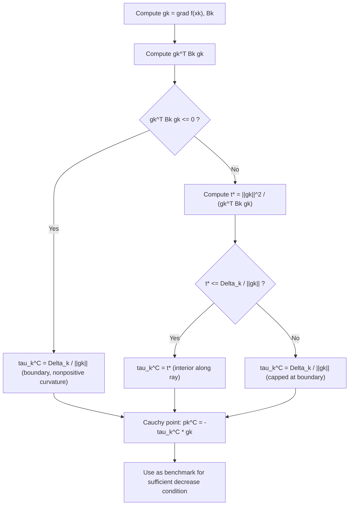

## Cauchy Point Calculation

### Overview

The **Cauchy point** is the simplest and cheapest approximate solution to the trust region subproblem. It is obtained by minimizing the quadratic model **along the steepest descent direction only**, restricted to the trust region. While too crude to use alone in a competitive algorithm, the Cauchy point plays a foundational theoretical role: it is the benchmark against which the **sufficient decrease** condition for all practical trust-region step computations (dogleg, Steihaug-CG, etc.) is measured.

### Setup

Recall the trust-region subproblem at iterate $x_k$:

$$
\min_{p} \; m_k(p) = f(x_k) + \nabla f(x_k)^T p + \frac{1}{2} p^T B_k p \quad \text{subject to} \quad \|p\| \le \Delta_k
$$

The Cauchy point restricts attention to the one-dimensional ray along the negative gradient direction:

$$
p(\tau) = -\tau \frac{\nabla f(x_k)}{\|\nabla f(x_k)\|}, \qquad \tau \ge 0
$$

and finds the best $\tau$ (equivalently, the best scalar step length along steepest descent) subject to remaining in the trust region.

### Derivation in Two Stages

**Stage 1 — Find the unconstrained minimizer of $m_k$ along the steepest descent direction.**

Define $g_k = \nabla f(x_k)$ for brevity. Along the direction $-g_k$, parameterize the step as $p = -t \, g_k$ for $t \ge 0$ (using the un-normalized gradient here simplifies the algebra). Substitute into the model:

$$
m_k(-t g_k) = f(x_k) - t \, g_k^T g_k + \frac{1}{2} t^2 g_k^T B_k g_k = f(x_k) - t \|g_k\|^2 + \frac{1}{2} t^2 \, g_k^T B_k g_k
$$

This is a scalar quadratic in $t$. Differentiating with respect to $t$ and setting to zero:

$$
\frac{d}{dt} m_k(-t g_k) = -\|g_k\|^2 + t \, g_k^T B_k g_k = 0 \quad \Rightarrow \quad t^* = \frac{\|g_k\|^2}{g_k^T B_k g_k}
$$

This unconstrained minimizer along the ray is valid **only if** $g_k^T B_k g_k > 0$ (i.e., the model is strictly convex along this direction); otherwise the quadratic is concave or linear along the ray and decreases without bound as $t \to \infty$.

**Stage 2 — Impose the trust-region constraint.**

The step $p = -t g_k$ must satisfy $\|p\| = t \|g_k\| \le \Delta_k$, i.e., $t \le \Delta_k / \|g_k\|$. Combining both the unconstrained minimizer and the trust-region cap:

$$
\tau_k^C = \begin{cases} \dfrac{\Delta_k}{\|g_k\|} & \text{if } g_k^T B_k g_k \le 0 \\[2mm] \min\left( \dfrac{\|g_k\|^2}{g_k^T B_k g_k} , \; \dfrac{\Delta_k}{\|g_k\|} \right) & \text{if } g_k^T B_k g_k > 0 \end{cases}
$$

The **Cauchy point** is then:

$$
p_k^C = -\tau_k^C \, g_k
$$

### Interpretation of the Two Cases

- **Nonpositive curvature case ($g_k^T B_k g_k \le 0$):** the model is unbounded below along the steepest descent ray (linear or concave), so the best the constrained problem can do is go all the way to the boundary of the trust region: $\tau_k^C = \Delta_k / \|g_k\|$, giving $\|p_k^C\| = \Delta_k$ exactly.
- **Positive curvature case ($g_k^T B_k g_k > 0$):** the ray has a genuine interior minimizer at $t^* = \|g_k\|^2 / (g_k^T B_k g_k)$; the Cauchy point uses this value **unless** it exceeds the trust-region radius, in which case it is capped at the boundary.

This structure mirrors the general TRS optimality conditions (interior vs. boundary solution) but restricted to a single direction, which is why it is solvable in closed form rather than requiring root-finding.

### Why the Cauchy Point Alone Is Insufficient

The Cauchy point guarantees global convergence (it produces a genuine, quantifiable decrease in $m_k$ every iteration), but it **ignores all curvature information except along the gradient direction**. In particular:

- It reduces to essentially a steepest-descent step (with trust-region-based step length control), and therefore [Inference] typically inherits the slow linear convergence rate characteristic of steepest descent, rather than the superlinear rates achievable by methods that use the full curvature information in $B_k$.
- It never uses the off-gradient-direction curvature encoded in $B_k$, even when that information could point toward a much better direction (e.g., along an eigenvector of small curvature).

For this reason, the Cauchy point is used **only as a reference / theoretical device** in practice, not as the step actually taken by competitive solvers.

### The Sufficient Decrease Condition (Its Real Role)

The Cauchy point's primary practical importance is as the **benchmark for global convergence proofs**. Practical approximate TRS solvers (dogleg, Steihaug-CG) are required to produce a step $p_k$ that achieves **at least a fixed fraction of the Cauchy decrease**:

$$
m_k(0) - m_k(p_k) \ge c_1 \left[ m_k(0) - m_k(p_k^C) \right], \qquad \text{for some fixed } c_1 \in (0, 1]
$$

A commonly cited bound on the Cauchy decrease itself, used in convergence proofs, is:

$$
m_k(0) - m_k(p_k^C) \ge \frac{1}{2} \|g_k\| \min\left( \Delta_k, \; \frac{\|g_k\|}{\|B_k\|} \right)
$$

This inequality guarantees the model reduction achieved at each iteration is bounded below in terms of $\|g_k\|$ and $\Delta_k$, which is precisely the quantitative ingredient needed to prove global convergence ($\|\nabla f(x_k)\| \to 0$) of the overall trust-region algorithm, regardless of which specific (Cauchy-decrease-satisfying) subproblem solver is used.

### Worked Example

Let $n = 2$ with:

$$
g_k = \nabla f(x_k) = \begin{bmatrix} 2 \\ 1 \end{bmatrix}, \qquad B_k = \begin{bmatrix} 2 & 0 \\ 0 & 8 \end{bmatrix}, \qquad \Delta_k = 1
$$

**Step 1 — Compute $\|g_k\|^2$:**

$$
\|g_k\|^2 = 4 + 1 = 5
$$

**Step 2 — Compute $g_k^T B_k g_k$:**

$$
g_k^T B_k g_k = \begin{bmatrix} 2 & 1 \end{bmatrix} \begin{bmatrix} 2 & 0 \\ 0 & 8 \end{bmatrix} \begin{bmatrix} 2 \\ 1 \end{bmatrix} = \begin{bmatrix} 2 & 1 \end{bmatrix}\begin{bmatrix} 4 \\ 8 \end{bmatrix} = 8 + 8 = 16
$$

Since $16 > 0$, we are in the positive curvature case.

**Step 3 — Compute the unconstrained minimizer along the ray:**

$$
t^* = \frac{5}{16} = 0.3125
$$

**Step 4 — Compute the trust-region cap:**

$$
\frac{\Delta_k}{\|g_k\|} = \frac{1}{\sqrt{5}} \approx 0.4472
$$

**Step 5 — Take the minimum:**

$$
\tau_k^C = \min(0.3125, 0.4472) = 0.3125
$$

Since $t^* < \Delta_k/\|g_k\|$, the unconstrained ray-minimizer lies **inside** the trust region — this is an interior-along-the-ray solution.

**Step 6 — Compute the Cauchy point:**

$$
p_k^C = -0.3125 \begin{bmatrix} 2 \\ 1 \end{bmatrix} = \begin{bmatrix} -0.625 \\ -0.3125 \end{bmatrix}
$$

**Verification — check feasibility:**

$$
\|p_k^C\| = \sqrt{0.625^2 + 0.3125^2} = \sqrt{0.3906 + 0.0977} = \sqrt{0.4883} \approx 0.699 \le 1 \quad \checkmark
$$

**Step 7 — Compute the model decrease for reference:**

$$
m_k(0) - m_k(p_k^C) = \tau_k^C \|g_k\|^2 - \frac{1}{2}(\tau_k^C)^2 (g_k^T B_k g_k) = 0.3125(5) - 0.5(0.3125)^2(16)
$$

$$
= 1.5625 - 0.5(0.09766)(16) = 1.5625 - 0.78125 = 0.78125
$$

This positive value confirms the Cauchy point produces a genuine decrease in the model, as required.

### Comparison with Other Subproblem Solvers

| Method | Uses full curvature $B_k$ | Cost | Typical convergence contribution |
|---|---|---|---|
| Cauchy point | No (gradient direction only) | $O(n)$ to $O(n^2)$ for one matrix-vector product | Global convergence guarantee only |
| Dogleg method | Partial (interpolates Cauchy point and full Newton step) | Requires one Cholesky/solve | Improves practical efficiency over Cauchy alone |
| Steihaug-Toint CG | Full (implicitly, via CG iterations) | Several matrix-vector products | Near-optimal decrease, scalable to large $n$ |
| Exact TRS solve | Full (via secular equation) | Eigendecomposition-level cost | Optimal decrease, expensive |

### Cauchy Point Computation Flow (Mermaid)

### Geometric Illustration (svg_diagram)

<svg xmlns="http://www.w3.org/2000/svg" viewBox="0 0 500 380">
  <text x="250" y="24" text-anchor="middle" font-size="16" font-weight="bold" fill="#222">Cauchy Point Along Steepest Descent Ray (svg_diagram)</text>
  <circle cx="250" cy="220" r="110" fill="#e6f0fa" stroke="#2266cc" stroke-width="2" />
  <text x="250" y="100" text-anchor="middle" font-size="12" fill="#2266cc">||p|| ≤ Δk</text>
  <circle cx="250" cy="220" r="3" fill="#333" />
  <text x="250" y="240" text-anchor="middle" font-size="11" fill="#333">p = 0</text>
  <line x1="250" y1="220" x2="130" y2="270" stroke="#996600" stroke-width="2" stroke-dasharray="4,3" />
  <text x="115" y="285" font-size="11" fill="#996600">steepest descent ray −g_k</text>
  <circle cx="185" cy="245" r="5" fill="#cc3333" />
  <text x="150" y="260" font-size="11" fill="#cc3333">Cauchy point p_k^C</text>
  <circle cx="130" cy="270" r="4" fill="#666" />
  <text x="95" y="300" font-size="10" fill="#666">boundary point along ray</text>
  <line x1="250" y1="220" x2="320" y2="160" stroke="#009966" stroke-width="2" />
  <text x="330" y="150" font-size="11" fill="#009966">true TRS solution p* (uses full Bk)</text>
</svg>

### Common Pitfalls

- **Forgetting the nonpositive curvature case.** Applying the formula $t^* = \|g_k\|^2/(g_k^T B_k g_k)$ blindly when $g_k^T B_k g_k \le 0$ produces a negative or undefined $t^*$; the correct handling always routes to the trust-region boundary in this case.
- **Believing the Cauchy point is a good step.** It is a **theoretical safeguard**, not a practically competitive step; algorithms that take only Cauchy points converge no faster than steepest descent.
- **Confusing Cauchy point with Cauchy's theorem or Cauchy sequences.** The name here refers specifically to the classical steepest-descent-based trust-region construction, unrelated to complex analysis or real-analysis convergence terminology.
- **Omitting the sufficient decrease check in implementations.** Any practical trust-region code must verify (or guarantee by construction, as dogleg and Steihaug-CG do) that its returned step achieves at least a fraction of the Cauchy decrease — skipping this check can silently break the global convergence guarantee.

**Related Topics:**
- Trust Region Subproblem Formulation
- Dogleg Method for Trust Region Subproblems
- Steihaug-Toint Conjugate Gradient Method
- Global Convergence Theory for Trust-Region Methods
- Steepest Descent Method
- Trust Region Radius Update Rules