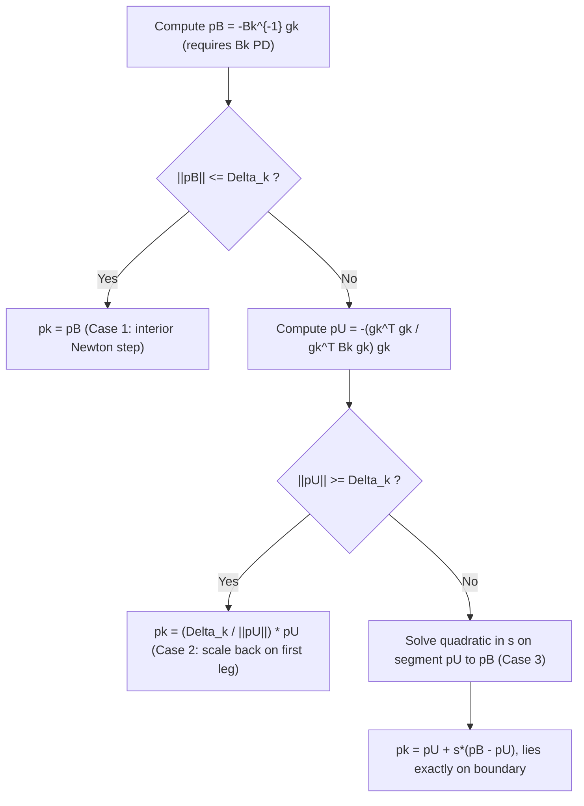

## Dogleg Method

### Overview

The **dogleg method** is an efficient approximate solver for the trust-region subproblem, applicable when $B_k$ is symmetric **positive definite**. It constructs a piecewise-linear path connecting the origin, the Cauchy point direction, and the full Newton step, then selects the point where this path intersects the trust-region boundary (or an interior point of the path if the boundary isn't reached). It is dramatically cheaper than an exact TRS solve while still substantially outperforming the Cauchy point alone.

### Prerequisite: Two Reference Steps

The dogleg method is built from two special points, both requiring $B_k \succ 0$:

**The full Newton step** (unconstrained minimizer of $m_k$):

$$
p^B = -B_k^{-1} \nabla f(x_k)
$$

Called $p^B$ (for "Bk" or sometimes "$b$") because it is the minimizer using the full second-order model — this is the point the trust region would converge to as $\Delta_k \to \infty$.

**The Cauchy point** (steepest-descent minimizer along the ray, as derived previously):

$$
p^U = -\frac{g_k^T g_k}{g_k^T B_k g_k} \, g_k, \qquad g_k = \nabla f(x_k)
$$

Called $p^U$ (for "unconstrained along the ray" / sometimes "$u$") — this is the same quantity as $\tau_k^C g_k$ direction from the Cauchy point derivation, but here defined without a trust-region cap, since $B_k \succ 0$ guarantees the ray-minimizer exists.

### The Dogleg Path

The **dogleg path** $\tilde{p}(\tau)$ is a piecewise-linear trajectory parameterized by $\tau \in [0, 2]$:

$$
\tilde{p}(\tau) = \begin{cases} \tau \, p^U & 0 \le \tau \le 1 \\ p^U + (\tau - 1)(p^B - p^U) & 1 \le \tau \le 2 \end{cases}
$$

- For $\tau \in [0,1]$: the path moves in a straight line from the origin to the Cauchy point $p^U$.
- For $\tau \in [1,2]$: the path continues in a straight line from $p^U$ to the full Newton step $p^B$.

This bent trajectory — resembling the angled shape of a dog's hind leg — is the origin of the method's name.

### Key Theoretical Property: Monotonicity Along the Path

The entire justification for the dogleg construction rests on two facts, both provable when $B_k \succ 0$:

1. **The model value $m_k(\tilde{p}(\tau))$ is monotonically decreasing in $\tau$** along the whole path from $\tau = 0$ to $\tau = 2$.
2. **The norm $\|\tilde{p}(\tau)\|$ is monotonically increasing in $\tau$.**

Together, these two facts guarantee that the trust-region boundary $\|\tilde{p}(\tau)\| = \Delta_k$ is crossed **at most once**, and that the model value along the path improves monotonically as $\tau$ increases up to that crossing. This is what makes finding "the point where the path meets the boundary" both **well-defined** and **guaranteed to be a good choice**, without needing to search the full 2D (or $n$-D) trust region.

[Inference] Both monotonicity properties rely on the positive definiteness of $B_k$; this is precisely why the dogleg method is not applicable (without modification) when $B_k$ is indefinite, in contrast to SR1's typical trust-region companion, Steihaug-Toint CG, which tolerates indefiniteness.

### The Dogleg Algorithm

Given $\Delta_k$, $p^U$, and $p^B$:

**Case 1 — Newton step is feasible.** If $\|p^B\| \le \Delta_k$, take the full Newton step:

$$
p_k = p^B
$$

This is the interior solution — no need to invoke the piecewise path at all.

**Case 2 — Even the Cauchy point exceeds the trust region.** If $\|p^U\| \ge \Delta_k$, scale back along the first leg:

$$
p_k = \frac{\Delta_k}{\|p^U\|} \, p^U
$$

**Case 3 — Boundary crossing occurs on the second leg.** If $\|p^U\| < \Delta_k < \|p^B\|$, find $\tau \in [1,2]$ such that $\|\tilde{p}(\tau)\| = \Delta_k$. Writing $\tau = 1 + s$ for $s \in [0,1]$ and $d = p^B - p^U$:

$$
\|p^U + s\,d\|^2 = \Delta_k^2
$$

Expanding gives a scalar quadratic in $s$:

$$
\|d\|^2 s^2 + 2 (p^U)^T d \, s + \left(\|p^U\|^2 - \Delta_k^2\right) = 0
$$

Solved via the quadratic formula, taking the **positive root** (since $s \in [0,1]$ is required):

$$
s = \frac{-(p^U)^T d + \sqrt{\left[(p^U)^T d\right]^2 - \|d\|^2\left(\|p^U\|^2 - \Delta_k^2\right)}}{\|d\|^2}
$$

giving $p_k = p^U + s \, d$.

### Worked Example

Let $n = 2$, with:

$$
g_k = \begin{bmatrix} 2 \\ 1 \end{bmatrix}, \qquad B_k = \begin{bmatrix} 2 & 0 \\ 0 & 8 \end{bmatrix}, \qquad \Delta_k = 1
$$

(Reusing the same data as the Cauchy point example for continuity.)

**Step 1 — Compute the full Newton step $p^B$:**

$$
p^B = -B_k^{-1} g_k = -\begin{bmatrix} 1/2 & 0 \\ 0 & 1/8 \end{bmatrix}\begin{bmatrix} 2 \\ 1 \end{bmatrix} = -\begin{bmatrix} 1 \\ 0.125 \end{bmatrix} = \begin{bmatrix} -1 \\ -0.125 \end{bmatrix}
$$

**Step 2 — Compute $\|p^B\|$:**

$$
\|p^B\| = \sqrt{1 + 0.015625} = \sqrt{1.015625} \approx 1.0078
$$

Since $\|p^B\| \approx 1.0078 > \Delta_k = 1$, Case 1 does **not** apply.

**Step 3 — Compute the Cauchy point $p^U$** (reusing the earlier calculation):

$$
g_k^T g_k = 5, \qquad g_k^T B_k g_k = 16 \quad \Rightarrow \quad p^U = -\frac{5}{16}\begin{bmatrix} 2 \\ 1 \end{bmatrix} = \begin{bmatrix} -0.625 \\ -0.3125 \end{bmatrix}
$$

$$
\|p^U\| = \sqrt{0.625^2 + 0.3125^2} = \sqrt{0.4883} \approx 0.699
$$

Since $\|p^U\| \approx 0.699 < \Delta_k = 1 < \|p^B\| \approx 1.0078$, this is **Case 3** — the boundary crossing occurs on the second leg.

**Step 4 — Compute $d = p^B - p^U$:**

$$
d = \begin{bmatrix} -1 \\ -0.125 \end{bmatrix} - \begin{bmatrix} -0.625 \\ -0.3125 \end{bmatrix} = \begin{bmatrix} -0.375 \\ 0.1875 \end{bmatrix}
$$

**Step 5 — Compute the coefficients of the quadratic in $s$:**

$$
\|d\|^2 = 0.375^2 + 0.1875^2 = 0.140625 + 0.035156 = 0.175781
$$

$$
(p^U)^T d = (-0.625)(-0.375) + (-0.3125)(0.1875) = 0.234375 - 0.058594 = 0.175781
$$

$$
\|p^U\|^2 - \Delta_k^2 = 0.4883 - 1 = -0.5117
$$

**Step 6 — Solve the quadratic for $s$:**

$$
s = \frac{-0.175781 + \sqrt{(0.175781)^2 - (0.175781)(-0.5117)}}{0.175781}
$$

$$
= \frac{-0.175781 + \sqrt{0.030889 + 0.089958}}{0.175781} = \frac{-0.175781 + \sqrt{0.120847}}{0.175781} = \frac{-0.175781 + 0.34763}{0.175781} \approx \frac{0.17185}{0.175781} \approx 0.9776
$$

Since $s \approx 0.978 \in [0,1]$, this is a valid root.

**Step 7 — Compute the dogleg step:**

$$
p_k = p^U + s\,d = \begin{bmatrix} -0.625 \\ -0.3125 \end{bmatrix} + 0.9776\begin{bmatrix} -0.375 \\ 0.1875 \end{bmatrix} = \begin{bmatrix} -0.625 - 0.3666 \\ -0.3125 + 0.1833 \end{bmatrix} = \begin{bmatrix} -0.9916 \\ -0.1292 \end{bmatrix}
$$

**Verification:**

$$
\|p_k\| = \sqrt{0.9916^2 + 0.1292^2} = \sqrt{0.9833 + 0.0167} = \sqrt{1.0000} = 1 \quad \checkmark
$$

The computed step lies exactly on the trust-region boundary, as required.

### Why the Dogleg Path (Rather Than a Straight Line to $p^B$)?

A natural simpler idea would be to just scale back the Newton step directly toward the origin. The dogleg construction is preferred because it **passes through the Cauchy point first**, ensuring the path initially moves in the steepest-descent direction (locally optimal for very small trust regions) before bending toward the Newton direction (optimal for large trust regions). [Inference] This generally produces better model decrease for intermediate trust-region radii than a naive straight-line interpolation directly between $0$ and $p^B$, though the formal guarantee is the monotonicity property proven above, not a claim of optimality relative to every possible alternative path.

### Comparison with Other Approaches

| Method | Requires $B_k \succ 0$ | Cost | Quality relative to exact TRS solution |
|---|---|---|---|
| Cauchy point | No | $O(n)$–$O(n^2)$ | Weakest (single direction only) |
| Dogleg | Yes | One Cholesky factorization + solve | Good; exact on the two-piece path |
| Steihaug-Toint CG | No (handles indefinite) | Several matrix-vector products | Good; scales to large/sparse problems |
| Exact TRS (secular equation) | No | Eigendecomposition-level | Optimal |

### Dogleg Decision Flow (Mermaid)

### Dogleg Path Illustration (svg_diagram)

<svg viewBox="0 0 520 400" xmlns="http://www.w3.org/2000/svg">
  <text x="260" y="24" text-anchor="middle" font-size="16" font-weight="bold" fill="#222">Dogleg Path (svg_diagram)</text>
  <circle cx="260" cy="230" r="110" fill="#e6f0fa" stroke="#2266cc" stroke-width="2"/>
  <text x="260" y="112" text-anchor="middle" font-size="12" fill="#2266cc">||p|| ≤ Δk</text>
  <circle cx="260" cy="230" r="3" fill="#333"/>
  <text x="260" y="250" text-anchor="middle" font-size="11" fill="#333">p = 0</text>
  <line x1="260" y1="230" x2="195" y2="270" stroke="#996600" stroke-width="2"/>
  <circle cx="195" cy="270" r="5" fill="#996600"/>
  <text x="150" y="290" font-size="11" fill="#996600">Cauchy point p^U</text>
  <line x1="195" y1="270" x2="130" y2="330" stroke="#cc3333" stroke-width="2"/>
  <circle cx="130" cy="330" r="5" fill="#cc3333"/>
  <text x="90" y="350" font-size="11" fill="#cc3333">Newton step p^B</text>
  <circle cx="163" cy="298" r="5" fill="#009966"/>
  <text x="60" y="315" font-size="11" fill="#009966">boundary crossing (dogleg step)</text>
  <path d="M 260 230 L 195 270 L 130 330" stroke="#444" stroke-width="1" stroke-dasharray="2,2" fill="none"/>
</svg>

### Common Pitfalls

- **Applying dogleg with indefinite $B_k$.** The monotonicity properties underlying the method's validity require $B_k \succ 0$; using dogleg with an SR1 approximation (which may be indefinite) without modification can produce an invalid or poor step.
- **Forgetting to check Case 1 first.** Skipping directly to the piecewise path construction when the Newton step is already feasible wastes computation and can introduce unnecessary approximation error.
- **Sign or root selection error in Case 3.** The quadratic in $s$ has two roots; only the one in $[0,1]$ (typically the "+" root in the quadratic formula, given the problem's structure) corresponds to a valid point on the dogleg path.
- **Assuming dogleg finds the true TRS solution.** Dogleg restricts the search to the two-segment path only; it is an efficient approximation, not the globally optimal point unless the true solution happens to lie exactly on that path.

**Related Topics:**
- Trust Region Subproblem Formulation
- Cauchy Point Calculation
- Steihaug-Toint Conjugate Gradient Method
- Trust Region Radius Update Rules
- Symmetric Rank-One (SR1) Updates
- Global Convergence Theory for Trust-Region Methods

